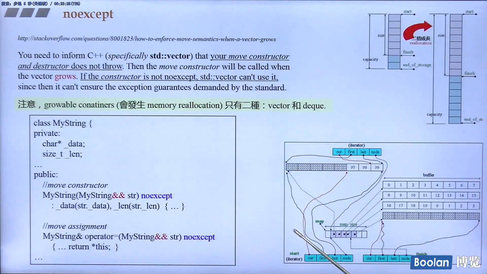

# alias template (template typedef)

```cpp
template<typename T>
using Vec = std::vector<T, MyAlloc<T>>;	//standard vector using own allocator


Vec<int> coll;
//the term is equivalent to 
//it is not possible to partially or explicitly specialize an alias template
std::vector<int, MyAlloc<int>> coll;
```

```cpp
//使用 macro 无法达到相同效果
#define Vec<T> template<typename T> std::vector<T, MyAlloc<T>>;

Vec<int> coll;
//equal
template<typename int> std::vector<int, MyAlloc<int>>;	//这不是我要的

//我们使用 typedef 也无法达到相同效果，因为 typedef 是不接受参数的。
//我们至多写成这样
typedef std::vector<int, MyAlloc<int>> Vec;	//这不是我要的
```


难道只为了少打几个字？实战经验如下

```cpp
//[Error] variable or field 'test_moveable' declared void
//[Error] 'Container' was not declared in this scope
//[Error] 'T' was not declared in this scope
void test_moveable(Container cntr, T elem)
{
Container<T> c;
    for (long i=0; i<SIZE; ++i)
        c.insert(c.end(), T());
    
    output_static_data(T());
    Container<T> c1(c);
    Container<T> c2(std::move(c));
    c1.swap(c2);
}
```


# 采用 function template + iterator + traits

```cpp
template<typename T>
void output_static_data(const T& obj)
{
    cout << ...	// static data of obj
}
```

```cpp
template<typename Container>
void test_moveable(Container c)
{
typedef typename iterator_traits<typename Container::iterator>::value_type Valtype;
    
    for(long i=0; i<SIZE; ++i)
        c.insert(c.end(), Valtype());
    
    output_static_data(*(c.begin()));
    Container c1(c);
    Container c2(std::move(c));
    c1.swap(c2);
}
```

```cpp
test_moveable(list<MyString>());
test_moveable(list<MyStrNoMove>());

test_moveable(vector<MyString>());
test_moveable(vector<MyStrNoMove>());

test_moveable(deque<MyString>());
test_moveable(deque<MyStrNoMove>());
...
//使用 RB-tree 时，元素需提供 operator<
//使用 hashtable 时，元素需提供 operator<, hash function
//使用 multi-容器时，元素还需提供 operator==
```

有没有 template 语法能够在模板接收一个 template 参数 Container 时，当 Container 本身又是个 class template，能取出 Container 的 template 参数？例如收到一个 vector<string>，能够取出其元素类型 string？

另向思考：既然谈的是 ”Container“，其 iterator 就能够回答 value_type 这种问题，简介解决了上述提问。但在没有 iterator 和 traits 的情况下呢？


# template template parameter + alias template

```cpp
template<typename T,
		template <class> class Container>
class XCls
{
private:
    Container<T> c;
public:
    XCls() {	//constructor
		for(long i=0; i<SIZE; ++i)
            c.insert(c.end(), T());
        
        output_static_data(T());
        Container<T> c1(c);
        Container<T> c2(std::move(c));
        c1.swap(c2);
    }
};
```

```cpp
template<typename _Tp, typename _Alloc = std::allocator<_Tp>>
	class vector : protected _Vector_base<_Tp, _Alloc>
    {

//alias templates are never deduced by template argument deduction when deducing a template template parameter.
        
XCls<MyString, vector> c1;
//[Error] type/value mismatch at argument 2 in template parameter list for 'template<class T, template<class> class Container> class XCls'
//[Error] expected a template of type 'template<class> class Container', got 'template<class _Tp, class _Alloc> class std::vector'
//[Error]invalid type in declaration before ';' token
```

```cpp
//不得在 function body 之内声明
template<typename T>
using Vec = vector<T, allocator<T>>;

template<typename T>
usign Lst = list<T, allocator<T>>;

template<typename T>
using Deq = deque<T, allocator<T>>;
```

```cpp
XCls<MyString, Vec> c1;
XCls<MyStrNoMove, Vec> c2;

XCls<MyString, Lst> c3;
XCls<MyStrNoMove, Lst> c4;

XCls<MyString, Deq> c5;
XCls<MyStrNoMove, Deq> c6;
...
//使用 RB-tree 时，元素需提供 operator<
//使用 hashtable 时，元素需提供 operator<, hash function
//使用 multi-容器时，元素还需提供 operator==
```


# type alias (similar to typedef)

```cpp
//type alias, identical to
//typedef void (*func)(int, int);
using func = void(*) (int,int);

// the name 'func' now denotes a pointer to function:
void example(int, int) {}
func fn = example;
```

there is no difference between a type alias declaration and typedef declaration. this declaration may appear in block scope, class scope, or namespace scope.

```cpp
//alias template
//type alias used to hide a template parameter
template <class CharT> using mystring = 
    std::basic_string<CharT, std::char_traits<CharT>>;

mystring<char> str;
```

```cpp
//type alias can introduce a member typedef name
template <typename T>
struct Container {
    using value_type = T;
    //等同 typedef T value_type;
};

//which can be used in generic programming
template<typename Cntr>
void fn2(const Cntr& c)
{
    typename Cntr::value_type n;
}
```

<string> 和 <string_fwd.h> 都有一下 typedef :

`typedef basic_string<char> string;`


# using

`using namespace std;`					`using std::count;`

- using-directives for namespaces and using-declarations for namespace members
- using-declarations for class members
- type alias and alias template declaration (since C++11)

```cpp
using func = void(*) (int,int);

template<typename T>
struct Container {
    using value_type = T;
};

template <class CharT> using mystring = 
    std::basic_string<CharT, std::char_traits<CharT>>;
```

```cpp
//...\4.9.2\include\c++\bits\stl_bvector.h
protected:
	using _Base::_M_allocate;
	using _Base::_M_deallocate;
	using _Base::_S_nword;
	using _Base::_M_get_Bit_allocator;

//...\4.9.2\include\c++\bits\stl_list.h
	using _Base::_M_impl;
	using _Base::_M_put_node;
	using _Base::_M_get_node;
	using _Base::_M_get_Tp_allocator;
	using _Base::_M_get_Node_allocator;
```


# noexcept

`void foo () noexcept;` 等同 `void foo () noexcept(true);`

declares that foo() won't throw. if an exception is not handled locally inside foo(). thus, if foo() throws the program is terminated, calling std::terminate(), which by default calls std::abort().


you can even specify a condition under which a function throws no exception. for example, for any type Type, the global swap() usually is defined as follows:

```cpp
void swap(Type& x, Type& y) noexcept(noexcept(x.swap(y)))
{
    x.swap(y);
}
```

here, inside noexcept(...), you can specify a Boolean condition under which no exception gets thrown: specifying noexcept without condition is a short form of specifying noexcept(true).

exception 是一门大学问，swap() 也是一门大学问。




# override

```cpp
struct Base {
    virtual void vfunc(float) {}
};

struct Derived1 : Base {
    virtual viod vfunc(int) {
        //accidentally create a new virtual function, when one intended to override a base class function.
        //this is a common problem, particularly when a user goes to modify the base class.
    }
};
```

```cpp
struct Derived2 : Base {
    virtual void vfunc(int) override {}
    //[Error] 'virtual void Derived2::vfunc(int)' marked override
    
    //override means that the compiler will check the base class(es) to see if there is
    //a virtual function with this exact signature
    //and if there is not, the compliler will indicate an error.
    
    virtual void vfunc(float) override {}
};
```


# final

```cpp
struct Base1 final {};

struct Derived1 : Base1 {};
//[Error] cannot derive from 'final' base 'Base1' in derived type 'Derived1'
```

```cpp
struct Base2 {
    virtual void f() final;
};

struct Derived2 : Base2 {
    void f();
    //[Error] overriding final function 'virtual void Base2::f()'
}
```


# decltype

unevaluated context

defines a type equivalent to the type of an expression

`map<string, float> coll;`

`decltype(coll)::value_type elem;`


这么写（before C++11）

`map<string, float>::value_type elem;`


By using the new decltype keyword, you cna let the complier find out the types of an expression. This is the realization of the often requested typeof feature.

One application of decltype is to declare return types. Another is to use it in metaprogramming or to pass the type of a lambda.


# decltype, used to declare return types

sometimes, the return type of a function depends on expression processed with the arguments. however, something like

`template <typename T1, typename T2>`

`decltype(x+y) add(T1 x, T2 y);`

was not possible before C++11, because the return expression uses objects not introduced or in scope yet.

but with C++11, you can alternatively declare the return type of a function behind the parameter list:

`template <typename T1, typename T2>`

`auto add(T1 x, T2 y) -> decltype(x+y);`

this uses the same syntax as for lambdas to declare return types.

`[...] (...) mutable throwSpec -> retType {...}`


decltype

```cpp
template <typename T>
void test18_decltype(T obj)
{
    //当我们手上有 type，可取其 inner typedef，没问题
    map<string, float>::value_type elem1;
    
    map<string, float> coll;
    //面对 obj 取其 class type 的 inner typedef，因为如今我们有了工具 decltype
    decltype(coll)::value_type elem2;
    
    //故意设计本测试函数为 template function, 接收任意参数 T obj
    
    //如今有了 decltype 我可以这样：
    typedef typename decltype(obj)::iterator iType;
    //! test18_decltype(complex<int>());	//编译失败
    
    typedef typename T::iterator iType;
    
    decltype(obj) anotherObj(obj);
}
```


decltype, used to pass the type of a lambda

```cpp
auto cmp = [] (const Person& p1, const Person& p2) {
    return p1.lastname()<p2.lastname()||
        (p1.lastname()==p2.lastname()&&
        p1.firstname()<p2.firstname());
};
...
std::set<Person, decltype(cmp)>coll(cmp);
```

面对 lambda，我们手上往往只有 object，没有 type。要获得其 type 就得借助于 decltype。