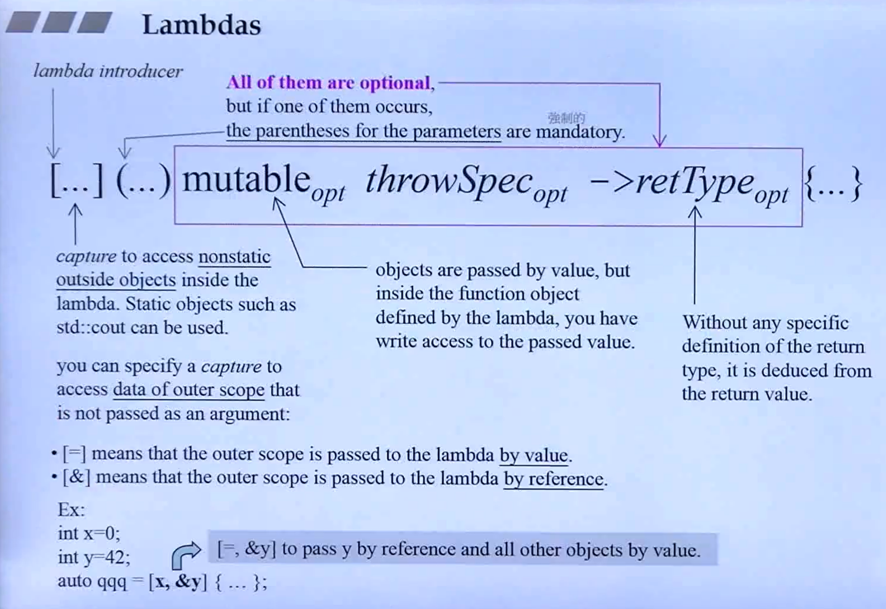
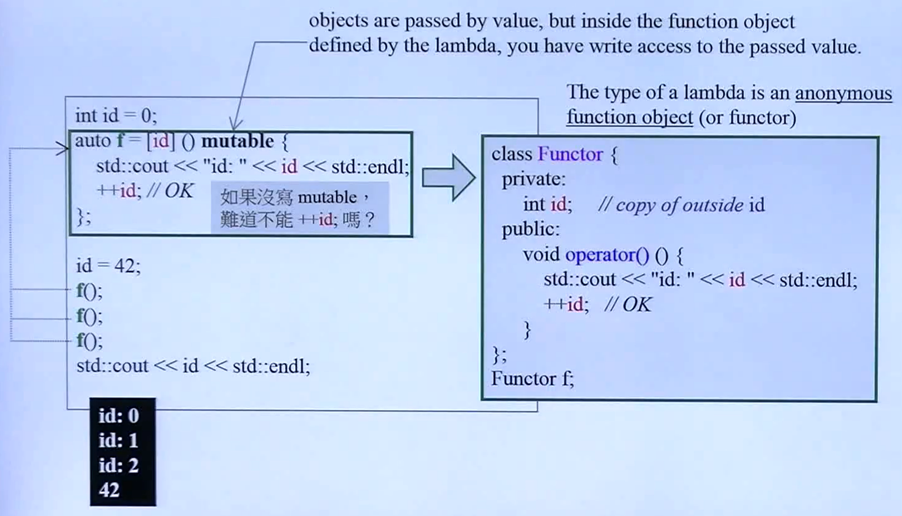
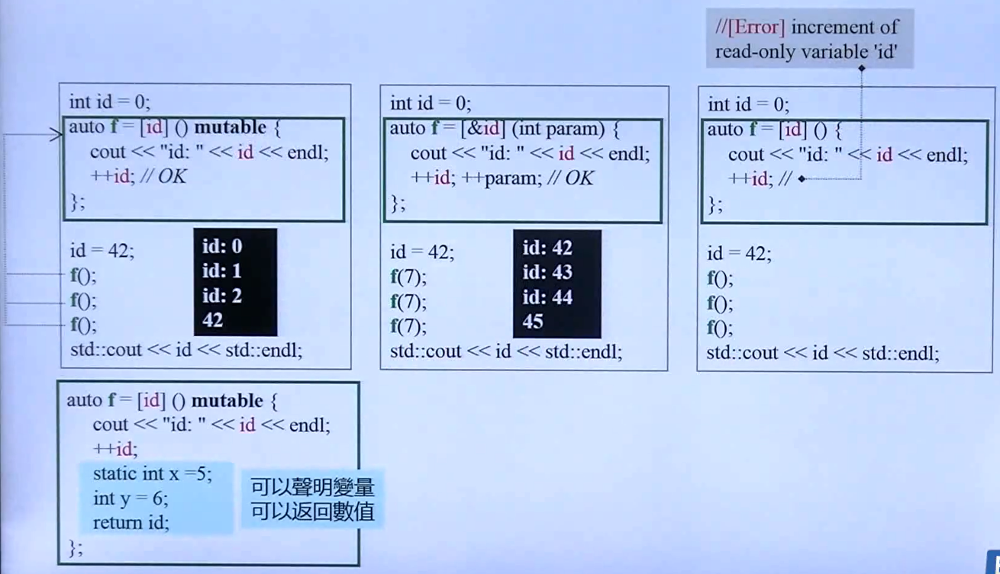
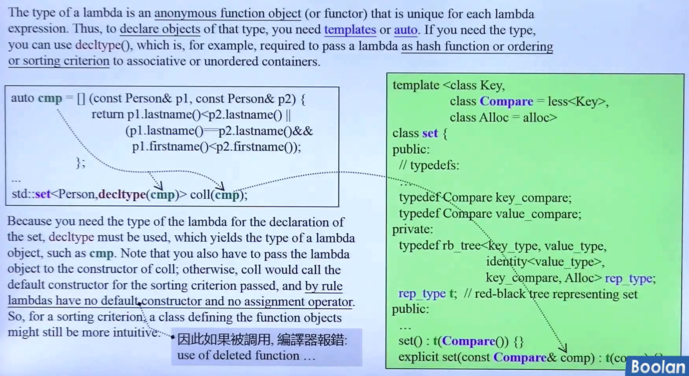

C++11 introduced lambdas, allowing the definition of inline functionality, which can be used as a parameter or a local object. Lambdas change the way the C++ standard library is used.

A lambda is a definition of functionality that can be defined inside statements and expressions. Thus, you can use a lambda as an inline function. The minimal lambda function has no parameters and simply does something:

```cpp
[]{
	std::cout << "hello lambda" << std::endl; 
}
```

You can call it directly:		`[...] (...) mutable throwSpec -> retType {...}`

```cpp
[] {
    std::cout << "hello lambda" << std::endl;
}();	//prints "hello lambda"
```

or pass it to objects to get called:	

```cpp
auto l = [] {
    std::cout << "hello lambda" << std::endl;
};
...
l();	//prints "hello lambda"
```














Function objects are a very powerful way to customize the behavior of Standard Template Library (STL) algorithms, and can encapsulate both code and data (unlike plain functions). But function objects are inconvenient to define because of the need to write entire classes. Moreover, they are not defined in the place in your source code where you're trying to use them, and the non-locality makes them more difficult to use. Libraries have attempted to mitigate some of the problems of verbosity and non-locality, but don't offer much help because the syntax becomes complicated and the compiler errors are not very friendly. Using function objects from libraries is also less efficient since the function objects defined as data members are not in-lined.

Lambda expressions address there problems. The following code snippet shows a lambda expression used in a program to remove integers between variables x and y from a vector of integers.

```cpp
vector<int> vi { 5,28,50,83,70,590,245,59,24 };
int x = 30;
int y = 100;
vi.erase( remove_if(vi.begin(),
                   vi.end(),
                   [x,y](int n) { return x < n && n < y; }
                   ),
         vi.end()
        );
for (auto i : vi)
    cout << i << '';	//5 28 590 245 24
cout << endl;
```

```cpp
class LambdaFunctor {
public:
    LambdaFunctor(int a, int b) : m_a(a), m_b(b) {}
    bool operator()(int n) const {
        return m_a < n && n < m_b; }
private:
    int m_a;
    int m_b;
};

v.erase(remove_if(v.begin(), v.end(), 
                  LambdaFunctor(x,y)),
        v.end()
       );
```

