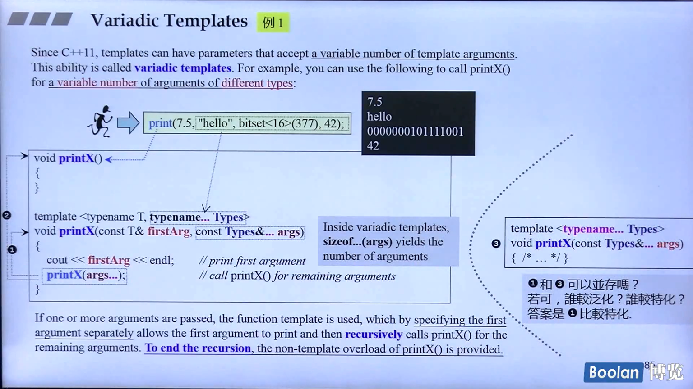
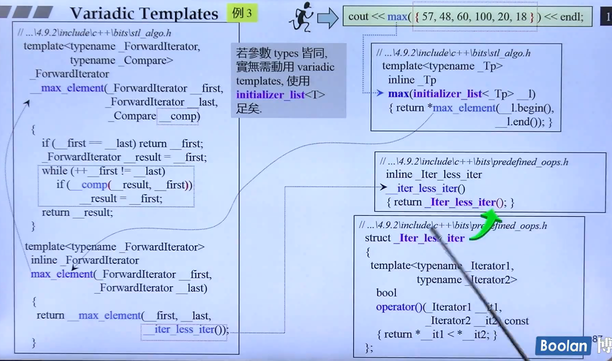
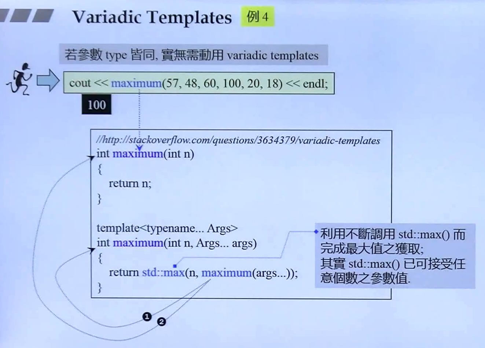
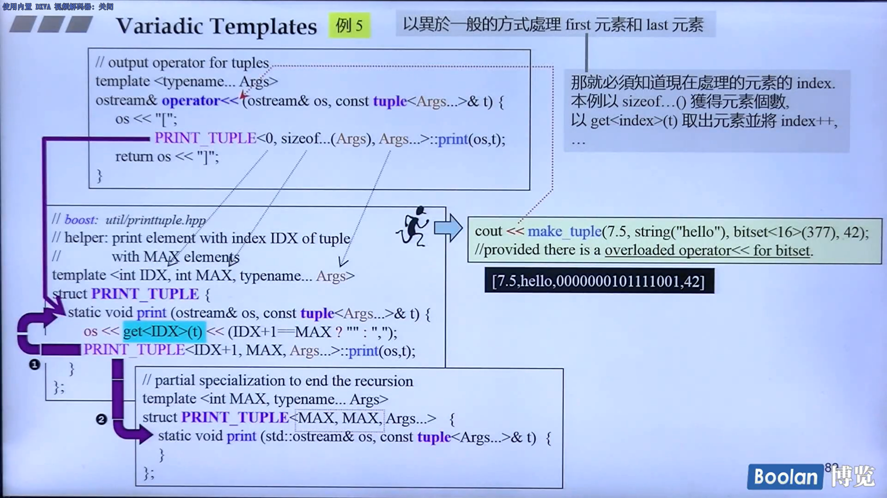
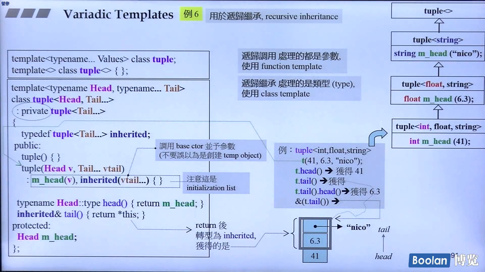
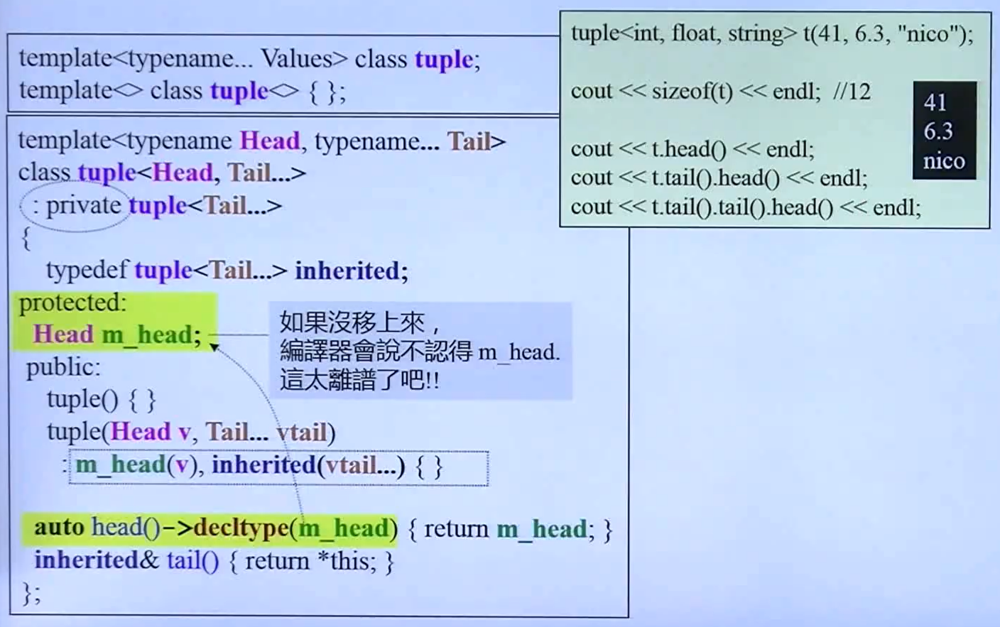

variadic template

- 谈的是 template
  - function template
  - class template
- 变化的是 template parameters
  - 参数个数（variable number），利用参数个数逐一递减的特性，实现递归函数调用，使用 function template 完成。
  - 参数类型（different type），利用参数个数逐一递减导致参数类型也逐一递减的特性，实现递归继承或递归复合，以 class template 完成。

```cpp
void func() { /* ... */}
```

```cpp
template <typename T, typename... Types>
void func(const T& firstArf, const Types&... args)
{
    //处理 firstArg
    func(args...);
}
```





例2

使用 variadic templates 重写 printf()

```cpp
int* pi = new int;
printf("%d %s %p %f\n",
      15,
      "This is Ace.",
      pi,
      3.141592653);

template<typename T, typename... Args>
void printf(const char* s, T value, Args... args)
{
    while(*s) {
        if (*s == '%' && *(++s) != '%') {
            std::cout << value;
            printf(++s, args...);	// call even when *s == 0 to detect extra argument
            return;
        }
        std::cout << *s++;
    }
    throw std::logic_error("extra arguments provided to printf");
}

void printf(const char* s)
{
    while (*s)
    {
        if (*s == '%' && *(++s) != '%')
            throw std::runtime_error("invalid format string: missing arguments");
        std::cout << *s++;
    }
}
```

















例7 用于递归复合，recursive composition

```cpp
template<typename... Values> class tup;
template<> class tup<> {};
```

递归调用处理的都是参数，使用 function template

递归复合实例的是类型（type），使用 class template

```cpp
template<typename Head, typename... Tail>
class tup<Head, Tail...>
{
    typedef tup<Tail...> composited;
	protected:
    	composited m_tail;
    	Head m_head;
    public:
    	tub() {}
    	tup(Head v, Tail... vtail)
            : m_tail(vtail...), m_head(v) {}
    
    Head head() { return m_head; }
    composited& tail() { return m_tial; }
};
```

