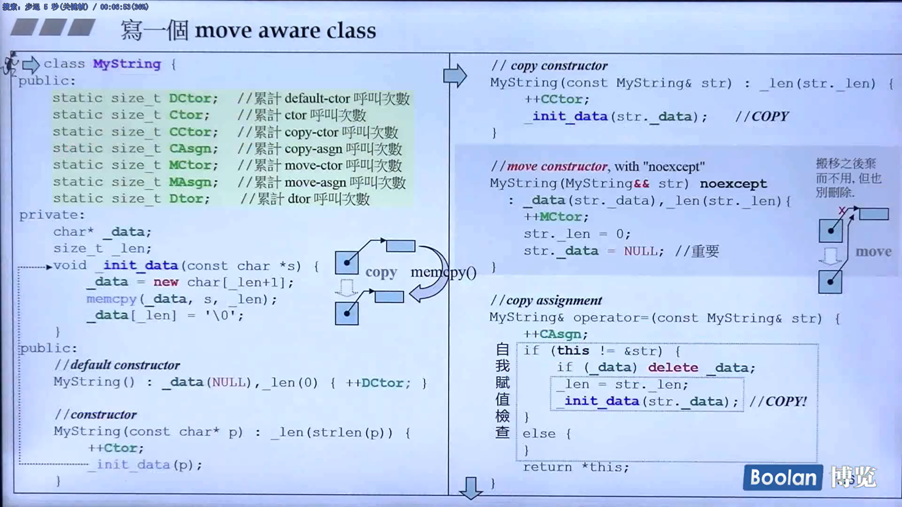
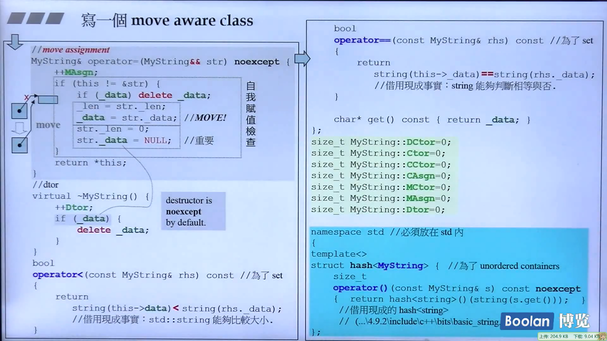
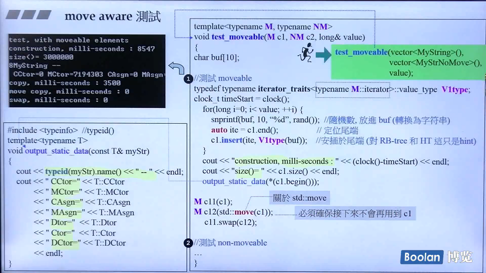

# Rvalue references

Rvalue references are a new reference type introduced in C++0x that help sove the problem of unnecessary copying and enable perfect forwarding. When the right-hand side of an assignment is an rvalue, then the left-hand side object can steal resources from the right-hand side object rather than performing a separate allocation, thus enabling move semantics.

Lvalue : 可以出现于 operator= 左侧者

Rvalue : 只能出现于 operator= 右侧者

```cpp
//以 int 试验
int a = 9;
int b = 4;

a = b;		//ok
b = a;		//ok
a = a + b;	//ok

a + b = 42;	//[Error] lvalue required as left operand of assignment
```

```cpp
//以 string 试验
string s1("Hello ");
string s2("World");
s1 + s2 = s2;	//竟然通过编译
cout << "s1: " << s1 << endl;
cout << "s2: " << s2 << endl;
string() = "World";	//竟然可以对 temp obj 赋值
```

```cpp
//以 complex 试验
complex<int> c1(3,8), c2(1,0);
c1 + c2 = complex<int>(4,9);		//c1+c2 可以当做 Lvalue 吗？
cout << "c1: " << c1 << endl;		//c1: (3,8)
cout << "c2: " << c2 << endl;		//c2: (1,0)
complex<int>() = complex<int>(4,9);	//竟然可以对 temp obj 赋值
```

C++ with its user-defined types has introduced some subtleties regarding modifiability and assignability that cause this definition to be incorrect


Rvalue : 只能出现于 operator= 右侧者

```cpp
int foo() { return 5; }
...
int x = foo();		//ok
int* p = &foo();	//[Error]	对着 Rvalue 取其 reference，不可以。
foo() = 7;			//[Error]	没有所谓 Rvalue reference (before C++0x)
```

当 Rvalue 出现于 operator= (copy assignment) 的右侧，我们认为对其资源进行偷取 / 搬移(move) 而非拷贝 (copy) 是可以的，是合理的。那么：

1. 必须有语法让我们在调用端告诉编译器 ”这是个 Rvalue“。
2. 必须有语法让我们在被调用端写出一个专门处理 Rvalue 的所谓 move assignment 函数。


# Rvalue references and move semantics

```cpp
class MyString {
private:
    char* _data;
    ...
public:
    //copy ctor
    MyString(const MyString& str)
        : initialization list {
            ...
        }
    
    //move ctor
    MyString(MyString&& str) noexcept
        : initialization list {
            ...
        }
}
```

noexcept : You need to inform C++ (specifically std::vector) that your move constructor and destructor does not throw. Then the move constructor does not throw. Then the move constructor will be called when the vector grows.

```cpp
template<typename M>
void test_moveable(M c, long& value)
{
char buf[10];
    
typedef typename
    iterator_traits<typename M::iterator>::value_type;
clock_t timeStart = clock();
    for (long i=0; i<value; ++i) {
        snprintf(buf, 10, "%d", rand());	//随机数（转为字符串）
        auto ite = c.end();				//定位于尾端
        c.insert(ite, Vtype(buf));		//插入
    }
    cout << "milli-seconds: " << (clock()-timeStart) << endl;
    cout << "size()= " << c.size() << endl;
    output_static_data(*(c.begin()));	//copy/move ctors 被调用次数
    
M c1(c);
M c2(std::move(c1));	//必须确保后续不再使用 c1
  c1.swap(c2);
}
```

```cpp
class MyString {
private:
    char* _data;
    ...
public:
    //copy assignment
    MyString& operator=(const MyString& str) {
        ...
		return *this;
    }
    
    //move assignment
    MyString& operator=(MyString&& str) noexcept {
        ...
		return *this;
    }
    ...
}
```


# perfect forwarding

Perfect forwarding allows you to write a single function template that takes n arbitrary arguments and forwards them transparently to another arbitrary function. The nature of the argument (modifiable, const, lvalue or rvalue) is preserved in this forwarding process.

```cpp
template <typename T1, typename T2>
void functionA(T1&& t1, T2&& t2)
{
    functionB(std::forward<T1>(t1),
             std::forward<T2>(t2));
}
```


# unperfect forwarding

```cpp
int a = 0;
process(a);		//process(int&): 0
				//变数被视为 lvalue 处理
process(1);		//process(int&&): 1
				//temp.object 被视为 Rvalue 处理
process(move(a));	//process(int&&): 0
					//强制将 a 由 Lvalue 改为 Rvalue
forward(2);		//forward(int&&): 2, process(int&): 2
				//Rvalue 经由 forward() 传给另一函数却变成 Lvalue
				//原因是传递过程中它编程了一个车 named object
forward(move(a));	//forward(int&&): 0, process(int&): 0
					//Rvalue 经由 forward() 传给另一个函数却变成了 Lvalue
//! forward(a);		//[Error] cannot bind 'int' lvalue to 'int&&'
const int& b = 1;
//! process(b);		//[Error] no matching function for call to 'process(const int&)'
//! process(move(b));	//[Error] no matching function for call to
						//'process(std::remove_reference<const int&>::type)'
//! int& x(5);			//[Error] invalid initialization of non-const reference of
						//type 'int&' from an rvalue of type 'int'
//! process(move(x));	//上行失败，本行也是："x" was not declared in this scope
```


# 写一个 move aware class







