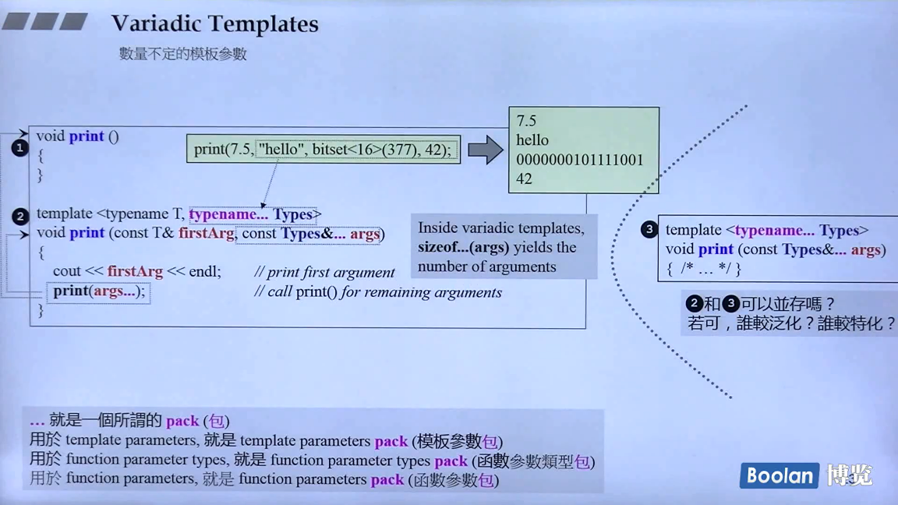
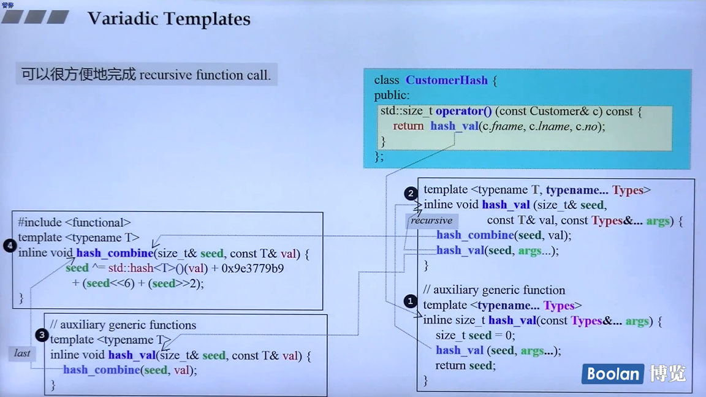
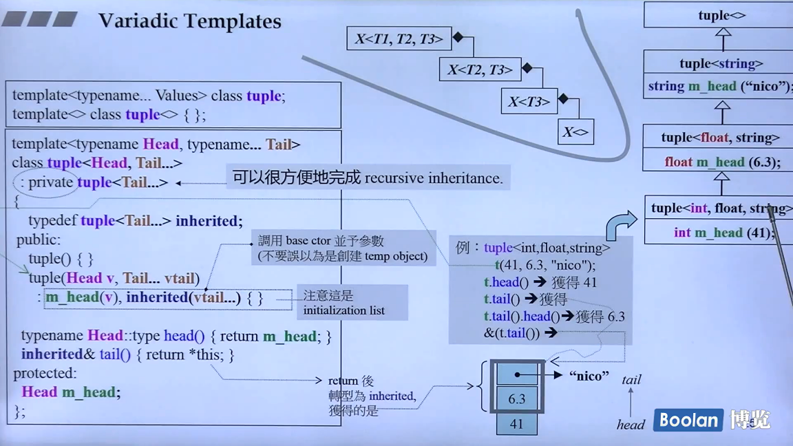

# Variadic Templates

```cpp
void printX()
{ }

template <typename T, typename... Types>
void printX(const T& firstArg, const Type&... args)
{
    cout << firstArg << endl;	// print first argument
    printX(args...);			//call print() for remaining arguments
}

int __cdecl printf(const char *format, ...)
{
    va_list arglist;
    int buffing;
    int retval;
    va_start(arglist, format);
    _ASSERTE(format != NULL);
    _lock_str2(1, stdout);
    buffing = _stbuf(stdout);
    retval = _output(stdout, format, arglist);
    _ftbuf(buffing, stdout);
    _unlock_str2(1, stdout);
    return(retval);
}
```











# Space in Template Expressions

the requirement to put a space between two closing template expressions has gone:

```cpp
vector<list<int>>;	// OK in each C++ version
vector<list<int>>;	// OK since C++11


// G4.5.3\include\c++\profile\vector
// std::hash specialization for vector<bool>.
template<typename _Alloc>
	struct hash<__profile::vector<bool, _Alloc>>
        

// G4.5.3\include\c++\bits\stl_bvector.h
struct hash<_GLIBCXX_STD_D::vector<bool, _Alloc>>
```


# nullptr and std::nullptr_t

C++11 lets you use nullptr instead of 0 or NULL to specify that a pointer refers to no value(which differs from having an underfined value). this new feature especially helps to avoid mistakes that occurred when a null pointer was interpreted as an integral value. for example:

```cpp
void f(int);
void f(void*);
f(0);			// calls f(int)
f(NULL);		// calls f(int) if NULL is 0, ambiguous otherwise
f(nullptr);		// calls f(void*)
```

nullptr is a new keyword. it automatically converts into each pointer type but not to any integral type. it has type std::nullptr_t, defined in <cstddef>, so you can now even overload operations for the case that a null pointer is passed. ntoe that std::nullptr_t counts as a fundamental data type.

```cpp
// \include\stddef.h

#if defined(__cplusplus) && __cplusplus >= 201103L
#ifndef _GXX_NULLPTR_T
#define _GXX_NULLPTR_T
	typedef decltype(nullptr) nullptr_t;
```


# Automatic Type Deduction with auto

with C++11, you can declare a cariable or an object without specifying its specific type by using auto. for example:

```cpp
auto i = 42; //i has type int
double f();
auto d = f()； //d has type double
```

using auto is especially useful where the type is a pretty long and/or complicated expression. for example:

```cpp
vector<string> v;
...
auto pos = v.begin();			//pos has type vector<string>::iterator
auto l = [](int x) -> bool {	//l has the type of a lambda
    ...,						//taking an int and returning a bool
};
```

the latter is an object, represeting a lambda.


# auto keyword

```cpp
list<string> c;
...
list<string>::iterator ite;
ite = find(c.begin(), c.end(), target);


//
list<string> c;
...
auto ite = find(c.begin(), c.end(), target);
```

