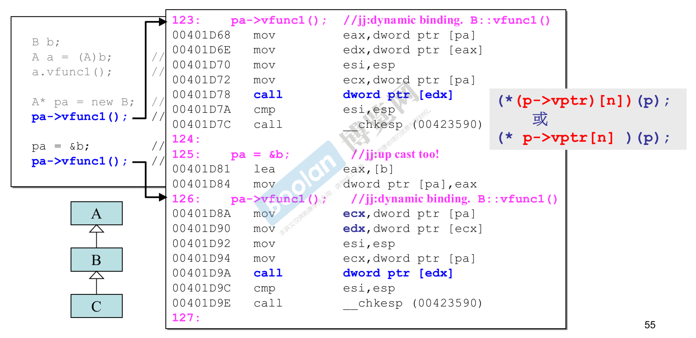

<br>

关于 C++ 标准库

在不同的语言上面，库都扮演者很重要的角色。作为初学者，要去熟用它。

标准库提供给我们最重要的一些我们可以直接用的东西，一个就是数据结构，也就是容器。一个是算法。

面对标准库，还有一大块东西对你非常有帮助，算法。七八十个除了这两三个很经典的之外，另外的好几十个其实是一些你想象中比较小的动作。比如说copy，从一块地方拷贝到另一个地方，这种事情在编程中常常发生，所以它的效率要非常的高。因此标准库团队用尽心思去设计这些常常用到的，他们把它称为算法。

程序就是算法 + 数据结构搭建起来的。标准库帮我们设计了这些高效的东西，为何不去用它呢。知道标准库各个函数的用途，不要重复造轮子。

| Sequence container:       | Sorting:                               |
| ------------------------- | -------------------------------------- |
| array                     | stable_sort                            |
| vector                    | partial_sort                           |
| deque                     | partial_sort_copy                      |
| forward_list              | is_sorted                              |
| list                      | is_sorted_until                        |
|                           | nth_element                            |
| Container adaptors:       |                                        |
| stack                     | Binary search(operating ordered data): |
| queue                     | lower_bound                            |
| priority_queue            | upper_bound                            |
|                           | equal_range                            |
| Associative containers:   | binary_search                          |
| set                       |                                        |
| multiset                  | Merge:                                 |
| map                       | merge                                  |
| multimap                  | inplace_merge                          |
|                           | includes                               |
| Unordered associative con | set_union                              |
| unordered_set             | set_intersection                       |
| unordered_map             | set_difference                         |
| unordered_multiset        | set_symmertric_difference              |
| unordered_multimap        |                                        |
|                           | ...                                    |
|                           |                                        |

<br>

三个主题

**variadic templates (since C++11) 数量不定的模板参数**

这个是最重要的，另外两个是语法糖，让你使用比较方便。

模板以前写的时候，模板参数个数一定要固定下来。现在新的语法说，允许你任意个模板参数。怎么写，...，它已经变成了语言的一部分。

2告诉编译器我这个模板函数接收的参数有两组，第一组只有一个T，也就是 firstArg。第二组是 args，个数不知道。所以这种语法的意思是把调用者放进去的模板参数分为一个和一包。一包怎么表现呢，'...'。类型呢，'...'。

3里面7.5就是一个，剩下是一包。第一次调用到4的时候，"hello"就变成了一个，剩下后面两个是一包。递归，以此类推，最后43是一个，剩下的包为0，此时再调用到4的时候会调到1。

bitset里面标准库一定有重载小括号<<，才能丢到cout，不然编译会失败。

强调一下这里放进去被分为一个和一包之后，你对于一个和一包做什么事情随便，并不一定调用自己，你可以拿后面的一包来继承，这是个特殊的技巧，发挥下想象。也可以拿来composition，组合在一起。

标准库很多地方用了 variadic template 翻修了一遍。我们很关心的一点是，新的语言规格、语法出来，新的标准库有没有用上这些新的语法呢？如果用上了，说服力才高。看看标准库有没有采用这些新语法。

```cpp
void print()	//1
{    
}

template <typename T, typename... Types>	//2
void print(const T& firstArg, const Types&... args)
{
    cout << firstArg <<endl;
    print(args...);	//4
}


print(7.5, "hello", bitset<16>(377), 42);	//3
//打印
7.5
hello
0000000101111001
42
```

如果你想知道后面的一包是几个，可以用 sizeof...(args)。inside variadic templates, sizeof...(args) yields the number of arguments

...就是一个所谓的 pack (包)

用于 template parameters，就是 template parameters pack (模板参数包)

用于 function parameter types，就是 function parameter types pack (函数参数类型包)

用于 function parameters，就是 function parameters pack (函数参数包)


**auto (since C++11)**

2使用容器，里面的每个元素是字符串string，然后...放了很多东西进去。第三行我要一个iterator，iterator就像指针那样。我要拥有一个iterator，它的值是什么，指向什么元素呢，在等号的右边做了一些动作。iterator的类型type是什么，在过去要写1a这么长，现在写成auto，意思是编译器你自动帮我推。编译器当然知道右边的return type是什么，所以这个返回类型就可以推出auto是什么东西。

另外有一种情况真的写不出来，比如lambda，你真的写不出它的类型。

你写成auto的时候一定要让编译器能够帮你推，不能写成3那样。这样写的时候你没有赋值，assign，编译器根本不知道ite是什么，也推不出来。

那所有的变量都用auto好了？这里有两个不可取。第一个就是，其实C++是一个非常能够帮你奠定基本素养的一种，所以我们很强调的是对于变量的类型是什么，我们要很清楚。只是有时候写不出来，太长了不想写，但是我们要很清楚。作为初学者，全部使用auto，其实是走偏了。第二个就是像3，你不能总是声明变量的时候就赋值吧。

```CPP
//1
list<string> c;
...
list<string>::iterator ite;	//1a
ite = find(c.begin(), c.end(), target);


//2, 相当于1
list<string> c;
...
auto ite = find(c.begin(), c.end(), target);


list<string> c;
...
auto ite;	//3, XXX
ite = find(c.begin(), c.end(), target);
```


**ranged-base for (since C++11)**

for 的这个循环有新的东西出来。语言规则有个单冒号 : ，冒号左手边你可以定义或者声明一个变量(declare)，右手边必须是一个容器(collection)。当你这样写的时候，编译器是怎么对待的呢？它会从右手边的容器 coll，容器就是一个数据结构，编译器就会找出里面的每一个元素。每一个元素设定到左边的变量 decl，设定完后做 statement 这件事情。

这个比起之前版本你要遍历一个容器写法简单很多。以前你可以拿容器的迭代器iterator去取，或者使用标准库有一个叫 for each去取。

语法搭配传统容器怎么用。当我写1这样的循环，编译器会把编译器里一个一个的元素逐一取出来，copy到elem。elem是什么类型呢？偷懒写auto。如果这里不是打印，而是乘以3，影响的是elem，不会影响容器里面的内容，因为它是pass by value。如果你想乘以3影响原来的东西，你要pass by reference。相当于elem里面的指针指向容器里的内容。

引用就是指针，只是表现的形式不同。其实所有的编译器，怎么实现引用，他都是用pointer去做的。

```cpp
for ( decl : coll ) {
    statement
}

for (int i : { 2, 3, 5, 7, 9, 13, 17, 19 }) {	//2.0语法，大括号自然形成了一个容器
    cout << i << endl;
}

vector<double> vec;
...
//1 pass by value
for ( auto elem : vec ) {
    cout << elem << endl;
}

//2 pass by reference
for ( auto& elem : vec ) {
    elem *= 3;
}
```

<br>

**reference**

从内存的角度看，变量有三种，一种是值(value本身)，一种是它的指针，一种是它的引用。


```cpp
int x=0;		//整数x值为0，任意画，内存也不知道在哪里
int* p = &x;  	//指针，指向整数。给初值 x的地址
int& r = x;		//r 代表 x。现在 r，x 都是 0
int x2 = 5;

r = x2;			//r 不能重新代表其他物体。现在 r，x 都是 5
int& r2 = r;	//现在 r2 是 5 (r2 代表 r；亦相当代表 x)
```

地址就是一种指针的形式，指针就是一种地址的形式，它们是互通的。

第二行p本身是一个变量，它占一块内存，箭头的意义是指向x。谈到指针在声明的时候有两个说法，*号是靠近int还是靠近p比较好，都可以。推荐靠近int，根据这种写法可以说p是一个变量，类型是 pointer to integer。

第三行取地址的符号在这里就不是取地址咯。它和取地址的符号可以很好解释，它的位置造成它的意义不同。我有一个变量叫r，类型是 reference to integer。这三行 x、p、r 都是变量，都占用了某个大小的内存。x是整数4个字节，p是指针32位电脑上也是4个字节，r占多少？现在要解释r的意义是什么，r 代表 x。我们在讲指针的时候，口头会说这个指针指向x。现在会说这个引用，r代表x，你要把它当成整数来看。x是0，r就是0。所有编译器对待r，都是拿指针实现的，但是从逻辑角度要把r看成整数，因为这样写r代表x。

reference，它一定要有初值。你声明一个reference的时候，就是要告诉它要代表谁，所以一定要有初值。而且设完值后就不能再变了，r再也不能代表其他人了。指针可以变化，这个时候指向a，下个时候指向b，但是reference不可以。

又有一个整数x2，r = x2。我们可能会误解刚刚r代表x，现在r要代表x2了。不对，r代表x永远定了，现在r的值设为5，所以x也变成5。

r代表的东西多大，r就多大。即使reference底部是指针，其实它真正是4个字节，不过编译器要制造一种假象，这种假象是好的。r代表x，x是一百个字节，r就是一百个字节，而且x的地址在哪里，r的地址就要在哪里。这两件事是特意制造出来的假象。Java里头所有变量都是reference。

```cpp
// object和其reference的大小相同，地址也相同(全都是假象)
typedef struct Stag { int a, b, c, d; } s;
int main() {
    double x = 0;
    double* p = &x;	//p指向x，p的值是x的地址
    double& r = x;	//r代表x，现在r，x都是0
    
    cout << sizeof(x) << endl;	//8字节
    cout << sizeof(p) << endl;	//4，指针，32位电脑
    cout << sizeof(r) << endl;	//8，假象
    cout << p << endl;	//0065FDFC
    cout << *P << endl;	//0，p所指的东西
    cout << x << endl;	//0
    cout << r << endl;	//0，r代表x
    cout << &x << endl;	//0065FDFC，假象
    cout << &r << endl; //0065FDFC
    
    S s;
    S& rs = s;
    cout << sizeof(s) << endl;	//16
    cout << sizeof(rs) << endl;	//16
    cout << &s << endl;	//0065FDE8
    cout << &rs << endl;	//0065FDE8
}
```

**reference 的常见用途**

reference就是一种漂亮的pointer。reference，写代码的时候，我们其实很少一个变量说它的类型是个reference，reference多半用在参数传递上。

下面声明、调用了三个函数，三个函数传参分别pass by pointer、value、reference。当你这样传的时候，后头的写法要使用这个参数，写法就不一样了。2、3写法一样是很好的，表示传进来的是value还是reference，都不影响后面的行为。被调用端写法相同，很好。1写法传的是指针，后面就得那样用，1和2不同，不太理想。

看看调用端。5、6写法一样，但是传进去的东西不一样，fun2传的value，fun3传的reference。fun1、2、3里头，2的形式是最简单的，最容易被接受的，但是2的传递过程会比较慢，建议写fun3的形式pass by reference。

reference 通常不用于声明变量，而用于参数类型 (parameters type)和返回类型 (return type)的描述。

```cpp
void func1(Cls* pobj) { pobj->xxx(); }	//1 pass by pointer
void func2(Cls obj) { obj.xxx(); }		//2 pass by value
void func3(Cls& obj) { obj.xxx(); }		//3 pass by reference
...
Cls obj;
func1(&obj);	//4 接口不同，困扰
func2(obj);		//5
func3(obj);		//6 调用端接口相同，很好
```

以下被视为 “same signature” (所以两者不能同时存在)：

函数名称相同，参数个数只有一个也相同，参数类型一个传引用一个传值只有这一点不同。这种情况下，这两行可不可以并存呢？不能，它们的签名是相同的。签名部分是不含return type，只看从函数名称开始的这段。

C++说这两个签名相同。这两个如果被视为不同的话，就会和另外一件事情产生矛盾。上面的fun2、fun3是不同的函数，现在讨论的是相同的函数，所以这是函数重载，如果这两个能够并存的话，那在调用imag函数的时候，编译器不知道你调用的是哪个。

```cpp
double imag(const double& im) { ... }
double imag(const double im) { ... }	//ambiguity
```

imag(const double im) , signature。函数名后加const，const 是不是函数签名的一部分？是。

<br>

符合&继承关系下的构造和析构

面向对象谈的是对象和对象间的关系，对象是由类class创建出来的，所以要谈的是class和class之间的关系。继承、组合(复合)、委托三种关系。

**Inheritance(继承)关系下的构造和析构**

```cpp
// Derived -▷ Base
// Derived object 包含 Base part。内存角度，子类对象有父类成分
// base class 的 dtor 必须是 virtual，否则会出现 undefined behavior

// 构造由内而外
// Derived 的构造函数首先调用 Base 的 default 构造函数，然后才执行自己
Derived::Derived(...): Base() { ... };

// 析构由外而内
// Derived 的析构函数首先执行自己，然后才调用 Base 的析构函数。
Derived::~Derived(...){ ... ~Base() };

```

**Composition(复合)关系下的构造和析构**

```cpp
// Container ◆-> Component
// Container object 包含 Component part

// 构造由内而外
// Container 的构造函数首先调用 Component 的 default 构造函数，然后才执行自己。
Container::Container(...): Component() { ... };
// 构造由外而内
// Container 的析构函数首先执行自己，然后才调用 Component 的析构函数。
Container::~Container(...) {... ~Component()}
```

Inheritance+Composition 关系下的构造和析构

```cpp
// Derived -▷ Base
// Container ◆-> Component
// Derived object 包含 Base part 和 Component part

// 构造由内而外
// Derived 的构造函数首先调用 Base 的 default 构造函数，然后调用
// Component 的 default 构造函数，然后才执行自己。
Derived::Derived(...): Base(),Component() { ... };

// 析构由外而内
// Derived 的析构函数首先执行自己，然后调用 Component 的析构函数，
// 然后调用 Base 的析构函数。
Derived::~Derived(...) {... ~Component, ~Base() };

```

<br>

对象模型 (Object Model) ：关于 vptr (虚指针) 和 vtbl (虚表)

这是代码层次看不到的东西。


一个类的对象占用了什么样的内存，那就看这个类里面的data。里面为什么有三个呢？因为这里有virtual function。如果只谈继承，没有虚函数，它的用途不太大。只要你的类里头有一个虚函数，一万个也一样，这个对象里头就会多一根指针，当你去测对象的大小你会看出来，带着虚函数那个会比数据相加起来还要多4。

会不会A有虚函数，而B没有呢？不可能。继承就是把所有的数据继承下来，还会把函数继承下来，继承的函数多大，没人能回答你。继承函数继承的是调用权，不是继承它的内存大小。

一般函数和虚函数在内存里长什么样子呢？B继承了两个虚函数，推翻 override vfunc1()。B的 func2() 跟A的 fun2() 一点关系都没有，只是这样同名写不太好。有几个函数呢？8个，虚函数4个，非虚函数4个。

现在要把虚指针和虚函数关联起来。A既然有虚函数，它就有一个虚指针(vptr)，指向一个表格。这个表格术语上叫做虚表(vtbl)。table里面放的都是函数指针，指向虚函数所在的位置。A既然有两个虚函数，其虚表就有两个指针指向对应的virtual function。B有自己的vfunc1()，同时继承了vfunc2()。

如果你对虚函数的功能有所理解，它之所以会有这种奇特的功能，就是因为编译器看到你使用虚函数的时候，它会走上图的路，去调用到适当的虚函数。

如果现在有一个指针指向C object，写代码就是new C得到一个指针。通过这个指针要调用vfun1()。编译器看到一个调用的动作，在过去C的时代，它一定是把它编译成一个特定的语法，call xxx (xxx 是一个地址)。call是汇编语言的一个动作，它会被解析成一个值。你要调用哪个函数，编译器就把它解析出来，跳到那个地方去，将来再return回来，这种叫做静态绑定。如果现在通过指针调用虚函数的话，编译器就知道不能做静态绑定，这就是面向对象设计的关键的。它不做静态绑定，它做动态绑定。动态绑定的逻辑意义就是通过指针找到vptr，再找到vtbl，然后再从里头看看它指向哪个函数。它现在是走的这种路径，而不是单纯的 call xxx 这样调用固定的地址。

如果要解析成C的形式，(*(p->vptr) [n]) (p); 或 (\* p->vptr[n]) (p); 。n 是编译器在编代码时，看你写是放在第几个，它就是第几。

举个生活中的例子。为了让容器list<A*> myLst容纳各式各样的形状，我们必须在容器指定的时候说它放的是指针，指向父类。因为不是这样指定的话，形状大大小小都不一(内存占用的空间)，这样不行啊，世界上没有一个容器可以放大小不同的元素，所以只好放指针。A、B、C 要各自写自己的draw()，这是正确的设计，每个形状要去画他自己，相当于上面的vfunc1()。

C++看到一个函数调用，它有两个考量，要把它静态绑定，还是把它动态绑定。符合三个条件就会做动态绑定：1. 必须是通过指针来调用；2. 这个指针是向上转型upcast；3. 调用的是虚函数。这条路线叫虚机制，也就是动态绑定形式。

虚函数的这种用法，我们叫做多态。为什么说它是多态呢？同样是这个声明pointer to A，实际上它们却指向不同的东西，不过这些东西都必须是A。这样我们说指针有很多类型，很多形态，我们叫多态。多态、虚函数、动态绑定、走的是虚函数加虚表，其实这些是同一件事情。把这些事情弄得非常清楚，你对于整个面向对象就了然于胸了

<br>

谈谈 const

const member functions (常量成员函数)

const 在函数小括号()参数列的后头，大括号{}函数本体的前头的位置。意思是要告诉编译器我的意图是修饰这个成员函数，我这个成员函数不打算改变class的data。一般来说，成员函数就是来操作这些data，但我现在告诉编译器我操作可以，我可能只是读，不会去改。如果没加const，就是说我可能会改这些数据。const只能放在成员函数的后头，一般的全局函数是不能在这个位置加const的。

```cpp
class complex
{
public:
    complex (double r = 0, double i = 0) : re (r), im (i) { }
    complex& operator += (const complex&);
    double real() const { return re; }
    double imag() const { return im; }
private:
    double re, im;
    friend complex& _doapl (complex*, const complex&);
};


{
    complex c1(2,1);
    cout << c1.real();
    cout << c1.imag();
}


{
    const complex c1(2,1);
    cout << c1.real();
    cout << c1.imag();
}
```

对象调用函数的时候，对象有可能是const，也可能不是const。现在讲的函数就是成员函数，const只能加在成员函数。

|                                                      | const object (data members 不得变动) | non-const object (data members 可变动) |
| ---------------------------------------------------- | ------------------------------------ | -------------------------------------- |
| const member functions (保证不更改data members)      | O                                    | O                                      |
| non-const member functions(不保证 data members 不变) | X                                    | O                                      |

```cpp
const String str("hello world");
str.print();
//如果当初设计 string::print() 时未指明 const,那么上行便是
//经由const object调用non-const member funciton,会出错。此非吾人所愿

//non-const member functions 可调用 const member functions,反之则不行，会引发：
//(VC)error C2662: cannot convert 'this' pointer from 'const class X' to 'class X&'. 
//Conversion loses qualifiers


//class template std::basic_string<...> 有如下两个 member functions:
charT operator[] (size_type pos) const
{ .../* 不必考虑 COW */ }

reference operator[] (size_type pos)
{ .../* 必须考虑 COW */ }	//COW: copy on write

```

当成员函数的 const 和 non-const 版本同时存在，const object只会(只能)调用const版本，non-const object只会(只能)调用non-const版本。

<br>

对象模型 (Object Model) ：关于 this

你通过对象调用一个函数，对象的地址就是this。对于this pointer要很清晰，因为你在分析设计一个继承体系的时候，如果你不是很清楚this，谁调用谁你都搞不清楚。

虚函数在使用的时候，一种是template method这种形式，一种是多态(polymorphism)。现在这个例子要让你感受到面向对象用到虚函数的好处。从这个好处可以感受到你要这样写，但是为什么你这样写会有这一个过程，会这样跑。

```cpp
//Application framework
CDocument::OnFileOpen()
{
    ...
	//1 通过指针调用this->Serialize();
	//2 向上转型。this指向子类
	//3 调用虚函数
    //符合三个条件。于是编译器把这一行编成(*(this->vptr)[n])(this);
	Serialize();
    ...
}
virtual Serialize();


//Application
class CMyDoc: public CDocument
{
    virtual Serialize() { ... }
};


main()
{
    CMyDoc myDoc;
    ...
	myDoc.OnFileOpen();	//11，CDocument::OnFileOpen(&myDoc);	&myDoc就是this
}
```

A部门在application framework里做了一些常规性的动作，但是有一个非常规的Serialize()不知道怎么做，这个要到B部分才能写出来。面向对象语言有这样的工具虚函数，告诉子类常规动作已经写好了，只有那个函数不会写，它是虚函数，所以子类你只要把那个虚函数写好就行了。

11子类调用父类的函数，因此跑到父类写出的函数，执行常规动作直到Serialize的时候，跑到子类，然后再return回来，执行完了再回到11的下一行。Serialize为什么会跑到子类呢？因为动态绑定。this是一个关键字，也是一个观念。this是一根指针，有时候也可以说this object。this指针传到OnFileOpen函数。C++里面所有的成员函数都有一个隐藏参数，this pointer。

<br>

对象模型 (Object Model) ：关于 Dynamic Binding


a是A的对象，虽然初值是b经过转型过来的。a.vfunc1()调用的是A的虚函数还是B的虚函数呢？想太多了，这是通过对象来调用，而不是指针，它就是静态绑定。看看编译之后的汇编码，紫色部分是注解，后面是jj注解静态绑定。绑定成什么样子，蓝色一行，这一行就是call xxx形式。



现在通过pa来调用。通过指针，是虚函数，向上转型。逻辑上应该是动态绑定。最重要的是call，call后面的不再是一个地址。蓝色这行连同上面几行合在一起，用C语言表现就是右边那样。意思就是通过指针找到它的虚指针，再找到它的虚表取出其中的第n个，把它当成函数指针去调用。由于是通过p来调用，所以p就是this pointer。

这就是我对整个继承体系之下，虚函数怎么会有这么棒的表现呢？这么棒从语言书籍看到你这么写它会调用到谁，那它怎么会那样去调用呢？通过上面对于对象模型的解释，就非常清除了。

<br>

关于 new， delete


new、delete的分解动作，这里new、delete都是expression表达式，至于分解进去调用的是operator new、operator delete。使用者用的是表达式，表达式的行为是不能变的，不能重载。也就是new分解为123，delete分解为12，这件事是不能改变的，但是分解下去调用的函数是可以重载的。

operator new、operator delete底层调用的是malloc、free。malloc分配到的区块长什么样子在右上角。

还有我们已经谈到了中括号的new和delete。

<br>

**重载 ::operator new, ::operator delete, ::operator new[], ::operator delete[]**

加了::这个符号，表示全局的global。

怎么重载？就是下面四个。有关new的部分，一定要有一个参数就是大小。三个动作中第一个动作就是当你有重载就跑到重载的地方，没有就使用全局的，这些函数当然要知道大小。谁传进来的呢？编译器，这些函数是给编译器调用的。

delete会接受指针，你要还那块内存。至于进去做什么是事情，那是我们的事情，没人能教我们做什么。

小心，这影响无远弗届。因为现在重载的是全局的东西。

```cpp
void* myAlloc(size_t size)
{ return malloc(size); }

void myFree(void* ptr)
{ return free(ptr); }	//小心，这影响无远弗届

//它们不可以被声明于一个namespace内
inline void* operator new(size_t size)
{ cout << "jjhou global new() \n"; return myAlloc(size); }

inline void* operator new[](size_t size)
{ cout << "jjhou global new[]() \n"; return myAlloc(size); }

inline void operator delete(void* ptr)
{ cout << "jjhou global delete() \n"; myFree(ptr); }

inline void operator delete[](void* ptr)
{ cout << "jjhou global delete[]()\n"; myFree(ptr); }
```

**重载 member operator new/delete**

我也可以对class里头的成员做重载，刚刚是全局。

operator new、delete就会跑到你重载的地方，这样你就接管了内存分配和释放的行为。我们接管了通常做什么事情？做一个内存池

```cpp
class Foo {
public:		//per-class allocator
    void* operator new(size_t);
    
    //size_t是optional，写不写第二参数都无所谓
    void operator delete(void*, size_t);
    // ...
};


Foo* p = new Foo;
...
delete p;

// new分解为三个动作
try {
    void* mem = operator new(sizeof(Foo));
    p = static_cast<Foo*>(mem);
    p->Foo::Foo();
}

// delete分解为两个动作
p->~Foo();
operator delete(p);
```

**重载 member operator new[]/delete[]**

```cpp
class Foo {
public:
    void* operator new[] (size_t);
    void operator delete[] (void*, size_t);//size_t is optional
    // ...
};


Foo* p = new Foo[N];
...
delete []p;

//new
try {
    void* mem = operator new(sizeof(Foo)*N + 4);
    p = static_cast<Foo*>(mem);
    p->Foo::Foo();	//N 次
}

//delete
p->~Foo();	//N 次
operator delete(p);
```

<br>

**示例**

```cpp
class Foo
{
public:
    int _id;
    long _data;
    string _str;
    
public:
    Foo():_id(0) { cout << "default ctor.this="<< this << " id=" << endl; }
    Foo(int i):_id(i) { cout << "ctor.this=" << this << " id=" << endl; }
    
//virtual
    ~Foo() {cout << "dtor.this=" << this << " id=" << _id << endl; }
    static void* operator new(size_t size);		//5
    static void operator delete(void* pdead, size_t size);
    static void* operator new[](size_t size);	//6	
    static void operator delete[](void* pdead, size_t size);
};

//4 接管的函数
void* Foo::operator new(size_t size) {
    Foo* p = (Foo*)malloc(size);
    cout<<...
	return p;
}

void Foo::operator delete(void* pdead, size_t size) {
    cout<<...
    free(pdead);
}

void* Foo::operator new[](size_t size) {
    Foo* p = (Foo*)malloc(size);
    cout<<...
	return p;
}

void Foo::operator delete[](void* pdead, size_t size) {
    cout<<...
	free(pdead);
}


//1 使用者
Foo* pf = new Foo;
delete pf;	//若无members就调用globals

//2 下面强制用gobals
Foo* pf = ::new Foo;
::delete pf;


//3 全局函数
void* ::operator new(size_t);
void ::operator delete(void*);
```

1使用者这么用，这两行就会分解，其中的动作就会跑到我设计的这些函数。如果使用者想刻意绕过你的设计，2这么写，那么调用的是3这两个全局函数，而不是4你打算接管的函数。

看看中括号数组的版本，它所收到的大小有没有值得注意的，有趣的地方。上面5没有[]的大小当然是一个对象的大小。[] array new 收到的大小是不是数组里面的个数乘以元素的大小呢？

首先看看元素的大小，int 4，double 4，string 里头是根指针4，一个Foo占用12个字节。

下面是另外一个例子，如果Foo加上一个virtual dtor。之前对象模型讲到当一个类有一个虚函数，它的对象就会多一根指针，所以下面是16。

看34，这里是new一个数组，5个元素。12乘以5就是60，是不是得到60呢？结果是64，执行完有5次构造函数。数组创建出来之后，每个对象都要调用构造函数一次。多出来的4字节，里面的值是5，记录的是。array大小再加上一个counter计数器整包来分配内存。构造的时候是这样(箭头)来调用构造函数，this指针会移动。析构的时候是这样来调用析构函数，this指针往上移动。

在VC也是一样的做法，靠着5，编译器才能很快的知道下面要调用5次构造，5次析构。


<br>

**重载 new(), delete()**

学会看报错信息是很好的。

我们可以重载 class member operator new()，写出多个版本。前提是每一版本的声明都必须有独特的参数列，这样才能分开来。其中第一参数必须是 size_t，其余参数以 new 所指定的 placement arguments 为初值。出现于 new (...) 小括号内的便是所谓 placement arguments。

```cpp
//前面是new一个classname，现在允许你加上小括号这段
//这里有两个参数，加上size_t，总共3个
Foo* pf = new (300, 'c') Foo;
```

我们也可以(不是必须，也可以不)重载 class member operator delete()，写出多个版本。delete 也可被称为 placement operator delete。但它们绝不会被 delete 调用。只有当 new 所调用的 ctor 抛出 exception，才会调用这些重载版的 operator delete()。它只可能这样被调用，主要用来归还未能完全创建成的 object 所占用的 memory。

```cpp
class Foo {
public:
    Foo() { cout << "Foo::Foo()" << endl; }
    Foo(int) { 
        cout << "Foo::Foo(int)" << endl; 
        //故意在这抛出exception，测试placement operator delete
        throw Bad(); }
    
    //(1) 这个就是一般的 operator new*() 的重载
    void* operator new(size_t size) {
        return malloc(size);
    }
    
    //(2) 这个就是标准库已提供的 placement new() 的重载(的形式)
    //所以我也模拟 standard placement new,就只是传回 pointer
    void* operator new(size_t size, void* start) {
        return start;
    }
    
    //(3) 这个才是崭新的 placement new
    void* operator new(size_t size, long extra) {
        return malloc(size+extra);
    }
    
    //(4) 这又是一个 placement new
    void* operator new(size_t size, long extra, char init) {
        return malloc(size+extra)
    }
    
    //XXX(5) 这又是一个 placement new，但故意写错第一参数的 type
    //那必须是 size_t 以符合正常的 operator new
    void* operator new(long extra, char init) {
        //[Error] 'operator new' takes type 'size_t' ('unsigned int') 
        //as first parameter [-fpermissive]
        return malloc(extra);
    }
    
    
    //以下是搭配上述 placement new 的各个所谓 placement delete
    //当 ctor 发出异常，这儿对应的 operator (placement) delete 就会被调用。
    //其用途是释放对应之 placement new 分配所得的 memory
    //(1) 这个就是一般的 operator delete() 的重载
    void operator delete(void*, size_t)
    { cout << "operator delete(void*, size_T=t)" << endl; }
    
    //(2) 这是对应上面的(2)
    void operator delete(void*, void*)
    { cout << "operator delete(void*, void*)" << endl; }
    
    //(3) 这是对应上面的(3)
    void operator delete(void*, long)
    { cout << "operator delete(void*, long)" << endl; }
    
    //(4) 这是对应上面的(4)
    void operator delete(void*, long, char)
    { cout << "operator delete(void*, long, char)" << endl; }
    
private:
    int m_i;
}
```

异常发出如果没有处理，程序就会结束掉。没有人处理，异常就会一直传递一直传递，传递到有一个函数叫terminate，最后还调用到abort，最后的阶段它们会打印出下面terminal的内容。可是我期待的是之前要打印出上面operator delete里面的内容，怎么没有呢？ctor抛出异常，奇怪G4.9没调用operator delete(void*,long)，但G2.9确实调用了。

```cpp
Foo* p5 = new(100) Foo(1);

//terminal
operator new<size_t size, long extra> 4 100
Foo::Foo<int>
terminate called after throwing an instance of 'jj07::Bad'
```

即使operator delete(...) 未能一一对应于operator new(...)，也不会出现任何报错。不写的意思是：放弃处理ctor发出的异常。VC6 warning C4291: 'void *_cdecl Foo::operator new(~~~)' no matching operator delete found; memory will not be freed if initialization throws an exception

<br>

**basic_string 使用 new(extra) 扩充申请量**

最后举一个例子看看标准库是如何改变operator new，而且是小括号这个new，也就是placement new。现在new有几种，有new表达式、operator new、array new、placement new。

这是个很不错的例子，让你感受我什么时候要重新定义replacement new呢？当我想向它一样无声无息、不知不觉地多分配一些东西的时候，可以拿着个来借鉴。

这是标准库的字符串，去重载了placement new，为的是它里头有一个reference counting的设计。

```cpp
template<...>
class basic_string
{
private:
    //Rep作reference counting控制用，一个计数器，以及多少人跟我共享
    struct Rep {
        ...
		void release() { if(--ref == 0) delete this; }
        //1 声明
        inline static void * operator new(size_t, size_t);
        inline static void operator delete(void*);
        inline static Rep* create(size_t);
        ...
    };
    ...
};

template <class charT, class traits, class Allocator>
inline basic_string <charT, traits, Allocator>::Rep*	//上面两行是因为它是模板
basic_string<charT, traits, Allocator>::Rep::
create(size_t extra)	//这两行是函数的全名，有Rep是因为它是内部的class
{
    extra = frob_size(extra + 1);
    Rep *p = new (extra) Rep;	//3 这个动作会跑到2
    //当它create自己的时候，是分配一个Rep + extra。
    //这一整包代表一个字符串。string内容放在extra里
    ...
	return p;
}

//2 定义
template <class charT, class traits, class Allocator>
inline void * basic_string <charT, traits, Allocator>::Rep::
operator new(size_t, size_t extra)
{
    return Allocator::allocate(s + extra * sizeof(charT));
}

template <class charT, class traits, class Allocator>
inline void * basic_string <charT, traits, Allocator>::Rep::
operator delete(void * ptr)
{
    Allocator::deallocate(ptr, sizeof(Rep) + reinterpret_cast<Rep *>(ptr)->res * sizeof(charT));
}
```

