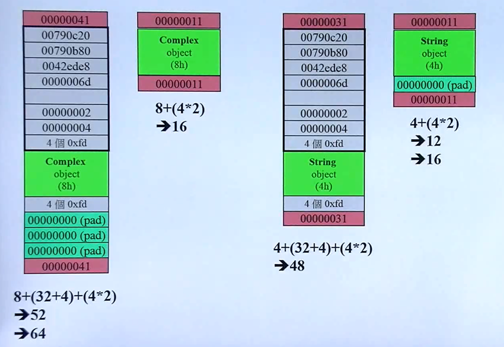
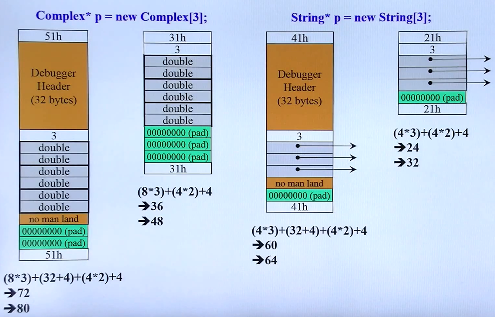
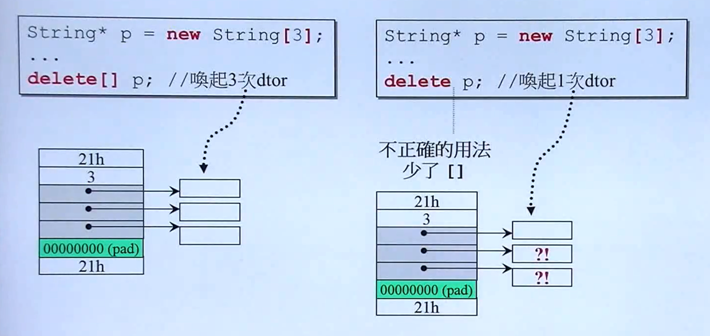

# 重学 C++

C++ 面向对象高级编程，侯捷老师


# C++ 编程简介


# 头文件与类的声明

C, C++ 关于数据与函数

函数就是用来处理数据的。在 C 中没有足够的关键字，这些数据一定是全局的，各个函数都可以处理它们。

后来发展出面向对象语言。C++ 把数据和处理这些数据的函数包在一起（Class），这些数据只有这些方法可以处理，其他人看不到。C++ 的 struct 几乎等同于 class。


最经典的 class 分类，一种是带有指针的，一种是里头不带指针的。这会影响后面的写法，影响深远。

```c++
// Object Based(基于对象)：面对的是单一 class 的设计
// Class with pointer member(s)
complex
field 实部，虚部  --create-->  c1,c2,c3,c4...

function 加减乘除，共轭，正弦...


// Object Oriented(面向对象)：面对的是多重 classes 的设计，
// classes 和classes 之间的关系
// Class without pointer member(s)
string
字符(s)	--create-->	s1,s2,s3,s4...
//其实是一个 ptr，指向一串字符

function 拷贝，输出，附加，插入...


// 创建对象
complex c1(2,1);
complex c2;
complex* pc = new complex(0,1);

string s1("Hello ");
string s2("World ");
string* ps = new string;
```

数据可以有很多份，但函数只有一份。中间桥梁？

<br/>

C++ programs 代码基本形式

```
.h (header files)
Classes Declaration

+

.cpp
#include <iostream.h>
#include "complex.h"

	ex.main()

+

.h (header files)
Standard Library
```

extension file name 不一定是 .h 或 .cpp（在不同平台上可能不一样），也可能是 .hpp 或其他或甚至无延伸名。

<br/>

Output，C++ vs. C

```cpp
// C++
#include <iostream.h>	// or #include <iostream>
using namespace std;

int main() {
	int i = 7;
	cout << "i=" << i << endl;
	
	return 0;
}


// C
#include <stdio.h>	// or #include <cstdio>

int main() {
	int i = 7;
	printf("i=%d \n", i);
	
	return 0;
}
```

<br/>

Header（头文件）中的防卫式声明、布局

```cpp
// complex.h
#ifndef _COMPLEX_	// guard(防卫式声明)
#define _COMPLEX_

// ...主体
#include <cmath>

class ostream;	// forward declarations（前置声明）
class complex;

complex&
	_doapl (complex* ths, const complex& r);
	
class complex {	// class declarations（类-声明）
	...
};

complex::function ...	// class definition（类-定义）

#endif
```

因为很多程序都要用到这个头文件，include 含入的次序如果要求是特定的，对使用者负担太沉重了。

程序第一次 include 时定义这个 COMPLEX，会进入这个主体。第二次 COMPLEX 定义过了，就不会进入这个主体。

<br/>

class 的声明（declaration）

```cpp
class complex	// class head
{	// class body
	// 这里面就要开始设计我的复数应该具备什么样的数据,
	//怎么样的函数才能满足使用者的需求
public:
	complex (double r = 0, double i = 0) : re (r), im (i)
	{ }
	complex& operator += (const complex&);	// 这里没有大括号，只是声明而已
	double real () const { return re; }	// 有些函数在此直接定义，另一些在 body 之外定义
	double imag () const { return im; }
private:
	double re, im;	// 不同类型需要定义好几个类
	
    // 设计另外一个函数，它和它之间是朋友关系
	friend complex& _doapl (complex*, const complex&);
};

{
	complex c1(2,1);
	complex c2;
	...
}
```

<br/>

class template（模板）简介

```cpp
// 实部虚部的类型不要现在就写死，等到使用时再绑定、指定
template<typename T>
class complex
{
public:
	complex (T r = 0, T i = 0) : re (r), im (i)
	{ }
	complex& operator += (const complex&);
	double real () const { return re; }	
	double imag () const { return im; }
private:
	T re, im;
	
	friend complex& _doapl (complex*, const complex&);
};


{
	complex<double> c1(2.5,1.5);
	complex<int> c2(2,6);
	...
}
```

 <br/>

# 构造函数

inline（内联）函数

```cpp
class complex	// class head
{
public:
	complex (double r = 0, double i = 0) : re (r), im (i)
	{ }
	complex& operator += (const complex&);	
	double real () const { return re; }	// 函数若在 class body 内定义完成，
	double imag () const { return im; }	// 便自动成为 inline 候选人
private:
	double re, im;	
	
	friend complex& _doapl (complex*, const complex&);
};


inline double	// 不在 body 定义，告诉编译器尽量把我看做 inline，由编译器决定
imag(const complex& x)
{
    return x.imag();
}
```

[C++ inline和#define宏的区别 - wywdahai - 博客园 (cnblogs.com)](https://www.cnblogs.com/yanwei-wang/p/8073111.html)

如果你的函数是 inline function 会比较快、好。但是有些 function （太复杂）你说是  inline，编译器也不会当做 inline。你的 inline 只是对编译器的建议而已，是否真正的 inline 由编译器决定。

<br/>

access level（访问级别）

```cpp
class complex	// class head
{
public:
	complex (double r = 0, double i = 0) : re (r), im (i)
	{ }
	complex& operator += (const complex&);	
	double real () const { return re; }	// 函数若在 class body 内定义完成，
	double imag () const { return im; }	// 便自动成为 inline 候选人
private:
	double re, im;	
	
	friend complex& _doapl (complex*, const complex&);
};


// XXX
{
    complex c1(2,1);
    cout << c1.re;
    cout << c1,im;
}


// OOO
{
    complex c1(2,1);
    cout << c1.real();
    cout << c1.imag();
}
```

body 之中可以区分为某几大段，用 public、private 关键字来区分，第三种 protected。

数据部分放 private，因为数据是要封装起来的，不要被外界任意看到，应该只有自己类才可以看到。数据一定要通过自己的函数传递出去或者被设定，一个读一个写。不能够直接外部去拿。除非这些数据是 public，但这是我们要避免的事情。

函数部分可以分为两部分：一部分是给外界用的，一部分是处理自己的私人事情的。这些段落可以任意交错出现。

<br/>

constuctor（ctor，构造函数）

```cpp
class complex
{
public:
	complex (double r = 0, double i = 0) 	// default argument(默认实参)
        : re (r), im (i)	// 1、初始化，initialization list(初值列，初始列)
	{ /* 2、赋值 */ }
    
    // 这样写，相当于放弃了初始化阶段。虽然你还是把值放进去了，但时间点已经晚了，效率差了
    /* assignment (赋值)	? XXX
    complex (double r = 0, double i = 0) 
    { re = r, im =i; }
    */
    
	complex& operator += (const complex&);	
	double real () const { return re; }
	double imag () const { return im; }
private:
	double re, im;	
	
	friend complex& _doapl (complex*, const complex&);
};


{
    complex c1(2,1);	// 1、创建实部为2，虚部为1的对象
    complex c2;		// 2、创建没有指明参数的对象，使用默认参数
    complex* p = new complex(4);	// 3、以动态的方式来创建一个对象，得到的是一个指针
    ...
}
```

C++ 语言说你想要创建一个对象，有一个函数会被自动调用起来，叫构造函数。构造函数的写法很独特，其名称一定要跟类名称相同，它可以拥有参数，参数是可以有默认值的。其他函数也可以写出默认值来。

构造函数没有返回类型，不需要。构造函数就是来创建对象的，不能改变的，没必要写。

构造函数有一个特别写法，其他函数没有的，initialization list。一个变量数值的设定有两阶段，第一个阶段就是初始化，第二个阶段是赋值。

对应的就有析构函数。不带指针的类多半不用写析构函数。

<br/>

ctor (构造函数) 可以有很多个 overloading (重载)

C++ 里面同名函数可以同时存在多个，但在编译器看来它们名称并不相同。

```cpp
class complex	
{
public:
	// 1
	complex (double r = 0, double i = 0) : re (r), im (i)
	{ }
	// 2 ? XXX
	complex () : re(0), im(0) {} 
    
	complex& operator += (const complex&);	
    
    // 3
	double real () const { return re; }	
	double imag () const { return im; }	
private:
	double re, im;	
	
	friend complex& _doapl (complex*, const complex&);
};


// 4
void real(double r) { re = r; }


// 3、4 real 函数编译后的实际名称可能是：取决于编译器（函数名称、参数类型/数量）
?real@Complex@@QBENXZ
?real@Complex@@QAENABN@Z
    

// 1、2 构造函数不能同时存在
// 1有默认参数，2无参数。编译器不知道调哪个。
{
    complex c1;
    complex c2();
    ...
}
```

可能有很多种初值的设定，所以需要重载。C 是不允许多个重载函数的。

<br/>

constructor (构造函数) 被放在 private 区域

```cpp
class complex
{
public:
	complex& operator += (const complex&);	
	double real () const { return re; }
	double imag () const { return im; }
private:
	double re, im;	
    
    // 把函数放在private表示不可以被外界调用。
	complex (double r = 0, double i = 0) : re (r), im (i)
	{ }
	friend complex& _doapl (complex*, const complex&);
};


// XXX
{
    complex c1(2,1);
    complex c2;
    ...
}
```

不允许被外界创建对象。这个类有什么用？

Singleton，单例。设计的 A，外界只能用一份。这一份在 static。

```cpp
class A {
public:
	static A& getInstance();
	setup() { ... }
private:
	A();
	A(const A& rhs);
	...
};

A& A::getInstance()
{
	static A a;
	return a;
}
```

<br/>

const member functions (常量成员函数)

```cpp
class complex
{
public:
	complex (double r = 0, double i = 0) : re (r), im (i)
	{ }
	complex& operator += (const complex&);	
	double real () const { return re; }
	double imag () const { return im; }
private:
	double re, im;	
	
	friend complex& _doapl (complex*, const complex&);
};


// OOO
{
    complex c1(2,1);
    cout << c1.real();
    cout << c1.imag();
}

// XXX
{
    // 对象/变量的内容是不变的，但函数没加const表明有可能改data
   	// 前后矛盾，编译器报错
    const complex c1(2,1);
    cout << c1.real();
    cout << c1.imag();
}
```

不改变数据内容的在函数的后面加 const。class 里面的函数分成会改变数据和不会改变数据两种。

<br/>

参数传递：pass by value vs. pass by reference (to const)

返回值传递：return by value vs. return by reference (to const)

```cpp
class complex
{
public:
    // pass value
	complex (double r = 0, double i = 0) 
        : re (r), im (i)
	{ }
    
    // pass reference
	complex& operator += (const complex&);	
    // return value
	double real () const { return re; }
	double imag () const { return im; }
private:
	double re, im;	
	
    // reference, to const
	friend complex& _doapl (complex*, const complex&);
};


{
    complex c1(2,1);
    complex c2;
    
    c2 += c1;
    cout << c2;
}


// pass reference, 传进去会对 os 进行改动
// return reference
ostream&
operator << (ostream& os, const complex& x)
{
    return os << '(' << real(x) << ',' << imag(x) << ')';
}
```

pass by value 就是 value 多大都整包传过去，传的动作是压到函数的栈 (stack) 里头去。传得时候有可能不是 double 4个字节，而是传100 个字节的东西。尽量不要传 value。

过去 C 可以传指针，这包东西太大了，可以把这包东西的地址 (指针，4个字节) 传出去。C++ 有引用 (reference)。指针可以打印出来，引用在底部就是一个指针，传引用相当于传指针那么快。尽量都传引用。如果传一个字符呢？也可以用 value。

C 传指针那个函数一改就影响我了，传引用也是。如果传引用只是为了速度，不希望改，可以 to const，传进去之后函数不能改传的引用。

如果可以的话，返回值也尽量传递引用。

<br/>

friend (友元)

```cpp
class complex
{
public:
	complex (double r = 0, double i = 0) 
        : re (r), im (i)
	{ }
	complex& operator += (const complex&);	
	double real () const { return re; }
	double imag () const { return im; }
private:
	double re, im;	
	
	friend complex& _doapl (complex*, const complex&);
};

inline complex& _doapl (complex* ths, const complex& r)
{
    // 自由取得friend 的private成员
    ths-> re += r.re;
    ths-> im += r.im;
    return *ths;
}
```

在语言里面，朋友可以来拿数据。外界获取数据可以通过函数，但是对于 friend 可以网开一面。C++ 强调封装，朋友就打开了封装的大门。

<br/>

相同 class 的各个 objects 互为 friends (友元)

```cpp
class complex
{
public:
	complex (double r = 0, double i = 0) 
        : re (r), im (i)
	{ }
    
    // 处理另外一个复数。直接拿数据，破坏了封装性，没有 friend？
	int func(const complex& param)
    { return param.re + param.im; }
    
private:
	double re, im;	
};


{
    complex c1(2,1);
    complex c2;
    
    c2.func(c1);
}
```

<br/>

class body 外的各种定义 (definitions)

什么情况下可以 pass by reference

什么情况下可以 return by reference

```cpp
inline complex& _doapl (complex* ths, const complex& r)
{
    // 第一参数将会被改动，
    ths-> re += r.re;
    ths-> im += r.im;
    return *ths;
}

inline complex& complex::operator += (const complex& r)
{
	return _doapl (this, r);
}
```

在第一个函数加完以后有结果，这个结果放哪里？第一种（如 ths->re + r.re），函数必须创建一个地方存放结果。这个结果在函数结束的时候就消失了，是 local 变量。这时候就不能返回 reference，传出去的话，外界就看到了不好的东西。这时就不能传引用。

第二种如果放在已有空间上面，就是上面的情况。

<br/>

好的代码风格：

1. 数据一定放在 private
2. 参数尽可能用 reference 来传，要不要加 const 看状况
3. 返回值也尽量用 reference 来传，可不可行要加进一步设想
4. 在类的 body 里面应该加 const 就加，如果不加，使用的时候可能报错
5. 构造函数 initialize list 尽量用它

<br/>

operator overloading (操作符重载-1，成员函数) this

```cpp
// 1
inline complex&
_doapl(complex* ths, const complex& r)	// do assignment plus
{
    ths->re += r.re;
    ths->im += r.im;
    return *ths;
}

inline complex& 
complex::operator += (const complex& r)
{
    return _doapl (this, r);
}


{
    complex c1(2,1);
    complex c2(5);
    
    // c2是一个指针，会把地址传给this pointer
    c2 += c1;
}


// 等同于1，差别在this。写代码时不能这样写
// 所有的成员函数都带有一个隐藏的参数this pointer，谁调用这个函数，this就指向它
inline complex& complex::operator += (this, const complex& r)
{
    return _doapl(this,r);
}
```

<br/>

return by  reference 语法分析

传递者无需知道接收者是以 reference 形式接收

```cpp
inline complex&		// 返回的声明是一个reference，接收端
_doapl(complex* ths, const complex& r)	// 传进来的左操作数是一个指针
{
	...
    return *ths;	// 返回的是指针所指的东西，一个object (value)。与接收端是怎样搭配的？
}

inline complex& complex::operator += (const complex& r)
{
    return _doapl (this, r);
}


{
    complex c1(2,1);
    complex c2(5);
    
    // c1传的是value，接收是用的reference
    // 如果设计的人是用value来接收的，也没关系，不影响使用者
    // c1加到c2上就执行完了，返回类型用void也可以
    c2 += c1;
    
    // c1加到c2身上，c2加到c3身上
    // 但是使用者连串赋值的话不能用void。加完后还要当右操作数
    c3 += c2 += c1;
}
```

返回的是 value，但是接收端怎么接收它，不必在乎。这就是为什么要用reference的好处。

如果你用pointer来传，传的人必须知道现在传的是pointer，要有一个特殊符号。

用reference来接收速度快，用value来接收速度慢。但反正我送出去的都不管。

<br/>

class body 之外的各种定义 (definition)

```cpp
// 不带class名称，全域函数
inline double
imag(const complex& x)
{
    return x.imag ();
}

inline double
real(const complex& x)
{
    return x.real();
}


{
    complex c1(2,1);
    
    cout << imag(c1);
    cout << real(c1);
}
```

<br/>

Header (头文件) 的布局

```cpp
#ifndef _COMPLEX_
#define _COMPLEX_

// 0 forward declaration (前置声明)
#include <cmath>

class ostream;
class complex;

complex& _doapl (complex* ths, const complex&)


// 1 class declaration (类-声明),class 本体
class complex
{
    ...
};


// 2 class definition (类-定义)
// 这段存在的都是函数，要么是这个类的成员函数(全名)，要么就是全局函数(前面不会带class name)
complex::function ...

    
#endif
```

<br/>

operator overloading (操作符重载-2，非成员函数) 无this

2-3 为了对付 client 的三种可能用法，这里对应开发三个函数

```cpp
inline complex operator + (const complex& x, const complex& y)
{
    return complex (real (x) + real (y),
                    imag (x) + imag (y));
}

inline complex operator + (const complex& x, double y)
{
    return complex (real (x) + y, imag (x));
}

inline complex operator + (double x, const complex& y)
{
    return complex (x + real (y), imag (y));
}


{
    complex c1(2,1);
    complex c2;
    
    c2 = c1 + c2;
    c2 = c1 + 5;
    c2 = 7 + c1;
}
```

任何一个函数可以设计为成员函数或全局函数，没有谁一定比谁好。

```cpp
inline complex conj (const complex& x)
{
    return complex (real (x), -imag (x));
}

#include <iostream.h>
// 
ostream& operator << (ostream& os, const complex& x)
{
   	// 每加一种东西都会改变os的状态
    return os << '()' << real (x) << ',' << imag (x) << ')';
}


{
    complex c1(2,1);
    // 第一个参数就是cout，一个object，是一种ostream的东西，
    // 且第一个参数前不能加const，否则传进去的os不能被改变
    cout << conj(c1);
    // 连串写法决定返回类型不能为void，c1给cout返回的仍要是cout
    // 返回类型前不能加const，他还要接收conj(c1)，改变状态
    cout << c1 << conj(c1);
}
```

C++ 语法没有作用在右边身上的语法。cout是标准库早就写好的，不认识你现在写的复数类型，只认识当时既有的 (building, 内置的)。对于 << 你的函数只能使用全局的写法。

<br/>

temp object (临时对象) typename();

2-3 下面这些函数绝不可 return by reference，因为它们返回的必定是个 local object。

```cpp
inline complex operator + (const complex& x, const complex& y)
{
    return complex (real (x) + real (y),
                    imag (x) + imag (y));
}

inline complex operator + (const complex& x, double y)
{
    return complex (real (x) + y, imag (x));
}

inline complex operator + (double x, const complex& y)
{
    return complex (x + real (y), imag (y));
}


{
    int(7);
    
    complex c1(2,1);
    complex c2();
    
    // 这两个的生命到他们的下一行就没有了
    complex();
    complex(4,5);
    
    cout << complex(2);
}
```

<br/>

class body 之外的各种定义 (definitions)

```cpp
// 判断是正号还是加号，看参数个数
inline complex operator + (const complex& x)
{
    // 这里返回的不是local object，可以返回reference提速
    return x;
}

// 这个函数绝不可返回reference，因为其返回的是local object
inline complex operator - (const complex& x)	// negate 反相(取反)
{
    return complex (-real (x), -imag (x));
}


{
    complex c1(2,1);
    complex c2;
    cout << -c1;
    cout << +c1;
}
```

<br/>

class 的声明 (declaration)

```cpp
class complex
{
public:
	complex (double r = 0, double i = 0) 
        : re (r), im (i)
	{ }
	complex& operator += (const complex&);	
	double real () const { return re; }
	double imag () const { return im; }
private:
	double re, im;	
	
	friend complex& _doapl (complex*, const complex&);
};
```

<br/>

Complex 类的设计与实现过程 (标准库实现)

```cpp
// 1. 防卫式声明
#ifndef _COMPLEX_
#define _COMPLEX_

// 2. 现在设计一个复数，先写出class head
class complex
{	// class body
    
// 5. 现在想我们要写哪些函数。这些函数操作在复数身上。对外发表，放public
public:
    // 5-1. 首先任何一个class我们都要想它的构造函数。构造函数名称与class相同，无返回类型
    // 接收哪些参数？要不要默认值？参数传递是pass by reference还是pass by value？
    // 现在这里是double 4字节，和传递引用效率是一样的。
    // 构造函数有一个很特别的语法：initialization list, 初值列
    // 带指针的类还需要写析构函数
    complex (double r = 0, double i = 0) : re (r), im (i)
    {
        // 构造函数还要做什么事情？
        // 可能要开辟内存、开一个窗口、开一个文件
    }
    
    // 5-2. 支持 += ，这里我们有两种选择：一种是成员函数，一种是非成员函数(全局函数)
    // 参数传递和返回类型如何定义？
    complex& operator += (const complex&);
    
    // 5-3. 为这个类再准备取得实部、虚部的函数
    // 设计任何一个函数的时候都要想后面要不要加const。函数里面不会改动data就要加
    // 有些函数在这里就写出来了，inline function，内联函数(取决于复杂程度，编译器)
    // class 外头写的，我们也可以让它是inline function
    double real () const { return re; }
    double imag () const { return im; }

// 3. 复数需要具备什么样的数据，放在private
private:
    double re, im;	// 4. 考虑数据是什么类型
    
    // 5-4 do assignment plus.这里要直接取得私有的实部虚部，怎么办？
    // 宣称class的友元是这个函数。后面写这个函数的时候就可以像朋友一样取它的data
    friend complex& _doapl (complex*, const complex&);
};

// 右边加到左边，左边会变，不能加const
// 返回类型同下
inline complex& _doapl(complex* ths, const complex& r)
{
    ths->re += r.re;
    ths->im += r.im;
    return *ths;
}

// 5-5 += 动作，这是一个操作符重载。
// 它是属于class里头的，函数全名是complex::operator +=, 中间有无空格都行(free font)
// 思考它的参数是什么？+= 一定有一个左边、一个右边。
// 由于它是一个成员函数，是作用在左边身上。左边作为一个隐藏的参数放进来，不一定是第一个或最后一个
// 首先考虑参数传引用。右边加到左边身上，右边不动，加const
// 接下来考虑return type。得到的左手边是复数，要不要传引用呢？
// 如果传出去的东西不是local object，不是在这个函数本体里面创建的，就可以传引用
// 左边本来就存在的，所以它不是local object，可以传引用
// 这个函数在class body之外，加上inline，最后能否成为inline取决于编译器
inline complex& complex::operator += (const complex& r)
{
    // 由于某些考量，把动作丢给另外一个函数做，参数原封不动传给它
    return _doapl (this, r);
}

// 5-6 复数的另外一些动作设计为非成员函数。为什么不设计为成员函数？
// 有一个考量是实数也可以加复数，而不只是复数加复数(把 + 设计到复数class里头，动作受限)
// 左边加右边不会改变内容(加const)，而是创建一个东西存放(local object, return type不能传引用)
inline complex operator + (const complex& x, const complex& y)
{
    // 创建对象，类的名称加小括号。临时对象
    return complex ( real (x) + real (y), imag (x) + imag (y));
}

inline complex operator + (const complex& x, double y)
{
    return complex (real (x) + y, imag (x));
}

inline complex operator + (double x, const complex& y)
{
    return complex (x + real (y), imag (y)); 
}

#include <iostream.h>	// 在function的外头都可以include
// 5-7 操作符重载一定是作用在左边操作数身上。可以写成成员函数或非成员函数
// c1 << cout; 使用者会很惊讶。所以这里只能写成非成员函数
// 右边加到左边，os的状态会发生改变，不加const
// cout << c1 << endl; 执行完后应该传回一种东西接收更右边的输出，所以返回ostream，不是local object
ostream& operator << (ostream& os, const complex& x)
{
    return os << '()' << real (x) << ',' << imag (x) << ')';
}

#endif
```


# 三大函数：拷贝构造，拷贝复制，析构

Classes 的两个经典分类

- Class without pointer member(s)

  complex

- Class with pointer member(s)

  string


String class

```cpp
// string.h
#ifndef _MYSTRING_
#define _MYSTRING_

// 1
class String
{
  ...  
};

// 2
String::function(...) ...

Global-function(...) ...

#endif
    
    
// string-test.cpp
int main()
{
	String s1(),
    String s2("hello");
    
    // 以s1为初值创建s3，拷贝构造
    String s3(s1);
    cout << s3 << endl;
    // s2赋值给s3，拷贝赋值
    s3 = s2;
    
    cout << s3 << endl;
}
```

前面讲的复数没有拷贝构造和拷贝赋值吗？也有，可是我们没有写它。这两个函数没有写的话，编译器会给你一套。拷贝构造和拷贝赋值所做的就是一个一个地copy。我们要不要自己写一份呢？就要考虑编译器给的这套够不够用。复数就有实部虚部，忠实拷贝过去，很好啊，再怎么写也就这样了，所以没有再写。

可以在带着指针的这种类上面，如果还是使用编译器给的这套拷贝构造和拷贝赋值，会有很不好的影响。想想看，现在我有一个对象，它里头有个指针指向另外一个地方。现在要产生新的对象，如果拷贝，那只是指针拷贝过来，它们两个指到同一个地方。这并不是真正的拷贝。

如果你的类带有指针，你不能使用编译器默认给你的拷贝构造和拷贝赋值，一定要自己写。


Big Three, 三个特殊函数（构造拷贝、构造赋值、析构函数）

```cpp
// 1
class String {
public:
    // 显然不能使用编译器给我们那套特殊函数，拷贝构造、拷贝赋值。要自己写一套
    // 函数名称与类相同。构造函数，传进来一个指针，默认给它0
	String(const char* cstr = 0);
    
    // 只要你的类带有指针，你一定要写出这两个函数
    // 构造函数，它接收的是它自己这种东西。所以叫拷贝构造
	String(const String& str);
    // 操作符重载，赋值的动作。特殊之处在于它赋值唯一参数也是它自己这种东西。所以这是拷贝赋值
	String& operator=(const String& str);
	
    // 与class名称相同，前面加波浪号。析构函数
    // 当这个类做出来的对象死亡的时候 (离开它的作用域)，析构函数就会被调用起来
    ~String();
    
   	// inline function
    // 只是返回，不改变数据，加const
	char* get_c_str() const { return m_data; }
	
private:
	char* m_data;
}
```

一般而言，字符串都会这样设计。让字符串里面拥有一根指针，在需要内存的时候才创建另外一个空间来放字符本身。这是因为字符串里面的东西有大有小，有时候是空字符串。这样设计就有一种动态的感觉最好，而不要字符串里头放一个数组说里面都是字符，这个数组你要设定多大呢？一万？一百？还是三？有的太大，有的太小。所以我们会想用一种动态的分配方式。

因此，确定下来这个class的data应放在private里头，这个data应该是一根指针，指向字符。


ctor 和 dtor (构造函数和析构函数)

```cpp
inline String::String(const char* cstr = 0)
{
    // 检查传进来的指针是0吗？
	if (cstr) {	// 传进来的不是0，表示要给初值
        // new分配足够空间，传进字符串长度+1（结束符）
		m_data = new char[strlen(cstr)+1];
		strcpy(m_data, cstr);
	}
	else {	// 如果是0，未指定初值
        // 虽然是0，空指针，但我们还是要准备一个字符放结束符号
		m_data = new chat[1];	// new分配一个字符的内存，写1是搭配上面写法
		*m_data = '\0';	// 把结束符号放进去后就形成了空字符串
	}
}

// 复数要不要清理，把实部虚部设0。不需要，清理完它都快死掉了。
// 但是这里有动态分配一块内存，如果没把这块内存释放掉的话，就会内存泄漏
inline String::~String()
{
	delete[] m_data;
}


{
    // 这样是没有参数
	String s1(),
    // 这样是传了一个指针进来
	String s2("hello");
    // 上面这两个离开作用域，析构函数自然被调用起来
	
    // new动态创建一个字符串
	String* p = new String("hello");
    // 离开作用域，要把p delete掉，因为它是指针
    delete p;
}
```

从 C 以来就延续的概念，字符串是什么？就是一个指针指着头，后面就一串，最后面有一个 0 这样的结束符。

一个字符串多长，有两种想法：一种是我不知道多长，但最后面有一个结束符，这样就可以算出来 (C、C++)。另外一种就是后面没有结束符，前面多一个长度这样的整数 (Pascal)。

如果你的类里面有指针，多半你就是要做动态分配。既然做了动态分配，那么这个对象要死亡前一刻，析构函数会被调用起来，你就必须在析构函数里面把你动态分配的那块内存释放掉，delete掉，还给系统。


class with pointer members 必须有 copy ctor (拷贝构造) 和 copy op= (拷贝赋值)

```
// String a("Hello"); String b("World");
a 的 data指针 -> Hello\0
b 的 data指针 -> World\0

b = a;

// 如果你没有自己写的话，使用 default copy ctor 或 default op= 就会形成一下局面
// 编译器给你的默认那个做bit，一个位一个位的拷贝
// 在a、b对象里头的data只有这个指针，Hello\0 是不属于对象本身的，是动态分配的
// a copy到 b里头去，也就是b的内容要和a相同
// b跟a里面只有指针，两根指针指向同一块内容。
a的data指针、b的data指针 -> Hello\0
```

这根本不是我们想要的。我们希望赋值之后，两端各有相同的内容。看起来它们是有相同的内容，但是 World\0 没有指针指向它了，memory leak。两个指针指向 Hello\0 也非常危险，因为将来你改a，b就会受影响。所以这种叫浅拷贝。


copy ctor(拷贝构造函数)

```cpp
// 名称与class相同，构造函数。收到的参数就是自己这种类型，所以叫拷贝。
// 传进来的蓝本不被改动，加const
inline String::String(const String& str)
{
    // 直接取另一个object的private data。兄弟之间互为friend
    // 分配足够的空间容纳蓝本。空间创建出来后，把内容拷贝过去。这种叫深拷贝。
    m_data = new char[ strlen(str.m_data)+1];
    strcpy(m_data, str.m_data);
}


{
    String s1("hello ");
    // 下面两个等同
    String s2(s1);
//  String s2 = s1;
}
```


copy assignment operator (拷贝赋值函数)

```cpp
inline Stirng& String::operator=(const String& str)
{
    // 检测自我赋值 (self assignment)
    if (this == &str)
        return *this;
    
    // 1.左边先杀掉自己
    delete[] m_data;
    // 2.左边重新分配一块跟右边一样大的空间，+1
    m_data = new char[ strlen(str.m_data)+1];
    // 3.把右边的内容拷贝到左边，使用C已经提供给我们的函数
    strcpy(m_data, str.m_data);
    return *this;
}


{
    String s1("hello");
    String s2(s1);
    s2 = s1;
}
```

类有指针的话，拷贝赋值你不能不写。

把右边的东西复制 (拷贝) 到左边，左右都有东西了，怎么办？先把左边清空，创建出跟右边一样大的空间，再把右边复制到左边身上。

一定要在operator=中检查是否self assignment。看起来可能不是自我赋值，其实可能是，因为指针的名称可能变动了。

```
// 如果没有检测自我赋值
a = a	// 左右pointers指向同一个memory block
*this的data指针、rhs的data指针 -> Hello\0

// 前述operator=的第一件事情就是delete，造成这般结果：
*this的data指针、rhs的data指针 -> ???

// 第二个动作就是看右边的长度，右边已经不见了
// 然后，当企图存取(访问)rhs，产生不确定行为(undefined behavior)，结果会出错

```


# 堆、栈与内存管理

output 函数

```cpp
#include <iostream.h>
// 不能是成员函数。否则，使用者用的时候方向会相反
ostream& operator<<(ostream& os, const String& str)
{
    // 字符串有没有什么东西是可以直接丢给cout来接收的？
    // 字符串里面有一根指针指向字符组成的一个数组。
    // 所以我们只要得到那根指针，cout本来就能接收那种指针，打印出字符串
    os << str.get_c_str();
    return os;
}


{
    String s1("hello ");
    cout << s1;
}
```


所谓 stack (栈)，所谓 heap (堆)

Stack，是存在于某作用域 (scope) 的一块内存空间 (memory space)。例如当你调用函数，函数本身即会形成一个 stack 用来放置它所接收的参数、返回地址以及local object。

在函数本体 (function body) 内声明的任何变量，其所使用的内存块都取自上述 stack。

Heap，或喂 system heap，是指由操作系统提供的一块 global 内存空间，程序可动态分配 (dynamic allocated) 从某中获得若干区块 (blocks)。

```cpp
class Complex {...};
...
{
    // c1 所占用的空间来自于stack
    Complex c1(1,2);
    // Complex(3) 是个临时对象，其所占用的空间是以new自heap动态分配而得，并由p指向
    Complex* p = new Complex(3);
    
    // 这两个对象，当离开作用域的时候，c1生命自然就消失了，因为它在stack
    // 但是如果是你自己以new的形式从堆里取得的内存(对象、任何东西)，你都必须手动地delete掉
}
```


stack objects 的生命期

```cpp
class Complex { ... };
...
    
{
    Complex c1(1,2);
}
```

c1 便是所谓 stack object，其生命在作用域 (scope) 结束之际结束，结束的时候它的析构函数会被调用起来。这种作用域内的object，又称为 auto object，因为它会被自动清理。


static local objects 的生命期

```cpp
class Complex { ... };
...

{
	static Complex c2(1,2);
}
```

c2 便是所谓 static object，其生命在作用域 (scope) 结束之后仍然存在，直到整个程序结束（这时候析构函数才被调用）。


global objects 的生命期

```cpp
class Complex { ... };
...
// 它的生命在main()更早之前就存在了，在main()结束之后才消失掉
Complex c3(1,2);

int main() 
{
	...
}
```

c3 便是所谓 global object，其生命在整个程序结束之后才结束。你也可以把它视为一种 static object，其作用域是整个程序。


heap objects 的生命期

```cpp
class Complex { ... };
...

{
    Complex* p = new Complex;
    ...
	delete p;	// delete的时候同时也调用起复数的析构函数(编译器默认版本)
}
```

p 所指的便是 heap object，其生命在它被 deleted 之际结束。

```cpp
class Complex { ... };
...
    
{
    Complex* p = new Complex;
    // 这边只有new，却忘记了delete
    // new之后得到的结果是p指针
    // 这个指针在离开作用域之后，这个指针本身就死亡了
    // 但是指针指向的那块空间还在，这个就是内存泄漏
}
```

内存泄漏：你本来有一块内存，可是经过某些时间或某些作用域之后，你对它失去了控制。以至于你根本没办法把它还给任何人，还给操作系统。内存是重要而有限的资源。

以上出现内存泄漏 (memory leak)，因为当作用域结束，p 所指的 heap object 仍然存在，但指针 p 的生命却结束了，作用域之外再也看不到 p (也就没机会 delete p) 。


new 跟内存分配有关，也和构造函数有关。可以用什么把它们集合起来，更加清晰呢？

new：先分配 memory，再调用 ctor

```cpp
// 1
Complex* pc = new Complex(1,2);

// 编译器把1转化为三个动作
Complex *pc;

// 1.分配内存。
// operator new是C++提供的一个很特别的函数，其内部调用 malloc(n)，C里面分配内存的函数
// sizeof出来是8，分配出来两个double
void* mem = operator new( sizeof(Complex) );
// 2.转型
pc = static_cast<Complex*> (mem);
// 3.调用其构造函数。构造函数是成员函数，所以一定会有this pointer
// 等同Complex::Complex(pc,1,2),pc即this,隐藏参数。谁调用这个函数，谁就是this。
// pc就是这块内存的起始位置
pc->Complex::Complex(1,2);


class Complex
{
public:
    Complex(...) {...}
...
private:
    double m_real;
    double m_imag;
};


```


delete：先调用 dtor，再释放 memory

这个次序跟new刚刚好是相反的

```cpp
String* ps = new String("Hello");
...
delete ps;

// 编译器把delete转化为两个动作
// 1.调用析构函数
String::~String(ps);
// 2.释放内存，其内部调用 free(ps)
// operator delete是C++的一个特殊函数，其内部调用free(ps)
// 这个时候才把字符串本身杀掉
operator delete(ps);


class String
{
public:
    // 析构函数要把我们字符串里面的它动态分配的那块杀掉，至于字符串本身，它只是一个指针而已
    ~String()
    { delete[] m_data; }
    ...
private:
    char* m_data;
}
```


刚才提到分配内存或者是释放内存，实际都是使用了C的malloc和free，那么使用malloc和free到底得到了多大的内存？

动态分配所得的内存块 (memory block), in VC



如果你去分配创建一个复数，获得两个double，8个byte。你只得到8个字节吗？不是。在调试模式底下，你会得到上面（每一格是4个字节）32个字节，下面还会得到1个4byte，灰色部分。除此之外，还要带着两个砖头颜色的cookie。你现在要这个内存，好，系统说那我赋一个小甜饼给你。大小算出来是52，VC给你的内存块一定是16的倍数（这是有原因的，现在没办法提），52不能除以16，最靠近52的16的倍数是64。所以这块还要填补一些东西进去（pad，填补物）。

当你前面在new一个复数的时候，得到两个double的一块空间，其实并不是这样。其实是上面那样，多得了这么多东西，这不是太浪费了吗？但是这是一种必要的浪费，因为以后回收的时候需要靠某些东西顺利的回收（对操作系统而言）。

也许你不会进入调试模式。你一般用的是release mode，对应上图第二部分。这样把灰色的拿掉，复数8个字节，加上上下cookie。加完之后是16,16的倍数，不需要加pad。

上下cookie做什么用？最主要的是记录整块给你的大小。因为将来系统回收的时候，你只给它一个指针，它怎么知道回收多大？所以必须在某个地方记录整块的长度。malloc 和 free 约定在每个区块的上头放一个cookie。看看上面写的对不对。这边算出来是64, 其16进制就是40。这边记录的是41，为什么呢？40借用最后一位（bit，0或1）来表现我这块是给出去1还是收回来0。为什么可以借用最后一位？因为16的倍数代表最后四个bit都是0。

字符串呢？字符串本身就含一个指针，大小是4byte。

知道以上部分，心中自有丘壑。


如果你分配的是数组会怎样？为什么要谈这个呢？在构造函数，字符串动态分配内存用new，这里是用分配一个数组出来。array new 要搭配 array delete，不然会出错。

动态分配所得的 array



这里为什么要加4呢？是因为这里是个数组，VC的做法用一个整数来记录这里有三个东西。


array new 一定要搭配 array delete



delete会分为两个动作，delete p会把左边的大块删掉。这块删掉需要看cookie，cookie有完整记录这块，所以删掉这块是没有问题的，不会造成内存泄漏。

delete[] p 这样写的话，编译器才知道你删除的是一个数组，才知道下面不是只有一个，而是有三个，才知道调用3次dtor。每个对象死亡之前，析构函数都要被调用起来。这三次析构函数各自负责把各自动态分配的内存杀掉。

如果没写中括号，编译器以为下面只有一个，所以调用1次dtor，析构函数会把指针指向的空间清掉回收，2跟3它不知道。析构函数执行完才来删除母体这块，整个杀掉。内存泄漏右边的两个小块。


# String 类的实现过程

# 扩展：类模板，函数模板，及其他

# 组合与继承

# 虚函数与多态

# 委托相关设计


导读

conversion function

non-explicit one argument constructor

pointer-like classes

function-like classes

namespace经验谈

class template

function template

member template

specialization

模板偏特化

模板参数

关于 C++ 标准库

三个主题

reference

符合&继承关系下的构造和析构

关于 vptr 和 vtbl

关于 Dynamic Binding

关于 this

关于 new， delete

operator new, operator delete

示例

重载 new(), delete()

basic_string 使用new(extra)扩充申请量