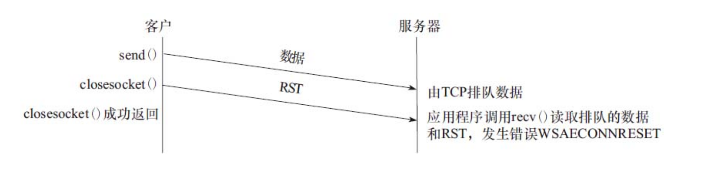

参考

[【网络编程实践--陈硕】学习笔记](https://blog.csdn.net/weixin_43919932/article/details/121308426)

Prerequisites

- Unix Network programming
  - know basics of TCP/IP, eg.IP addresses, ports.
  - know how to write and echo server with basic sockets APIs.
- access to one or more Linux hosts.
- know about C++, Python or Go.

Highlights of this course

- focus on server-side tcp networking programming
  - no user interaction, runs for weeks not minutes
- measurable performance
  - myths busted
- no hypothetic optimizations
  - how many memory (de)allocs kernal does from receiving an Ethernet frame to passing tcp payload to your application?

测不出来的性能指标是没有意义的，

避免猜测、猜想的优化。有些优化除了把代码变得复杂外，对性能没有实质的提升。

Layered Network

- ethernet frame，以太网帧
- ip packet，ip 分组
- tcp segment，tcp 分截
- application message，应用层消息

一般程序员关注4层，以太网层、ip 层、传输层和应用层。

ip分组和ip分片是两个设计，一般我们不用管ip分片。

Common pitfalls(陷阱) of novices(新手)

- mix business logical with network IO, difficult to unit test
- incomplete data received from a TCP peer
- incorrectly determine message boundaries when using TCP
- sending C struct to peer
  - modify the global align setting causes core dump in 3rd parth library
- TCP self-connection: localhost:54321 <-> localhost:54321
- many more in non-blocking networking programming

网络编程是个入门容易精通难的事情。初学者有些常见的错误，这里列了一些。

1、unix 网络编程的实例代码往往把网络 IO 和业务逻辑穿插在一起，这固然比较容易写出紧凑易读的代码，但是在大型项目中代码的维护性较低。不是每个人都精通网络编程方方面面的细节，如果他熟悉业务逻辑，在写业务逻辑的时候一不小心就引入网络编程方面的bug。应该尽量避免把网络编程socket、ip打交道的代码和业务逻辑穿插在一起。

2、TCP 不可靠，收到的数据不完整？这个话题之后会专门讲，主要涉及 TCP 连接断开的时机与条件。因此，在应用层设计时，应考虑到TCP断开时的设计。
（注：close太早可能会导致协议栈发生RST分解，连接重置，导致数据接收不完整。 在阻塞IO中可以使用SO_LINGER选项，但在非阻塞IO中此选项无用）

参考：《Windows网络编程 5.6.4顺序释放连接》

在服务器应用程序读取剩余数据之前，服务器主机的崩溃导致数据丢失，但客户并不知道。
对于面向连接的流式套接字而言，在调用closesocket（）时，选项SO_LINGER和SO_DONTLINGER的配置决定了closesocket（）的操作过程。这两个选项使得我们可以改变closesocket（）的默认配置，要求在用户进程与内核间传递linger结构，声明当调用closesocket（）时，如果仍有排队的数据等待发送套接字应当如何处理。）

3、TCP是字节流格式，只保证字节按顺序到达，但不保留消息的边界。在应用层中，需要设计实现TCP分包的逻辑（将字节流切分成消息）

4、不要直接发送语言中的结构体类型，原因有二：1)为了考虑对齐，而修改了全局的对齐方式（[**attribute**((packed))](http://blog.chinaunix.net/uid-25768133-id-3485479.html)），破坏了abi导致第三方库coredump。2)高度不可扩展，如果增加一个字段，则客户端与服务端都需要进行升级。

5、TCP自连接问题。客户端向本机服务端发起连接时，如果服务器没有起来，某些条件下可能会出现自连接现象，loop循环。localhost：54321<->localhost：54321 [参考：self-connection](https://blog.csdn.net/weixin_44787158/article/details/93200751)

6、非阻塞网络编程中还有很多坑，一个好的库应该把大多数坑都填上了。同时，程序员应该明白非阻塞网络编程的特点，避免自己再把坑挖开掉进去

