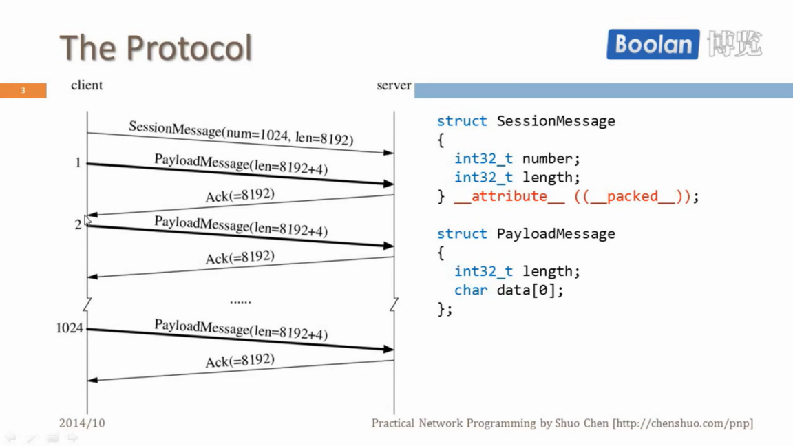
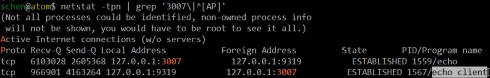
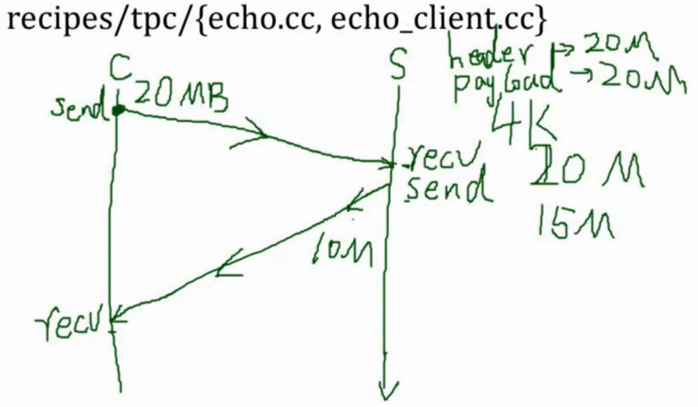
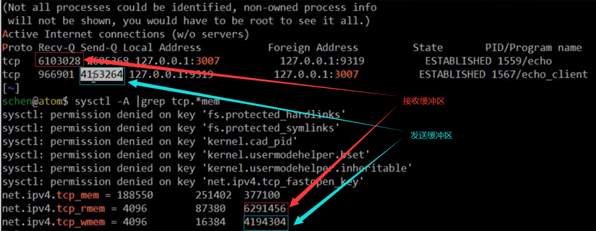

1\. Test TCP (ttcp)

The standard of old school tool for TCP performance benchmarking

主要测试两台机器间的TCP吞吐量。


# What performance do we care?

- Bandwitdh, MB/s. 每秒收发的数据量。(只关注数据量，不关注消息数)
- Throughput(吞吐量), message /s, queries /s (QPS), transactions /s (TPS)
- Latency,milliseconds, percentiles
- Utilization, percent, payload vs. carrier, goodput vs. theory BW
- Overhead, eg. CPU usage, for compression and/or encryption

1、带宽。前面用netcat测量了两台机器之间单向发送接收的带宽。TCP是117MB/s，这个可以看作上限，因为使用netcat发送什么额外开销都没有。其他工具实现的话因为消息要分包啊等等，会增加一些overhead，测出来的带宽应该会比这个小。如果测出来比这个大呢，有一种可能是数据压缩。这些情况值得记在心里，拿117这个数据来对比。如果小太多呢，意味着可能某个地方做错了。特别是如果小太多，而且CPU使用率又很低的话，那这个程序是不是既没有利用好网络带宽，又没有利用好CPU带宽。如果测出来的带宽小很多，而CPU使用率是100%，说明计算开销比较大。一个例子是SSH拷文件的时候，在比较慢的机器上，测出来只有二十多四十多MB/s离117较远，你发现它已经用完了整个CPU，而且SSH只能使用单线程，单核，所以你选多核它也不能加速。这个时候你就要想我能不能用别的方法把SSH的加密并行化以后能够提高它拷文件的效率。当然现在服务器级别的SSH单核也能占满TCP的千兆网带宽，所以并行的做法不一定有意义，但值得考虑一下。所以瓶颈如果在CPU的话，办法要么是优化程序，要么就是并行处理。

2、另外一个重要的性能指标就是吞吐量，有时候带宽和吞吐量可以混在一起。吞吐量通常是在应用层面讲一秒钟能处理多少条消息，能够执行多少条查询或者完成多少次事务。

3、还有个重要指标是延迟，除了平均延迟，我们还关心它的百分位延迟，比如说50%的延迟是多少ms。

4、资源使用率，这个通常是一个比例。比方说，我知道普通SATA硬盘的带宽是100MB/s，然后我写了一个程序，它把这个资源能够发挥到什么程度。它如果能够利用到80%，那它就有80MB/s，这也是一个效率指标。类似情况CPU百分百的使用率，当你的程序跑起来的时候受别的因素影响只能60%的CPU，那它的资源使用率就有值得提高的地方。

5、额外开销。比如说两台机器间直接拷文件的话，CPU使用率通常很低。但如果你需要压缩和加密的话，那么它会占用一些CPU资源。实时压缩和加密的话，能不能提高拷文件的性能这个取决于CPU额外负担的大小，这也是值得考虑的。这里简单估算一下，加密肯定不能提高性能，它只有开销，而且它不会使数据变小。压缩有可能会，而且我们一定要先压缩。如果反过来，压缩就没有作用了。考虑个简单的情况，比方说，在千兆网上这个带宽现在按照100MB/s来估算，假设压缩的性能是200MB/s。也就是说如果你用100MB/s在千兆网上拷文件的话，就会使用0.5个CPU。那么算下来如果你拷一个100MB的文件，不压缩的话是1s。压缩呢，先用0.5s把100MB的文件压缩成50MB，再用0.5s拷到另外一台机器上，一样是1s。但是你要考虑到压缩和网络IO是可以重叠的，你不用把整个100MB压缩到50MB后发送出去，你可以压缩完100k然后就发送100k，这样流水线操作的话，有可能把拷贝时间降低到0.5s。这样提高了拷文件的效率，代价就是CPU使用率上升一些。


# Why do we re-implement TTCP?

- it uses all basic sockets APIs: socket, listen, bind, accept, connect, read/recv, write/send, shutdown, close, etc.
- the protocol is binary, not just byte stream, so it's better than the classic echo example
- typical behaviors, meaningful results, instead of packets /s
- service as benchmark(基准) of programming language as well, by comparing CPU usage
- not concurrent, at least in the very basic form

协议带有格式，不只是字节流，相较于echo具有tcp分包处理等。

ttcp 本身是由 tcp/ip 实现的程序，具有一些典型的行为。可以阅读其代码学习它的一些优秀实现。

协议简单，可以由多种语言实现，针对测试结果对比各语言实现的runtime开销。

无并发连接，client 与 server 之间只有一个 tcp socket。


# The Protocol

ttcp 用到的协议。这里的粗箭头表示有效载荷的数据，以 1 为例：这里的 len=8192 对应右侧结构体 PayloadMessage::length 成员携带的数据，表示第二个成员的 data 的长度。而 length 本身占4个字节，因此这一次发送数据长度为 8192+4。注意这里的 PayloadMessage::data 成员是一个柔性数组，大小由运行时写入の数据为准，所以这里需要一个 length 成员记录 data 的长度。



可以注意到，ttcp 发送数据会有一个 Ack 应答，相对于 netcat 只发送不接收而言，理论上讲 ttcp 检测出的带宽要慢于 netcat 测出的结果，特别对于网络有延迟的情况而言，发送数据和 Ack 都会有延迟产生。

- 直线型的阻塞 IO 示例：
  - [muduo/examples/ace/ttcp/ttcp_blocking.cc](https://gitee.com/TRr320/muduo-master/blob/master/examples/ace/ttcp/ttcp_blocking.cc) （C with sockets API）
  - [recipes/tpc/ttcp.cc](https://gitee.com/TRr320/recipes-master/blob/master/tpc/ttcp.cc) （C++ with a thin wrapper）
  - [muduo-examples-in-go/examples/ace/ttcp/ttcp.go](https://gitee.com/TRr320/muduo-examples-in-go/blob/master/examples/ace/ttcp/ttcp.go) （Go）
- 非阻塞 IO 库示例：
  - [muduo/examples/ace/ttcp/ttcp.cc](https://gitee.com/TRr320/muduo-master/blob/master/examples/ace/ttcp/ttcp.cc)

以上示例都不支持并发连接，前三个示例每个连接起一个线程来处理就可以支持并发，第四个在设计上收到最后一条消息就退出，将退出语句注释掉可以支持并发。


#  The Code

- Straight forward with blocking IO
  - muduo / examples / ace / ttcp / ttcp_blocking.cc (C with sockets API)
  - recipes / tpc / ttcp.cc (C++ with a thin wrapper)
  - muduo-examples-in-go / examples / ace / ttcp / ttcp.go (Go)
- Non-blocking IO with muduo library
  - muduo / examples / ace / ttcp / ttcp.cc
- None of above support concurrent connections
  - pretty easy to enable, thread-per-connection for first three.

C 服务端 (接收函数)

```c
// muduo/examples/ace/ttcp/ttcp_blocking.cc 接收函数。C 实现

// 服务端：接收
void receive(const Options& opt)
{
    int sockfd = acceptOrDie(opt.port); // 接收连接
    
    struct SessionMessage sessionMessage = { 0, 0 }; // 接收消息，common.h中定义8字节
    if (read_n(sockfd, &sessionMessage, sizeof(sessionMessage)) != sizeof(sessionMessage)) // 保证完整读取8字节
    {
        perror("read SessionMessage");
        exit(1);
    }
    
    // number 消息条数，length 每条消息长度
    sessionMessage.number = ntohl(sessionMessage.number); // 消息由网络字节序转至本机字节序
    sessionMessage.length = ntohl(sessionMessage.length);
    // 服务器打印预计接收的数据大小
    printf("receive number = %\nreceive length = %d\n", sessionMessage.number, sessionMessage.length);
    const int total_len = static_cast<PayloadMessage*>(::malloc(total_len)); // 准备缓冲区接收。
    // 漏洞，如果对方故意发送很大的length，会造成malloc分配很大的内存，有可能造成攻击。加一条规则，限制length长度
    PayloadMessage* payload = static_cast<PayloadMessage*>(::malloc(total_len));
    assert(payload);
    
    for (int i=0; i<sessionMessage.number; ++i) // number次消息循环读取
    {
        payload->length = 0;
        if (read_n(sockfd, &payload->length, sizeof(payload->length)) != sizeof(payload->length)) // 先读4字节的，这里存放每条消息的长度
        {
            perror("read length");
            exit(1);
        }
        payload->length = ntohl(payload->length);
        assert(payload->length == sessionMessage.length); // 每条消息的 len 应该与 sessionMessage.len 一致
        // 读消息
        if (read_n(sockfd, payload->data, payload->length) != payload->length) // 读剩余的消息
        {
            perror("read payload data");
            eixt(1);
        }
        // 响应字段，返回本次收到的字节数
        int32_t ack = htonl(payload->length);
        if (write_n(sockfd, &ack, sizeof(ack)) != sizeof(ack))
        {
            perror("write ack");
            eixt(1);
        }
        ::free(payload);
        ::close(sockfd);
    }
}
```

C++ 客户端（发送函数）代码

```cpp
// 选自 recipes/tpc/ttcp.cc 发送函数。 C++实现

void transmit(const Options& opt)
{
  InetAddress addr(opt.port); // 拿到地址的端口
  if (!InetAddress::resolve(opt.host.c_str(), &addr)) // 将主机名解析成ip地址
  {
    printf("Unable to resolve %s\n", opt.host.c_str());
    return;
  }

  printf("connecting to %s\n", addr.toIpPort().c_str());
  TcpStreamPtr stream(TcpStream::connect(addr));  // 连接
  if (!stream)
  {
    printf("Unable to connect %s\n", addr.toIpPort().c_str());
    perror("");
    return;
  }

  if (opt.nodelay)  // 禁用Nagle算法，即可以有多个 未确认的分组的报文（tcp应答ack）
  {
    stream->setTcpNoDelay(true);
  }
  printf("connected\n");
  double start = now();
  struct SessionMessage sessionMessage = { 0, 0 };
  sessionMessage.number = htonl(opt.number);
  sessionMessage.length = htonl(opt.length);
  if (stream->sendAll(&sessionMessage, sizeof(sessionMessage)) != sizeof(sessionMessage))
  {
    perror("write SessionMessage");
    return;
  }
  /* 构造 PayloadMessage */
  const int total_len = sizeof(int32_t) + opt.length;
  PayloadMessage* payload = static_cast<PayloadMessage*>(::malloc(total_len));
  std::unique_ptr<PayloadMessage, void (*)(void*)> freeIt(payload, ::free); // freeIt 自动析构 
  assert(payload);
  payload->length = htonl(opt.length);
  /* 构造数据，一个循环出现的字符串 */
  for (int i = 0; i < opt.length; ++i)
  {
    payload->data[i] = "0123456789ABCDEF"[i % 16];
  }

  double total_mb = 1.0 * opt.length * opt.number / 1024 / 1024;
  printf("%.3f MiB in total\n", total_mb);

  for (int i = 0; i < opt.number; ++i)
  {
    int nw = stream->sendAll(payload, total_len); // 发送数据给服务端
    assert(nw == total_len);

    int ack = 0;
    int nr = stream->receiveAll(&ack, sizeof(ack)); // 接收服务端返回数据
    assert(nr == sizeof(ack));
    ack = ntohl(ack);
    assert(ack == opt.length);  // 检查服务段收到的数据长度 与 本次发送的长度是否相等
  }

  double elapsed = now() - start; // 计算带宽
  printf("%.3f seconds\n%.3f MiB/s\n", elapsed, total_mb / elapsed);
}

```


# Test environment

- atom is Intel Celeron 1037U
  - low and lvy Bridge dual core @ 1.8 GHz, 8GB ram
- e6400 is Dell laptop 2009
  - Intel Core2 Duo P8600 @ 2.4 GHz, 4GB ram
- e350 is AMD E-350
  - 8GB ram, low and APU


# Multidimensional performance results

- host(s) to run
- client / server programs to run
- message size in byte
- number of messages

多维度性能测试。在直线型的阻塞 IO 示例中提供了三种语言实现的服务端/客户端，我们可以从下面几种角度进行性能测试。

机器角度：选取不同的机器分别充当服务器/客户端的角色，进行性能测试。

语言角度：选取不同的语言实现的服务器/客户端的角色，进行性能测试。

消息角度：选取不同 number 与 length 的组合 (如 n*l 不变，参考反比例函数)，进行性能测试。

除此之外，干扰性能的因素还有网络的拥堵情况，数据延迟等也可考虑在内。


# Blocking IO could block, forever

- recipes / tpc /{echo.cc, echo_client.cc}

阻塞 IO，有可能阻塞，并且一致阻塞下去。

```cpp
// ~/recipes/tpc/echo.cc, 服务端代码

// a thread-per-connection current echo server
int main(int argc, char* argv[])
{
  InetAddress listenAddr(3007);
  Acceptor acceptor(listenAddr);
  printf("Accepting... Ctrl-C to exit\n");
  int count = 0;
  bool nodelay = argc > 1 && strcmp(argv[1], "-D") == 0;
  while (true)
  {
    TcpStreamPtr tcpStream = acceptor.accept();
    printf("accepted no. %d client\n", ++count);
    if (nodelay)
      tcpStream->setTcpNoDelay(true);

    // C++11 doesn't allow capturing unique_ptr in lambda, C++14 allows.
    std::thread thr([count] (TcpStreamPtr stream) {
      printf("thread for no. %d client started.\n", count);
      char buf[4096];
      int nr = 0;
      while ( (nr = stream->receiveSome(buf, sizeof(buf))) > 0)
      {
        int nw = stream->sendAll(buf, nr);
        if (nw < nr)
        {
          break;
        }
      }
      printf("thread for no. %d client ended.\n", count);
    }, std::move(tcpStream));
    thr.detach();
  }
}
```

echo server 用的阻塞的库，它用的是 thread-per-connection 模型，每一个线程对应一个客户端。

从acceptor拿到一个tcp stream，然后起一个线程从tcp读一部分数据，读的缓冲区是4096字节，读了数据后再把它回显sendAll。这是一个简单的循环，读写读写，每个线程对应着一个连接。这是个简单的echo，回响服务。

```cpp
// ~/recipes/tpc/echo_client.cc, 客户端代码

int main(int argc, const char* argv[])
{
  if (argc < 3)
  {
    printf("Usage: %s hostname message_length [scp]\n", argv[0]);
    return 0;
  }

  const int len = atoi(argv[2]);

  InetAddress addr(3007);
  if (!InetAddress::resolve(argv[1], &addr))
  {
    printf("Unable to resolve %s\n", argv[1]);
    return 0;
  }

  printf("connecting to %s\n", addr.toIpPort().c_str());
  TcpStreamPtr stream(TcpStream::connect(addr));
  if (!stream)
  {
    printf("Unable to connect %s\n", addr.toIpPort().c_str());
    perror("");
    return 0;
  }

  printf("connected, sending %d bytes\n", len);

  std::string message(len, 'S');
  int nw = stream->sendAll(message.c_str(), message.size());
  printf("sent %d bytes\n", nw);

  if (argc > 3)
  {
    for (char cmd : std::string(argv[3]))
    {
      if (cmd == 's')  // shutdown
      {
        printf("shutdown write\n");
        stream->shutdownWrite();
      }
      else if (cmd == 'p') // pause
      {
        printf("sleeping for 10 seconds\n");
        ::sleep(10);
        printf("done\n");
      }
      else if (cmd == 'c') // close
      {
        printf("close without reading response\n");
        return 0;
      }
      else
      {
        printf("unknown command '%c'\n", cmd);
      }
    }
  }

  std::vector<char> receive(len);
  int nr = stream->receiveAll(receive.data(), receive.size());
  printf("received %d bytes\n", nr);
  if (nr != nw)
  {
    printf("!!! Incomplete response !!!\n");
  }
}
```

前面是例行公式的代码，解析服务器ip地址。实际业务逻辑只有六七行。先是构造一个由命令行指定的长度 (发送多长的消息)，然后把这个消息全部发给对方。再准备一个相同长度的缓冲区，把消息从服务端读回来。发送再读回来，这是echo回响的客户端。这样一个程序有可能会阻塞吗？

本机测试，先起服务端`./echo`，端口是3007，然后再起echo的客户端`./echo_client localhost 20240000`，20MB已经阻塞掉了。为什么会阻塞掉呢？可以用netstat看看连接的状态`netstat - tpn | grep '3007\|^[AP]'`。



注意看它收发队列 (Recv-Q、Send-Q)的长度，这也是tcp阻塞的一个特征。

服务端接收队列上有6兆字节的数据，发送队列上有2.6MB，也就是有2.6MB数据存在缓冲区里，内核缓冲区还没发出去。内核缓冲区有6MB数据等待读，没有读进来。客户端接收缓冲区有900多k数据，发送缓冲区有4MB多数据，这是怎样的情况呢？



客户端发完了数据才会去读服务端返回的数据。客户端的数据在发的时候会进入内核缓冲区，内核缓冲区有一定大小，如果满了，就会阻塞掉。服务端读的时候没什么疑惑，但是它会往客户端发。比如客户端send 20MB，在它发完20MB之前，它是不会去读的。那么服务端这个send有多少呢？如果缓冲区只有10MB的话，客户端发完10MB后，服务端send 10MB，服务端就阻塞在send上了。因为客户端要等待send完之后再读，所以先是服务端阻塞在send上，它就不会再去recv收，那么客户端就阻塞在send上。这两个都同时停在了send上，原因在于客户端用阻塞方式发的数据太大，它不会去读，结果两个连接上就堆积了很多数据，这是之前stat看到的结果。这说明阻塞 IO 看起来简单，但是一旦发生长期阻塞情况的话，是没有办法自我解脱的。

而以上过程发生阻塞的具体过程为：

- C（客户端）：客户端send() 大量数据堆积在发送缓冲区，而对端没有及时的读取导致数据堆积，致使发送缓冲区可用空间不足，send() 发生阻塞。
- S（服务端）：服务端recv() 之后立刻发送数据到对端，但由于对端流程处于send()阻塞状态 ，无法及时recv()，导致服务端也阻塞在 send() 处。

这里我们看以查看一下tcp默认的缓冲区打下。
在 `/proc/sys/net/ipv4/`目录下有三个tcp缓冲区配置文件 `tcp_mem tcp_wmem tcp_rmem`

20MB是本机测试的结果，如果是网络上两台机器的话，结果会显著小于这个数据，大概测出来是2MB，这也跟内核参数有关。



这里tcp默认的接收缓冲区为 6M 左右，因此在 echo 的接收缓冲区接近这个阈值时，再来数据就不收了。而由于服务端没有及时处理接收缓冲区的消息，使得客户端的发送缓冲区也满了。因此，客户端就阻塞在send()不再发送数据了。

在echo程序的设计上，服务端每次读4K数据，就向客户端发送一次消息，而客户端是一次发送完所有消息后，才接收服务端的消息。导致服务端向客户端发送的消息，没有及时的读取。

从程序的设计考虑，客户端发送一个20MB的数据是合法的，而服务端预先不知客户端请求数据的大小，采用了读取4K就响应一次的方式，最后导致的阻塞。问题在于服务端没有完整读到客户端发来的请求。正常我们在设计应用层协议时，应采取客户端先发送一个 header，告诉客户端请求的大小，然后服务端这边收到 header 后，准备一个符合请求大小的buffer，准备接收请求。然后客户端再发送请求至服务端，服务端这边接收到请求后，计算出一个响应，再按照相同的方式发送回客户端。