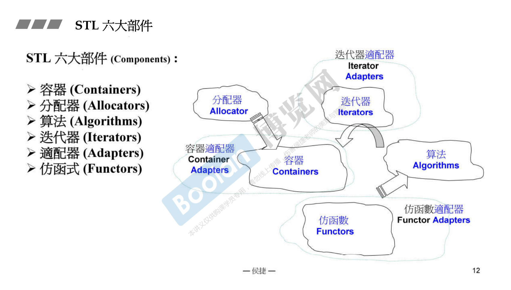
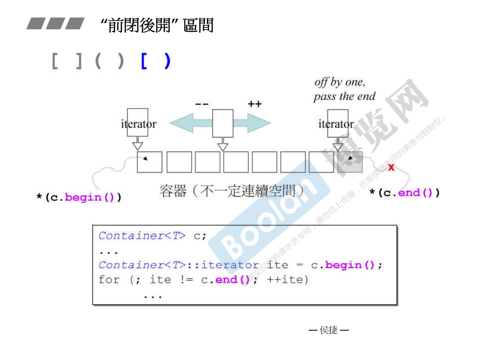

标准库涵盖了 STL，STL占了大部分。

STL 六大部件(Component)：

- 容器 (Containers)
- 分配器 (Allocators)
- 算法 (Algorithms)
- 迭代器 (Iterators)
- 适配器 (Adapters)
- 仿函式 (Functors)



一个程序的主体是由数据结构与算法构成的。C++ 标准库把非常重要的算法和容器 (数据结构) 做出来了。这就是六大部件中最重要的容器和算法。

通常你第一个接触到的是容器，容器要放东西，东西要占用内存，所以容器它非常好的是帮我们把内存的事情全部解决掉，你看不到内存这件事情，你只要把东西一再一再的放进去或者取出来就好了，内存的事情你不必管。所以容器的背后需要另外一个部件去支持它，分配器 Allocator。分配器是来支持容器。

容器里头，你把东西一百万数据放到里面去，你要对它操作啊。容器是一个class类，一个模板类，有些操作是在容器本身做的，但是还有更多的东西被独立出来变成一个个函数，模板函数，放在算法 Algorithm。

在面向对象这种编程技巧，Object-Oriented 建议我们把数据放在类里头，把数据处理的函数也放在类里头，形成一个类class。现在你看到的不一样，数据在容器里面，操作这些数据的动作，也就是算法在另外一组，不在class里。所以STL的设计观念跟OO不一样，这叫 generic programming 模板编程。

算法要去处理数据，他手上必须要有东西。比如一个sort排序，现在处理的容器是个链表里头有一百万个元素，那我这个算法手上应该掌握什么才可以去存取、访问到这一百万个元素呢？数据（容器）、操作（算法）中间的桥梁叫做 Iterator 迭代器。迭代器就像一种泛化的指针。

仿函数，它的作用就像一个函数。比如你要把两个东西加起来、两个东西相减，这东西不是数值，可能是两颗石头、两栋房子、两个人，你所创造的这些class，你要把它们相加相减，你就可以写一些仿函数。

适配器 Adapter，在英文里面就是变压器。我们现在用电脑都要插上一个adapter变压器，因为电脑用的电压和墙壁出来的电压不一样，所以中间要有一个转换的东西。这里有一个容器的Adapter，对于仿函数也可以做转换，对于迭代器也可以做转换，这些转换有些会让你目瞪口呆，技巧上非常有趣。

这样我们对六大部件之间的关系用这张图作一个交代。

```cpp
#include <vector>
#include <algorithm>
#include <functional>
#include <iostream>

using namespace std;

int main()
{
    int ia[6] = { 27, 210, 12, 47, 109, 83 };
    // vertor: Container
    // allocator<int>: Allocator
    vector<int, allocator<int>> vi(ia,ia+6);
    
    // count_if: Algorithm
    // vi.begin、vi.end: Iterator
    // not1: function adapter(negator)
    // bind2nd: function adapter(binder)
    // less: function object
    cout << count_if(vi.begin(), vi.end()), not1(bind2nd(less<int>(), 40));
    
    return 0;
}
```

<br>

**"前闭后开" 区间**

标准库规定所有的容器要表现头跟尾，begin指向第一个元素的起点，end得到的泛化指针指的是最后一个元素的下一个位置，叫前闭后开区间。

遍历容器里的元素。所有容器都有它专属的iterator的形象，所以当我需要一个iterator的时候，我要从这个容器里头去问iterator是什么，让它等于begin，就是指向头。iterator概念上就是一个泛化指针，指针可以做的事情他都可以做。



<br>

**range-based for statement (since C++11)**

```cpp
for ( decl : coll) {
    statement
}


for ( int i : { 2, 3, 5, 7, 9 }) {
    std::cout << i << std::endl;
}


std::vector<double> vec;
...
for ( auto elem : vec ) {
    std::cout << elem << std::endl;
}

for ( auto& elem : vec ) {
    elem *= 3;
}
```

<br>

**auto keyword (since C++11)**

```cpp
list<string> c;
...
list<string>::iterator ite;
ite = ::find(c.begin(), c.end(), target);

//等同
list<string> c;
...
auto ite = ::find(c.begin(), c.end(), target);
```

