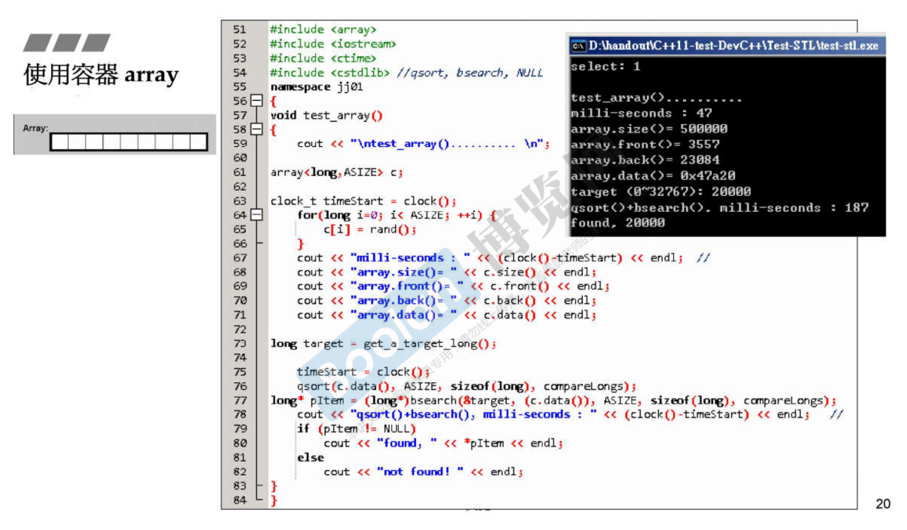

容器，结构与分类

引导大家使用容器。元素放到容器后，会去操作它，于是会用到一些算法，一些其他东西。

这张图谈的是容器的结构与分类。最重要的是我们使用容器，它在内存里面是长什么样子。元素和元素之间是什么样的关系，是连续的，还是用指针把它串起来，串起来是个单纯的链表呢？还是一棵树？这棵树是红黑树吗？二分树吗？还是它是个Hashtable？到底它是什么呢，非常重要。你要知道它到底代表什么结构，你才能去判断做这个动作效率如何，背后引发什么样的连锁反应，等等等。

先谈谈容器的分类，大致分为两种，一种是 Sequence Container 序列式容器，一种叫做 Associative Container 关联式容器。什么叫关联式容器呢？它的元素是有key跟value，用key来找value就很好找，所以这种容器非常适合做快速的查找。第三种是 Unordered Container 不定序容器，这个是 C++11 才出现的一种容器，其实它就是一种 Associative Container。元素放在这个容器，没有一定的次序，也许这刻放在第三个位置上，一个小时后由于一些动作，位置跑掉了。底部使用 HashTable 做的。

红色的是 C++11 新加的东西。先看 Sequence Container 里面有什么：

- 第一种就是 Array 数组。C 和 C++ 语言本来就有数组这样东西，是语言的一部分，现在 C++11 开始把它也变成 class。Array 就是一个连续空间，你当初要多大它就多大，前后是没有办法扩充的。
- 第二种是 Vector。起点是不能动的，后面是可以扩充的，也就是说你把元素放进去，当它空间不够的时候它会自动增长。这个自动增长由谁来做呢？前面讲过容器背后有个分配器来帮它处理内存的事情，分配器会自动做这个事。
- 第三种是 Deque。两端可进可出，前后都是可以扩充的。这个非常好啊，弹性这么大。但是你从技术去想的话，你想不通为什么，怎么有一个内存它是后头可以扩充，前头也可以扩充？
- List，链表。每个元素并没有连续画在一起，中间都是用指针串起来，而且指针是双向的，双向链表。
- Forward-List，单向链表。占用内存比双向链表少，少了一根指针，4个字节（32位电脑）。

对于大量查找的动作来讲，最有价值的 Associative Container，它的底部是什么做的呢？我们使用的有两种东西：Set、Map。它内部是用红黑树做的。红黑树在数据结构里面是一种特殊的二分树，叫做高度平衡二分树。什么叫高度平衡呢？左边右边它自己会调整，调整到差不多一样，差不多一样的话在查找的时候就不会有那种最坏的情况找到某一只很长的右臂，一直找下去。Set、Map的区别：Map的每个结点都有两个东西，key、value。找东西用key找value。而 Set，key就是value，它们是不分的。Multiset、Multimap表示key可以重复。

Unordered Container 里面的元素是分散的，没有定性的排列。 HashTable Separate Chaining。


<br>

**以下测试程序之辅助函数**

1使用交谈的方式让使用者输入一个要找的目标，后面所有的容器我可以选择使用哪一种容器。然后它会问你要放多少个元素，我都是放五十万、一百万这种数量级，然后它使用随机数去选一个数放进去，统统放进去后，这个程序会告诉你它花了多少时间，几微秒，这样就可以对效率有一些概念。然后这个程序就会问我，你要找哪个元素呀？我就打一个数进去，get_a_target_long()就是输入进去找一个目标。

2也是输入一个目标，但是这个目标不是long，而是一个string。其实放进容器里面的元素不是数值，刚才是把随机数放进去，但我把数值转换成字符串，让你感受到我放的是object，object里头可能有pointer，是比较复杂的东西，而不是单纯的数值。

3、4比较两个long等不等、两个字符串等不等，这是为了后面可能用到quick sort快排。C有一个function叫qsort，要求我们给它一个函数来比大小。

```cpp
using std::cin;
using std::cout;
using std::string;

long get_a_target_long()	//1
{
long target=0;
    
    cout << "target (0~" << RAND_MAX << "): ";
    cin >> target;
    return target;
}

string get_a_target_string()	//2
{
long target=0;
char buf[10];
    
    cout << "target (0~" << RAND_MAX << "): ";
    cin >> target;
    snprintf(buf, 10, "%d", target);	//打进去的字符转换成字符串
    return string(buf);
}

int compareLongs(const void* a, cosnt void* b)	//3
{
    return ( *(long*)a - *(long*)b );
}

int compareStrings(const void* a, const void* b)	//4
{
    if ( *(string*)a > *(string*)b )
        return 1;
    else if ( *(string*)a < *(string*)b )
        return -1;
    else
        return 0;
}
```

<br>

**使用容器 array**

test_array，我需要一个array，里面放的是long，必须有第二个参数告诉它我要多大，就像在C或C++声明一个数组，一定要告诉它多大，而且这个大不能是变数，必须是个定下来的值。ASIZE前面给的定义，500000。array.data() 传回这个数组在内存的起点的地址。接来下进行排序，选择是qsort快排。



```cpp
#include <array>
#include <iostream>
#include <ctime>
#include <cstdlib> //qsort, bsearch, NULL
namespace jj01
{
void test_array()
{
    cout << "\ntest_array().......... \n";
array<long,ASIZE> c;

clock_t timeStart = clock();
    for(long i=0; i< ASIZE; ++i) {
        c[i] = rand();
    }
    cout << "milli-seconds : " << (clock()-timeStart) << endl; //
    cout << "array.size()= " << c.size() << endl;
    cout << "array.front()= " << c.front() << endl;
    cout << "array.back()= " << c.back() << endl;
    cout << "array.data()= " << c.data() << endl;
    
long target = get_a_target_long();
    
    timeStart = clock();
    qsort(c.data, ASIZE, sizeof(long), compareLongs);
long* pItem = (long*)bsearch(&target, (c.data()), ASIZE, sizeof(long), compareLongs);
    cout << "qsort()+bsearch(), milli-seconds: " << (clock()-timeStart) << endl; //
    if (pItem != NULL)
        cout << "found, " << *pItem << endl;
    else
        cout << "not found!" << endl;
}
}
```

<br>

**使用容器 vector**

<br>

**使用容器 list**

<br>

**使用容器 forward_list**

<br>

**使用容器 slist**

<br>

**使用容器 deque**

<br>

**使用容器 stack**

<br>

**使用容器 queue**

<br>

**使用容器 multiset**

<br>

**使用容器 multimap**

<br>

**使用容器 unordered_multiset**

<br>

**使用容器 unordered_multimap**

<br>

**使用容器 set**

<br>

**使用容器 map**

<br>

**使用容器 unordered_set**

<br>

**使用容器 unordered_map**


