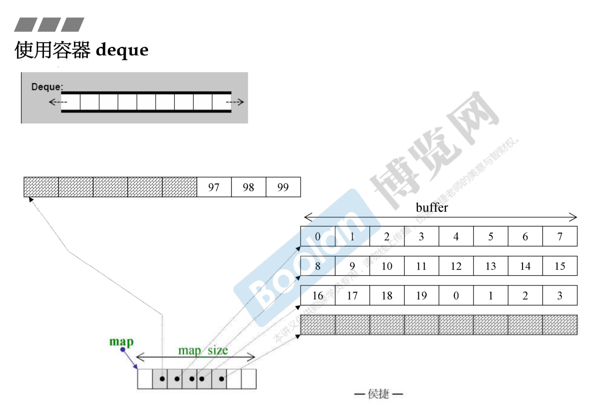

# 容器，结构与分类

引导大家使用容器。元素放到容器后，会去操作它，于是会用到一些算法，一些其他东西。

这张图谈的是容器的结构与分类。最重要的是我们使用容器，它在内存里面是长什么样子。元素和元素之间是什么样的关系，是连续的，还是用指针把它串起来，串起来是个单纯的链表呢？还是一棵树？这棵树是红黑树吗？二分树吗？还是它是个Hashtable？到底它是什么呢，非常重要。你要知道它到底代表什么结构，你才能去判断做这个动作效率如何，背后引发什么样的连锁反应，等等等。

先谈谈容器的分类，大致分为两种，一种是 Sequence Container 序列式容器，一种叫做 Associative Container 关联式容器。什么叫关联式容器呢？它的元素是有key跟value，用key来找value就很好找，所以这种容器非常适合做快速的查找。第三种是 Unordered Container 不定序容器，这个是 C++11 才出现的一种容器，其实它就是一种 Associative Container。元素放在这个容器，没有一定的次序，也许这刻放在第三个位置上，一个小时后由于一些动作，位置跑掉了。底部使用 HashTable 做的。

红色的是 C++11 新加的东西。先看 Sequence Container 里面有什么：

- 第一种就是 Array 数组。C 和 C++ 语言本来就有数组这样东西，是语言的一部分，现在 C++11 开始把它也变成 class。Array 就是一个连续空间，你当初要多大它就多大，前后是没有办法扩充的。
- 第二种是 Vector。起点是不能动的，后面是可以扩充的，也就是说你把元素放进去，当它空间不够的时候它会自动增长。这个自动增长由谁来做呢？前面讲过容器背后有个分配器来帮它处理内存的事情，分配器会自动做这个事。
- 第三种是 Deque。两端可进可出，前后都是可以扩充的。这个非常好啊，弹性这么大。但是你从技术去想的话，你想不通为什么，怎么有一个内存它是后头可以扩充，前头也可以扩充？
- List，链表。每个元素并没有连续画在一起，中间都是用指针串起来，而且指针是双向的，双向链表。
- Forward-List，单向链表。占用内存比双向链表少，少了一根指针，4个字节（32位电脑）。

对于大量查找的动作来讲，最有价值的 Associative Container，它的底部是什么做的呢？我们使用的有两种东西：Set、Map。它内部是用红黑树做的。红黑树在数据结构里面是一种特殊的二分树，叫做高度平衡二分树。什么叫高度平衡呢？左边右边它自己会调整，调整到差不多一样，差不多一样的话在查找的时候就不会有那种最坏的情况找到某一只很长的右臂，一直找下去。Set、Map的区别：Map的每个结点都有两个东西，key、value。找东西用key找value。而 Set，key就是value，它们是不分的。Multiset、Multimap表示key可以重复。

Unordered Container 里面的元素是分散的，没有定性的排列。 HashTable Separate Chaining。


<br>

# 测试程序之辅助函数

1使用交谈的方式让使用者输入一个要找的目标，后面所有的容器我可以选择使用哪一种容器。然后它会问你要放多少个元素，我都是放五十万、一百万这种数量级，然后它使用随机数去选一个数放进去，统统放进去后，这个程序会告诉你它花了多少时间，几微秒，这样就可以对效率有一些概念。然后这个程序就会问我，你要找哪个元素呀？我就打一个数进去，get_a_target_long()就是输入进去找一个目标。

2也是输入一个目标，但是这个目标不是long，而是一个string。其实放进容器里面的元素不是数值，刚才是把随机数放进去，但我把数值转换成字符串，让你感受到我放的是object，object里头可能有pointer，是比较复杂的东西，而不是单纯的数值。

3、4比较两个long等不等、两个字符串等不等，这是为了后面可能用到quick sort快排。C有一个function叫qsort，要求我们给它一个函数来比大小。

```cpp
using std::cin;
using std::cout;
using std::string;

long get_a_target_long()	//1
{
long target=0;
    
    cout << "target (0~" << RAND_MAX << "): ";
    cin >> target;
    return target;
}

string get_a_target_string()	//2
{
long target=0;
char buf[10];
    
    cout << "target (0~" << RAND_MAX << "): ";
    cin >> target;
    snprintf(buf, 10, "%d", target);	//打进去的字符转换成字符串
    return string(buf);
}

int compareLongs(const void* a, cosnt void* b)	//3
{
    return ( *(long*)a - *(long*)b );
}

int compareStrings(const void* a, const void* b)	//4
{
    if ( *(string*)a > *(string*)b )
        return 1;
    else if ( *(string*)a < *(string*)b )
        return -1;
    else
        return 0;
}
```

<br>

# Sequence Container

## 使用容器 array

test_array，我需要一个array，里面放的是long，必须有第二个参数告诉它我要多大，就像在C或C++声明一个数组，一定要告诉它多大，而且这个大不能是变数，必须是个定下来的值。ASIZE前面给的定义，500000。array.data() 传回这个数组在内存的起点的地址。接来下进行排序，选择是qsort快排。


```cpp
#include <array>
#include <iostream>
#include <ctime>
#include <cstdlib> //qsort, bsearch, NULL
namespace jj01
{
void test_array()
{
    cout << "\ntest_array().......... \n";
array<long,ASIZE> c;

clock_t timeStart = clock();
    for(long i=0; i< ASIZE; ++i) {
        c[i] = rand();
    }
    cout << "milli-seconds : " << (clock()-timeStart) << endl; //
    cout << "array.size()= " << c.size() << endl;
    cout << "array.front()= " << c.front() << endl;
    cout << "array.back()= " << c.back() << endl;
    cout << "array.data()= " << c.data() << endl;
    
long target = get_a_target_long();
    
    timeStart = clock();
    qsort(c.data, ASIZE, sizeof(long), compareLongs);
long* pItem = (long*)bsearch(&target, (c.data()), ASIZE, sizeof(long), compareLongs);
    cout << "qsort()+bsearch(), milli-seconds: " << (clock()-timeStart) << endl; //
    if (pItem != NULL)
        cout << "found, " << *pItem << endl;
    else
        cout << "not found!" << endl;
}
}
```

<br>

## 使用容器 vector

push_back就是放到尾巴，没有push_front。vector只有向后增长，如果提供一个push_front，从前面插一个元素进去不得了，它要全部往后推，一百万个元素要推一百万次，一百万次constructor构造函数、destructor析构函数要做，很花时间。大部分容器都有push_back函数。

vector增长是两倍增长。在push_back动作外头加了try-catch抓取异常，要做一百万次push_back万一空间不够呢？发生异常，abort掉，退出程序。


<br>

## 使用容器 list

和刚刚的vector不一样，vector是一段放满了之后成长为另一段，它不可能在这个位置上成长两倍。它一定要在另外一个地方找一个两倍大的空间，然后把原来这些一个个搬过去，所以成长这个过程是非常缓慢的。但是list不一样，它是一个萝卜一个坑，每放一个元素进去，就在空间中找到一个节点的大小。

输出还有个max_size，意思是可以放多少个元素。按理讲list的元素是动态分配的，所以应该是你的内存能够供应，它就可以一直要。按理说没有max_size这种东西。

sort是标准库里面算法的一个，但是197行呼叫的不是全局的那个，也就是说不是使用标准库算法的那个，我是调用容器里面自己的那个function。有趣了，原来标准库有个sort，而容器自己也有个sort，容器自己提供sort的时候使用容器的比较快。


<br>

**使用容器 forward_list**


<br>

## 使用容器 slist

<br>

## 使用容器 deque

双向开口，可进可出的容器。一个容器占用多少内存，占用内存后是不能够再扩充的，再扩充就会扩充到别人用掉的内存上。所以像vector扩充是在别的地方找到一块，然后把原来的搬过去，找到的那块必须是两倍大。

deque是两边可以扩充，是怎么做呢？下图的结构有5段，术语上把一段叫做一个buffer，一个buffer可以放很多个元素。deque是由这样一段一段构成。术语上把它叫做分段有序。在每一段每个buffer上面，它当然是有序的，但是段跟段之间怎么办呢？deque号称它是有序的，是假象，要让使用者感觉它是有序的。

如果buffer都填满了，继续push_back放元素进去，它就会分配另外一个buffer，并由map后面空格指向该buffer。每次扩充多少这个概念要有，关乎我们想想它的效率、内存用量。最前面讲的array不能扩充。后面的vector是两倍增长，后面的每次扩充都很大，可能会有不少浪费。list每次扩充一个节点，空间利用率上是最高的，但是找起来很慢。deque每次扩充是一个buffer，buffer是多大，后面讲。




<br>

## 使用容器 stack


<br>

## 使用容器 queue


stack、queue是非常有特性的两种容器，一个是先进后出、一个先进先出，所以它们不提供iterator泛化指针操作。如果提供了这种函数，可能会利用指针改变、杀掉、安插某个元素，就会破坏这两种容器独特的性质。

<br>

# Associative Container

## 使用容器 multiset

关联式容器，高度红黑树，查询非常快。set的元素，key就是value，value就是key。

这里是insert，不是push_back、push_front，会放到该放的地方去。标准库有一个find，容器本身也有一个find，容器的快。


<br>

## 使用容器 multimap

红黑树。

每个元素key、value分开。找的时候是用key来找。multimap，所以key是可以重复的。

379行调用insert把元素放进去，这时候你要自己把key、value组合起来。


<br>

## 使用容器 unordered_multiset

底部是Hashtable。

篮子比元素还要多，合理吗？合理，有些篮子无元素。篮子一定比元素多，这是设计的考量。每个篮子的链表出去不能太长，太长的话，将来要找虽然很快找到篮子，链表太长循序查找很慢。什么叫太长？经验法则，如果元素的个数大于等于篮子，这个篮子就要重新打散扩充到大约两倍。

load_factor 载重因子


<br>

## 使用容器 unordered_multimap

476行是定义的方式。485行insert的时候要把key、value合成一个pair


<br>

## 使用容器 set

没有multi，key必须是独一无二的。


<br>

## 使用容器 map

multimap不可以用 [] 做 insertion。710行map却可以，这是个非常特殊的方式，意思是说我的第 i 个元素要放这个值进去，i 就是 key，等号右边就是 value，这个容器会把key、value合成一个pair放到红黑树里面去。


<br>

## 使用容器 unordered_set


<br>

## 使用容器 unordered_map


# 使用分配器 allocator

容器的背后需要分配器支持它对内存的使用。理想情况下，最好是不知道它，首先是你不用写出来，容器就有一个默认的分配器。第二个条件是默认的分配器要够好。

你使用的容器到底是什么分配器？下列每个容器的声明都是模板，模板一定有第二参数 (红色部分，有默认值)。


push_back就会分配内存，分配内存就会用到对应的分配器。


