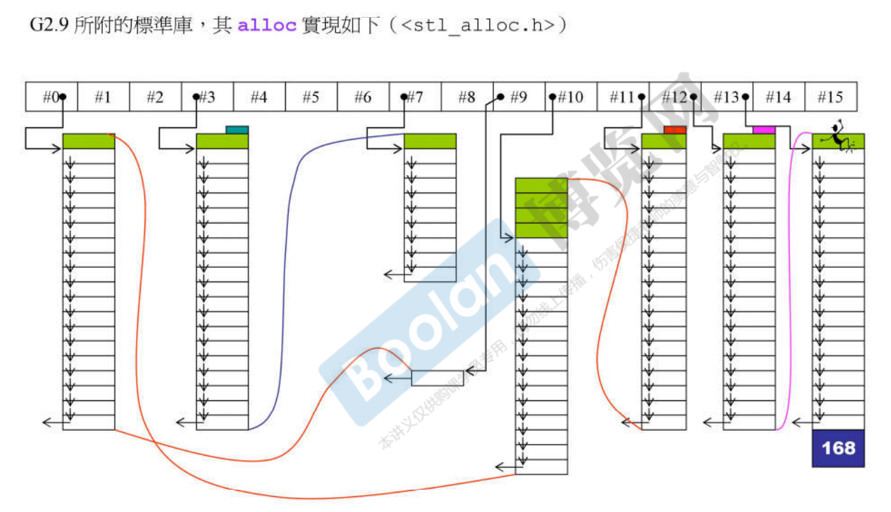
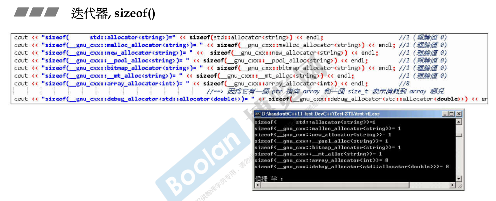

分配器 allocators 

# 先谈 operator new() 和 malloc()

所有的分配动作，最终一层一层下去，最后都会跑到malloc()。这个函数再根据操作系统平台windows、linux或unix的不同调用系统API拿到真正的内存。

malloc分配的内存比实际用到的要大，debug mode会加，还要加上cookie，之后还要调整到某个边界。

...\vc98\crt\src\newop2.cpp

```cpp
void *operator new(size_t size, const std:: nothrow_t&)
    _THROW0()
{	// try to allocate size bytes
    void *p;
    while ((p = malloc(size)) == 0)
    {
        // buy more memory or return null pointer
        _TRY_BEGIN
		if(_callnewh(size) == 0) break;
        _CATCH(std::bad_alloc) return (0);
        _CATCH_END
    }
return (p);
}
```

<new.h> of CB5

```cpp
// inline versions of the nothrow_t versions of new & delete operators
inline void * _RTLENTRY operator new(size_t size, const std::nothrow_t&)
{
	size = size ? size : 1;
	return malloc(size);
}
```


# VC6 STL 对 allocator 的使用

```cpp
template<class _Ty, class _A = allocator<_Ty> >
class vector
{ ...
};

template<class _Ty, class _A = allocator<_Ty> >
class list
{ ...
};

template<class _Ty, class _A = allocator<_Ty> >
class deque
{ ...
};

template<class _K, class _Pr = less<_K>, class _A = allocator<_K> >
class set{ 
...
};
```

VC6所附的标准库，其allocator实现如下 (<xmemory>)

VC6+的 allocator 只是以 ::operator new 和 ::operator delete 完成 allocate() 和 deallocate()，没有任何特殊设计。

```cpp
template<class _Ty>
class allocator {
public:
	typedef _SIZT size_type;
    typedef _PDFT difference_type;
    typedef _Ty _FARQ *pointer;
    typedef _Ty value_type;
    pointer allocate(size_type _N, const void *) //无名称指针，小技巧，确定类型
    { return (_Allocate((difference_type)_N, (pointer)0)); }
    void deallocate(void _FARQ *_P, size_type)
    { operator delete(_P); }
};

// 其中用到的_Allocate()定义如下
template<class _Ty> inline
_Ty _FARQ *_Allocate(_PDFT _N, _Ty _FARQ *)
{ if (_N < 0) _N = 0; 
 return ((_Ty _FARQ *)operator new((_SIZT)_N * sizeof (_Ty))); }


// 分配512 ints。
int* p = allocator<int>().allocate(512,(int*)0);	//临时对象
allocator<int>().deallocate(p,512);
```


# BC5 STL 对 allocator 的使用

```cpp
template <class T, class Allocator _RWSTD_COMPLEX_DEFAULT(allocator<T>) >
class vector ...
    
template <class T, class Allocator _RWSTD_COMPLEX_DEFAULT(allocator<T>) >
class list ...
    
template <class T, class Allocator _RWSTD_COMPLEX_DEFAULT(allocator<T>) >
class deque ...
```

```cpp
// #define _RWSTD_COMPLEX_DEFAULT(a) = a, 在<stdcomp.h>
template <class T, class Allocator = allocator<T>>
class vector ...

template <class T, class Allocator = allocator<T>>
class list ...
    
template <class T, class Allocator = allocator<T>>
class deque ...
```

BC5 所附的标准库，其 allocator 实现如下 (<memory.stl>)

BC++ 的 allocator 只是以 ::operator new 和 ::operator delete 完成 allocate() 和 deallocate()，没有任何特殊设计。

```cpp
template <class T>
class allocator
{
public:
    typedef size_t size_type;
    typedef ptrdiff_t difference_type;
    typedef T* pointer;
    typedef T value_type;
    
    pointer allocate(size_type n, allocator<void>::const_pointer = 0) {
        pointer tmp = _RWSTD_STATIC_CAST(pointer, (::operator new(
            _RWSTD_STATIC_CAST(size_t, (n * sizeof(value_type))))));
        _RWSTD_THROW_NO_MSG(tmp == 0, bad_alloc);
        return tmp;
    }
    
    void deallocate(pointer p, size_type) {
        ::operator delete(p);
    }	// <new.h> of CB5
    ...
};


// 分配512 ints
int* p = allocator<int>().allocate(512);
allocator<int>(),deallocate(p,512);
```

# G2.9 STL 对 allocator 的使用

```cpp
template <class T, class Alloc = alloc>
class vector {
    ...
};

template <class T, class Alloc = alloc>
class list {
    ...
};

template <class T, class Alloc = alloc, size_t BufSiz = 0>
class deque {
    ...
};


//分配512 bytes
void* p = allo::allocate(512);	//也可alloc().allocate(512);
alloc::deallocate(p,512);

template <class Key, class T, class Compare = less<Key>, class Alloc = alloc>
class map {
    ...
};

template <class Key, class Compare = less<Key>, class Alloc = alloc>
class set {
    ...
};
```

G2.9 所附的标准库，其 allocator 实现如下 (<defalloc.h>)

```cpp
template <class T> 
class allocator {
public:
    typedef T value_type;
    typedef T* pointer;
    typedef size_t size_type;
    typedef ptrdiff_t difference_type;
    pointer allocate(size_type n) {
        return ::allocate((difference_type)n, (pointer)0);	//调用下面1
    }
    
    void deallocate(pointer p) { ::deallocate(p); }			//调用下面2
};


//1
template <class T>
inline T* allocate(ptrdiff_t size, T*) {
    set_new_handler(0);
    T* tmp = (T*) (::operator new((size_t)(size*sizeof(T))));
    if (tmp == 0) {
        cerr << "out of memory" << endl;
        exit(1);
    }
    return tmp;
}

//2
template <class T>
inline void deallocate(T* buffer) {
    ::operator delete(buffer);
}
```

G++ <defalloc.h> 中有这样的注释：DO NOT USE THIS FILE unless you have an old container implementation that requires an allocator with the HP-style interface. SGI STL uses a different allocator interface. SGI-style allocators are not parametrized with respect to the object type; they traffic in void* pointers. This file is not included by any other SGI STL header.

前面提过所有分配的内存的最后动作都是malloc，所以这个特殊的分配器它的主要诉求是减少malloc次数。因为malloc就代表了overhead额外开销，它不想要那个额外开销。这个额外开销最重要的两个是cookie，cookie记录了整块的大小，这是必要的。因为你用malloc去拿内存的时候，得到一个指针，还的时候还这个指针，不需要告诉它大小，大小已经记录起来了，所以free函数根据cookie知道回收多大。

因为malloc是给各式各样的人用的，有大有小，所以需要cookie来记录。但是我们来想想容器，容器的元素大小是一样的，所以这个大小不必每个元素附带着记。在容器这个应用下，可以不需要cookie。

它设计了16条链表，每条链表负责某一种特定大小的区块用链表串起来。第0号链表负责8个这种大小，第7号链表负责56 (7*8)字节大小。

所有的容器当它需要内存的时候，都来跟这个分配器要内存。容器的元素大小会被调整到8的倍数。比如说50就会调整到56，调整到56后分配器会看看是哪条链表来负责，这个链表里头有没有挂内存块呢？如果没有它才跟操作系统，也就是malloc要一大块，然后进行切割，给出来一块，切割出来的东西用链表串起来，单向链表。所以切出来的每一块就不带cookie。当一个容器放一百万个元素，每个元素两个cookie 8个字节，就省掉了800万个字节。



# G4.9 STL 对 allocator 的使用

```cpp
template<typename _Tp, typename _Alloc = std::allocator<_Tp>>
class vector : protected _Vector_base<_Tp, _Alloc>
{
    ...
};
```

G4.9 所附的标准库，其 allocator 实现如下

这个分配器有一个父类 __allocator_base，这个又叫new_allocator，定义在 <bits/c++allocator.h>。

怎么不用G2.9版那个设计得很棒的？是不是把它拿掉了？

```cpp
// <bits/allocator.h>
template<typename _Tp>
class allocator: public _allocator_base<_Tp>
{
    ...
};


// <bits/c++allocator.h>
# define _allocator_base _gnu_cxx::new_allocator


// <bits/new_allocator.h>
template<typename _Tp>
class new_allocator
{
  ...
  pointer allocate(size_type _n, cosnt void* = 0) {
      if (_n > this->max_size())
          std::_throw_bad_alloc();
      return static_cast<_Tp*> (::operator new(_n * sizeof(_Tp)));
  }
    
  void deallocate(pointer _p, size_type) 
  { ::operator delete(_p); }
  ...
};
```

G4.9 所附的标准库，有许多 extention allocators，其中 _pool_alloc 就是 G2.9 的 alloc。

用例：`vector<string, __gnu_cxx::__pool_alloc<string>> vec;`

```cpp
template<typename _Tp>
class __pool_alloc : private __pool_alloc_base
{
    ...
};


// 这段有趣的注解仍然没变
// Try to make do with what we have. That can't hurt. We
// do not try smaller requests, since that tends to result
// in disaster on multi-process machines.
// __pool_alloc<T> ——▷(private) __pool_alloc_base 
class __pool_alloc_base
{
protected:
    enum { _S_align = 8 };
    enum { _S_max_bytes = 128 };
    enum { _S_free_list_size = (size_t)_S_max_bytes / (size_t)_S_align };
    
    union _Obj
    {
        union _Obj* _M_free_list_link;
        char _M_client_data[1];	// The client sees this.
    };
    
    static _Obj* volatile _S_free_list[_S_free_list_size];
}
```

迭代器，sizeof()

