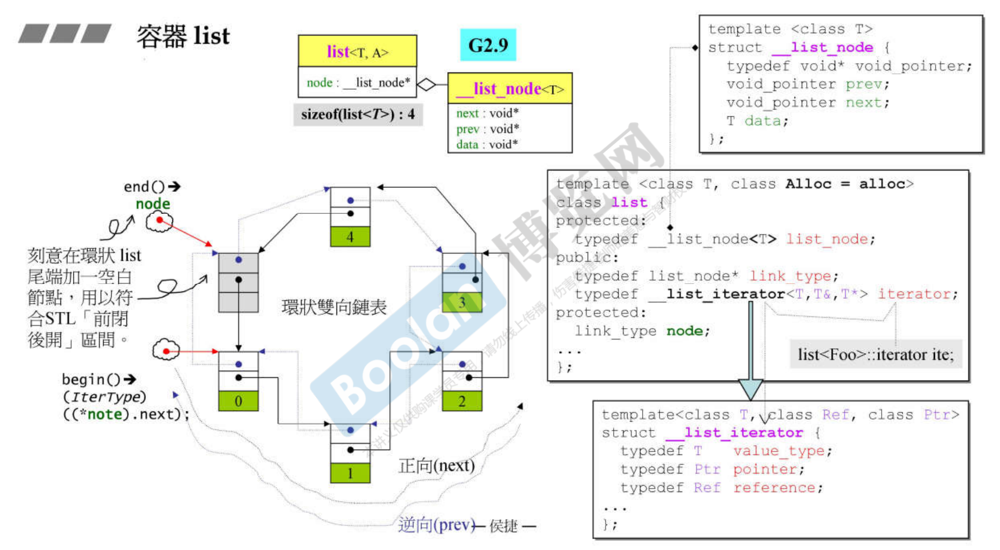
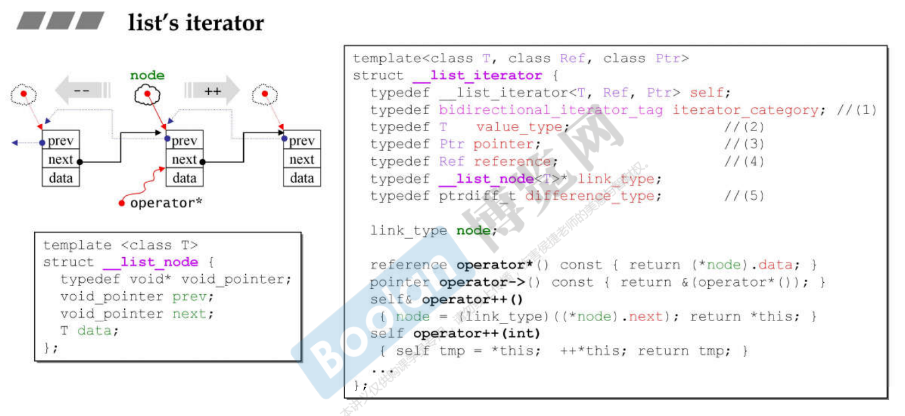
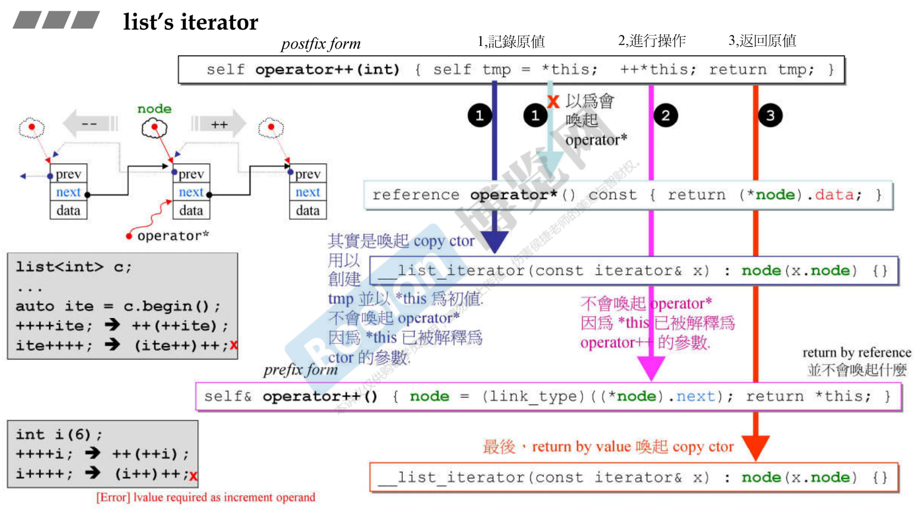
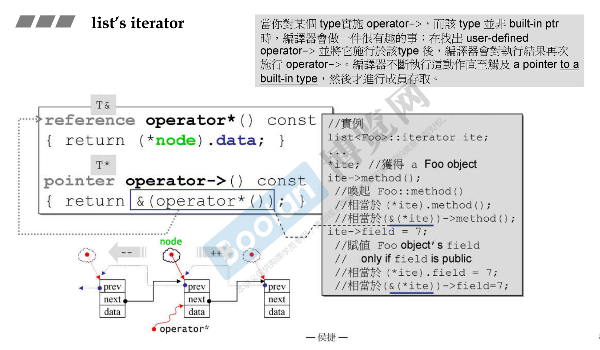
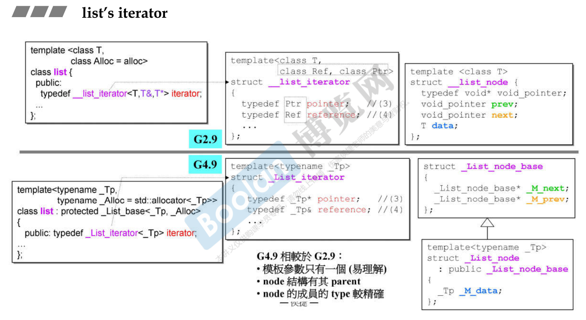
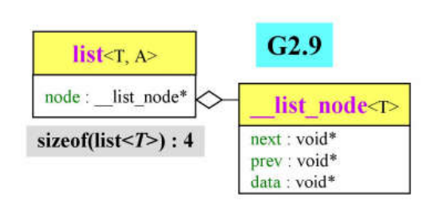
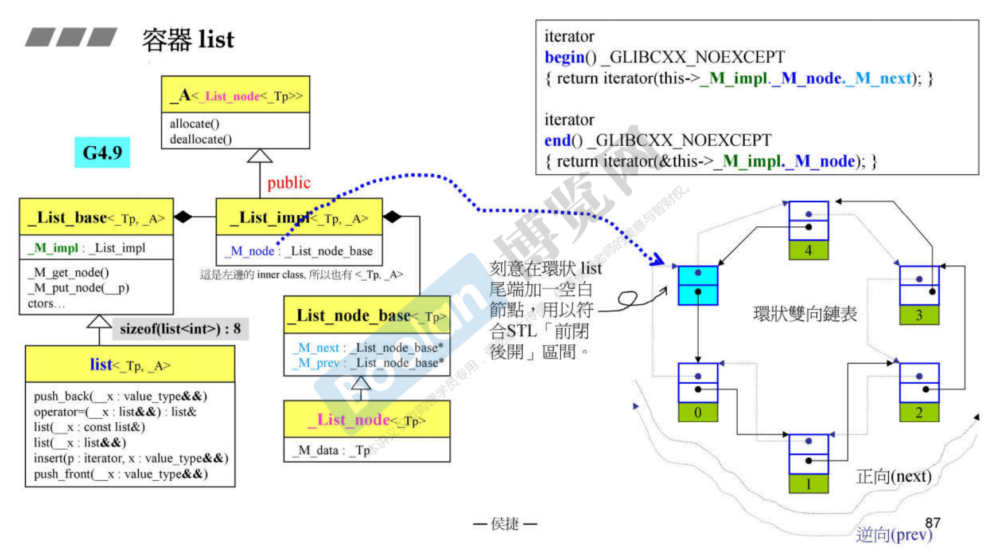

# 容器 list

首先想带你看list里面需要什么东西才能去控制双向链表或单向链表。

link_type 是什么？如果自己看源代码，有个比较困扰的就是在它的class里面总是有一大堆自己的typedef，它会把一些type重新命名，所以我们看到一个不知道的type就要往上看，也许在前面有新的命名。link_type 是一个指针指向 list_node，list_node 是什么无所谓。现在指向知道绿色的node多大，它是个指针指向某个东西，大小是4字节(32位电脑)。所以用 sizeof 去取list对象的大小应该是4。

双向链表的节点设计。__list_node 的两个指针是 pointer to void。这样写的话可以运作，但是不够好。双向链表指出去的东西通常是自己这种东西本身，现在两个指针指出去是 void，可见在后面程序设计还要转型。

... 是一些常规操作，push_back，把元素拿出来，指针要怎样变化。iterator 都有

iterator 向 list 说请你给我起点 begin 或者终点 end。用泡泡表示 iterator。链表是个非连续空间，所以 iterator 不能是指针。我们希望 iterator 模拟指针的动作，指针++会知道哪里去呢？不知道，但是一定是错误的。iterator 要足够聪明，iterator 指向一个节点，当使用者把 iterator ++ 的时候，意思是走到下一个节点去，所以 iterator 要聪明到进去看当前节点的 next 指针，然后经由 next 指针指向下一个节点，才把 iterator 本身指过来。

看看 iterator 是怎么设计的。在链表里头有个type叫iterator，是 __list_iterator 这个class。所以 iterator 是个 smart pointer，必须是个class。除了vector、array之外，所有容器的 iterator 都必须是个class，才能够设计出聪明动作。

# list's iterator

首先iterator里面会有大量的操作符重载，iterator要模拟指针，指针会被怎样使用呢？->、*、++、-- 等等这些操作符。每个容器都有自己的iterator，这些 iterator 都一定要做5个typedef。

iterator ++ 要跑到里头找出next指针，移到下个位置去，这件事情是怎么做的。由于 i++ 或 ++i 它的唯一参数就是它自己，因此没办法区分 i++ 还是 ++i，怎么办呢？C++ 语言规格说为了区分这件事情，前++没有参数，不是说 i 本身就是一个参数吗？i 已经变成了调用这个函数的 object 本身了。为了区分，后++有一个参数，但是这个参数没意义，只是形式上要加上 int。

当你想要很详细的去看这些动作的时候，你要细细的去推先做什么后做什么，那些动作被重载了去看重载的部分，哪些动作不是那样子。

还要注意前++和后++的返回类型。操作符的偶像是谁，要向谁看齐呢？整数。整数怎么做，我们就那么做。如果你想设计一个东西，赋予它某些功能，这个东西是类似数值的东西，那你希望有一个看齐的对象，你就想整数可以怎么做你就怎么做，整数不可以怎么做你就不要那么做。

看看用法。`list<Foo>::iterator ite;` 的意思是现在选用链表这个容器，里头放的都是Foo这种元素，现在要用这种容器的iterator。`list<Foo>::iterator` 是type，根据这个类型做个对象出来。

iterator 除了移动另外一个重要任务就是提取值 dereference。提取的动作就是 * 和 ->。通过 *node 取得整个节点，再去取出其中的data。

# G2.9 vs. G4.9

iterator 有两大部分，一个是一大堆的typedef，另外一大部分是一大堆的operator overloading操作符重载。

G2.9传三个参数进去，G4.9只传一个就行了。G4.9传进来之后才取 * 和 & 去定义另外两个type。G4.9的节点设计被分为两块，而且不再是pointer to void，而是指向自己本身。

G2.9的 list 只有一个类，到了G4.9就变成下面这么复杂了。

list 的大小，在G2.9是4，里面只有一个指针。在G4.9是8，list 本身没有任何data，大小是0，但是它有父类，所以它的大小就是父类的大小。最终看到里面是两个data是指针。