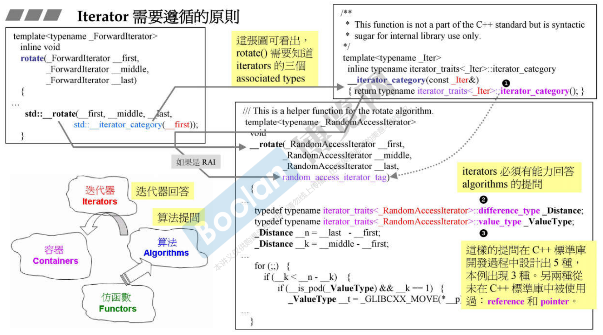
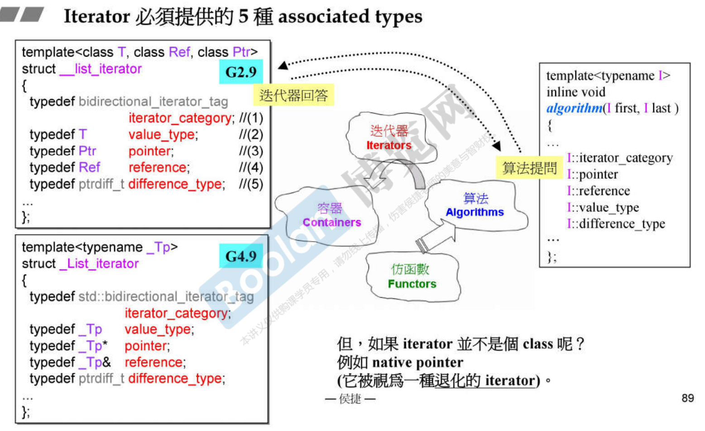
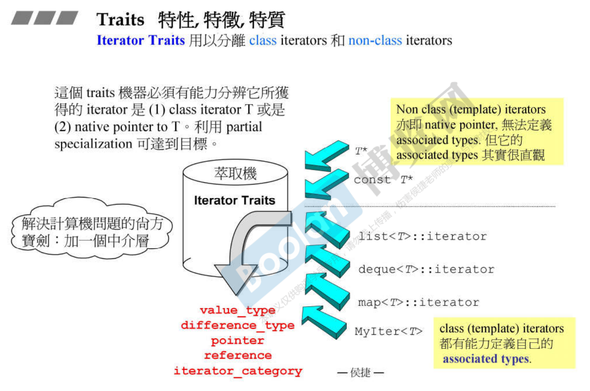
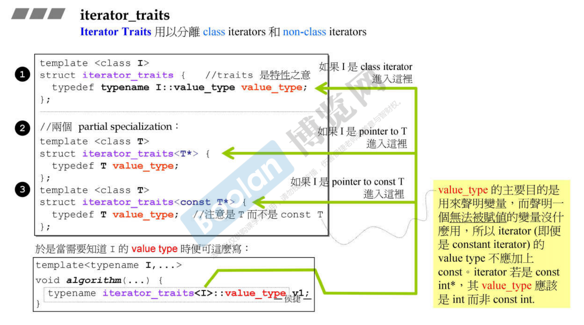

traits 萃取出 iterator 的特性，要谈谈 iterator 有什么特性。

# Iterator 需要遵循的原则

iterator 是算法和容器之间的桥梁，一方面让算法知道它要处理的元素范围。通常我们会把容器的begin跟end这两个函数传回来是两个iterator指向头跟尾，交给算法处理。也可以不是头尾，而是其中某段。算法在操作iterator过程中可能想要知道iterator有哪些性质，因为算法要做动作，要选一个最佳化动作。

举个例子，有个roate算法，在这个算法会想知道iterator的哪些属性。1有一个萃取机，它想要萃取出iterator的iterator_category。iterator的分类是指它的移动性质，有的可以向前++、有的可以后退--、有的可以跳着走+=3。这里rotate想要知道iterator的分类，以便采取最佳方式。还想知道iterator的difference_type、value_type。




# Iterator 必须提供5种 associated types




# Traits 特性，特征， 特质







# 完整的 iterator_traits

```cpp
// ref. G2.9 <stl_iterator.h>
template <class T>
struct interator_traits {
    typedef typename I::iterator_category iterator_category;
    typedef typename I::value_type        value_type;
    typedef typename I::difference_type   difference_type;
    typedef typename I::pointer           pointer;
    typedef typename I::reference         reference;
};

//partial specialization for regular pointers
template <class T>
struct iterator_traits<T*> {
    typedef ramdom_access_iterator_tag iterator_category;
    typedef T    value_type;
    typedef ptrdiff_t    difference_type;
    typedef T*    pointer;
    typedef T&    reference;
};

//partial specialization for regular const pointers
template <class T>
struct iterator_traits<T*> {
    typedef ramdom_access_iterator_tag iterator_category;
    typedef T    value_type;
    typedef ptrdiff_t    difference_type;
    typedef const T*    pointer;
    typedef const T&    reference;
};
```


# 各式各样的 Traits

- type traits    <.../C++/type_traits>
- iterator traits    <.../C++/stl_iterator.h>
- char traits
- allocator traits
- pointer traits
- array traits