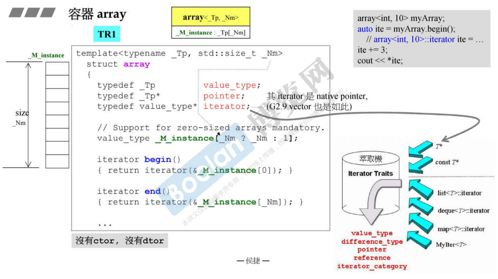

# 容器 vector

vector 是一种动态增长的 array。事实上没有任何一种东西内存可以在原地扩充。因为你要了一块内存之后，这块内存后面的内存接下来就可能被使用了，所以这个数组array在某个点上形成之后，如果要扩充的话，一定要到内存的某个地方去找，找到另外一块空间然后把原来的东西搬过去。

vecor 里头有些变量记录这个数组，start (起点)、finish (终点)、end_of_storage (整个空间的终点)，三个指针。靠三根指针就可以控制整个容器，因此 sizeof vector，也就是对象本身多大，就是这三根指针。

`end() - begin()`为什么不用 `end - begin` 直接减呢？为什么要通过函数调用来减？当然直接减会快一点点，但是通过函数调用来减会得到一个好处就是，也是将来实作不是图上那么简单，但是size等于end减掉begin这件事情是永远不会变的，可以确定size函数永远都是这样写，这是好的设计。

所有的容器只要带着连续空间的特性就必须提供 []，因为中括号是数组很平常的一种操作方式。


## vetor 两倍成长

vector 简单也容易操作，但是注意每次成长都要大量的拷贝动作。要知道元素拷贝会引发拷贝构造函数，而且拷贝过去之后，原来那边也要杀掉，析构函数，这是一个大的成本。

```cpp
void push_back(const T& x) {
	if (finish != end_of_storage) {	//尚有备用空间
        construct(finish, x);		//全局函数
        ++finish;					//调整水位高度
    }
    else	//已无备用空间
        insert_aux(end(), x);
}

template <class T, class Alloc>
void vector<T,alloc>::insert_aux(iterator position, const T& x) {
    if (finish != end_of_storage) {	//尚有备用空间
        //在备用空间起始处构建一个元素，并以vector最后一个元素值为其初值
        construct(finsh, *(finsh - 1));
        ++finish;	//调整水位
        T x_copy = x;
        copy_backward(position, finish - 2, finish - 1);
        *position = x_copy;
    }
    else {	//已无备用空间
        const size_type old_size = size();
        const size_type len = old_size != 0 ? 2 * old_size : 1;
        //以上分配原则 ：如果原大小为0，则分配1个元素大小
        //如果原大小不为0，则分配原大小的两倍，前半段用来放置原数据，后半段放置新数据
        
        iterator new_start = data_allocator::allocate(len);
        iterator new_finish = new_start;
        try {
            //将原vector的内容拷贝到新vector
            new_finish = uninitialized_copy(start, position, new_start);
            construct(new_finish, x);	//为新元素设初值x
            ++new_finish;	//调整水位
            //拷贝安插点后的原内容 (因它也可能被insert(p,x)呼叫)
            new_finish = uninitialized_copy(position, finish, new_finish);
        }
        catch(...) {
            //"commit or rollback" semantics.
            destroy(new_start, new_finish);
            data_allocator::deallocate(new_start, len);
            throw;
        }
        //解构并释放原vector
        destroy(begin(), end());
        deallocate();
        //调整迭代器，指向新vector
        start = new_start;
        finish = new_finish;
        end_of_storage = new_start + len;
    }
}
```


## vector's iterator

既然它是一个连续空间，那么它的迭代器不必设计太复杂，设计成一个class，不必。链表的迭代器需要单独设计成一个 class，双向跑来跑去，那是因为链表的节点都是分离的。但是vector是连续的，按理说应该用指针就可以当成迭代器。

iterator就是一个指针指向T，T是元素类型。当算法要问iterator的五个相关类型的时候，123把iterator丢给traits。图中右边泛化部分、偏特化部分 (针对指针进行偏特化)。当iterator这个指针丢给萃取机traits的时候，萃取机走入偏特化的版本。


## G4.9 version

上面的设计很好，直观明了，没有弯弯曲曲的东西。在G4.9版变成下面的样子，vector原先只有一个class，现在却变成了它有一个父类，父类内含着一个impletation的类，impl又继承了allocator。这么复杂，其实最终功能是一样的。

看它的大小要找出它的data。它没有data，但有父类，vector的大小就是父类的大小，父类有一个__M_impl。impl的父类没有大小，所以它的大小是三根指针12。

继承有public、private、protected，public继承表示的是 is-a。这个地方为什么用public继承？现在这里的继承只是为了让_Vector_impl这个类能够用到上面分配器的功能，所以应该用private继承。你总不能讲impl是一种allocator。


G4.9 vector‘s iterator 的变化。_M_current 是什么？绕了一大圈，发现它就是 pointer to T。


如果算法要问iterator的分类。现在iterator不再是一个指针，而是一个object，它要走的就是下面这条路，而不是上面的指针。iterator本身有定义这几个重要的相关类型。G2.9非常单纯，到了G4.9曲曲折折绕了这么大一段路，最后和2.9的最终实现是一样的。乱七八糟，舍近求远，何必如此！！也许团队为了未来的扩充性，但是以目前的认知来看就是这样。


# 容器 array

array比起vector更简单，因为array就是我们C、C++里面使用的数组。为什么要把它包装成容器来用呢？因为变成容器后，它就要遵循容器的规则，要提供iterator迭代器，而这个迭代器提供五种相应类型associated type，以便于算法去询问一些必要的信息，算法才可以采取最优化的动作。

array里头先要观察data。

没有ctor，没有dtor。它不是最高级的容器，array要模拟语言本身的数组。数组谈不上有什么构造析构函数，所以它也没有。

array本身是个连续空间，迭代器可以用指针来表现。



## G4.9 version


# 容器 forward_list

单向


