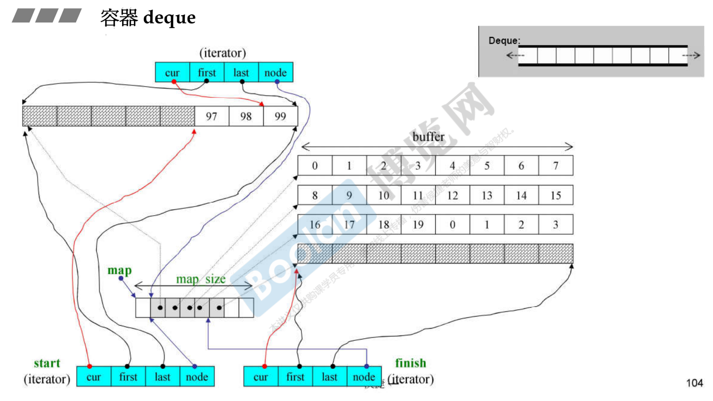
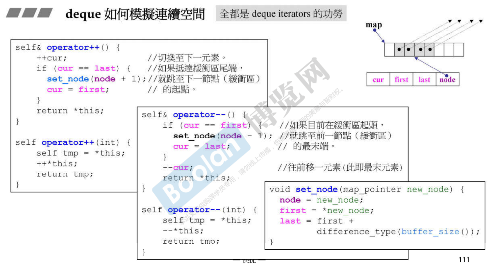
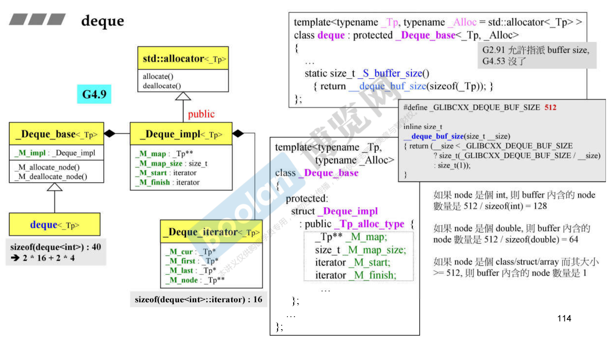
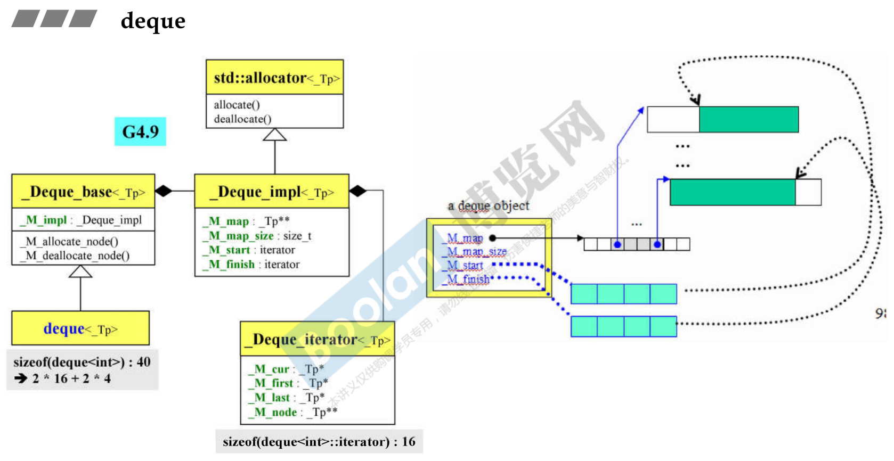
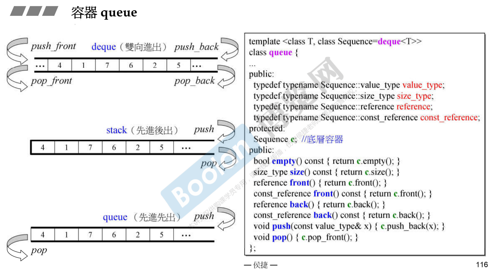
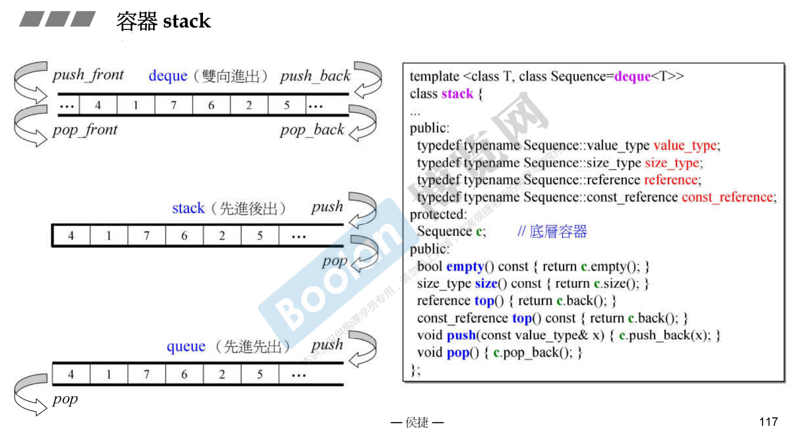

# 容器 deque

Deque描述，双向开口的空间。对于单向开口，就是vector，vector进行单向扩充。deque双向扩充怎么做呢？

常常讲deque叫分段连续，5个buffer缓冲区怎么串接起来呢？靠的是下图的map，内部是用vector实现的。

deque的迭代器是一个class。node指的是控制中心，迭代器加加减减就能跳到另一个分段去。first、last指的是node所指的分段buffer里的头和尾，这两个指针表示该缓冲区的边界。cur当前指向元素。

几乎所有的容器都维护了两个迭代器，分别指向头和尾，start和finish，成员函数begin()和end()。



创建deque的时候，对象本身是40 bytes。至于内部放多少个元素，那是动态获得的，跟对象本身没有关系。

```cpp
template <class T, class Alloc=alloc, size_t BufSiz=0>
class deque {	//所谓buffer size是指每个buffer容纳的元素个数
public:
    typedef T value_type;
    typedef __deque_iterator<T, T&, BufSiz> iterator;
protected:
    typedef pointer* map_pointer; // T**, 因为map指向的每个元素都是指针
protected
    iterator start;
    iterator finish;
    map_pointer map;
    size_type map_size;
public:
    iterator begin() { return start; }
    iterator end() { return finish; }
    size_type size() const { return finish - start;}
...
};


//为什么BufSiz默认值为0呢？
//如果n不为0，传回n，表示buffer size由使用者自定
//如果n为0，表示buffer size使用预设值，那么
// 如果sz(sizeof(value_type))小于512，传回512/sz,
// 如果sz不小于512，传回1。
inline size_t __deque_buf_size(size_t, size_t sz)
{
    return n != 0 ? n : (sz < 512 ? size_t(512/sz) : size_t(1));
}
```


# deque's iterator

迭代器大小是16。

```cpp
template <class T, class Ref, class Ptr, size_t BufSiz>
struct __deque_iterator {
    typedef random_access_iterator_tag iterator_category;	//(1)
    typedef T value_type;									//(2)
    typedef Ptr pointer;									//(3)
    typedef Ref reference;									//(4)
    typedef size_t size_type;
    typedef ptrdiff_t difference_type;						//(5)
    typedef T** map_pointer;
    typedef __deque_iterator self;
    
    T* cur;
    T* first;
    T* last;
    map_pointer node;
...
};
```


# deque<T>::insert()

插入元素可以往前往后推，往短的一边推比较快。

```cpp
// 在position处安插一个元素，其值为 x
iterator insert(iterator position, const calue_type& x) {
    if (position.cur == start.cur) {//如果安插点是deque最前端，交给push_front()做
        push_front(x);
        return start;
    }
    else if (position.cur == finish.cur) {//安插点是deque最尾端，给push_back()做
        push_back(x);
        iterator tmp = finish;
        --tmp;
        return tmp;
    }
    else {
        return insert_aux(position, x);
    }
}


// deque<T>::insert()
template <class T, class Alloc, size_t BufSize>
typename deque<T, Alloc, BufSize>::iterator
deque<T, Alloc, BufSize>::insert_aux(iterator pos, const value_type& x) {
    difference_type index = pos - start;	//安插点之前的元素个数
    value_type x_copy = x;
    if (index < size() / 2) {	//如果安插点之前的元素个数较少
        push_front(front());	//在最前端加入与第一元素同值的元素
        ...
		push(front2, pos1, front1);	//元素搬移
    }
    else {					//安插点之后的元素个数较少
        push_back(back());	//在尾段加入与最末元素同值的元素
        ...
		copy_backward(pos, back2, back1);	//元素搬移
    }
    *pos = x_copy;		//在安插点上设定新值
    return pos;
}
```


# deque 如何模拟连续空间

全都是deque iterators的功劳

```cpp
reference operator[] (size_type n)
{
    return start[difference_type(n)];
}


reference front()
{ return *start; }

//finish指的是最后一个元素的下一个
reference back()
{
    iterator tmp = finish;
    --tmp;
    return *tmp;
}

size_type size() const
{ return finish - start; }

bool empty() const
{ return finish == start; }
 

reference operator*() const
{ return *cur; }

pointer operator->() const
{ return &(operator*()); }


//两根iterators之间的具体相当于
//(1)两根iterators间的buffers的总长度 +
//(2)itr至其buffer末尾的长度 +
//(3)x 至其buffer起头的长度
difference_type operator-(const self& x) const
{
    return difference_type(buffer_size()) * (node - x.node - 1) + 
        (cur - first) + (x.last - x.cur);
    	//末尾(当前)buffer的元素量 + 起始buffer的元素量
}
```




```cpp
self& operator+=(difference_type n) {
	difference_type offser = n + (cur - first);
	if (offset >= 0 && offset < difference_type(buffer_size()))
		//目标位置在同一缓冲区内
		cur += n;
	else {
		//目标位置不在同一缓冲区内
		difference_type node_offset = offset > 0 ? offset / difference_type(buffer_size()) 
            : -difference_type((-offset - 1) / buffer_size()) - 1;
        //切换至正确的缓冲区
        set_node(node + node_offset);
        //切换至正确的元素
        cur = first + (offset - node_offset * difference_type(buffer_size()));
	}
    return *this;
}

self operator+(difference_type n) const {
    self tmp = *this;
    return tmp += n;
}

self& operator-=(difference_type n)
{ return *this += -n; }

self operator-(difference_type n) const
{
    self tmp = *this;
    return tmp -= n;
}

reference operator[](difference_type n) const
{ return *(*this + n); }
```


# G4.9 version

G2.9只有一个单一的class，到了G4.9就变这么多。可以归纳出一个情况：各个容器从一个单一的class变成复杂的，本体有一个base，base里面会有一个数据implementation，这个impl继承自allocator。



控制中心vector扩充的时候，原数据扩充到新空间的中段，方便两端进行扩充。




# 容器 queue

queue内含一个deque。有时把queue叫适配器，把别人改装下变成自己。




# 容器 stack




# queue 和 stack，关于其 iterator 和底层结构

stack 或 queue 都不允许遍历，也不提供 iterator。标准容器都允许遍历，允许某个地方插入insert元素，但现在这两个有特殊行为，一个先进先出，一个先进后出，如果允许你任意放元素的话，就会干扰这个行为模式，所以不允许这样放元素，放元素要靠迭代器，所以不给你提供迭代器。

`stack<string>::iterator ite;	//[Error]'iterator' is not a member of 'std::stack<std::basic_string<char>>'`

`queue<string>::iterator ite;	//[Error]'iterator' is not a member of 'std::stack<std::basic_string<char>>'`

stack 和 queue 都可选择 list 或 deque 做为底层结构。

```cpp
stack<string, list<string>> c;
	for(long i=0; i<10; ++i) {
        snprintf(buf, 10, "%d", rand());
        c.push(string(buf));
    }
	cout << "stack.size()=" << c.size() << endl;
	cout << "stack.top()=" << c.top() <<endl;
	c.pop();
	cout << "stack.size()=" << c.size() << endl;
	cout << "stack.top()=" << c.top() <<endl;
```


## queue 和 stack，关于其 iterator 和底层结构

queue 不可选择 vector 做为底层结构。

使用模板的时候，编译器不会帮你进行全面性的检测，你用到多少它才帮你检测多少。size(), front(), back() 都是可以调用的，只有 pop() 不能调用。只是局部不行而已。

`c.pop();	//[Error] 'class std::vector<std::basic_string<char>>' has no member named 'pop_front'`


stack 可选择 vector 做为底层结构。


stack 和 queue 都不可选择 set 或 map 做为底层结构。

如果你做底部支撑，当它转调用的时候调用不到正确函数的话，就不能作为候选。

