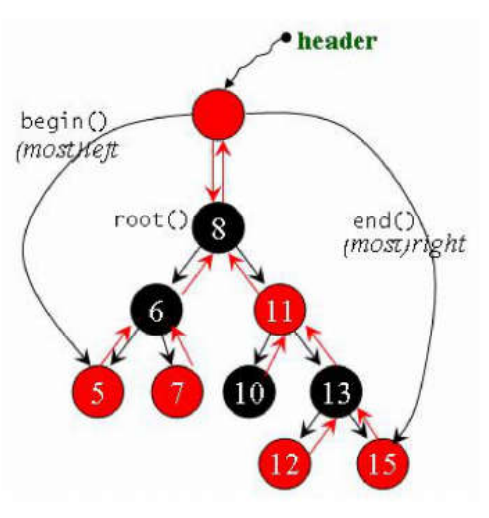
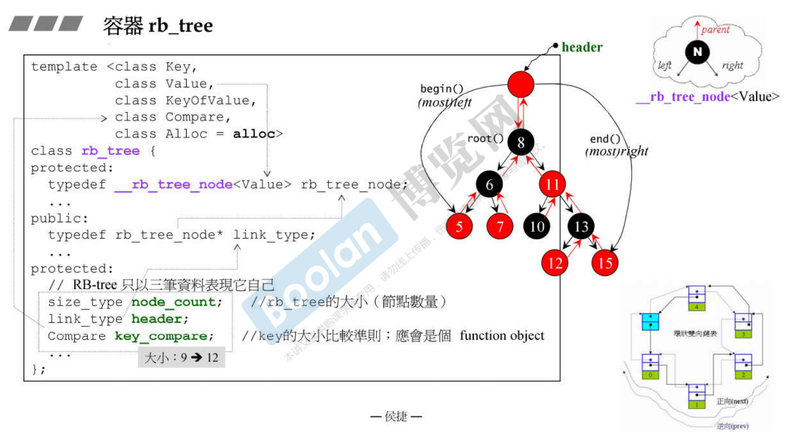
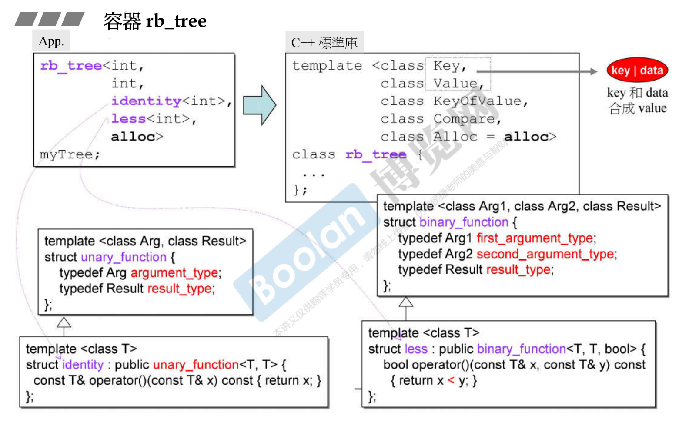
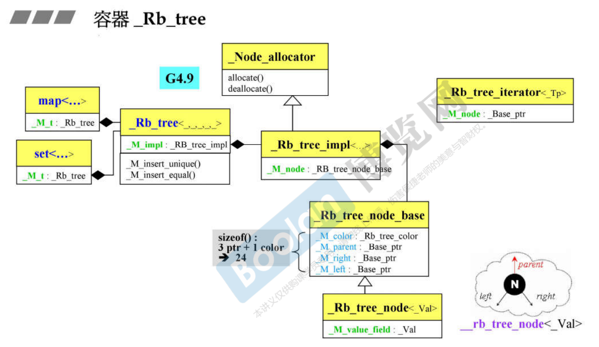

# 容器 rb_tree

Red-Black tree (红黑树) 是平衡二元搜寻树 (balanced binary search tree) 中常被使用的一种平衡二元搜寻树的特征：排列规则有利 search 和 insert，并保持适度平衡，无任何节点过深。

tb_tree 提供遍历操作及iterators。按正常规则 (++ite) 遍历，便能获得排序状态 (sorted)。

我们不应使用rb_tree的iterator改变元素值 (因为元素有其严谨排列规则)。编程层面 (programming level) 并未阻绝此时。如此设计是正确的，因为rb_tree即将为set和map服务，作为其底部支持，而map允许元素的data被改变，只有元素的key才是不可被改变的。

rb_tree提供两种insertion操作：insert_unique() 和 insert_equal()。前者表示节点的key一定在整个tree中独一无二，否则安插失败；后者表示节点的key可重复。










容器 rb_tree，用例

```cpp
//G2.9, test rb_tree
rb_tree<int, int, identify<int>, less<int>> itree;
cout << itree.empty() << endl;	//1
cout << itree.size() << endl;	//0

itree.insert_unique(3);
itree.insert_unique(8);
itree.insert_unique(5);
itree.insert_unique(9);
itree.insert_unique(13);
itree.insert_unique(5);			//no effect, since using insert_unique()
cout << itree.empty() << endl;	//0
cout << itree.size() << endl;	//5
cout << itree.count(5) << endl;	//1

itree.insert_equal(5);
itree.insert_equal(5);
cout << itree.size() << endl;	//7, since using insert_equal()
cout << itree.count(5) << endl;	//3


//G4.9, test rb_tree
_Rb_tree<int, int, _Identity<int>, less<int>> itree;
cout << itree.empty() << endl;	//1
cout << itree.size() << endl;	//0

itree._M_insert_unique(3);
itree._M_insert_unique(8);
itree._M_insert_unique(5);
itree._M_insert_unique(9);
itree._M_insert_unique(13);
itree._M_insert_unique(5);		//no effect, since using _M_insert_unique()
cout << itree.empty() << endl;	//0
cout << itree.size() << endl;	//5
cout << itree.count(5) << endl;	//1

itree._M_insert_equal(5);
itree._M_insert_equal(5)
cout << itree.size() << endl;	//7, since using _M_insert_equal()
cout << itree.count(5) << endl;	//3
```


