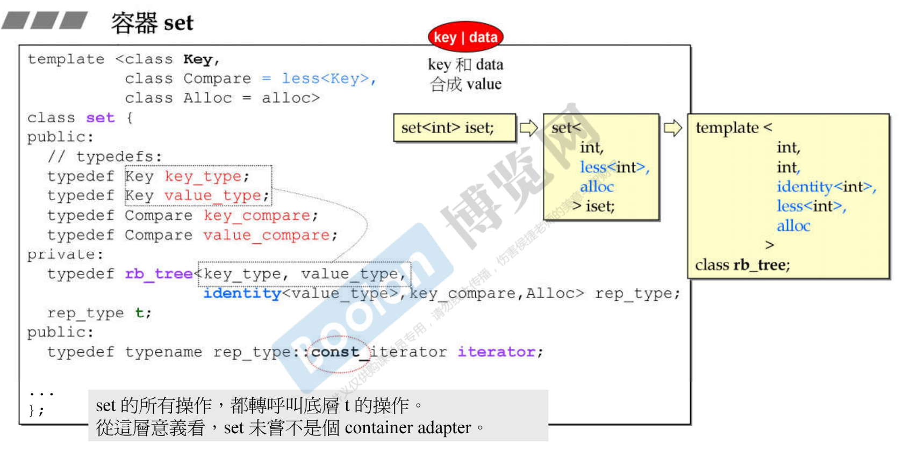
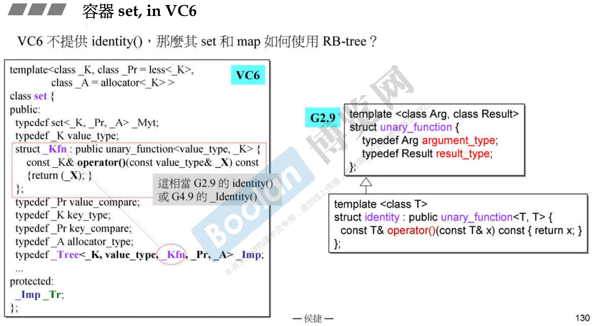
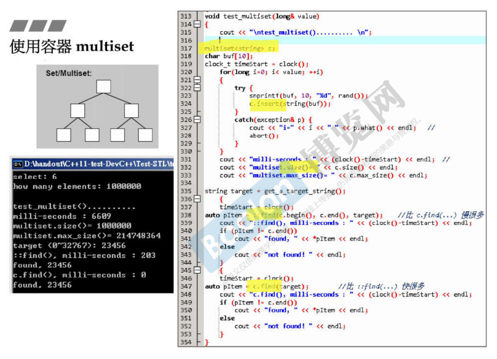
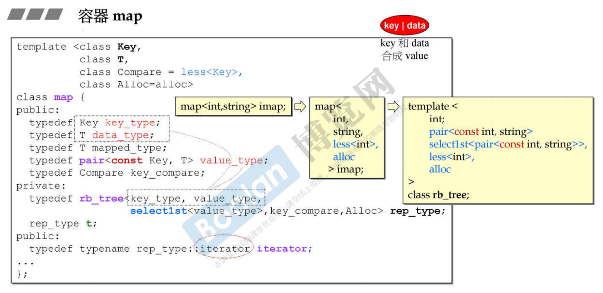
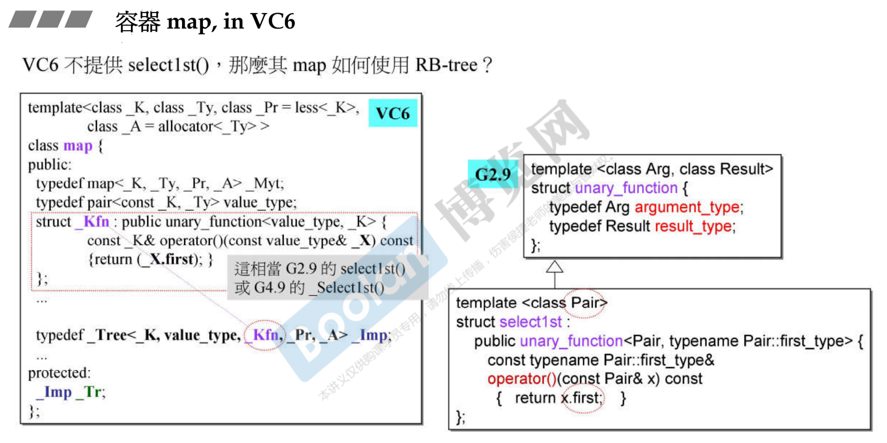
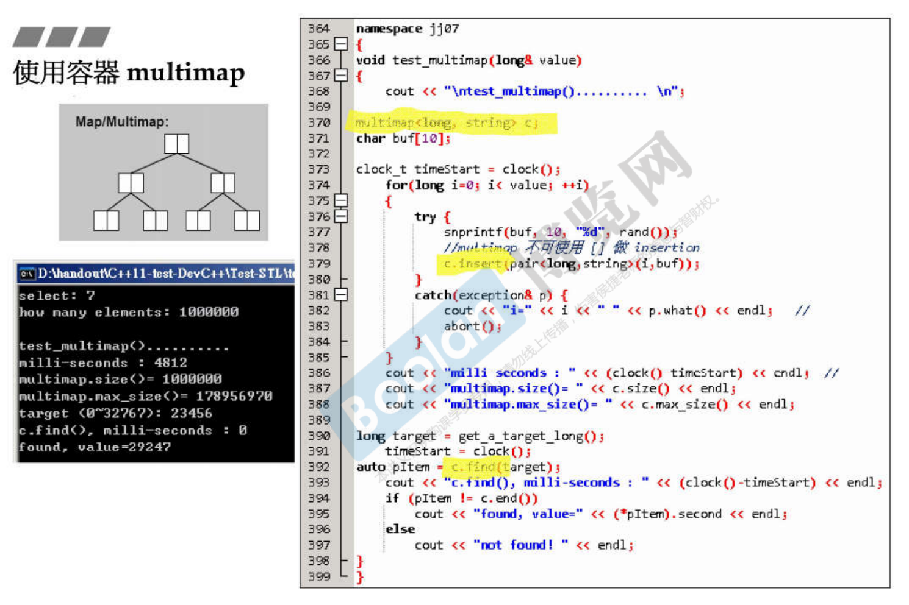
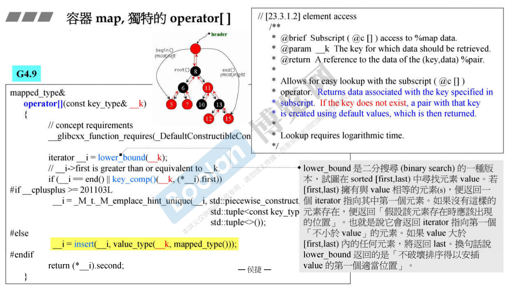
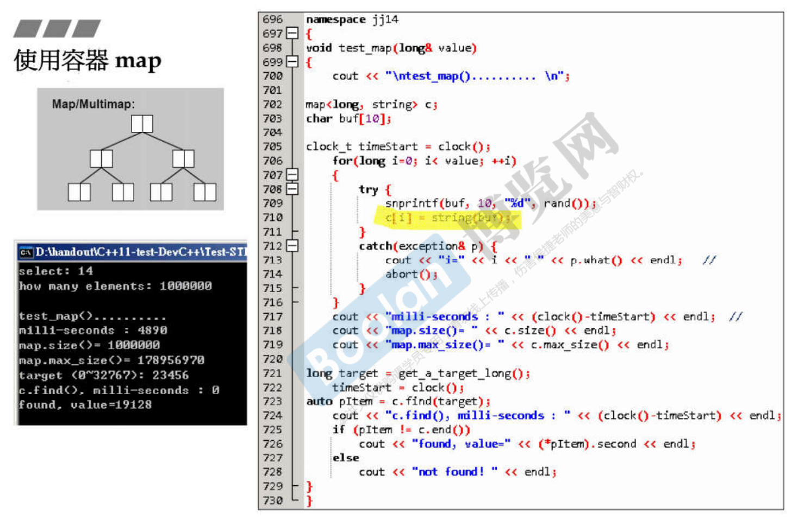

# 容器 set，multiset

set/multiset 以 rb_tree 为底层结构，因此有元素自动排序特性。排序的依据是key，而set/multiset元素的value和key合一：value就是key。

set/multiset提供遍历操作及iterators。按正常规则 (++ite) 遍历，便能获得排序状态 (sorted)。

我们无法使用set/multiset的iterators改变元素值 (因为key有其严谨排列规则)。set/multiset的iterator是其底部的RB tree的const-iterator，就是为了禁止user对元素赋值。

set元素的key必须独一无二，因此其insert()用的是rb_tree的insert_unique()

multiset元素的key可以重复，因此其insert()用的是rb_tree的insert_equal()

容器 map, multimap

