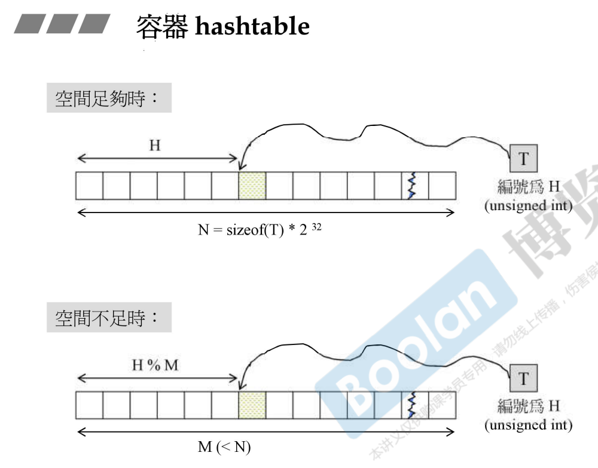
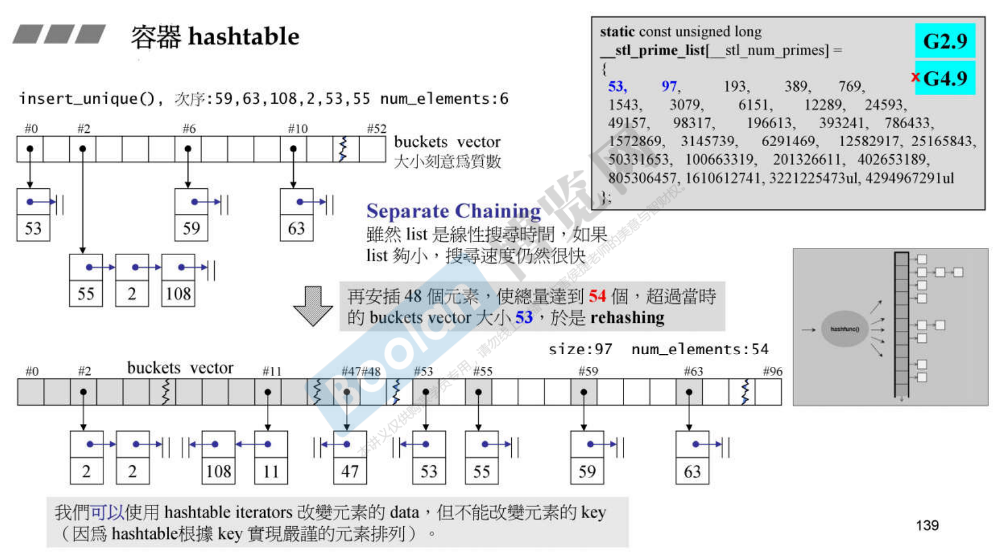
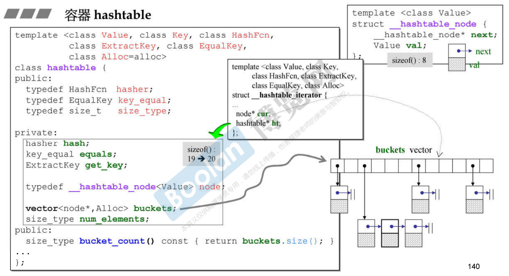
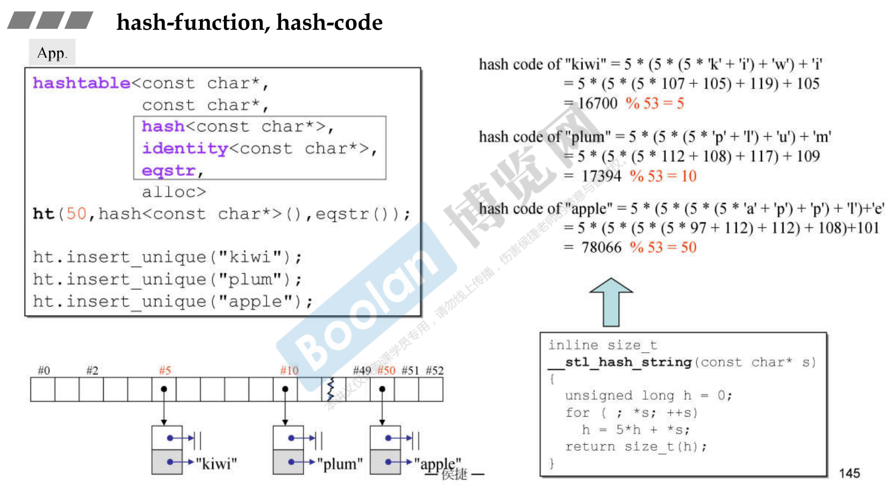

# 容器 hashtable









```cpp
//App
hashtable<const char*, const char*, hash<const char*>,
		identity<const char*>, eqstr, alloc>
ht(50, hash<const char*>(), eqstr());

ht.insert_unique("kiwi");
ht.insert_unique("plum");
ht.insert_unique("apple");


//比较两个c-string是否相等，有strcmp()可用，但它传回-1,0,1，
//不是传回bool，所以必须加一层外套
struct eqstr {
    bool operator()(const char* s1, const char* s2) const
    { return strcmp(s1,s2) == 0;}
};
```

```cpp
//C++标准库
template <class Value, class Key, class HashFcn, 
		class ExtractKey, class EqualKey, class Alloc=alloc>
class hashtable {
public:
    typedef HashFcn  hasher;
    typedef EqualKey key_equal;
    typedef size_t   size_type;
private:
    hasher		hash;
    key_equal	equals;
    ExtractKey	get_key;
    ...
}
```


# hash-function, has-code

```cpp
//泛化
template <class Key> struct hash { };

//特化
//__STL_TEMPLATE_NULL 即 template<>
__STL_TEMPLATE_NULL struct hash<char> {
    size_t operator() (char x) const { return x; }
};

__STL_TEMPLATE_NULL struct hash<short> {
    size_t operator() (short x) const { return x; }
}

__STL_TEMPLATE_NULL struct hash<unsigned short> {
    size_t operator() (unsigned short x) const { return x; }
}

//int i= hash<int>()(32)
__STL_TEMPLATE_NULL struct hash<int> {
    size_t operator() (int x) const { return x; }
}

__STL_TEMPLATE_NULL struct hash<unsigned int> {
    size_t operator() (unsigned int x) const { return x; }
}
```


```cpp
inline size_t __stl_hash_string(const char* s)
{
    unsigned long h = 0;
    for (; *s; ++s)
        h = 5*h + *s;
    
    return size_t(h);
}

__STL_TEMPLATE_NULL struct hash<char*>
{
    size_t operator() (const char* s) const { return __stl_hash_string(s); }
};

__STL_TEMPLATE_NULL struct hash<const char*>
{
    size_t operator() (const char* s) const { return __stl_hash_string(s); }
};
```

hash function 的目的，就是希望根据元素值算出一个 hash code（一个可运行modulus运算的值），使得元素经 hash code 映射之后能够杂乱随机地被置于hashtable内。越是杂乱，越不容易发生碰撞。


# modulus(模数) 运算

```cpp
iterator find(const key_type& key)
{ size_type n = bkt_num_key(key); //花落谁家	
 ...
     
size_type count(const key_type& key) const
{ const size_type n = bkt_num_key(key); 
 ...
     
template <class V, class K, class HF, class ExK, class EqK, class A>
__hashtable_iterator<V, K, HF, ExK, EqK, A>&
__hashtable_iterator<V, K, HF, ExK, EqK, A>::
operator++()
{
...
    size_type bucket = ht->bkt_num(old->val);
...
}


size_type bkt_num_key(const key_type& key) const
{
    return bkt_num_key(key, buckets.size());
}

size_type bkt_num(const value_type& obj) const
{
    return bkt_num_key(get_key(obj));
}
 
 
size_type bkt_num_key(const key_type& key, size_t n) const
{
    //这个hash不是前面出现的struct hash，而是class hashtable中的hasher hash
    return hash(key) % n;
}
 
size_type bkt_num(const value_type& obj, size_t n) const
{
    return bkt_num_key(get_key(obj), n);
}
```





# unordered 容器

before C++11

- hash_set
- hash_multiset
- hash_map
- hash_multimap


since C++11

- unordered_set
- unordered_multiset
- unordered_map
- unordered_multimap


