# C++ 标准库的算法

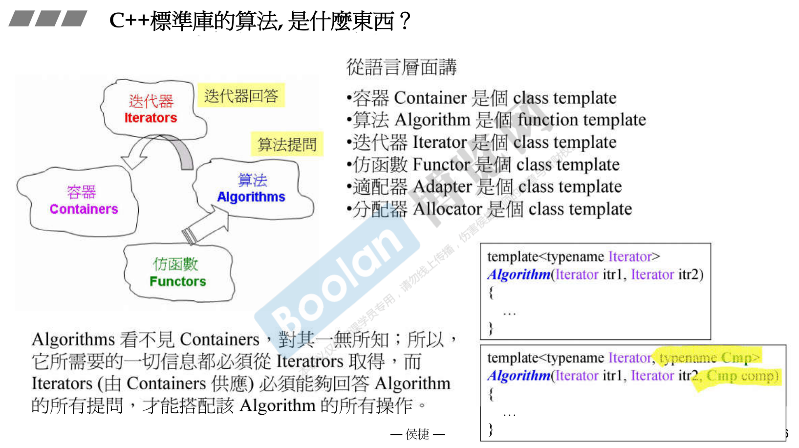


# 各种容器的 iterators 的 iterator_category

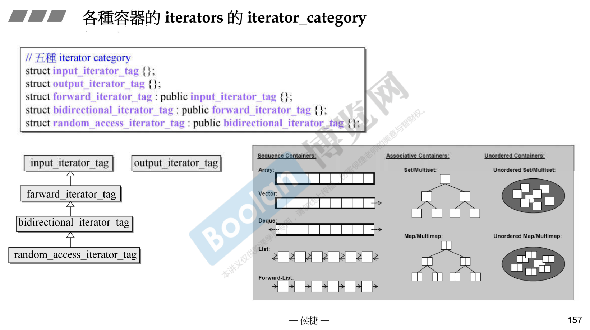

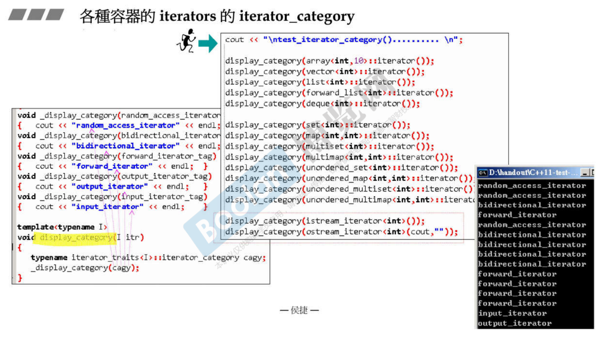


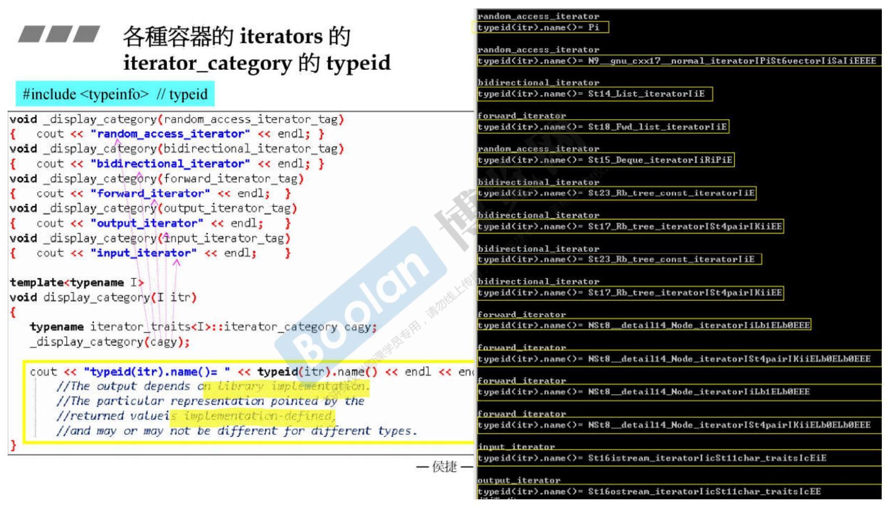


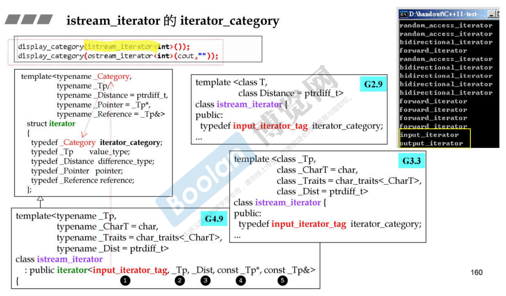


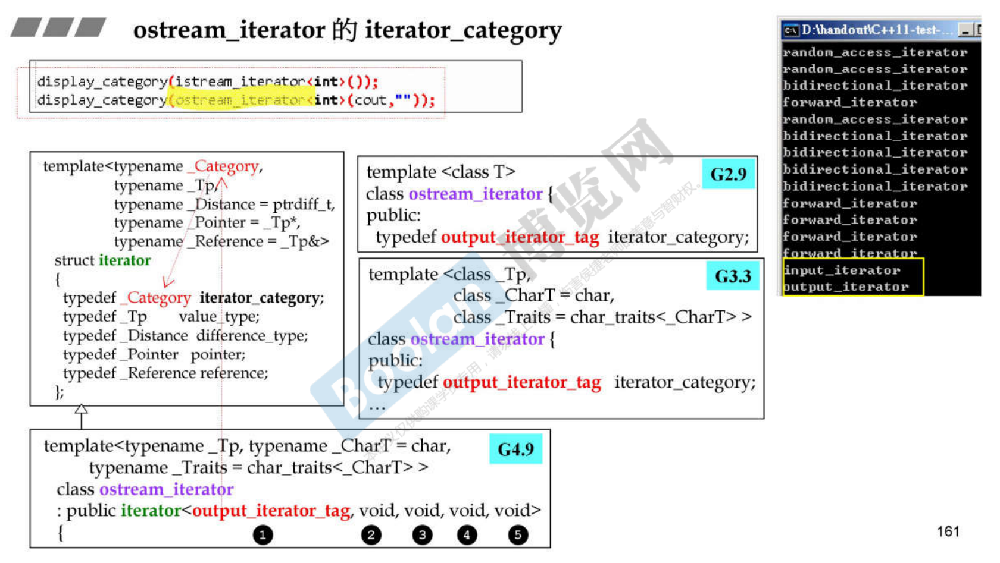


# iterator_category 对算法的影响

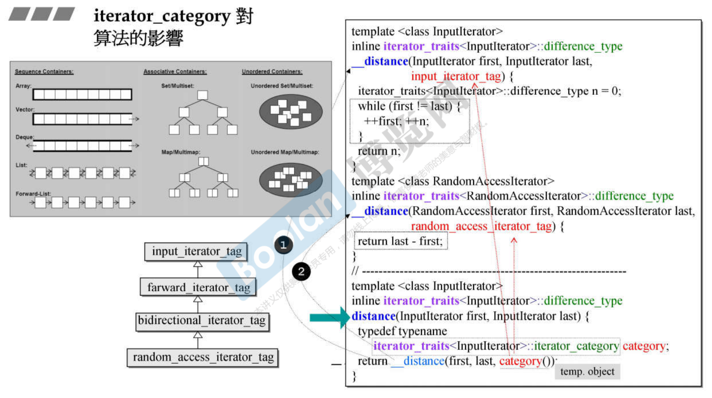

distance 两个指针的距离。第二个版本可以直接相减，有判断这个 iterator 是不是 random access，连续空间才可以 random access。如果不是，则一步步走到尾巴，看走几步。

两根指针的距离究竟要用什么 type 来表现。前面讲过迭代器的五种类型，有种类型叫 difference type。问萃取机现在传入的迭代器它的 difference type 是什么？`iterator_traits<InputIterator>::difference_type` 是distance的返回类型，如果编译通过，那就是答案了。

`iterator_traits<InputIterator>::iterator_category category` 这行是问，同时也是回答。结果这么长，给它一个别名 category。然后为了调用上面两个版本，用 category 创建一个临时对象`category()`。typename 直接加一个小括号，创建临时对象。


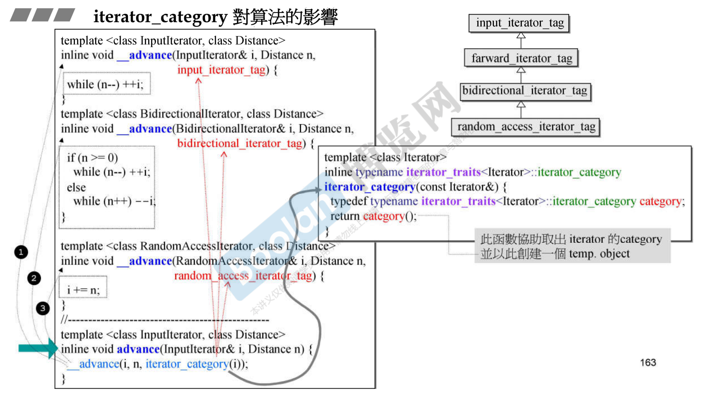

怎么前面 iterator category 只分成两种和三种？分类用对象来表现。用对象来表现，而且有继承关系的话，如果获取的 iterator category 是 forward_iterator_tag，虽然没有它的专属版本，但是它是一个 input_iterator_tag，会落到前面的第一个版本。


# iterator_category 和 type traits 对算法的影响

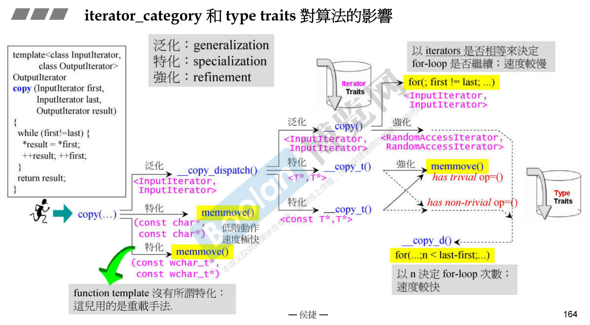

copy 是从来源端到目的端，copy 一定是有头跟尾两根指针指向来源端，目的端只要起点指针，对应 first、last、result。

memmove() 是一个非常低阶的 C 函数，相当于 syscall。

trivial op=() 表示拷贝赋值不重要的话，还是用 memmove()。但如果它重要的话，就一个个赋值，每一个都要调用拷贝赋值。


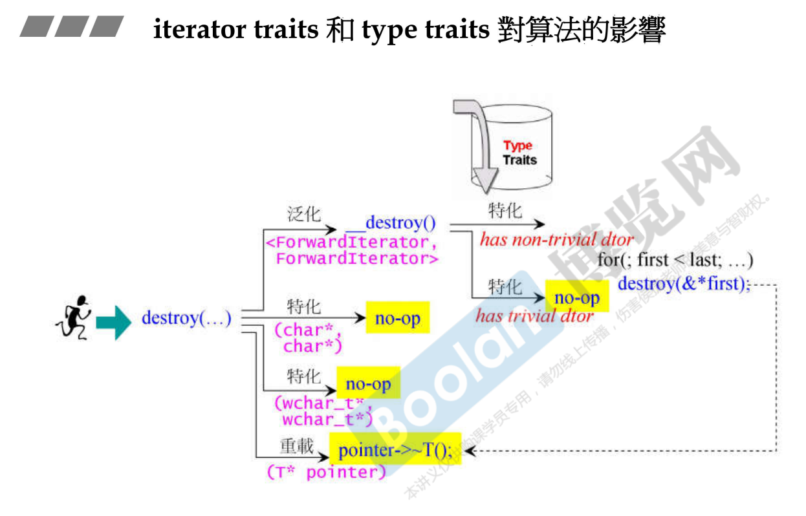


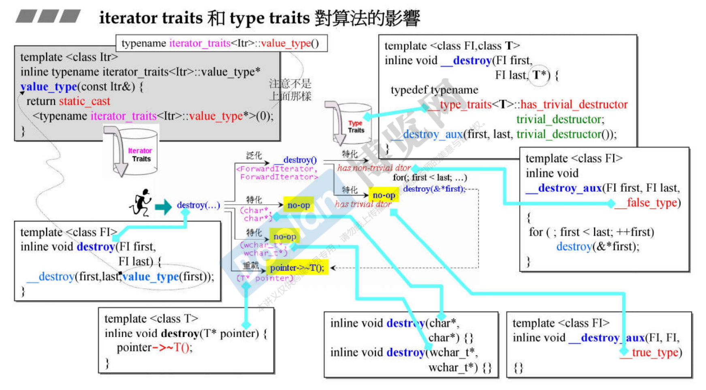


```cpp
template <class InputIterator, class OutputIterator>
    inline OutputIterator __unique_copy(InputIterator first,
                                       inputIterator last,
                                       OutputIterator result,
                                       output_iterator_tag) {
    // output iterator 有其特别局限
    //所以处理前先探讨其 value type.
    return __unique_copy(first, last, result, value_type(first));
}


template <class Itr>
    inline typename iterator_traits<Itr>::value_type*
        value_type(const Itr&) {
        return static_cast
            <typename iterator_traits<Itr>::value_type*>(0);
        //注意不是：typename iterator_traits<Itr>::value_type()
    }


template <class InputIterator, class OutputIterator, class T>
    OutputIterator __unique_copy(InputIterator first,
                                InputIterator last,
                                OutputIterator result, T*) {
    T value = * first;
    *result = value;
    while (++first != last)
        if (value != *first) {
            value = *first;
            *++result = value;
        }
    return ++result;
}

// vs.
//由于 output iterator (例 ostream_iterator) 是 write-only, 
//无法像 forward iterator 那般可以 read，所以不能有类似(下面)
//*result != *first 的动作，因此需设计出(上面)专属版本。
    
template <class InputIterator, class ForwardIterator>
    ForwardIterator __unique_copy(InputIterator first,
                                 InputIterator last,
                                 ForwardIterator result,
                                 forward_iterator_tag) {
    *result = *first;				//登录第一元素
    while (++first != last)			//遍历整个区间
        if (*result != *first) {
            *++result = *first;
        }
    return ++result;
}
```


```cpp
template <class InputIterator>
    inline iterator_traits<InputIterator>::difference_type
        distance(InputIterator first, InputIterator last) {
        typedef typename
            iterator_traits<InputIterator>::iterator_category category;
        return __distance(first, last, category());
    }

template <class RandomAccessIterator>
    inline void sort(RandomAccessIterator first,
                    RandomAccessIterator last) {
    if (first != last) {
        __introsort_loop(first, last, value_type(first), __lg(last - first)*2);
        __final_insertion_sort(first, last);
    }
}

template <class InputIterator, class T>
    InputIterator find(IputIterator first, InputIterator last, const T& value) {
    while (first != last && *first != value) ++first;
    return first;
}

template <class ForwardIterator>
    inline void rotate(ForwardIterator first, ForwardIterator middle, 
                       ForwardIterator last) {
    if (first == middle || middle == last) return;
    __roate(first, middle, last, distance_type(first), iterator_category(first));
}

template <class BidirectionalIterator, class OutputIterator>
    OutputIterator reverse_copy(BidirectionalIterator first, 
                                BidirectionalIterator last,
                               OutputIterator result) {
    while (first != last) {
        --last;
        *result = *last;
        ++result;
    }
    return result;
}
```


# 先前示例中出现的算法

```cpp
qsort(c.data(), ASIZE, sizeof(long), compareLongs);	//C 函数

long* pItem = 
    (long*)bsearch(&target, (c.data()), ASIZE, sizeof(long), compareLongs);

```

```cpp
//这是C++标准库提供的 algorithms，以函数的形式呈现
cout << count_if(vi.begin(), vi.end(), not1(bind2nd(less<int>(),40)));
auto ite = find(c.begin(), c.end(), target);
sort(c.begin(), c.end());


template<typename Iterator>
std::Algorithm(Iterator itr1, Iterator itr2, ...)
{
    ...
}
```


## 算法 accumulate

```cpp
template <class InputIterator, class T>
    T accumulate(InputIterator first, InputIterator last, T init)
{
    for ( ; first != last; ++first)
        //将元素累加至初值init身上
        init = init + *first;
    return init;
}


template <class InputIterator, class T, class BinaryOperation>
    T accumulate(InputIterator first, InputIterator last, T init, 
                 BinaryOperation binary_op)
{
    for ( ; first != last; ++first)
        //对元素类计算至初值init身上
        init = binary_op(init, *first);
    return init;
}
```

```cpp
#include <iostream>		// std::cout
#include <functional>	// std::minus
#include <numeric>		// std::occumulate
namespace jj34
{
    int myfunc (int x, int y) {return x+2*y;}

    struct myclass {
        int operator()(int x, int y) {return x+3*y;}
    } myobj;

    void test_accumulate()
    {
        int init = 100;
        int nums[] = {10,20,30};

        cout << "using default accumulate: ";
        cout << accumulate(nums,nums+3,init);	//160
        cout << '\n';

        cout << "using functional's minus: ";
        cout << accumulate(nums, nums+3, init, minus<int>());	//40
        cout << '\n';

        cout << "using custom function: ";
        cout << accumulate(nums, nums+3, init, myfunc);		//220
        cout << '\n';

        cout << "using custom object: ";
        cout << accumulate(nums, nums+3, init, myobj);		//280
        cout << '\n';
    }
}
```

通常算法有两个版本，其中往往第二个版本允许我们加上一个额外的原则或者一个操作，让原先的版本可以更广泛一些。


## 算法 for_each

```cpp
template <class InputIterator, class Function>
    Function for_each(InputIterator first, InputIterator last, Function f)
{
    for ( ; first != last; ++first)
        f(*first);
    return f;
}

//range-based for statement (since C++11)
for ( decl : coll ) {
    statement
}

for ( int i : {2,3,5,6,7,9} ) {
    cout << i << endl;
}
```

```cpp
#include <iostream>		//std::cout
#include <algorithm>	//std::for_each
#include <vector>		//std::vector
namespace jj35
{
    void myfunc (int i) {
        cout << ' ' << i;
    }
    
    struct myclass {
        void operator() (int i) { cout << ' ' << i; }
    } myobj;
    
    void test_for_each()
    {
        vector<int> myvec;
        myvec.push_back(10);
        myvec.push_back(20);
		myvec.push_back(30);
        
        for_each (myvec.begin(), myvec.end(), myfunc);
        cout << endl;		//output: 10 20 30
        
        for_each (myvec.begin(), myvec.end(), myobj);
        cout << endl;		//output: 10 20 30
        
        //since C++11, range-based for- statement
        for (auto& elem : myvec)
            elem += 5;
        
        for (auto elem : myvec)
            cout << ' ' << elem;	//output: 15 25 35
    }
}
```


## 算法 replace, replace_if, replace_copy

用这个例子体会七八十个算法中的一种命名方式。

```cpp
template <class ForwardIterator, class T>
    void replace(ForwardIterator first, ForwardIterator last, 
                 const T& old_value, constT& new_value) {
    //范围内所有等同于old_value者都以new_value取代
    for ( ; first != last; ++first)
        if (*first == old_value)
            *first = new_value;
}


template <class InputIterator, class OutputIterator, class T>
    OutputIterator replace_copy(InputIterator first,
                               InputIterator last,
                               OutputIterator result,
                               const T& old_value,
                               const T& new_value) {
    //范围内所有等同于old_value者都以new_value放至新区间
    //不符合者原值放入新区间
    for ( ; first != last; ++first, ++result)
        *result = 
        	*first == old_value ? new_value : *first;
    return result;
}


template <class ForwardIterator, class Predicate, class T>
    void replace_if(ForwardIterator first,
                   ForwardIterator last,
                   Predicate pred,
                   const T& new_value) {
    //范围内所有满足pred()为true的元素都以new_value取代
    for ( ; first != last; ++first)
        if (pred(*first))
            *first = new_value;
}
```


## 算法 count, count_if

```cpp
template <class InputIterator, class T>
    typename iterator_traits<InutIterator>::difference_type
        count(InputIterator first, InputIterator last, const T& value) {
        //以下定义一个初值为 0 的计数器 n
        typename iterator_traits<InputIterator>::difference_type n = 0;
        for ( ; first != last; ++first)			//遍历(循序搜寻)
            if (*first == value)				//如果元素值和value相等
                ++n;							//计数器累加1
        return n;
    }

template <class InputIterator, class Predicate>
    typename iterator_traits<InputIterator>::difference_type
        count_if(InputIterator first, InputIterator last, Predicate pred) {
        //以下定义一个初值为 0 的计数器 n
        typename iterator_traits<InputIterator>::difference_type n = 0;
        for ( ; first != last; ++first)			//遍历(循序搜寻)
            if (pred(*first))					//如果元素代入pred的结果为true
                ++n;							//计数器累加1
        return n;
    }


```

**容器不带成员函数 count() :**

array, vector, list, forward_list, deque


**容器带有成员函数 count() :**

set / multiset, map / multimap, unordered_set / unordered_multiset, unordered_map / unordered_multimap


## 算法 find, find_if

```cpp
template <class InputIterator, class T>
    InputIterator find(InputIterator first, InputIterator last, const T& value)
{
    while (first != last && *first != value)
        ++first;
    return first;	//循序式查找
}

template <class InputIterator, class Predicate>
    InputIterator find_if(InputIterator first,
                         InputIterator last,
                         Predicate pred)
{
    while (first != last && !pred(*first))
        ++first;
    return first;	//循序式查找
}
```

容器不带成员函数 find() ：

array, vector, list, forward_list, deque,


容器带有成员函数 find() :

set / multiset,  map / multimap, unordered_set / unordered_multiset, unordered_map / unordered_multimap 

为什么是这8个？关联式容器，可以用一个key找到一个data，一个小型数据库。它有自己的严谨结构，内部是用红黑树跟哈希表做出来的，所以这8个count有自己的快速做法。


## 算法 sort

```cpp
bool myfunc(int i, int j) { return (i<j); }

struct myclass {
    bool operator() (int i, int j) { return (i<j); }
} myobj;

bool test_sort()
{
    int myints[] = {32,71,12,45,26,80,53,33};
    vector<int> myvec(myints, myints+8);			// 32 71 12 45 26 80 53 33
    
    // using default comparison (operator <);
    sort(myvec.begin(), myvec.begin()+4);			//(12 32 45 71)26 80 53 33
    
    // using function as comp
    sort(myvec.begin()+4, myvec.end(), myfunc);		// 12 32 45 71(26 33 53 80)
    
    // using object as comp
    sort(myvec.begin(), myvec.end(), myobj);		//(12 26 32 33 45 53 71 80)
    
    // print out content:
    cout << "myvec contains:";
    for (auto elem : myvec)			//C++11 range-based ofr statement
        cout << ' ' << elem;		//output: 12 26 32 33 45 53 71 80
    
    // using reverse iterators and default comparison (operator <):
    sort(myvec.rbegin(), myvec.rend());
    
    // print out content:
    cout << "myvec contains:";
    for (auto elem : myvec)			//C++11 range-based for statement
        cout << ' ' << elem;		//output: 80 71 53 45 33 32 26 12
}
```

**容器不带成员函数 sort() :**

array, vector, deque, 

set / multiset, map / multimap, unordered_set / unordered_multiset, unordered_map / unordered_multimap 遍历自然形成 sorted 状态


**容器带有成员函数 sort() :**

list, forward_list


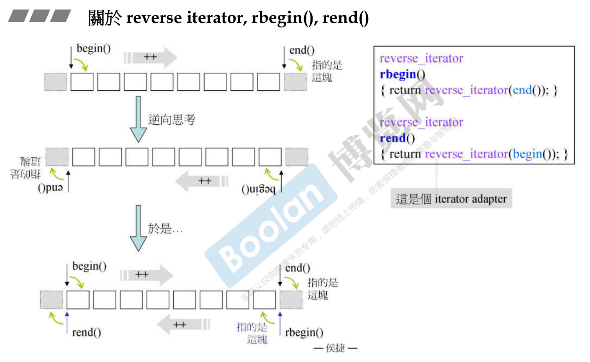

## 算法 binary_search

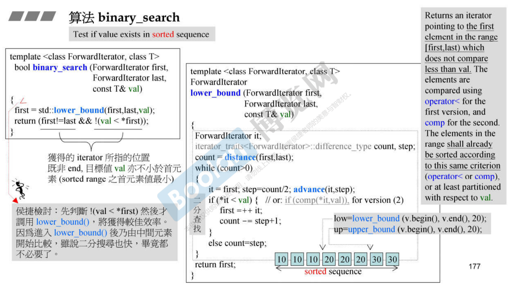