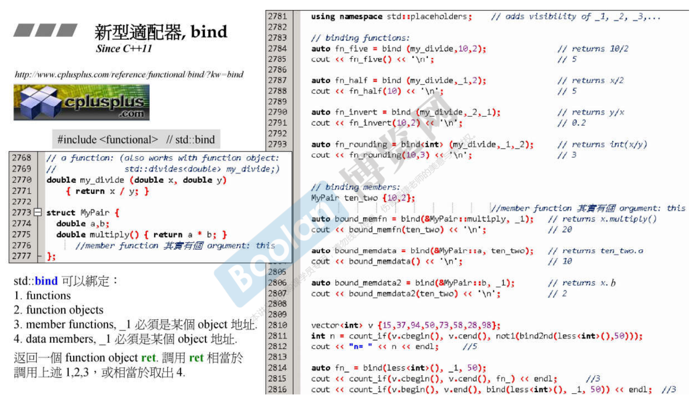

# adapter

adapter，把某个既有不错的东西改造一下。继承或者内含。


# 容器适配器：stack, queue

```cpp
template <class T, class Sequence=deque<T>>
class stack {
...
public:
    typedef typename Sequence::value_type value_type;
    typedef typename Sequence::size_type size_type;
    typedef typename Sequence::reference reference;
    typedef typename Sequence::const_reference const_reference;
protected:
    Sequence c;	//底层容器
public:
    bool empty() const { return c.empty(); }
    size_type size() const { return c.size(); }
    reference top() { return c.back(); }
    const_reference top() const { return c.back(); }
    void push(const value_type& x) { c.push_back(x); }
    void pop() { c.pop_back(); }
};
```

```cpp
template <class T, class Sequence=deque<T>>
class queue {
...
public:
    typedef typename Sequence::value_type value_type;
    typedef typename Sequence::size_type size_type;
    typedef typename Sequence::reference reference;
    typedef typename Sequence::const_reference const_reference;
protected:
    Sequence c;	//底层容器
public:
    bool empty() const { return c.empty(); }
    size_type size() const { return c.size(); }
    reference front() { return c.front(); }
    const_reference front() const { return c.front(); }
    reference back() { return c.back(); }
    const_reference back() const { return c.back(); }
    void push(const value_type& x) { c.push_back(x); }
    void pop() { c.pop_front(); }
};
```


# 函数适配器：binder2nd、not1

function adapter

cout_if，参数为数据边界、条件。如果要限于某个条件，如小于50、大于40小于100，你就要为这些条件都要写一个函数。

如果在程序中你常常要传一些动作、操作、函数进去，这些函数都很小，但是你要写好几个，技术上当然不是问题，但在软件工程上还有改善的空间。标准库就推出这种东西，我有一个比大小，x 比 y 函数 less，仿函数。指明比整数，x 小于 y，现在要 x 小于 40。标准库提供 bind2nd 允许你把第二参数绑定为 40，相当于把 less 动作修饰了一下。

一个主体，一个辅助函数。主体比较复杂，增加一个辅助函数给外界使用。

adapter 修饰 functor(这里讲function)，之后它也要表现成一个 function。如果它修饰一个容器，也要表现成一个容器。修饰迭代器就要表现成迭代器。所以 binder2nd 要重载 () 操作符。

函数调用的时候才进行参数绑定，这里是执行到 `typenaem Operation::result_type operator()(const typename Operation::first_argument_type& x) const{}` 才进行参数绑定。

`less<int>()` 产生一个临时对象。

灰色部分如 `Operation::second_argument_type` 都是在问 Operation 相关信息。第一个实参 type、第二个实参 type、返回的 type。

灰色部分前加 typename 是要帮助编译器通过这些代码，因为编译器编它的时候，这东西还没被使用，所以这个 Operation 是什么还不知道。Operation 是要被传参数进来的时候才被实参推导知道。


继续使用 not1 进行修饰，好像乐高积木一样。


# 新型适配器：bind

```cpp
//...\include\c++\backward\backward_warning.h
/*
	A list of valid replacements is as follows:
	
	Use:									Instead of:
	<sstream>, basic_stringbuf				<strstream>, strstreambuf
	<sstream>, basic_istringstream			<strstream>, istrstream
	<sstream>, basic_ostringstream			<strstream>, OStrstream
	<sstream>, basic_stringstream			<strstream>, strstream
	<unordered_set>, unordered_set			<ext/hash_set>, hash_set
	<unordered_set>, unordered_multiset		<ext/hash_set>, hash_multiset
	<unordered_map>, unordered_map			<ext/hash_map>, hash_map
	<unordered_map>, unordered_multimap		<ext/hash_map>, hash_multimap
	<functional>, bind						<functional>, binder1st
	<functional>, bind						<functional>, binder2nd
	<functional>, bind						<functional>, bind1st
	<functional>, bind						<functional>, bind2nd
	<memory>, unique_ptr					<memory>, auto_ptr
*/
```




_1, _2, _3 占位符，placeholders。


# 迭代器适配器：reverse_iterator


插进去的动作是 insert，而不是 assign 赋值动作，也就是说要自己准备空间。在 3、4 之间每放一个元素就要安排一个空间。但是我们调用的是 copy，copy 已经写死了 assign 赋值。我们可以采用 inserter 把目的端的迭代器改成一个 insert 的动作。明明 copy 已经写死了，如何改变它的行为？这里非常巧妙，你可以看到 C++ 操作符重载非常妙的地方。

= 操作符重载，接管了赋值操作。如果 result (copy 的第三参数) 有对 = 做重新定义的动作，那么这个动作就会跑到重新定义的地方。


