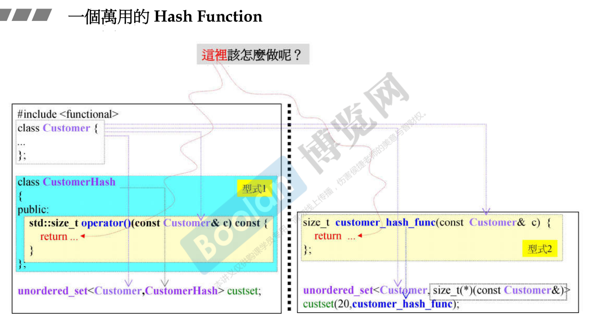
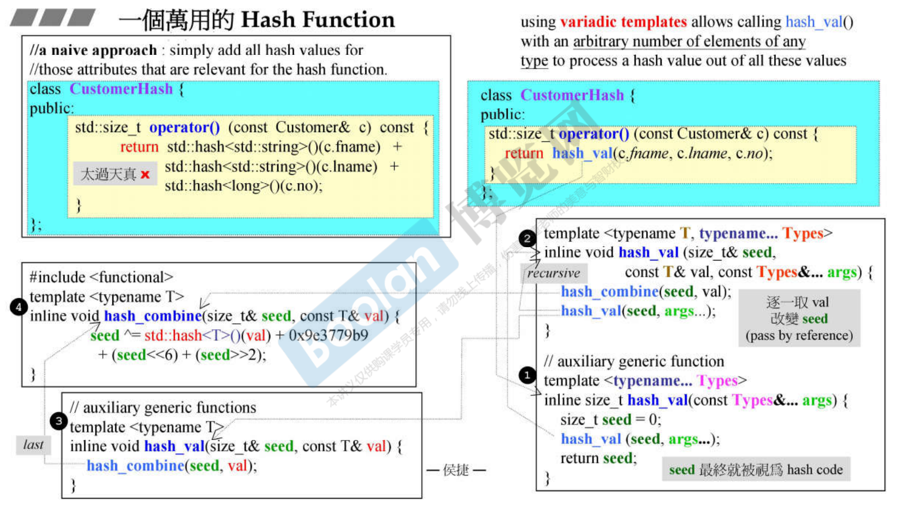
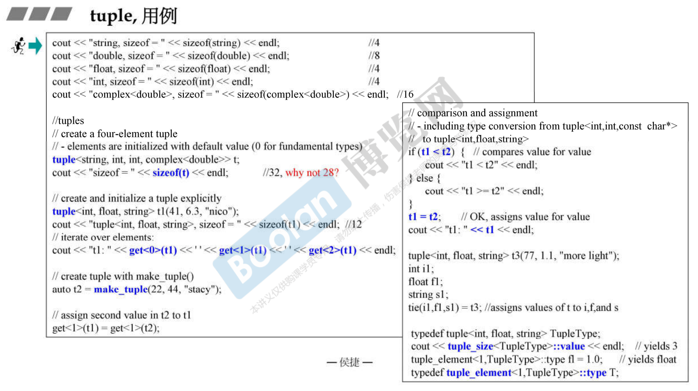

# 一个万用的 hash function







```cpp
//from boost (functional/hash):
template <typename T>
inline void hash_combine (size_t& seed, const T& val)
{
    seed ^= hash<T>()(val) + 0x9e3779b9 + (seed<<6) + (seed>>2);
}

//auxiliary generic functions to create a hash value using a seed
template <typename T>
inline void hash_val (size_t& seed, const T& val)
{
    hash_combine(seed, val);
}

template <typename T, typename... Types>
inline void hash_val (size_t& seed, const T& val, const Type&... args)
{
    hash_combine(seed, val);
    hash_val(seed, args...);
}


//auxiliary generic function
template <typename... Types>
inline size_t hash_val (const Types&... args)
{
    size_t seed = 0;
    hash_val(seed, args...);
    return seed;
}

class CustomerHash {
public:
    size_t operator()(const Customer& c) const {
        return hash_val(c.fname, c.lname, c.no);
    }
};
```


以 struct hash 偏特化形式实现 hash function

```cpp
//G4.9
template <typename T, 
		typename Hash = hash<T>, 
		typename EqPred = equal_to<T>, 
		typename Allocator = allocator<T>>
class unordered_set;

template <typename T, 
		typename Hash = hash<T>, 
		typename EqPred = equal_to<T>, 
		typename Allocator = allocator<T>>
class unordered_multiset;

template <typename Key, typename T, 
		typename Hash = hash<T>,
		typename EqPred = equal_to<T>,
		typename Allocator = allocator<pair<const Key, T>>>
class unordered_map;

template <typename Key, typename T, 
		typename Hash = hash<T>,
		typename EqPred = equal_to<T>,
		typename Allocator = allocator<pair<const Key, T>>>
class unordered_multimap;
```


```cpp
class MyString {
private:
    char* _data;
    size_t _len;
...
};

namespace std	//必须放在std内
{
template<>
struct hash<MyString>	//为了 unordered containers
{
    size_t operator()(const MyString& s) const noexcept
    { return hash<string>()(string(s.get())); }	//借用 hash<string>
};
}
```





