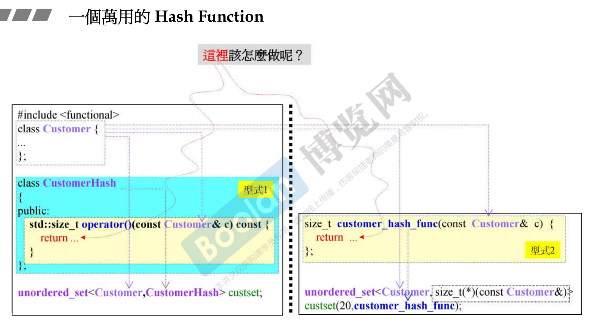
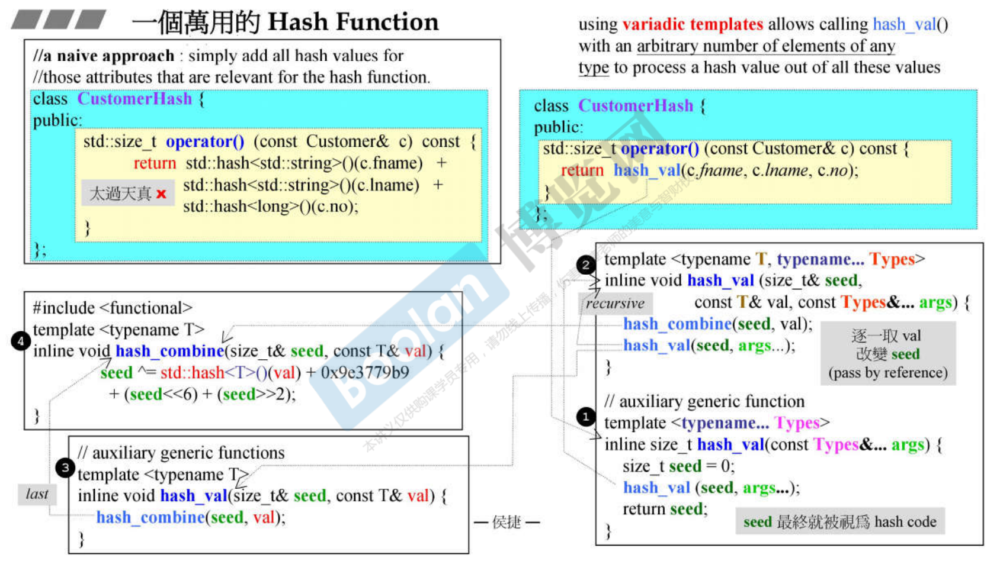
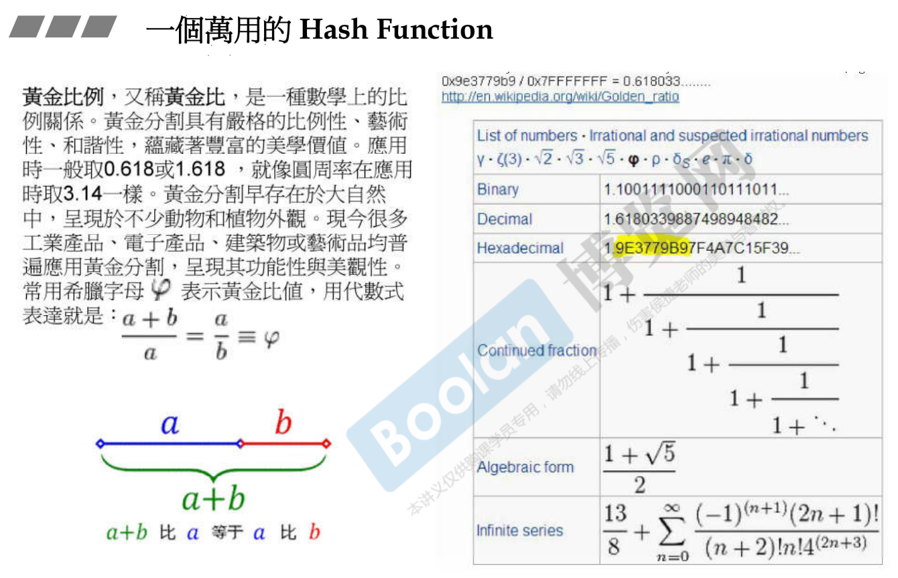
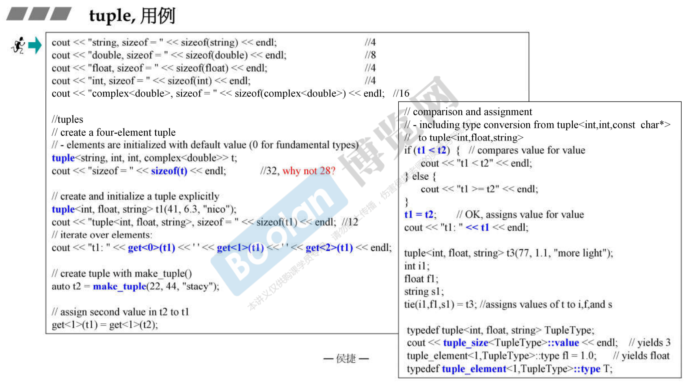
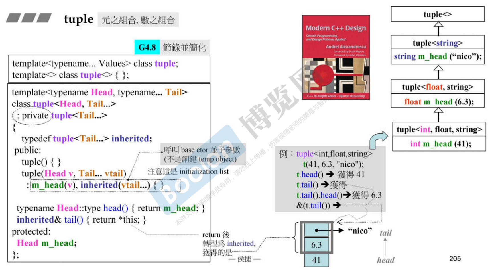
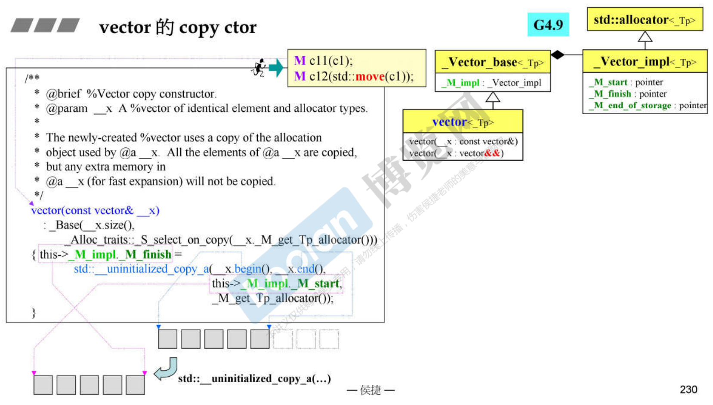
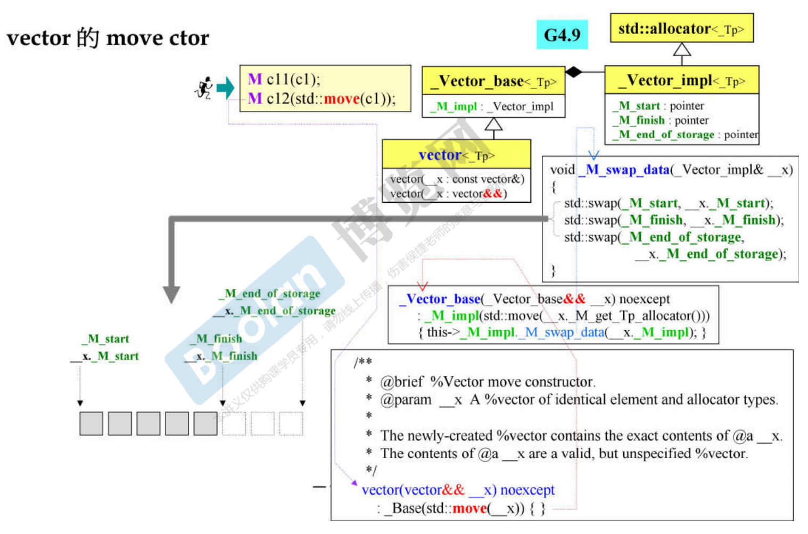
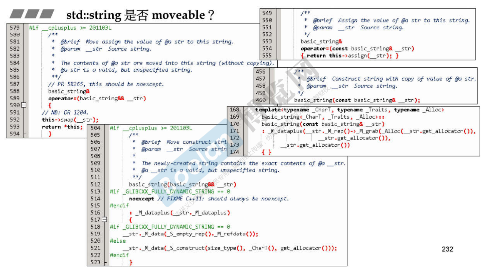

第四讲

# hash function

当使用 hashtable 支撑的容器时，让你为放置元素写一个 hash function。编程里所有的数据都由原始的整数、浮点数、字符串等组成，而这些数值型的它们本身就有 hash function。既然这些基本的原子、分子都有了 hash function，有没有可能把我们现在设计出来的 structure 的元素拆分开来，把它们各自的 hash code 加起来变成这个元素的 hash code 呢？

hash function 有两种型式，一种型式2是单纯写为一般的函数。另一种型式1是设计成成员函数在类里头，这个类的对象将来要成为一个函数对象，要像函数一样能被调用，所以要重载 () 操作符。

型式2使用的时候，unorder_set 第二个参数是 hash function 的函数类型，之后再创建容器的时候还得把函数地址传进来。

型式1只需指定类型就好了，里头会自动产生 CustomerHash 对象，这个对象会被当成一个函数对象被调用。









```cpp
//from boost (functional/hash):
//4，对应前图的 1 2 3 4
template <typename T>
inline void hash_combine (size_t& seed, const T& val)
{
    seed ^= hash<T>()(val) + 0x9e3779b9 + (seed<<6) + (seed>>2);
}

//auxiliary generic functions to create a hash value using a seed
//3
template <typename T>
inline void hash_val (size_t& seed, const T& val)
{
    hash_combine(seed, val);
}

//2
template <typename T, typename... Types>
inline void hash_val (size_t& seed, const T& val, const Type&... args)
{
    hash_combine(seed, val);
    hash_val(seed, args...);
}


//auxiliary generic function
//1
template <typename... Types>
inline size_t hash_val (const Types&... args)
{
    size_t seed = 0;
    hash_val(seed, args...);
    return seed;
}

class CustomerHash {
public:
    size_t operator()(const Customer& c) const {
        return hash_val(c.fname, c.lname, c.no);
    }
};
```


hash function 使用

```cpp
CustomerHash hh;	//函数对象，当成函数来使用
// %11, 看元素放在哪个篮子
cout << "bucket position of Ace = " << hh(Customer("Ace", "Hou", 1L)) % 11 << endl; //2
cout << "bucket position of Sabri = " << hh(Customer("Sabri", "Hou", 2L)) % 11 << endl; //4
cout << "bucket position of Stacy = " << hh(Customer("Stacy", "Chen", 3L)) % 11 << endl; //10
cout << "bucket position of Mike = " << hh(Customer("Mike", "Tseng", 4L)) % 11 << endl;	//2
cout << "bucket position of Paili = " << hh(Customer("Paili", "Chen", 5L)) % 11 << endl; //9
cout << "bucket position of Light = " << hh(Customer("Light", "Shiau", 6L)) % 11 << endl; //6
cout << "bucket position of Shally = " << hh(Customer("Shally", "Hwung", 7L)) % 11 << endl;	//2

for (unsigned i = 0; i < set3.bucket_count(); ++i) {
    cout << "bucket #" << i << " has " << set3.bucket_size(i) << " elements.\n";
}
//bucket #0 has 0 elements.
//bucket #1 has 0 elements.
//bucket #2 has 3 elements.
//bucket #3 has 0 elements.
//bucket #4 has 1 elements.
//bucket #5 has 0 elements.
//bucket #6 has 1 elements.
//bucket #6 has 0 elements.
//bucket #6 has 0 elements.
//bucket #6 has 1 elements.
//bucket #6 has 1 elements.
```

```cpp
unordered_set<Customer, CustomerHash> set3;
set.insert( Customer("Ace", "Hou", 1L) );
set.insert( Customer("Sabri", "Hou", 1L) );
set.insert( Customer("Stacy", "Chen", 1L) );
set.insert( Customer("Mike", "Tseng", 1L) );
set.insert( Customer("Paili", "Chen", 1L) );
set.insert( Customer("Light", "Shiau", 1L) );
set.insert( Customer("Shally", "Hwung", 1L) );
cout << "set3 current bucket_count: " << set3.bucket_count() << endl;
```


以 struct hash 偏特化形式实现 hash function，型式3

```cpp
//G4.9
template <typename T, 
		typename Hash = hash<T>, 
		typename EqPred = equal_to<T>, 
		typename Allocator = allocator<T>>
class unordered_set;

template <typename T, 
		typename Hash = hash<T>, 
		typename EqPred = equal_to<T>, 
		typename Allocator = allocator<T>>
class unordered_multiset;

template <typename Key, typename T, 
		typename Hash = hash<T>,
		typename EqPred = equal_to<T>,
		typename Allocator = allocator<pair<const Key, T>>>
class unordered_map;

template <typename Key, typename T, 
		typename Hash = hash<T>,
		typename EqPred = equal_to<T>,
		typename Allocator = allocator<pair<const Key, T>>>
class unordered_multimap;
```

偏特化型式使用。对 hash 写一个特化版本，对 MyString 特化。

```cpp
class MyString {
private:
    char* _data;
    size_t _len;
...
};

namespace std	//必须放在std内
{
template<>
struct hash<MyString>	//为了 unordered containers
{
    size_t operator()(const MyString& s) const noexcept
    { return hash<string>()(string(s.get())); }	//借用 hash<string>
};
}
```


# tuple

一组东西，任意元素，任意类型。



tuple 怎么做的？variadic template，它是怎么利用这个东西做出tuple。variadic template 这个语法帮你自动把 n 个参数分解为 1 和 n-1，然后把 n-1 分解为 1 和 其余，一直递归下去，直到 1 + 0，这时写出终止条件。

继承自己，尾巴部分，递归。原来 C++ 的 variadic template 可以自动把一个类变成这种继承关系。










