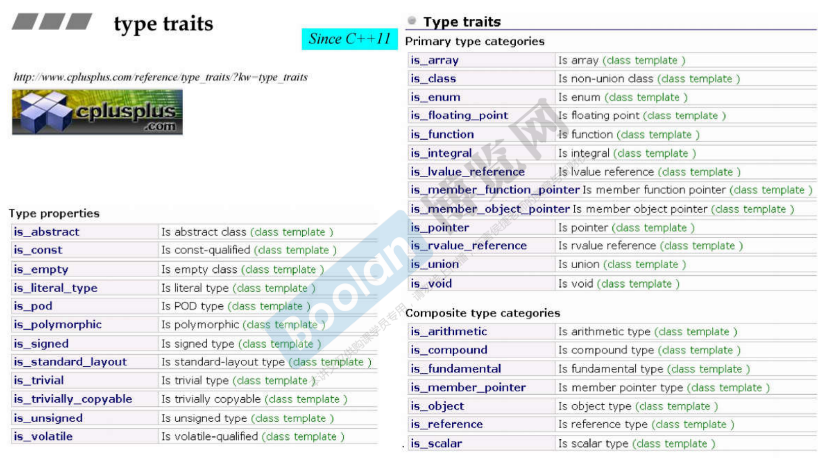
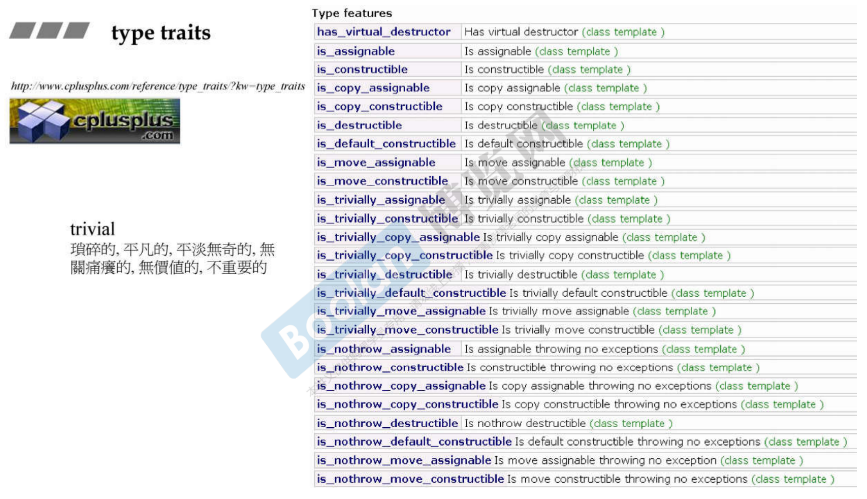
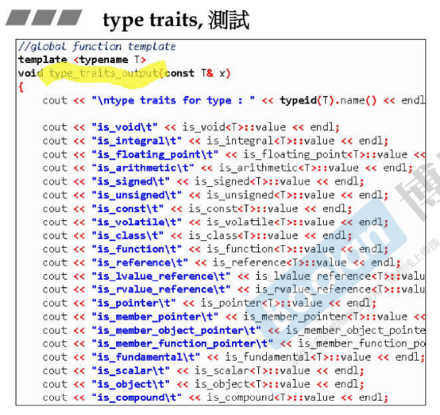
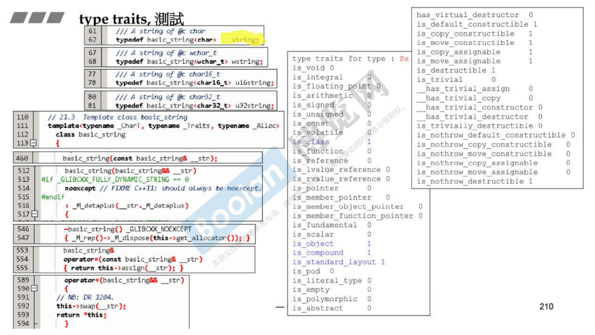
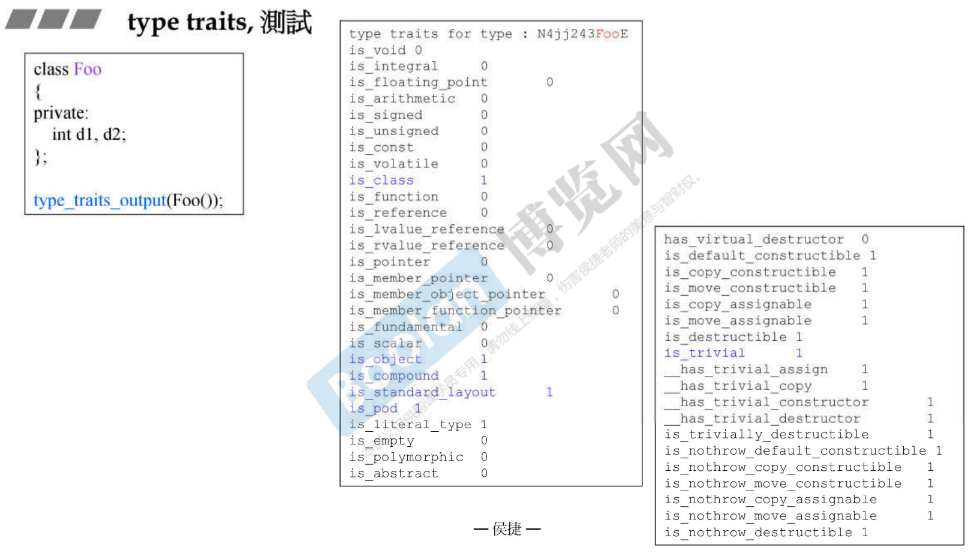
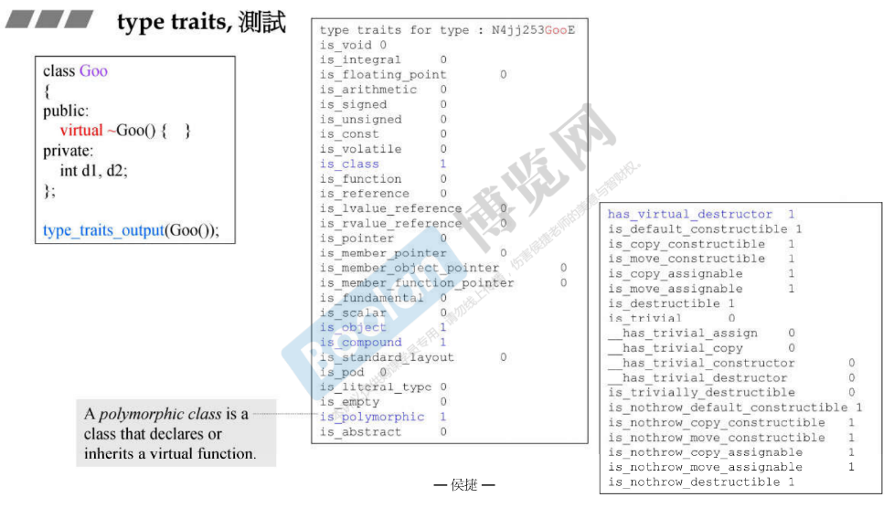
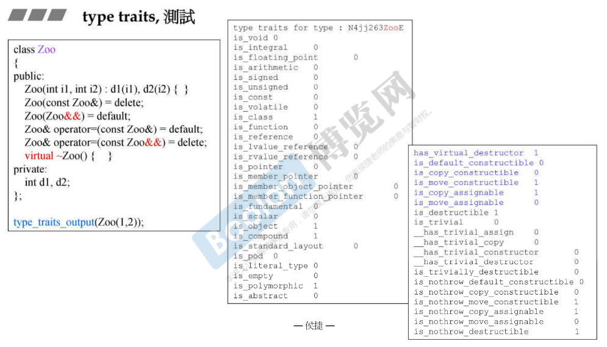
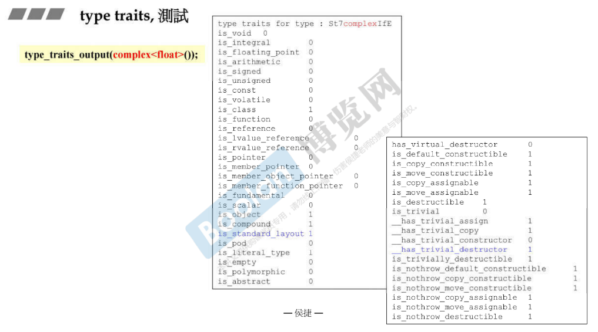
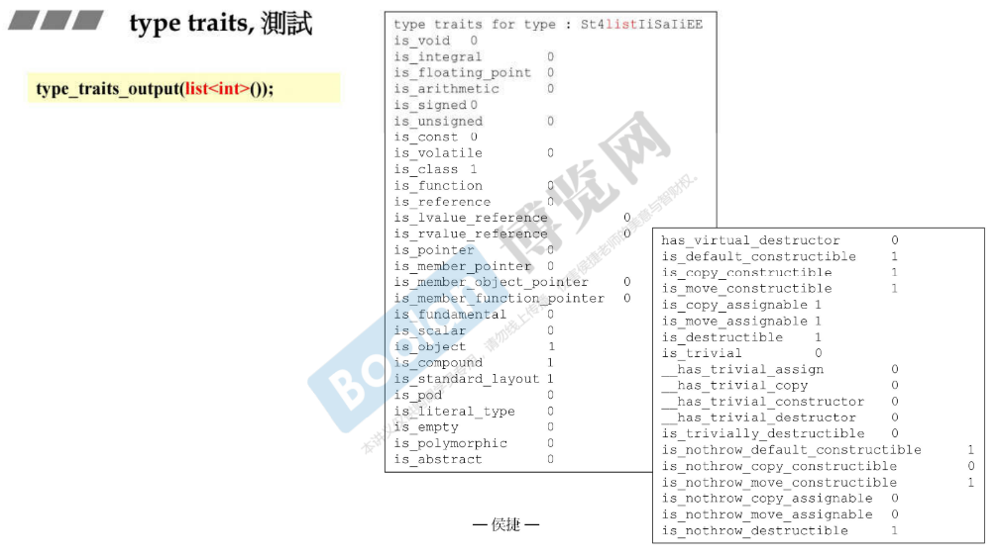

# type traits

G2.9

`struct __true_type { };`

`struct __flase_type { };`

默认版本，后面5个问题，默认构造、拷贝构造、拷贝赋值、析构等重要吗？默认回答是 false，重要。比如在一个容器里把一百万个元素搬到另外一个地方，应该做一百万次的拷贝构造，搬过去之后还要做一百万次的析构。

```cpp
//泛化
template <class type>
struct __type_traits {
    typedef __true_type		this_dummy_member_must_be_first;
    typedef __false_type	has_trivial_default_constructor;
    typedef __flase_type	has_trivial_copy_constructor;
    typedef __flase_type	has_trivial_assignment_operator;
    typedef __flase_type	has_trivial_destructor;
    typedef __flase_type	is_POD_type;	
    //Plain Old Data, C 里面的 structure 只有 data 没有 function
};
```

但是如果你写出一个类型，知道哪些不重要，就可以为这个泛化版本写一个特化版本。比如对于整数，这些都是不重要的。

```cpp
template<> struct __type_traits<int> {
    typedef __true_type		has_trivial_default_constructor;
    typedef __true_type		has_trivial_copy_constructor;
    typedef __true_type		has_trivial_assignment_operator;
    typedef __true_type		has_trivial_destructor;
    typedef __true_type		is_POD_type;
};
```

`__type_traits<Foo>::has_trivial_destructor`

```cpp
template<> struct __type_traits<double> {
    typedef __true_type		has_trivial_default_constructor;
    typedef __true_type		has_trivial_copy_constructor;
    typedef __true_type		has_trivial_assignment_operator;
    typedef __true_type		has_trivial_destructor;
    typedef __true_type		is_POD_type;
};
```

比如设计一个复数，有实部虚部。它的析构函数重不重要呢？根本没有必要为它写析构函数，它都快死掉了，清 0 没用。拷贝构造、拷贝赋值不用写，编译器给的默认版本已经够了。 只有带着指针的这种才需要特别考虑，或者是要关掉一个窗口、一个文件，释放一个锁等等。

这么写是为了算法服务，算法可能问你的某个东西重要吗？进而决策一个最有效的运算流程。








# type traits, 测试






一个类要不要写析构函数？只要它带有指针就一定要写，如果不带指针多半不用写。

string 这个析构函数是不是虚函数呢？一个 class 把自己当成 base class 的时候才需要写 virtual destructor，如果它根本不打算当成 base 父类，那就不必写 virtual destructor。字符串会当成父类吗？不会。












# type traits, 实现，is_void

现在都是对类型进行操作，而不是变量。

is_void() 收到一个类型后，先把一些令人困惑的东西拿掉，constant、volatile。

```cpp
// remove _const
template<typename _Tp>
struct remove_const
{ typedef _Tp 	type; };

template<typename _Tp>
struct remove_const<_Tp const>
{ typedef _Tp 	type; };

// remove_volatile
template<typename _Tp>
struct remove_volatile
{ typedef _Tp 	type; };

template<typename _Tp>
struct remove_volatile<_Tp volatile>
{ typedef _Tp 	type; };

// remove_cv
template<typename _Tp>
struct remove_cv
{
    typedef typename
        remove_const<typename remove_volatile<_Tp>::type>::type		type;
};

// add_const
template<typename _Tp>
struct add_const
{ typedef _Tp const 	type; };
```

```cpp
template<typename>
struct __is_void_helper
    : public false_type { };

template<>
struct __is_void_helper<void>
    : public true_type { };

// is_void
template<typename _Tp>
struct is_void
    : public __is_void_helper<typename remove_cv<_Tp>::type>::type
    { };
```


type traits, 实现 is_integral

```cpp
template<typename>
struct __is_integral_helper
    : public false_type { };

template<>
struct __is_integral_helper<bool>
    : public true_type { };
    
template<>
struct __is_integral_helper<char>
    : public true_type { };

template<>
struct __is_integral_helper<signed char>
    : public true_type { };

template<>
struct __is_integral_helper<unsigned char>
    : public true_type { };

...
    
template<>
struct __is_integral_helper<long long>
    : public true_type { };

template<>
struct __is_integral_helper<unsigned long long>
    : public true_type { };
```

```cpp
// is_integral
template<typename _Tp>
struct is_integral
    : public __is_integral_helper<typename remove_cv<_Tp>::type>::type
    { };
```


type traits, 实现 is_class, is_union, is_enum, is_pod

```cpp
// is_enum
template<typename _Tp>
struct is_enum
    : public integral_constant<bool, __is_enum(_Tp)>
    { };

// is_union
template<typename _Tp>
struct is_union
    : public integral_constant<bool, __is_union(_Tp)>
    { };

// is_class
template<typename _Tp>
struct is_class
    : public integral_constant<bool, __is_class(_Tp)>
    { };

// is_pod
// Could use is_standard_layout && is_trivial instead of the builtin.
template<typename _Tp>
struct is_pod
    : public integral_constant<bool, __is_pod(_Tp)>
    { };
```


type traits, 实现 is_move_assignable

```cpp
template<typename _Tp, bool = __is_referenceable<_Tp>::value>
struct __is_move_assignable_impl;

template<typename _Tp>
struct __is_move_assignable_impl<_Tp, false>
    : public false_type { };

template<typename _Tp>
struct __is_move_assignable_impl<_Tp, true>
    : public is_assignable<_Tp&, _Tp&&>
    { };

// is_move_assignable
template<typename _Tp>
struct is_move_assignable
    : public __is_move_assignable_impl<_Tp>
    { };
```

```cpp
// Utility to detect referenceable types ([defns.referenceable]).
template<typename _Tp>
struct __is_referenceable
    : public __or_<is_object<_Tp>, is_reference<_Tp>>::type
    { };

template<typename _Res, typename... _Args>
struct __is_referenceable<_Res(_Args...)>
    : public true_type
    { };

template<typename _Res, typename... _Args>
struct __is_referenceable<_Res(_Args......)>
    : public true_type
    { };
```

