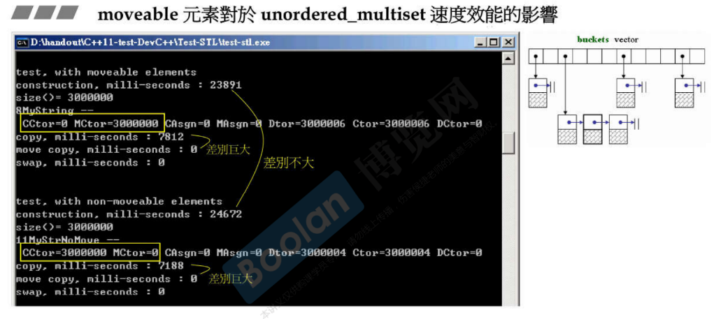

# cout

```cpp
//G2.9 iostream.h
class ostream : virtual public ios
{
public:
    ostream& operator<<(char c);
    ostream& operator<<(unsigned char c) { return (*this) << (char)c; }
    ostream& operator<<(signed char c) { return (*this) << (char)c; }
    ostream& operator<<(const char *s);
    ostream& operator<<(const unsigned char *s) { return (*this) << (const char*)s; }
    ostream& operator<<(const signed char *s) { return (*this) << (const char*)s; }
    ostream& operator<<(const void *p);
    ostream& operator<<(int n);
    ostream& operator<<(unsigned int n);
    ostream& operator<<(long n);
    ostream& operator<<(unsigned long n);
...
```

```cpp
class _IO_ostream_withassign : public ostream {
public:
    _IO_ostream_withassign& operator=(ostream&);
    _IO_ostream_withassign& operator=(_IO_ostream_withassign& rhs)
    { return operator=(static_cast<ostream&>(rhs)); }
};

extern _IO_ostream_withassign cout;
//extern, 文件之外的都能看到它
```

除了基本类型外，你要往 cout 丢的类型都要自己写一个操作符重载。


# moveable 元素对于容器速度效能的影响

放到容器里面的元素，元素的类型加不加 move 这个功能会对效率带来极大影响。


为什么是七百多万次构造。因为 vector 的特性，容量不够会进行 2 倍扩张，把原来的东西拷贝过去，就引发拷贝构造或拷贝赋值。





# 写一个 moveable class

静态数据需要 class 之外有定义。

这是个字符串，里面有个指针，_init_data 里面有 new 的动作去分配出要的这块。

深拷贝，不但要把指针拷贝过来，还要把指针指向的东西也拷贝过来。浅拷贝很危险。

move ctor 就像浅拷贝，但是它把原来指针打断了。


由于 move 后 _data = NULL, 所以 dtor 必须做检查 `if (_data)` 。


这样写一个 moveable class 之后，对于次数很多的拷贝动作，本来是真的有拷贝内容，现在这里调用的确实 move 版本，只是拷贝指针，这样当然是 move 版本快多了。

测试时候并没有指明哪个版本，这样负担会很大。了解写一个 moveable class 需要增加那几部分。


V1type(buf)，临时对象，右值，数据做成一个临时对象，放进容器后就不要了。编译器一看到这个，知道它将来一定不会再用了，就自动取 move 版本。


就是用 && 区分 move 版本和 copy 版本。


