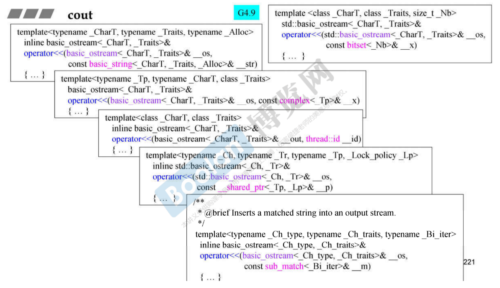

# cout

```cpp
//G2.9 iostream.h
class ostream : virtual public ios
{
public:
    ostream& operator<<(char c);
    ostream& operator<<(unsigned char c) { return (*this) << (char)c; }
    ostream& operator<<(signed char c) { return (*this) << (char)c; }
    ostream& operator<<(const char *s);
    ostream& operator<<(const unsigned char *s) { return (*this) << (const char*)s; }
    ostream& operator<<(const signed char *s) { return (*this) << (const char*)s; }
    ostream& operator<<(const void *p);
    ostream& operator<<(int n);
    ostream& operator<<(unsigned int n);
    ostream& operator<<(long n);
    ostream& operator<<(unsigned long n);
...
```

```cpp
class _IO_ostream_withassign : public ostream {
public:
    _IO_ostream_withassign& operator=(ostream&);
    _IO_ostream_withassign& operator=(_IO_ostream_withassign& rhs)
    { return operator=(static_cast<ostream&>(rhs)); }
};

extern _IO_ostream_withassign cout;
//extern, 文件之外的都能看到它
```

除了基本类型外，你要往 cout 丢的类型都要自己写一个操作符重载。

