# 适配器模式

封装器模式、Wrapper、Adapter

能使接口不兼容的对象能够相互合作。


## 问题

假如你在开发一款股票市场检测程序，它会从不同来源下载 XML 格式的股票数据，然后向用户呈现出美观的图表。开发过程中，你决定在程序中整合一个第三方智能分析函数库。但问题是分析函数库只兼容 JSON 格式的数据。

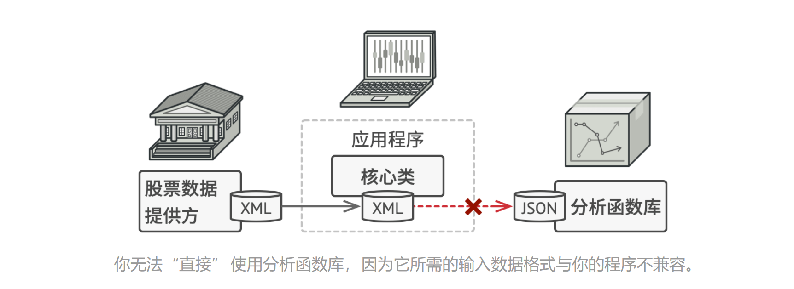

无法 “直接” 使用分析函数库，因为它所需的输入数据格式与你的程序不兼容。你可以修改程序库来支持 XML。但是，这可能需要修改部分依赖该程序库的现有代码。甚至你可能没有程序库的源代码，无法对其进行修改。


## 解决方案

你可以创建一个适配器。这是一个特殊的对象，能够转换对象接口，使其能与其他对象进行交互。适配器模式通过封装对象将复杂的转换过程隐藏于幕后。被封装的对象甚至察觉不到适配器的存在。例如，你可以使用一个将所有数据转换为英制单位（如英尺和英里）的适配器封装运行于米和千米单位制中的对象。

适配器不仅可以转换不同格式的数据，还有助于采用不同接口的对象之间的合作。它的运作方式如下：

1. 适配器实现与其中一个现有对象兼容的接口。
2. 现有对象可以使用该接口安全地调用适配器方法。
3. 适配器方法被调用后将以另一个对象兼容的格式和顺序将请求传递给该对象。

有时你甚至可以创建一个双向适配器来实现双向转换调用。

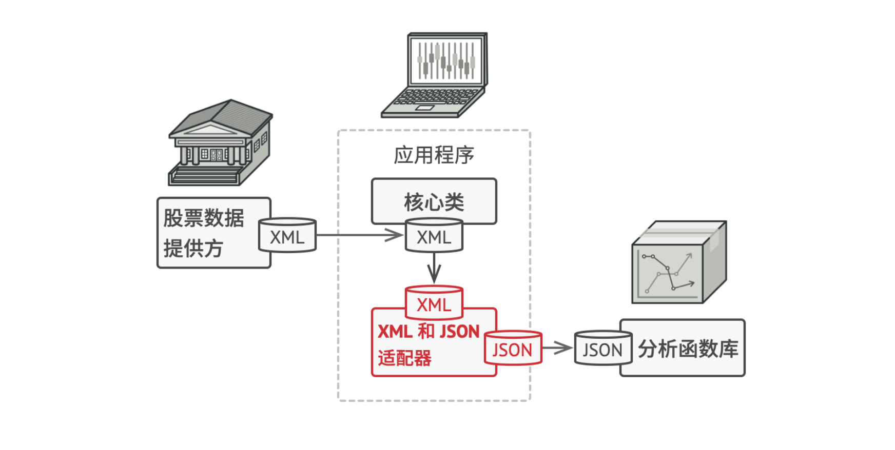

回到股票市场程序。为了解决数据格式不兼容的问题，你可以为分析函数库中的每个类创建将 XML 转换为 JSON 格式的适配器，然后让客户端仅通过这些适配器来与函数库进行交流。当某个适配器被调用时，它会将传入的 XML 数据转换为 JSON 结构，并将其传递给被封装分析对象的相应方法。

类比电源适配器。


## 结构


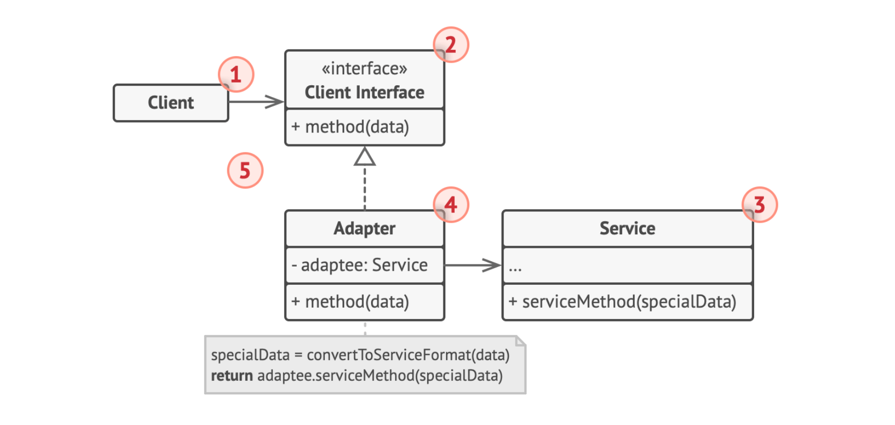

**对象适配器**

实现时使用了构成原则：适配器实现了其中一个对象的接口，并对另一个对象进行封装。所有流行的语言都可以实现适配器。

1. 客户端（Client）是包含当前程序业务逻辑的类。
2. 客户端接口（Client Interface）描述了其他类与客户端代码合作时必须遵循的协议。
3. 服务（Service）中有一些功能类（通常来自第三方或遗留系统）。客户端与其接口不兼容，因此无法直接调用其功能。
4. 适配器（Adapter）是一个可以同时与客户端和服务交互的类：它在实现客户端接口的同时封装了服务对象。适配器接受客户端通过适配器接口发起的调用，并将其转换为适用于被封装服务对象的调用。
5. 客户端代码只需通过接口与适配器交互即可，无需与具体的适配器类耦合。因此，你可以向程序中添加新类型的适配器而无需修改已有代码。这在服务类的接口被更改或替换时很有用：你无需修改客户端代码就可以创建新的适配器类。


**类适配器**

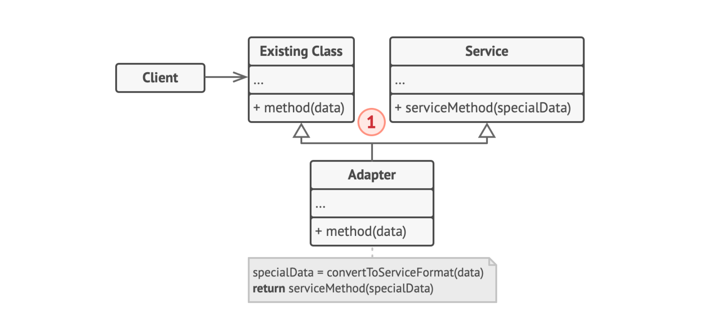

这一实现使用了继承机制：适配器同时继承两个对象的接口。注意这种方式仅能在支持多重继承的语言中实现，如 C++。

类适配器不需要封装任何对象，因为它同时继承了客户端和服务的行为。适配功能在重写的方法中完成。最后生成的适配器可替代已有的客户端类进行使用。


## 伪代码

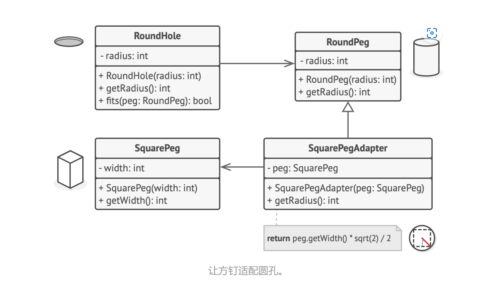

经典的 ”方钉和圆孔“ 问题。适配器假扮成一个圆钉 （RoundPeg），其半径等于方钉（SquarePeg）横截面对角线的一半（即能够容纳方钉最小外接圆的半径）。

```
// 假设你有两个接口相互兼容的类：圆孔（RoundHole）和圆钉（RoundPeg）
class RoundHole is
	constructor RoundHole(radius) {...}
	
	method getRadius() is
		// 返回孔的半径
		
	method fits(peg: RoundPeg) is
		return this.getRadius() >= peg.getRadius()
		
class RoundPeg is
	constructor RoundPeg(radius) {...}
	
	method getRadius() is
		// 返回钉子的半径
		
// 但还有一个不兼容的类：方钉（SquarePeg）
class SquarePag is
	constructor SquarePeg(width) {...}
	
	method getWidth() is
		// 返回方钉的宽度
		
// 适配器类让你能够将方钉放入圆孔中。它会对 RoundPeg 类进行扩展，
// 以接受适配器对象作为圆钉。
class SquarePegAdapter extends RoundPeg is
	// 在实际情况中，适配器中会包含一个 SquarePeg 类的实例。
	private field peg: SquarePeg
	
	constructor SquarePegAdapter(peg: SquarePeg) is
		this.peg = peg
		
	method getRadius() is
		// 适配器会假扮为一个圆钉，其半径刚好能与适配器实际封装的方钉搭配
		return peg.getWidth() * Math.sqrt(2) / 2
		
// 客户端代码的某个位置
hole = new RoundHole(5)
rpeg = new RoundPeg(5)
hole.fits(rpeg)  // true

small_sqpeg = new SquarePeg(5)
large_sqpeg = new SquarePeg(10)
hole.fits(small_sqpeg)  // 无法编译，类型不一致

small_sqpeg_adapter = new SquarePegAdapter(small_sqpeg)
large_sqpeg_adapter = new SquarePegAdapter(large_sqpeg)
hole.fits(small_sqpeg_adapter)  // true
hole.fits(large_sqpeg_adapter)  // false
```


## 适用场景

- 当你希望使用某个类，但是其接口与其他代码不兼容时，可以使用适配器类。

- 如果你需要复用这样一些类，它们处于同一个继承体系中，并且它们又有了额外的一些共同方法，但是这些共同的方法不是所有在这一继承体系中的子类所具有的共性。

  你可以扩展每个子类，将缺少的功能添加到新的子类中。但是，你必须在所有新子类中重复添加这些代码，这样会使代码变糟糕。

  将缺失功能添加到一个适配器类中是一种更优雅的解决方案。然后你可以将缺少功能的对象封装在适配器中，从而动态地获取所需功能。如要这一点正常运作，目标类必须要有通用接口，适配器的成员变量应当遵循该通用接口。这种方式同装饰模式非常相似。


## 实现方式

1. 确保至少有两个类的接口不兼容：
   - 一个无法修改（通常是第三方、遗留系统或者存在众多已有依赖的类）的功能性服务类。
   - 一个或多个将受益于使用服务类的客户端类
2. 声明客户端接口，描述客户端如何与服务交互。
3. 创建遵循客户端接口的适配器类。所有方法暂时为空。
4. 在适配器类中添加一个成员变量用于保存对于服务对象的引用。通常情况下会通过构造函数对该成员变量进行初始化，但有时在调用其方法时将该变量传递给适配器会更方便。
5. 依次实现适配器类客户端接口的所有方法。适配器会将实际工作委派给服务对象，自身只负责接口或数据格式的转换。
6. 客户端必须通过客户端接口使用适配器。这样，你就可以在不影响客户端代码的情况下修改或扩展适配器。


## 优缺点

- 单一职责原则你可以将接口或数据转换代码从程序主要业务逻辑中分离。
- 开闭原则。只要客户端代码通过客户端接口与适配器进行交互，你就能在不修改客户端代码的情况下在程序中添加新类型的适配器。
- 代码整体复杂度增加，因为你需要新增一系列接口和类。有时直接更改服务类使其与其他代码兼容会更简单。


## 与其他模式的关系

- 桥接模式通常会于开发前期进行设计，使你能够将程序的各个部分独立开来以便开发。另一方面，适配器模式通常在已有程序中使用，让相互不兼容的类能很好地合作。
- 适配器可以对已有对象的接口进行修改，装饰模式则能在不改变对象接口的前提下强化对象功能。此外，装饰还支持递归组合，适配器则无法实现。
- 适配器能为被封装对象提供不同的接口，代理模式能为对象提供相同的接口，装饰则能为对象提供加强的接口。
- 外观模式为现有对象定义了一个新接口，适配器则会试图运用已有的接口。适配器通常只封装一个对象，外观通常会作用于整个对象子系统上。
- 桥接、状态模式和策略模式（在某种程度上包括适配器）模式的接口非常相似。实际上，它们都基于组合模式，即将工作委派给其他对象，不过也各自解决了不同的问题。模式并不只是以特定方式组织代码的配方，你还可以使用它们来和其他开发者讨论模式所解决的问题。


# 桥接模式

Bridge

可将一个大类或一系列紧密相关的类拆分为抽象和实现两个独立的层次结构，从而能在开发时分别使用。


## 问题

抽象？实现？

假如你有一个几何 Shape 类，从它扩展出两个子类：Circle 和 Square。你希望对这样的类层次结构进行扩展以使其包含颜色，所以你打算创建名为 Red 和 Blue 的形状子类。但是，由于已有两个子类，所以总共需要创建四个类才能覆盖所有组合。所有组合类的数量将以几何级数增长。


## 解决方案

问题的根本原因使我们试图在两个独立的维度上扩展形状类。这在处理类继承时是很常见的问题。

桥接模式通过将继承改为组合的方式来解决这个问题。具体来说，就是抽取其中一个维度并使之成为独立的类层，这样就可以在初始类中引用这个新层次的对象，从而使得一个类不必拥有所有的状态和行为。

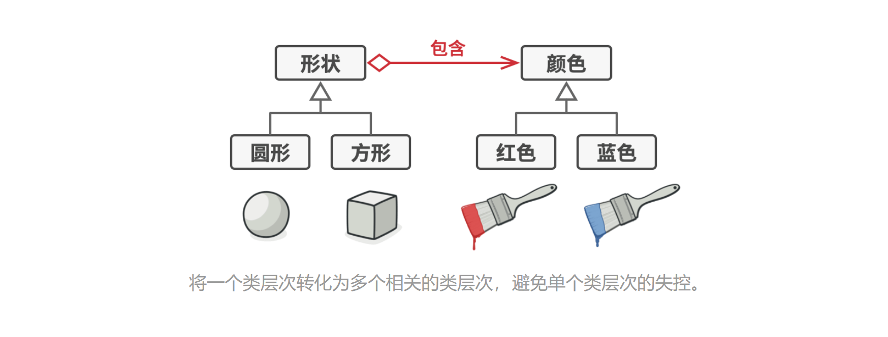

根据该方法，我们可以将颜色相关的代码抽取到拥有红色和蓝色两个子类的颜色类中，然后在形状类中添加一个指向某一颜色对象的引用成员变量。现在，形状类可以将所有与颜色相关的工作委派给连入的颜色对象。这样的引用就成为了形状和颜色之间的桥梁。此后，新增颜色将不再需要修改形状的类层次，反之亦然。

**抽象部分和实现部分**

抽象部分（也被称为接口）是一些实体的高阶控制层。该层自身不完成任何具体的工作，它需要将工作委派给实现部分层（也被称为平台）。注意，这里提到的内容与编程语言中的接口或抽象类无关。

在实际的程序中，抽象部分是图形用户界面（GUI），而实现部分则是底层操作系统代码（API），GUI 层调用 API 层来对用户的各种操作做出反应。一般来说，你可以在两个独立方向上扩展这种应用：

- 开发多个不同的 GUI（例如面向普通用户和管理员分别配置）
- 支持多个不同的 API（例如，能够在 Windows、Linux 和 macOS 上运行该程序）

在最糟糕的情况下，程序可能会是一团乱麻，其中包含数百种条件语句，连接着代码各处不同种类的 GUI 和各种 API。

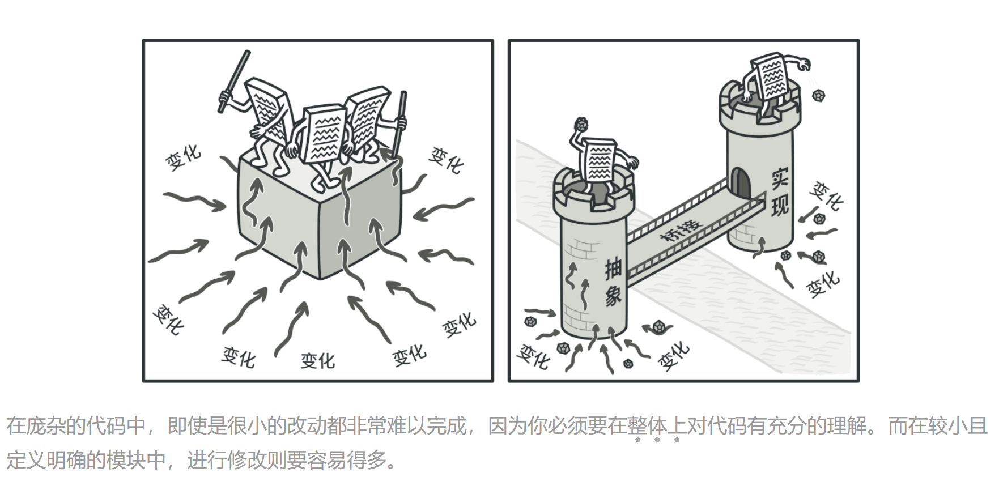

你可以将特定接口-平台的组合代码抽取到独立的类中，以在混乱中建立一些秩序。但是，你很快会发现这种类的数量很多。类层次将以指数形式增长，因为每添加一个新的 GUI 或支持一种新的 API 都需要创建更多的类。

让我们试着用桥接模式来解决这个问题。该模式建议将类拆分为两个类层次结构：

- 抽象部分：程序的 GUI 层
- 实现部分：操作系统的 API

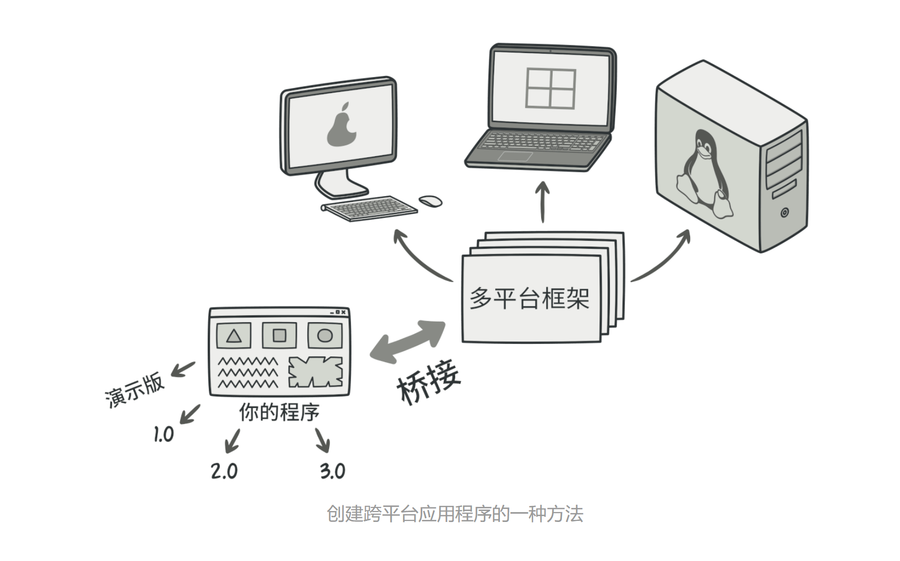

抽象对象控制程序的外观，并将真实工作委派给连入的实现对象。不同的实现只要遵循相同的接口就可以互换，使同一 GUI 可在 Windows 和 Linux 下运行。

最后的结果是：你无需改动与 API 相关的类就可以修改 GUI 类。此外如果想支持一个新的操作系统，只需在实现部分层次中创建一个子类即可。


## 结构

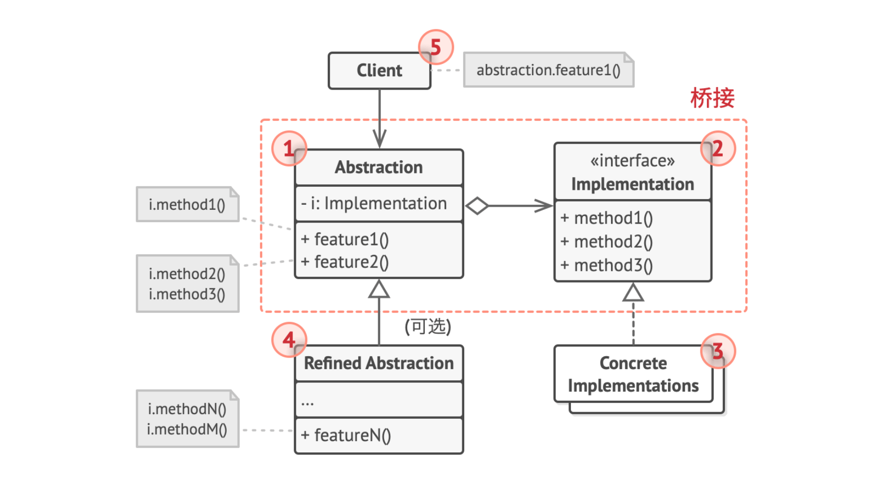

1. 抽象部分（Abstraction）提供高层控制逻辑，依赖于完成底层实际工作的实现对象。

2. 实现部分（Implementation）为所有具体实现声明通用接口。抽象部分仅能通过在这里声明的方法与实现对象交互。

   抽象部分可以列出和实现部分一样的方法，但是抽象部分通常声明一些复杂行为，这些行为依赖于多种由实现部分声明的原语操作。

3. 具体实现（Concrete Implementations）中包括特定于平台的代码。

4. 精确抽象（Refined Abstraction）提供控制逻辑的变体。与其父类一样，它们通过通用实现接口与不同的实现进行交互。

5. 通常情况下，客户端（Client）仅关心如何与抽象部分合作。但是，客户端需要将抽象对象与一个实现对象连接起来。


## 伪代码

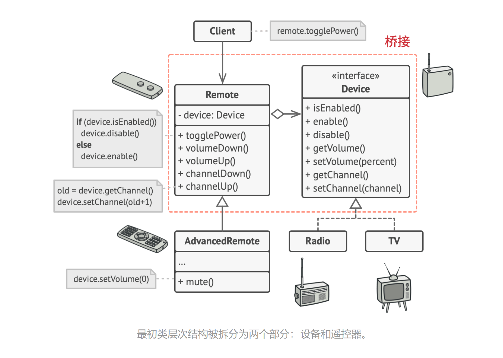

实例演示了桥接模式如何拆分程序中同时管理设备及其遥控器的庞杂代码。设备 Device 类作为实现部分，而遥控器 Remote 类则作为抽象部分。

遥控器基类声明了一个指向设备对象的引用成员变量。所有遥控器通过通用设备接口与设备进行交互，使得同一个遥控器可以支持不同类型的设备。

你可以开发独立于设备类的遥控器类，只需新建一个遥控器子类即可。例如，基础遥控器可能只有两个按钮，但你可在其基础上扩展新功能，比如额外的一节电池或一块触摸屏。

客户端代码通过遥控器构造函数将特定种类的遥控器和设备对象连接起来。

```
// 抽象部分定义了两个类层次结构中控制部分的接口。它管理着一个指向
// 实现部分层次结构中对象的引用，并会将所有真实工作委派给该对象。
class RemoteControl is
	protected field device: Device
	constructor RemoteControl(device: Device) is
		this.device = device
	method togglePower() is
		if (device.isEnabled()) then
			device.disable()
		else
			device.enable()
	method volumeDown() is
		device.setVolume(device.getVolume() - 10)
	method volumeUp() is
		device.setVolume(device.getvolume() + 10)
	method channelDown() is
		device.setChannel(device.getChannel - 1)
	method channelUp() is
		device.setChannel(device.getChannel + 1)
	
// 你可以独立于设备类的方式从抽象层中扩展类
class AdvancedRemoteControl extends RemoteControl is
	method mute() is
		device.setVolume(0)
		
// 实现部分接口声明了在所有具体实现类中通用的方法。它不需要与抽象接口相
// 匹配。实际上，这两个类可以完全不一样。通常实现接口只提供原语操作，而
// 抽象接口则会基于这些操作定义较高层次的操作。
interface Device is
	method isEnabled()
	method enable()
	method disable()
	method getVolume()
	method setVolume(percent)
	method getChannel()
	method setChannel(channel)
	
// 所有设备都遵循相同的接口
class Tv implements Device is
	// ...
	
class Radio implements Device is
	// ...

// 客户端代码中的某个位置
tv = new Tv()
remote = new RemoteControl(tv)
remote.togglePower()

radio = new Radio()
remote = new AdvancedRemoteControl(radio)
```


## 适用场景

- 如果你想要拆分或重组一个具有多重功能的庞杂类（例如能与多个数据服务器进行交互的类），可以使用桥接模式。

  类的代码行数越多，弄清其运作方式就越困难，对其进行修改所花费的时间就越长。一个功能上的变化可能需要在整个类范围内进行修改，而且常常会产生错误，甚至还会有一些严重的副作用。

  桥接模式可以将庞杂类拆分为几个类层次结构。此后，你可以修改任意一个类层次结构而不会影响到其他类层次结构。这种方法可以简化代码的维护工作，并将写乞丐已有代码的风险降到最低。

- 如果你希望在几个独立维度上扩展一个类，可以使用该模式。

  桥接模式将每个维度抽取为独立的类层次。初始类将相关工作委派给属于对应类层次的对象，无需自己完成所有工作。

- 如果你需要在运行时切换不同的实现方法，可使用桥接模式。

  当然并不是说一定要实现这一点，桥接模式可替换抽象部分中的实现对象，具体操作就和给成员变量赋新值一样简单。

  最后一点是很多人混淆桥接模式和策略模式的主要原因。记住，设计模式并不仅是一种对类进行组织的方式，它还能用于沟通意图和解决问题。


## 实现方式

1. 明确类中独立的维度。独立的概念可能是：抽象 / 平台，域 / 基础设施，前端 / 后端或接口 / 实现。
2. 了解客户端的业务需求，并在抽象基类中定义它们。
3. 确定在所有平台上都可执行的业务。并在通用实现接口中声明抽象部分所需的业务。
4. 为你域内的所有平台创建实现类，但需确保它们遵循实现部分的接口。
5. 在抽象类中添加指向实现类型的引用成员变量。抽象部分会将大部分工作委派给该成员变量所指向的实现对象。
6. 如果你的高层逻辑有多个变体，则可通过扩展抽象基类为每个变体创建一个精确抽象。
7. 客户端代码必须将实现对象传递给抽象部分的构造函数才能使其能够相互关联。此后，客户端只需与抽象对象进行交互，无需和实现对象打交道。


## 优缺点

- 你可以创建与平台无关的类和程序。
- 客户端代码仅与高层抽象部分进行互动，不会接触到平台的详细信息。
- 开闭原则。你可以新增抽象部分和实现部分，且它们之间不会相互影响。
- 单一职责原则。抽象部分专注于处理高层逻辑，实现部分处理平台细节。
- 对高内聚的类使用该模式可能会让代码更加复杂。


## 与其他模式的关系

- 桥接模式通常会于开发前期进行设计，使你能够将程序的各个部分独立开来以便开发。另一方面，适配器模式通常在已有程序中使用，让相互不兼容的类能很好地合作。

- 桥接、状态模式和策略模式（在某种程度上包括适配器）模式的接口非常相似。实际上，它们都基于组合模式，即将工作委派给其他对象，不过也各自解决了不同的问题。模式并不只是以特定方式组织代码的配方，你还可以使用它们来和其他开发者讨论模式所解决的问题。
- ？你可以将抽象工厂模式和桥接搭配使用。如果由桥接定义的抽象只能与特定实现合作，这一模式搭配就非常有用。在这种情况下，抽象工厂可以对这些关系进行封装，并且对客户端代码隐藏其复杂性。
- ？你可以结合使用生成器和桥接模式：主管类负责抽象工作，各种不同的生成器负责实现工作。


# 组合模式

对象树、Object Tree、Composite

可以使用它将对象组合成树状结构，并且能像使用独立对象一样使用它们。


## 问题

如果应用的核心模型能用树状结构表示，在应用中使用组合模式才有价值。

例如，你有两类对象：产品和盒子。一个盒子中可以包含多个产品或者几个较小的盒子，以此类推。

假设你希望在这些类的基础上开发一个定购系统。订单中可以包含无包装的简单产品，也可以包含装满产品的盒子……以及其他盒子。此时你会如何计算每张订单的总价格呢？

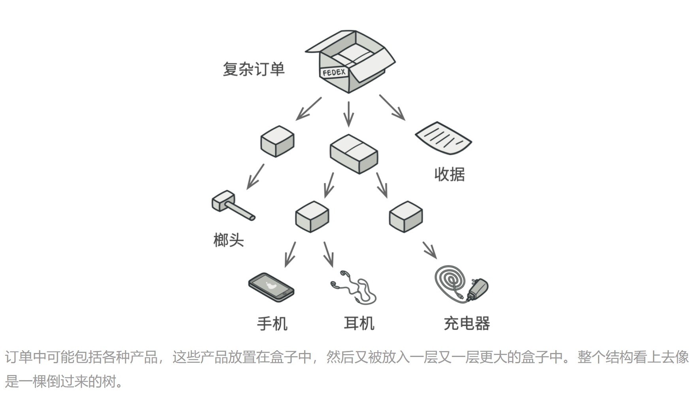

你可以尝试直接计算：打开所有盒子，找到每件产品，然后计算总价。这在真实世界中或许可行，但在程序中，你并不能简单地使用循环语句来完成该工作。你必须事先知道所有产品和盒子的类别，所有盒子的嵌套层数以及其他繁杂的细节信息。因此，直接计算极不方便，甚至完全不可行。


## 解决方案

组合模式建议使用一个通用接口来与产品和盒子进行交互，并且在该接口中声明一个计算总结的方法。

那方法该如何设计呢？对于一个产品，该方法直接返回其价格；对于一个盒子，该方法便利和自重的所有项目，询问每个项目的价格，然后返回该盒子的总价格。如果其中某个项目是小一号的盒子，那么当前盒子也会遍历其中的所有项目，以此类推，直到计算出所有内部组成部分的价格。你甚至可以在盒子的最终价格中增加额外费用，作为该盒子的包装费用。

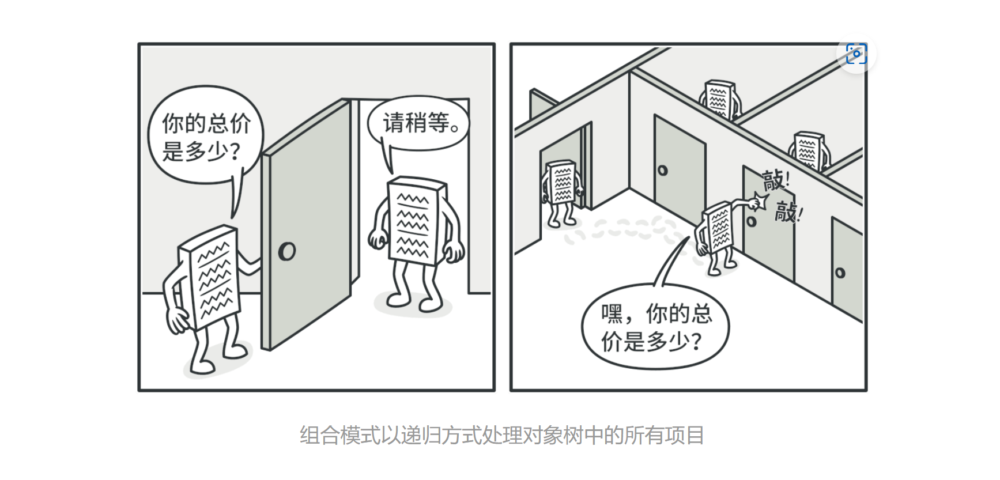

该方式的最大优点在于你无需了解构成树状结构的对象的具体类。也无需了解对象是简单的产品还是复杂的盒子。你只需要调用通用接口以相同的方式对其进行处理即可。当你调用该方法后，对象会将请求沿着树结构传递下去。


## 结构

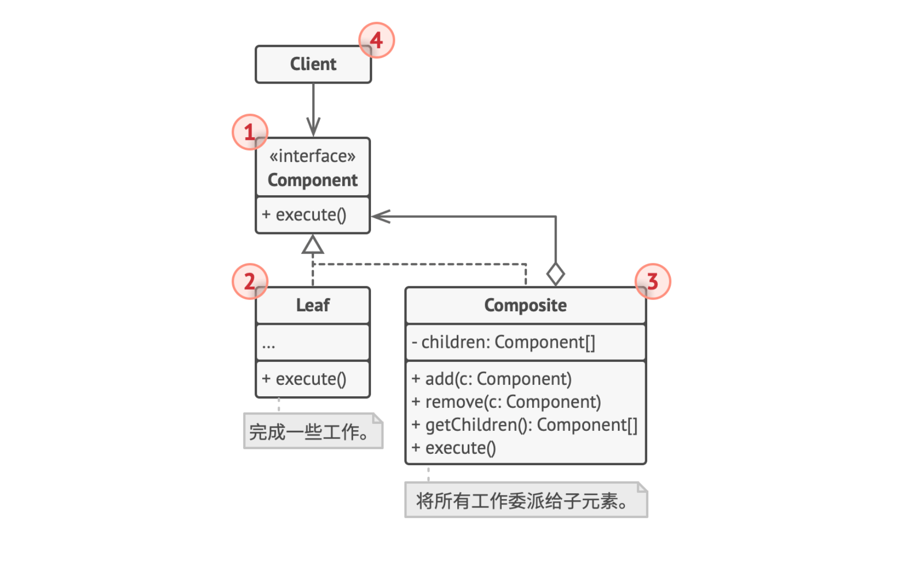

1. 组件（Component）接口描述了简单项目和复杂项目所共有的操作。

2. 叶节点（Leaf）是树的基本结构，它不包含子项目。

   一般情况下，叶节点最终会完成大部分的实际工作，因为它们无法将工作指派给其他部分。

3. 容器（Container），又名组合（Composite），是包含叶节点或其他容器等子项目的单位。容器不知道其子项目所属的具体类，它只通过通用的组件接口与其子项目交互。

   容器接收到请求后会将工作分配给自己的子项目，处理中间结果，然后将最终结果返回给客户端。

4. 客户端（Client）通过组件接口与所有项目交互。因此，客户端能以相同方式与树状结构中的简单或复杂项目交互。

   

## 伪代码

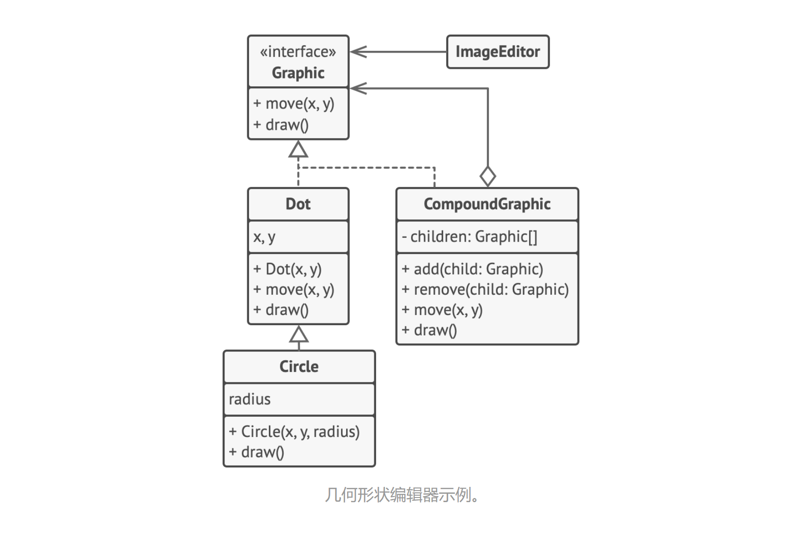

组合图形 CompoundGraphic 是一个容器，它可以由多个包括容器在内的子图形构成。组合图形与简单图形拥有相同的方法。但是，组合图形自身并不完成具体工作，而是将请求递归地传递给自己的子项目，然后汇总结果。

通过所有图形类所共有的接口，客户端代码可以与所有图形互动。因此，客户端不知道其交互的是简单图形还是组合图形。客户端可以与非常复杂的对象结构进行交互，而无需与组成该结构的实体类紧密耦合。

```
// 组件接口会声明组合中简单和复杂对象的通用操作
interface Graphic is
	method move(x, y)
	method draw()
	
// 叶节点类代表组合的终端对象。叶节点对象不能包含任何子对象。叶节点对象
// 通常会完成实际的工作，组合对象则仅会将工作委派给自己的子部件。
class Dot implements Graphic is
	field x, y
	
	constructor Dot(x, y) {...}
	
	method move(x, y) is
		this.x += x, this.y += y
		
	method draw() is
		// 在坐标位置（X,Y)处绘制一个点
		
// 所有组件类都可以扩展其他组件
class Circle extends Dot is
	field radius
	
	constructor Circle(x, y, radius) {...}
	
	method draw() is
		// 在坐标位置（X,Y) 处绘制一个半径为 R 的圆
		
// 组合类表示可能包含子项目的复杂组件。组合对象通常会将实际工作委派给子项
// 目,然后汇总结果。
class CompoundGraphic implements Graphic is
	field children: array of Graphic
	
	// 组合对象可在其项目列表中添加或移除其他组件，简单复杂皆可
	method.add(child: Graphic) is
		// 在子项目数组中添加一个子项目
		
	method remove(child: Graphic) is
		// 从子项目数组中移除一个子项目
		
	method move(x, y) is
		foreach (child in chirldren) do
			child.move(x, y)
			
	// 组合会以特定的方式执行其主要逻辑。它会递归遍历所有子项目，并收集和
	// 汇总其结果。由于组合的子项目也会将调用传递给自己的子项目，以此类推，
	// 最后组合将会完成整个对象树的遍历工作。
	method draw() is
		// 1. 对于每个子部件：
		//		- 绘制该部件
		//		- 更新边框坐标
		// 2. 根据边框坐标绘制一个虚线长方形
		
// 客户端代码会通过基础接口与所有组件进行交互。这样一来，客户端代码便可同
// 时支持简单叶节点组件和复杂组件。
class ImageEditor is
	field all: CompundGraphic
	
	method load() is
		all = new CompoundGraphic()
		all.add(new Dot(1, 2))
		all.add(new Circle(5, 3, 10))
		// ...
		
	// 将所需组件组合为复杂的组合组件
	method groupSelected(components: array of Graphic) is
		group = new CompoundGraphic()
		foreach (component in components) do
			group.add(component)
			all.remove(component)
		all.add(group)
		// 所有组件都将被绘制
		all.draw()
```


## 适用场景

- 如果你需要实现树状对象结构，可以使用组合模式。

  组合模式为你提供了两种共享公共接口的基本元素类型：简单叶节点和复杂容器。容器中可以包含叶节点和其他容器。这使得你可以构建树状嵌套递归对象结构。

- 如果你希望客户端代码以相同方式处理简单和复杂元素，可以使用该模式。

  组合模式中定义的所有元素共用同一个接口。在这一接口的帮助下，客户端不必在意其所使用的对象的具体类。


## 实现方式

1. 确保应用的核心模型能够以树状结构表示。尝试将其分解为简单元素和容器。记住，容器必须能够同时包含简单元素和其他容器。

2. 声明组件接口及其一系列方法，这些方法对简单和复杂元素都有意义。

3. 创建一个叶节点类表示简单元素。程序中可以有多个不同的叶节点类。

4. 创建一个容器类表示复杂元素。在该类中，创建一个数组成员变量来存储对于其子元素的引用。该数组必须能够同时保存叶节点和容器，因此请确保将其声明为组合接口类型。

   实现组件接口方法时，记住容器应该将大部分工作交给其子元素来完成。

5. 最后，在容器中定义添加和删除子元素的方法。

   记住，这些操作可在组件接口中声明。这将会违反接口隔离原则，因为叶节点类中的这些方法为空。但是，这可以让客户端无差别地访问所有元素，即使是组成树状结构的元素。


## 优缺点

- 你可以利用多态和递归机制更方便地使用复杂树结构。
- 开闭原则。无需更改现有代码，你就可以在应用中添加新元素，使其成为对象树的一部分。
- 对于功能差异较大的类，提供公共接口或许会有困难。在特定情况下，你需要过度一般化组件接口，使其变得令人难以理解。


## 与其他模式的关系

- 桥接、状态模式和策略模式（在某种程度上包括适配器）模式的接口非常相似。实际上，它们都基于组合模式，即将工作委派给其他对象，不过也各自解决了不同的问题。模式并不只是以特定方式组织代码的配方，你还可以使用它们来和其他开发者讨论模式所解决的问题。

- 你可以在创建复杂组合树时使用生成器模式，因为这可使其构造步骤以递归的方式运行。

- 责任链模式通常和组合模式结合使用。在这种情况下，叶组件接收到请求后，可以将请求沿包含全体父组件的链一直传递至对象树的底部。

- 你可以使用迭代器模式来遍历组合树。

- 你可以使用访问者模式对整个组合树执行操作。

- 你可以使用享元模式实现组合树的共享叶节点以节省内存。

- 组合和装饰模式的结构图很相似，因为两者都依赖递归组合来组织无限数量的对象。

  装饰类似于组合，但其只有一个子组件。此外还有一个明显不同：装饰为被封装对象添加了额外的职责，组合仅对其子节点的结果进行了求和。

  但是，模式也可以相互合作：你可以使用装饰来扩展组合树中特定对象的行为。

- 大量使用组合和装饰的设计通常可从对于原型模式的使用中获益。你可以通过该模式来复制复杂结构，而非从零开始重新构造。


# 装饰模式

装饰者模式、Wrapper、Decorator

允许你通过将对象放入包含行为的特殊封装对象中来为原对象绑定新的行为。


## 问题

假设你在开发一个提供通知功能的库，其他程序可使用它向用户发送关于重要事件的通知。

库的最初版本基于 Notifier 类，其中只有很少的几个成员变量，一个构造函数和一个 send 方法。该方法可以接受来自客户端的消息参数，并将该消息发送给一系列的邮箱，邮箱列表则是通过构造函数传递给通知器的。作为客户端的第三方程序仅会创建和配置通知器对象一次，然后在有重要事件发生时对其进行调用。

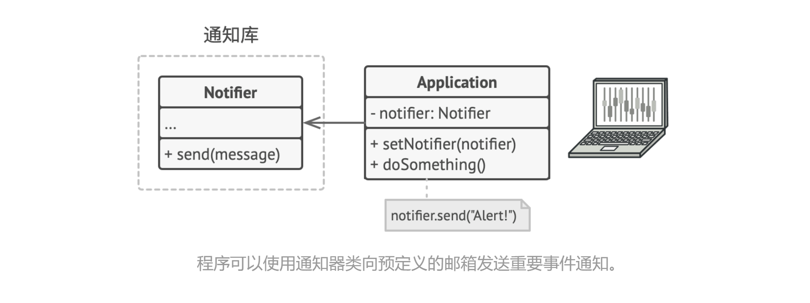

此后某个时刻，你会发现库的用户希望使用除邮件通知之外的功能。许多用户会希望接受关于紧急事件的手机短信，还有些用户希望在微信上接受消息，而公司用户则希望在 QQ 上接受消息。

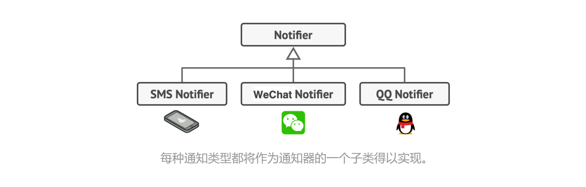

这有什么难的呢？首先扩展 Notifier 类，然后在新的子类中加入额外的通知方法。现在客户端要对所需通知形式的对应类进行初始化，然后使用该类发送后续所有的通知消息。

但是很快有人会问：“为什么不同时使用多钟通知形式呢？如果房子着火了，你大概会是想在所有渠道中都收到相同的消息吧。”

你可以尝试创建一个特殊子类来将多种通知方法组合在一起已解决该问题。但这种方式会是的代码量迅速膨胀，不仅仅是程序库代码，客户端代码也会如此。

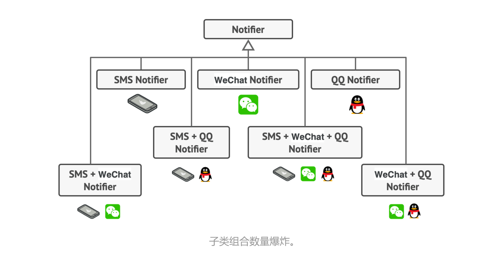

你必须找到其他方法来规划通知类的结构，否则它们的数量会在不经意之间打破吉尼斯纪录。


## 解决方案

当你需要更改一个对象的行为时，第一个想法就是扩展他所属的类。但是，你不能忽视继承可能引发的几个严重问题。

- 继承是静态的。你无法在运行时更改已有对象的行为，只能使用由不同子类创建的对象来替代当前的整个对象。
- 子类只能有一个父类。大部分编程语言不允许一个类同时继承多个类的行为。

其中一种方法是用聚合或组合，而不是继承。两者的工作方式几乎一模一样：一个对象包含指向另一个对象的引用，并将部分工作委派给引用对象；继承中的对象则继承了父类的行为，它们自己能够完成这些工作。

你可以使用这个新方法来轻松替换各种连接的对象，从而能在运行时改变容器的行为。一个对象可以使用多个类的行为，包含多个指向其他对象的引用，并将各种工作委派给引用对象。聚合、组合是许多设计模式背后的关键原则。

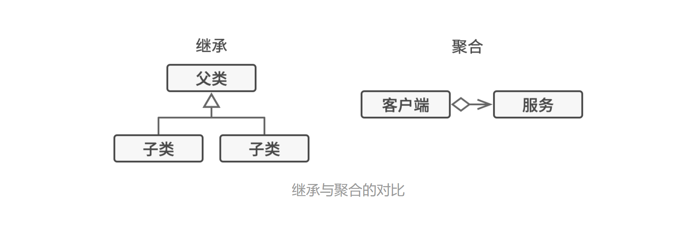

封装器是装饰模式的别称，这个称谓明确表达了该模式的思想。封装器是一个能与其他目标对象连接的对象。封装器包含与目标对象相同的一系列方法，它会将所有接收到的请求委派给目标对象。但是，封装器可以在将请求委派给目标前后对其进行处理，所以可能会改变最终结果。

那么什么时候一个简单的封装器可以被称为是真正的装饰呢？正如之前提到的，封装器实现了 与其封装对象相同的接口。因此从客户端的角度来看，这些对象是完全一样的。封装器中的引用成员变量可以是遵循相同接口的任意对象。这使得你可以将一个对象放入多个封装器中，并在对象中添加所有这些封装器的组合行为。

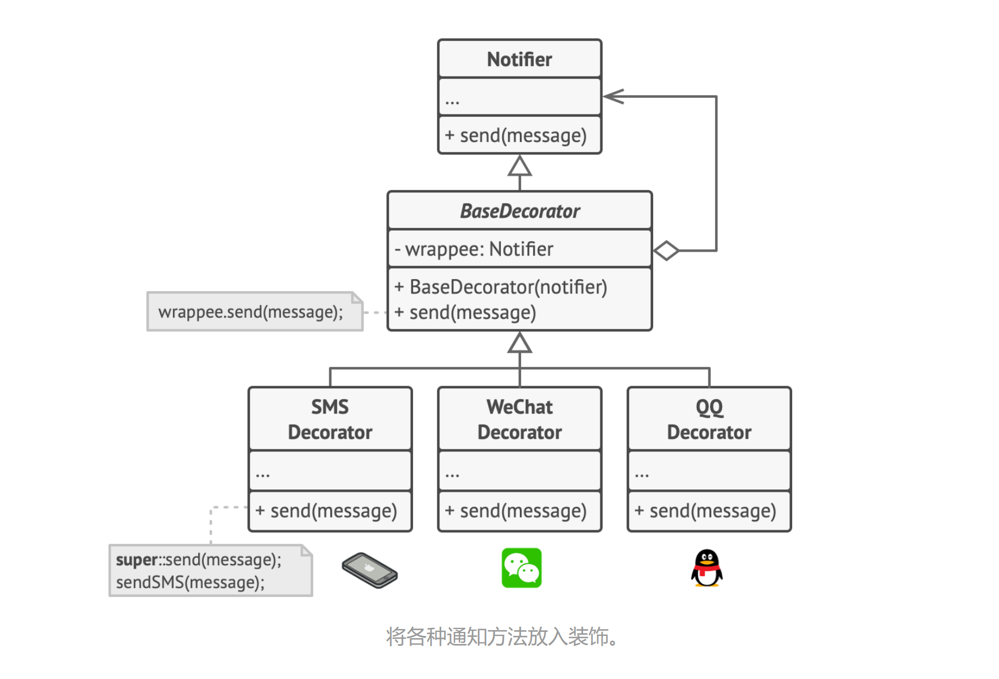

客户端代码必须将基础通知器放入一系列自己所需的装饰中。因此最后的对象将形成一个栈结构。

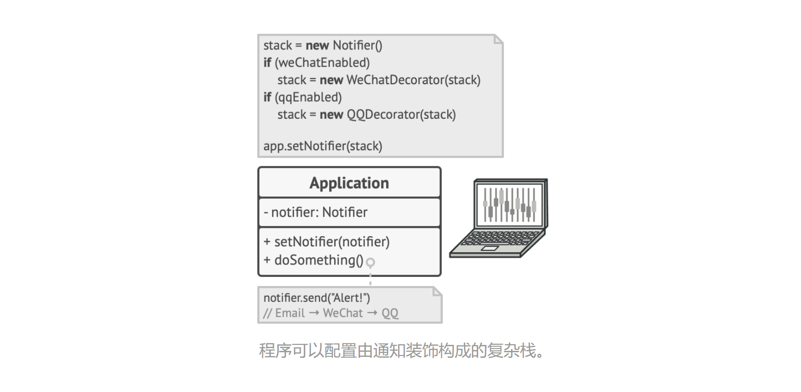

实际与客户端进行交互的对象将是最后一个进入栈中的装饰对象。由于所有的装饰都实现了与通知基类相同的接口，客户端的其他代码并不在意自己到底是与存粹的通知器对象，还是与装饰后的通知器对象进行交互。

我们可以使用相同方法来完成其他行为（例如设置消息格式或者创建接收人列表）。只要所有装饰都遵循相同的接口，客户端就可以使用任意自定义的装饰来装饰对象。

穿衣服是使用装饰的一个例子。觉得冷时，可以穿一件毛衣。如果穿毛衣还觉得冷，可以再套上一件夹克。如果下雨，还可以再穿一件雨衣。所有这些衣物都扩展了你的基本行为，但它们并不是你的一部分，如果你不再需要某件衣物，可以方便地随时脱掉。


## 结构

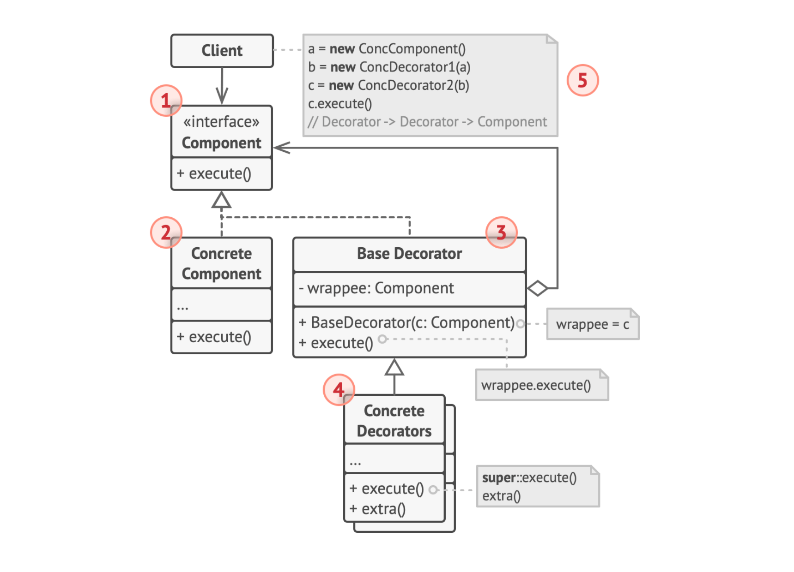

1. 组件（Component）声明封装器和被封装器对象的公用接口。
2. 具体组件（Concrete Component）类是被封装对象所属的类。它定义了基础行为，但装饰类可以改变这些行为。
3. 基础装饰（Base Decorator）类拥有一个指向被装饰对象的引用成员变量。该变量的类型应当被声明为通用组件接口，这样它就可以引用具体的组件和装饰。装饰基类会将所有操作委派给被封装的对象。
4. 具体装饰类（Concrete Decorators）定义了可动态添加到组件的额外行为。具体装饰类会重写装饰基类的方法，并在调用父类方法之前或之后进行额外的行为。
5. 客户端（Client）可以使用多层装饰来封装组件，只要它能使用通用接口与所有对象互动即可。


## 伪代码


在本例中，装饰模式能够对敏感数据进行压缩和加密，从而将数据从使用数据的代码中独立出来。

程序使用一对装饰来封装数据源对象。这两个封装器都改变了从磁盘读写数据的方式：

- 当数据即将被写入磁盘前，装饰对数据进行加密和压缩。在原始类对改变毫无察觉的情况下，将加密后的受保护数据写入文件。
- 当数据刚从磁盘读出后，同样通过装饰对数据进行解压和解密。

装饰和数据源实现同一接口，从而能在客户端代码中相互替换。

```
// 装饰可以改变组件接口所定义的操作
interface DataSource is
	method writeData(data)
	method readData():data


// 具体组件提供操作的默认实现。这些类在程序中可能会有几个变体
class FileDataSource implements DataSource is
	constructor FileDataSource(filename) {...}
	
	method writeData(data) is
	// 将数据写入文件
	
	method readData():data is
	// 从文件读取数据


// 装饰基类和其他组件遵循相同的接口。该类的主要任务是定义所有具体装饰的封
// 装接口。封装的默认实现代码中可能会包含一个保存被封装成组件的成员变量，并
// 且负责对其进行初始化。
class DataSourceDecorator implements DataSource is
	protected field wrappee: DataSource
	
	constructor DataSourceDecorator(source: DataSource)
		wrappee = source
		
	// 装饰基类会直接将所有工作分派给封装组件。具体装饰则可以新增一些
	// 额外的行为。
	method writeData(data) is
		wrappee.writeData(data)
		
	// 具体装饰可调用其父类的操作实现，而不是直接调用被封装对象。这种方式
	// 可简化装饰类的扩展工作。
	method readData():data is
		return wrappee.readData()


// 具体装饰必须在被封装对象上调用方法，不过也可以自行在结果中添加一些内容。
// 装饰必须在调用封装对象之前或之后执行额外的行为。
class EncryptionDecorator extends DataSourceDecorator is
	method writeData(data) is
		// 1. 对传递数据进行加密
		// 2. 将加密后数据传递给被封装对象 writeData 方法
	
	method readData():data is
		// 1. 通过被封装对象的 readData 方法获取数据
		// 2. 如果数据被加密就尝试解密
		// 3. 返回结果


// 你可以将对象封装在多层装饰中
class CompressionDecorator extends DataSourceDecorator is
	method writeData(data) is
		// 1. 压缩传递数据。
		// 2. 将压缩后数据传递给被封装对象 writeData 方法
		
	method readData(): data is
		// 1. 通过被封装对象的 readData 方法获取数据
		// 2. 如果数据被压缩就尝试解压
		// 3. 返回结果


// Option 1：装饰组件的简单示例
class Applicaiton is
	method dumbUsageExample() is
		source = new FileDataSource("somefile.dat")
		source.writeData(salaryRecords)
		// 已将明码数据写入文件
		
		source = new CompressionDecorator(source)
		source.writeData(salaryRecords)
		// 已将压缩数据写入目标文件
		
		source = new EncryptionDecorator(source)
		// 源变量中现在包含：
		// Encryption > Compression > FileDataSource
		source.writeData(salaryRecords)
		// 已将压缩且加密的数据写入目标文件
		

// Option 2：客户端使用外部数据源。SalaryManager 对象并不关心数据
// 如何存储。它们会与提前配置好的数据源进行交互，数据源则是通过程序配
// 置器获取的。
class SalaryManager is
	field source: DataSource
	
	constructor SalaryManager(source: DataSource) {...}
	
	method load() is
		return source.readData()
		
	method save() is
		source.writeData(salaryRecords)
	// ...其他有用的方法...
	
	
// 程序可在运行时根据配置或环境组装不同的装饰堆栈
class ApplicationConfigurator is
	method configurationExample() is
		source = new FileDataSource("salary.dat")
		if (enableEncryption)
			source = new EncryptionDecorator(source)
		if (enableCompression)
			source = new CompressionDecorator(source)
			
		logger = new SalaryManager(source)
		salary = logger.load()
	// ...
```


## 适用场景

- 如果你希望在无需修改代码的情况下即可使用对象，且希望在运行时为对象新增额外的行为，可以使用装饰模式。

  装饰能将业务逻辑组织为层次结构，你可为各层创建一个装饰，在运行时将各种不同逻辑组合成对象。由于这些对象都遵循通用接口，客户端代码能以相同的方式使用这些对象。

- 如果使用继承来扩展对象行为的方案难以实现或者根本不可行，你可以使用该模式。

  许多编程语言使用 final 关键字来限制对某个类进一步扩展。复用最终类已有行为的唯一方法是使用装饰模式：用封装器对其进行封装。


## 实现方式

1. 确保业务逻辑可用一个基本组件及多个额外可选层次表示。
2. 找出基本组件和可选层次的通用方法。创建一个组件接口并在其中声明这些方法。
3. 创建一个具体组件类，并定义其基础行为。
4. 创建装饰基类，使用一个成员变量存储指向被封装对象的引用。该成员变量必须被声明为组件接口类型，从而能在运行时连接具体组件和装饰。装饰基类必须将所有工作委派给被封装的对象。
5. 确保所有类实现组件接口。
6. 将装饰基类扩展为具体装饰。具体装饰必须在调用父类方法（总是委派给被封装对象）之前或之后执行自身的行为。
7. 客户端代码负责创建装饰并将其组合成客户端所需的形式。


## 优缺点

- 你无需创建新子类即可扩展对象的行为。
- 你可以在运行时添加或删除对象的功能。
- 你可以用多个装饰封装对象来组合几种行为。
- 单一职责原则。你可以将实现了许多不同行为的一个大类拆分为多个较小的类。
- 在封装器栈中删除特定封装器比较困难。
- 实现行为不受装饰栈顺序影响的装饰比较困难。
- 各层的初始化配置代码看上去可能会很糟糕。


## 与其他模式的关系

- 适配器可以对已有对象的进口进行修改，装饰模式则能在不改变对象接口的前提下强化对象功能。此外，装饰还支持递归组合，适配器则无法实现。

- 适配器能为被封装对象提供不同的接口，代理模式能为对象提供相同的接口，装饰则能为对象提供加强的接口。

- 责任链模式和装饰模式的类结构非常相似。两者都依赖递归组合将需要执行的操作传递给一系列对象。但是，两者有几点重要的不同之处。

  责任链的管理着可以相互独立地执行一切操作，还可以随时停止传递请求。另一个方面，各种装饰可以在遵循基本接口的情况下扩展对象的行为。此外，装饰无法中断请求的传递。

- 组合模式和装饰的结构图很相似，因为两者都依赖递归组合来组织无限数量的对象。

  装饰类似于组合，但其只有一个子组件。此外还有一个明显不同：装饰为被封装对象添加了额外的职责，组合仅对其子节点的结果进行了求和。

  但是，模式也可以相互合作：你可以使用装饰来扩展组合树中特定对象的行为。

- 大量使用组合和装饰的设计通常可从对于原型模式的使用中获益。你可以通过该模式来复制复杂结构，而非从零开始重新构造。

- 装饰可让你更改对象的外表，策略模式则让你能把改变其本质。

- 装饰和代理有着相似的结构，但是其意图却非常不同。这两个模式的构建都基于组合原则，也就是说一个对象应该将部分工作委派给另一个对象。两者之间的不同之处在于代理通常自行管理其服务对象的声明周期，而装饰的生成则总是由客户端进行控制。


