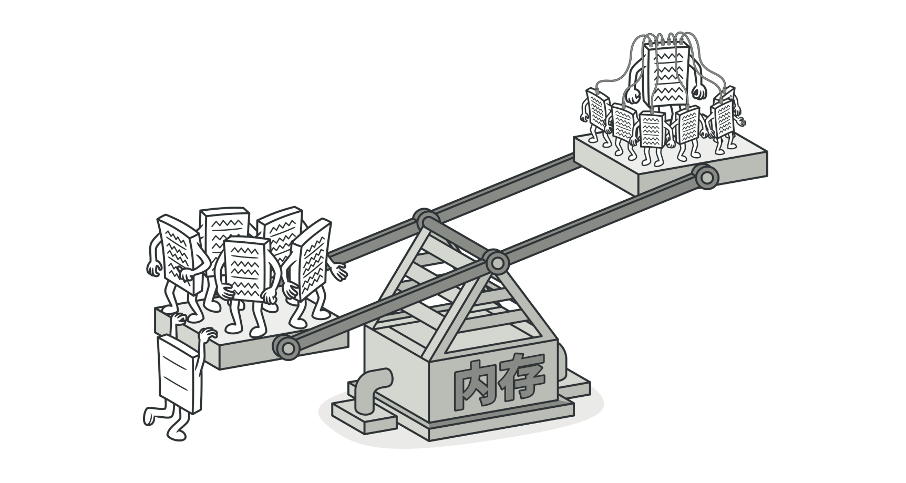

# 外观模式

Facade [fəˈsɑːd] 外观; (建筑物的)正面，立面; (虚假的)表面，外表;

能为程序库、框架或其他复杂类提供一个简单的接口。


## 问题

假设你必须在代码中使用某个复杂的库或框架中的众多对象。正常情况下，你需要负责所有对象的初始化工作、管理其依赖关系并按正确的顺序执行方法等。

最终，程序中类的业务逻辑将与第三方类的实现细节紧密耦合，使得理解和维护代码的工作很难进行。


## 解决方案

外观类为包含许多活动部件的复杂子系统提供了一个简单的接口。与直接调用子系统相比，外观提供的功能可能比较有限，但它却包含了客户端真正关心的功能。

如果你的程序需要与包含几十种功能的复杂库整合，但只需使用其中非常少的功能，那么使用外观模式会非常方便。例如：上传猫咪搞笑短视频到社交媒体网站的应用可能会用到专业的视频转换库，但它只需使用一个包含 encode(filename, format) 方法的类即可。在创建这个类并将其连接到视频转换库后，你就拥有了自己的第一个外观。

当你通过电话给商店下达订单时，接线员就是该商店的所有服务和部门的外观。接线员为你提供了一个同购物系统、支付网关和各种送货服务进行互动的简单语音接口。


## 结构


1. 外观（Facade）提供了一种访问特定子系统功能的便捷方式，其了解如何重定向客户端请求，知晓如何操作一切活动部件。

2. 创建附加外观（Additional Facade）类可以避免多种不相关的功能污染单一外观，使其变成有一个复杂结构。客户端和其他外观可使用附加外观。

3. 复杂子系统（Complex Subsystem）由数十个不同对象构成。如果要用这些对象完成有意义的工作，你必须深入了解子系统的实现细节，比如按照正确顺序初始化对象和为其提供正确格式的数据。

   子系统类不会意识到外观的存在，它们在系统内运作并且相互之间可直接进行交互。

4. 客户端（Client）使用外观代替对子系统对象的直接调用。


## 伪代码


本例中，外观模式简化了客户端与复杂视频转换框架之间的交互。

你可以创建一个封装所需功能并隐藏其他代码的外观类，从而无需使全部代码直接与数十个框架类进行交互。该结构还能将未来框架升级或更换所造成的的影响最小化，因为你只需要修改程序中外观方法的实现即可。

```
// 这里有复杂第三方视频转换框架中的一些类。我们不知晓其中的代码，因此无法对其进行简化。

class VideoFile
// ...

class OggCompressionCodec
// ...

class MPEG4CompressionCodec
// ...

class CodecFactory
// ...

class BitrateReader
// ...

class AudioMixer
// ...


// 为了将框架的复杂性隐藏在一个简单接口背后，我们创建了一个外观类。
// 它是在功能性和简洁性之间做出的权衡。
class VideoConverter is
	method convert(filename, format):File is
		file = new VideoFile(filename)
		sourceCodec = (new CodecFactory).extract(file)
		if (format == "mp4")
			destinationCodec = new MPEG4CompressionCodec()
		else 
			destinationCodec = new OggCompressionCodec()
		buffer = BitrateReader.read(filename, sourceCodec)
		result = BitrateReader.convert(buffer, destinationCodec)
		result = (new AudioMixer()).fix(result)
		return new File(result)


// 应用程序的类并不依赖于复杂框架中成千上万的类。同样，如果你决定更换框架，
// 那只需重写外观类即可。
class Application is
	method main() is
		convertor = new VideoConvertor()
		mp4 = convertor.convert("funny-cats-video.ogg", "mp4")
		mp4.save()
```


## 适用场景

- 如果你需要一个指向复杂子系统的直接接口，且该接口的功能有限，则可以使用外观模式。

  子系统通常会随着时间的推进变得越来越复杂。即便是应用了设计模式，通常你也会创建更多的类。尽管在多钟情形中子系统可能是更灵活或易于复用的，但其所需的配置和样板代码数量将会增长得很快。为了解决这个问题，外观将会提供指向子系统中最常用功能的快捷方式，能够满足客户端的大部分需求。

- 如果需要将子系统组织为多层结构，可以使用外观。

  创建外观来定义子系统中各层次的入口。你可以要求子系统仅使用外观来进行交互，以减少子系统之间的耦合。

  回到视频转换框架的例子。该框架可以拆分为两个层次：音频相关和视频相关。你可以为每个层次创建一个外观，然后要求各层的类必须通过这些外观进行交互。这种方式看上去与中介者模式非常相似。


## 实现方式

1. 考虑能否在现有子系统的基础上提供一个更简单的接口。如果该接口能让客户端代码独立于众多子系统类，那么你的方向就是正确的。
2. 在一个新的外观类中声明并实现该接口。外观应将客户端代码的调用重定向到子系统中的相应对象处。如果客户端代码没有对子系统进行初始化，也没有对其后续生命周期进行管理，那么外观必须完成此类工作。
3. 如果要充分发挥这一模式的优势，你必须确保所有客户端代码仅通过外观来与子系统进行交互。此后客户端代码将不会受到任何由子系统代码修改而造成的影响，比如子系统升级后，你只需修改外观中的代码即可。
4. 如果外观变得过于臃肿，你可以考虑将其部分行为抽取为一个新的专用外观类。


## 优缺点

- 你可以让自己的代码独立于复杂子系统。
- 外观可能成为与程序中所有类都耦合的上帝对象。


## 与其他模式的关系

- 外观模式为现有对象定义了一个新接口，适配器模式则会试图运用已有的接口。适配器通常只封装一个对象，外观通常会作用于整个对象子系统上。
- 当只需对客户端代码隐藏子系统创建对象的方式时，你可以使用抽象工厂模式来代替外观。
- 享元模式展示了如何生成大量的小型对象，外观则展示了如何用一个对象来代表整个子系统。
- 外观和中介者模式的职责类似：它们都尝试在大量紧密耦合的类中组织起合作。
  - 外观为子系统中的所有对象定义了一个简单接口，但是它不提供任何新功能。子系统本身不会意识到外观的存在。子系统中的对象可以直接进行交流。
  - 中介者将系统中组件的沟通行为中心化。各组件只知道中介者对象，无法直接相互交流。
- 外观类通常可以转换为单例模式类，因为在大部分情况下一个外观对象就足够了。
- 外观与代理模式的相似之处在于它们都缓存了一个复杂实体并自行对其进行初始化。代理与其服务对象遵循同一接口，使得自己和服务对象可以互换，在这一点上它与外观不同。


# 享元模式

缓存、Cache、Flyweight

摒弃了在每个对象保存所有数据的方式，通过共享多个对象所共有的相同状态，让你能在有限的内存容量中载入更多对象。




## 问题

你开发了一款简单的游戏：玩家们在地图上移动并相互射击。你决定实现一个真实的粒子系统，并将其作为游戏的特色。大量的子弹、导弹和爆炸弹片在整个地图上穿行，为玩家提供紧张刺激的游戏体验。

开发完成后，你推送提交了最新版本的程序，并在编译游戏后将其发送给一个朋友进行测试。尽管该游戏在你的电脑上完美运行，但是你的朋友却无法长时间进行游戏：游戏总是会在他的电脑上运行几分钟后崩溃。在研究了几个小时的调试信息记录后，你发现导致游戏崩溃的原因是内存容量不足。朋友的设备性能远比不上你的电脑，因此游戏运行在他的电脑上时很快就会出现问题。

真正的问题与粒子系统有关。每个粒子（一颗子弹、一枚导弹或一块弹片）都由包含完整数据的独立对象来表示。当玩家在游戏中鏖战进入高潮的某一时刻，游戏将无法在剩余内存中载入新建粒子，于是程序崩溃了。


## 解决方案

仔细观察粒子 Particle 类，你可能会注意到 color 和精灵图 sprite 这两个成员变量所消耗的内存要远比其他变量多得多。更糟糕的是，对于所有的粒子来说，这两个成员变量所存储的数据几乎完全一样（比如所有子弹的颜色和精灵图都一样）。


每个粒子的另一些状态（坐标、移动矢量和速度）则是不同的。因为这些成员变量的数值会不断变化。这些数据代表粒子在存续期间不断变化的情景，但每个粒子的颜色和精灵图则会保持不变。

对象的常量数据通常被称为内在状态，其位于对象中，其他对象只能读取但不能修改其数值。而对象的其他状态尝尝能被其他对象从外部改变，因此被称为外在状态。

享元模式建议不在对象中存储外在状态，而是将其传递给依赖它的一个特殊方法。程序只在对象中保持内在状态，以方便在不同情景下重用。这些对象的区别仅在于其内在状态（与外在状态相比，内在状态的变体要少很多），因此你所需的对象数量会大大削减。

回到游戏中。假如能从粒子类中抽出外在状态，那么我们只需要三个不同的对象（子弹、导弹和弹片）就能表示游戏中所有的粒子。你现在很可能已经猜到了，我们将这样的一个仅存储内在状态的对象称为享元。


**外在状态存储**

那么外在状态会被移动到什么地方呢？总得有类来存储它们。在大部分情况中，它们会被移动到容器对象中，也就是我们应用享元模式前的聚合对象中。

在我们的例子中，容器对象就是主要的 Game 对象，其会将所有粒子存储在名为 particles 的成员变量中。为了能将外在状态移动到这个类中，你需要创建多个数组成员变量来存储每个粒子的坐标、方向矢量和速度。除此之外，你还需要另一个数组来存储指向代表粒子的特定享元的引用。这些数组必须保持同步，这样你才能够使用同一索引来获取关于某个粒子的所有数据。


更优雅的解决方案是创建独立的情景类来存储外在状态和享元对象的引用。在该方法中，容器类只需包含一个数组。

这样的话情景对象数量不是会和不采用该模式时的对象数量一样多吗？确实，但这些对象要比之前小很多。消耗内存最多的成员变量已经被移动到很少的几个享元对象中。现在，一个享元大对象会被上千个情境小对象复用，因此无需再重复存储数千个大对象的数据。

**享元与不可变性**

由于享元对象可在不同的情景中使用，你必须保持其状态不能被修改。享元类的状态只能由构造函数的参数进行一次性初始化，它不能对其他对象公开其设置器或公有成员变量。

**享元工厂**

为了能更方便地访问各种享元，你可以创建一个工厂方法来管理已有享元对象的缓存池。工厂方法从客户端处接收目标享元对象的内在状态作为参数，如果它能在缓存池中找到所需享元，则将其返回给客户端；如果没有找到，它就会新建一个享元，并将其添加到缓存池中。

你可以选择在程序的不同地方放入该函数。最简单的选择就是将其放置在享元容器中。此外，你还可以新建一个工厂类，或者创建一个静态的工厂方法并将其放入实际的享元类中。


## 结构


1. 享元模式只是一种优化。在应用该模式之前，你要确定程序中存在与大量类似对象同时占用内存相关的内存消耗问题，并且确保该问题无法使用其他更好的方式解决。
2. 享元（Flyweight）类包含原始对象中部分能在对象中共享的状态。同一享元对象可在许多不同情景中使用。享元中存储的状态被称为 ”内在状态“。传递给享元方法的状态被称为 ”外在状态“。
3. 情景（Context）类包含原始对象中各不相同的外在状态。情景与享元对象组合在一起就能表示原始对象的全部状态。
4. 通常情况下，原始对象的行为会保留在享元类中。因此调用享元方法必须提供部分外在状态作为参数。但你也可将行为移动到情景类中，然后将连入的享元作为单纯的数据对象。
5. 客户端（Client）负责计算或存储享元的外在状态。在客户端看来，享元是一种可在运行时进行配置的模板对象，具体的配置方式为向其方法中传入一些情景数据参数。
6. 享元工厂（Flyweight Factory）会对已有享元的缓存池进行管理。有了工厂后，客户端就无需直接创建享元，它们只需调用工厂并向其传递目标享元的一些内在状态即可。工厂会根据参数在之前已创建的享元中进行查找，如果找到满足条件的享元就将其返回；如果没有找到就根据参数新建享元。


## 伪代码


在本例中，享元模式能有效减少在画布上渲染数百万个树状对象时所需的内存。

该模式从主要的 Tree 类中抽取内在状态，并将其移动到享元类 TreeType 之中。

最初程序需要在多个对象中存储相同数据，而现在仅需在几个享元对象中保存数据，然后在作为情景的 Tree 对象中连入享元即可。客户端代码使用享元工厂创建树对象并封装搜索指定对象的复杂行为，并能在需要时复用对象。

```
// 享元类包含一个树的部分状态。这些成员变量保存的数值对于特定树而言是唯一的。
// 例如，立在这里找不到树的坐标。但这里有很多树木之间所共有的纹理和颜色。 
// 由于这些数据的体积通常非常大，所以如果让每棵树都进行保存的话将耗费大量
// 内存。因此，我们可将纹理、颜色和其他数据导出到一个单独的对象中，然后让
// 众多的单个树对象去引用它。
class TreeType is
	field name
	field color
	field texture
	constructor TreeType(name, color, texture) {...}
	method draw(canvas, x, y) is
		// 1. 创建特定类型、颜色和纹理的位图
		// 2. 在画布坐标 (X,Y) 处绘制位图

// 享元工厂决定是否复用已有享元或者创建一个新的的对象
class TreeFactory is
	static field treeTypes: collection of tree types
	static method getTreeType(name, color, texture) is
		type = treeTypes.find(name, color, texture)
		if (type == null)
			type = new TreeType(name, color, texture)
			treeTypes.add(type)
		return type

// 情景对象包含树状态的外在部分。程序中可以创建数十亿个此类对象，因为它们
// 体积很小：仅有两个整形坐标和一个引用成员变量
class Tree is
	field x,y
	field type: Treetype
	constructor Tree(x, y, type) {...}
	method draw(canvas) is
		type.draw(canvas, this.x, this.y)

// Tree 和 Forest 类是享元的客户端。如果不打算继续对树类进行开发，
// 你可以将它们合并。
class Forest is
	field trees: collection of Trees
	
	method plantTree(x, y, name, color, texture) is
		type = TreeFactory.getTreeType(name, color, texture)
		tree = new Tree(x, y, type)
		trees.add(tree)
		
	method draw(canvas) is
		foreach (tree in trees) do
			tree.draw(canvas)
```


## 适用场景

- 仅在程序必须支持大量对象且没有足够的内存容量时使用享元模式

  应用该模式所获的收益大小取决于使用它的方式和情景。它在下列情况中最有效：

  - 程序需要生成数量巨大的相似对象
  - 这将耗尽目标设备的所有内存
  - 对象中包含可抽取且能在多个对象之间共享的重复状态


## 实现方式

1. 将需要改写的享元的类成员变量拆分为两个部分：
   -  内在状态：包含不变的、可在许多对象中重复使用的数据的成员变量。
   - 外在状态：包含每个对象各自不同的情景数据的成员变量
2. 保留类中表示内在状态的成员变量的方法，为在方法中所用的每个成员变量新建一个参数，并使用该参数代替成员变量。
3. 找到所有使用外在状态成员变量的方法，为在方法中所用的每个成员变量新建一个参数，并使用该参数代替成员变量。
4. 你可以有选择地创建工厂类来管理享元缓存池，它负责在新建享元时检查已有的享元。如果选择使用工厂，客户端就只能通过工厂来请求享元，它们需要将享元的内在状态作为参数传递给工厂。
5. 客户端必须存储和计算外在状态（情景）的数值，因为只有这样才能调用享元对象的方法。为了使用方便，外在状态和引用享元的成员变量可以移动到单独的情景类中。


## 优缺点

- 如果程序中有很多相似对象，那么你将可以节省大量内存。
- 你可能需要牺牲执行速度来换取内存，因为他人每次调用享元方法时都需要重新计算部分情景数据。
- 代码会变得更加复杂。团队中的新成员总是会问：“为什么要像这样拆分一个实体的状态？”。


## 与其他模式的关系

- 你可以使用享元模式实现组合模式树的共享叶节点以节省内存。
- 享元展示了如何生成大量的小型对象，外观模式则展示了如何用一个对象来代表整个子系统。
- 如果你能将对象的所有共享状态简化为一个享元对象，那么享元和单例模式类似了。但这两个模式有根本性的不同。
  1. 只会有一个单例实体，但是享元类可以有多个实体，各实体的内在状态也可以不同。
  2. 单例对象可以是可变的。享元对象是不可变的。


# 代理模式

Proxy

让你能够提供对象的替代品或其占位符。代理控制着对于原对象的访问，并允许在将请求提交给对象前后进行一些处理。


## 问题

为什么要控制对于某个对象的访问呢？举个例子：有这样一个消耗大量系统资源的巨型对象，你只是偶尔需要使用它，并非总是需要。


你可以实现延迟初始化：在实际有需要时再创建该对象。对象的所有客户端都要执行延迟初始化代码。但是，这很可能会带来很多重复代码。

在理想情况下，我们系统将代码直接放入对象的类中，但这并非总能实现：比如类可能是第三方封闭库的一部分。


## 解决方案

代理模式建议新建一个与原服务对象接口相同的代理类，然后更新应用以将代理对象传递给所有原始对象客户端。代理类接收到客户端请求后会创建实际的服务对象，并将所有工作委派给它。

这有什么好处呢？如果需要在类的主要业务逻辑前后执行一些工作，你无需修改类就能完成这项工作。由于代理实现的接口与原类相同，因此你可将其传递给任何一个使用实际服务对象的客户端。


信用卡是银行账户的代理，银行账户则是一大捆现金的代理。它们都实现了同样的接口，均可用于进行支付。消费者会非常满意，因为不必随身携带大量现金；商店老板同样会十分高兴，因为交易收入能以电子化的方式进入商店的银行账户中，无需担心存款时出现现金丢失或被抢劫的情况。


## 结构


1. 服务接口（Service Interface）声明了服务接口。代理必须遵循该接口才能伪装成服务对象。

2. 服务（Service）类提供了一些实用的业务逻辑。

3. 代理（Proxy）类包含了一个指向服务对象的引用成员变量。代理完成其任务（例如延迟初始化、记录日志、访问控制和缓存等）后会将请求传递给服务对象。

   通常情况下，代理会对其服务对象的整个生命周期进行管理。

4. 客户端（Client）能通过同一接口与服务或代理进行交互，所以你可在一切需要服务对象的代码中使用代理。


## 伪代码


本例演示如何使用代理模式在第三方腾讯视频程序库中添加延迟初始化和缓存。

程序库提供了视频下载类。但是该类的效率非常低。如果客户端多次请求同一视频，程序库会反复下载该视频，而不会将首次下载的文件缓存下来复用。

代理类实现和原下载器相同的接口，并将所有工作委派给原下载器。不过，代理类会保存所有的文件下载记录，如果程序多次请求同一文件，它会返回缓存的文件。

```
// 远程服务接口
interface ThirdPartyTVLib is
	method listVideos()
	method getVideoInfo(id)
	method downloadVideo(id)


// 服务连接器的具体实现。该类的方法可以像腾讯视频请求信息。请求速度取决于
// 用户和腾讯视频的联网状况。如果同时发送大量请求，即使所请求的信息一模一样，
// 程序的速度依然会减慢。
class ThirdPartyTVClass implements ThirdPartyTVLib is
	method listVideos() is
		// 向腾讯视频发送一个 API 请求
		
	method getVideoInfo(id) is
		// 获取某个视频的元数据
		
	method downloadVideo(id) is
		// 从腾讯视频下载一个视频文件


// 为了节省网络带宽，我们可以将请求结果缓存下来并保存一段时间。但你可能无法
// 直接将这些代码放入服务类中。比如该类可能是第三方程序库的一部分或其用 final
// 修饰。因此我们会在一个实现了服务类接口的新代理类中放入缓存代码。当代理类接收
// 到真实请求后，才会将其委派给服务对象。
class CachedTVClass implements ThirdPartyTVLib is
	private field service: ThirdPartyTVLib
	private field listCache, videoCache
	field needReset
	
	constructor CachedTVClass(service: ThirdPartyTVLib) is
		this.service = service

	method listVideos() is
		if (listCache == null || needReset)
			listCache = service.listVideos()
		return listCache
		
	method getVideoInfo(id) is
		if (VideoCache == null || needReset)
			videoCache = service.getVideoInfo(id)
		return videoCache
		
	method downloadVideo(id) is
		if (!downloadExists(id) || needReset)
			service.downloadVideo(id)


// 之前直接与服务对象交互的 GUI 类不需要改变，前提是它仅通过接口与服务对象
// 交互。我们可以安全地传递一个代理对象来替代真实服务对象，因为它们都实现了
// 相同的接口。
class TVManager is
	protected field service: ThirdPartyTVLib
	
	constructor TVManager(service: ThirdPartyTVLib) is
		this.service = service
		
	method renderVideoPage(id) is
		info = service.getVideoInfo(id)
		// 渲染视频页面	
	
	method renderListPanel() is
		list = service.listVideos()
		// 渲染视频缩略图列表

	method reactOnUserInput() is
		renderVideopage()
		renderListPanel()
		
		
// 程序可在运行时对代理进行配置
class Application is
	method init() is
		aTVService = new ThirdPartyTVCalss()
		aTVProxy = new CachedTVClass(aTVService)
		manager = new TVManager(aTVProxy)
		manager.reactOnUserInput()
```


## 适用场景

- 延迟初始化（虚拟代理）。如果你有一个偶尔使用的重量级服务对象，一直保持该对象运行会消耗系统资源时，可使用代理模式。

  你无需在程序启动时就创建该对象，可将对象的初始化延迟到真正有需要的时候。

- 访问控制（保护代理）。如果你只希望特定客户端使用服务对象，这里的对象可以是操作系统中非常重要的部分，而客户端则是各种已启动的程序（包括恶意程序），此时可使用代理模式。

  代理可仅在客户端凭据满足要求时将请求传递给服务对象。

- 本地执行远程服务（远程代理）。适用于服务对象位于远程服务器上的情形。

  在这种情形中，代理通过网络传递客户端请求，负责处理与网络相关的复杂细节。

- 记录日志请求（日志记录代理）。适用于当你需要保存对于服务对象的请求历史记录时。

  代理可以在向服务传递请求前进行记录。

- 缓存请求结果（缓存代理）。适用于需要缓存客户端请求结果并对缓存生命周期进行管理时，特别是当返回结果的体积非常大时。

  代理可对重复请求所需的相同结果进行缓存，还可使用请求参数作为索引缓存的键值。

- 智能引用。可在没有客户端使用某个重量级对象时立即销毁该对象。

  代理会将所有获取了指向服务对象或其结果的客户端记录在案。代理会时不时地遍历各个客户端，检查它们是否仍在运行。如果相应的客户端列表为空，代理就会销毁该服务对象，释放底层系统资源。

  代理还可以记录客户端是否修改了服务对象。其他客户端还可以复用未修改的对象。


## 实现方式

1. 如果没有现成的服务接口，你就需要创建一个接口来实现代理和服务对象的可交换性。从服务类中抽取接口并非总是可行的，因为你需要对服务的所有客户端进行修改，让它们使用接口。备选计划是将代理作为服务类的子类，这样代理就能继承服务的所有接口了。
2. 创建代理类，其中必须包含一个存储指向服务的引用的成员变量。通常情况下，代理负责创建服务并对其整个生命周期进行管理。在一些特殊情况下，客户端会通过构造函数将服务传递给代理。
3. 根据需求实现代理方法。在大部分情况下，代理在完成一些任务后应将工作委派给服务对象。
4. 可以考虑新建一个车构建方法来判断客户端可获取的是代理还是实际服务。你可以在代理类中创建一个简单的静态方法，也可以创建一个完整的工厂方法。
5. 可以考虑为服务对象实现延迟初始化。


## 优缺点

- 你可以在客户端毫无察觉的情况下控制服务对象。
- 如果客户端对服务对象的生命周期没有特殊要求，你可以对生命周期进行管理。
- 即使服务对象还未准备好或不存在，代理也可以正常工作。
- 开闭原则。你可以在不对服务或客户端做出修改的情况下创建新代理。
- 代码可能会变得复杂，因为需要新建许多类。
- 服务响应可能会延迟。


## 与其他模式的关系

- 适配器模式能为被封装对象提供不同的接口，代理模式能为对象提供相同的接口，装饰模式则能为对象提供加强的接口。
- 外观模式与代理的相似之处在于它们都缓存了一个复杂实体并自行对其进行初始化。代理与其服务对象遵循同一接口，使得自己和服务对象可以互换，在这一点上它与外观不同。
- 装饰和代理有着相似的结构，但是其意图却非常不同。这两个模式的构建都基于组合原则，也就是说一个对象应该将部分工作委派给另一个对象。两者之间的不同之处在于代理通常自行管理其服务对象的生命周期，而装饰的生成则总是由客户端进行控制。