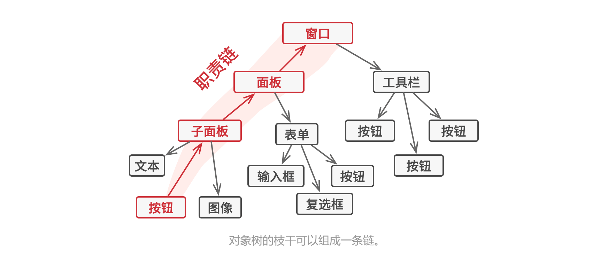
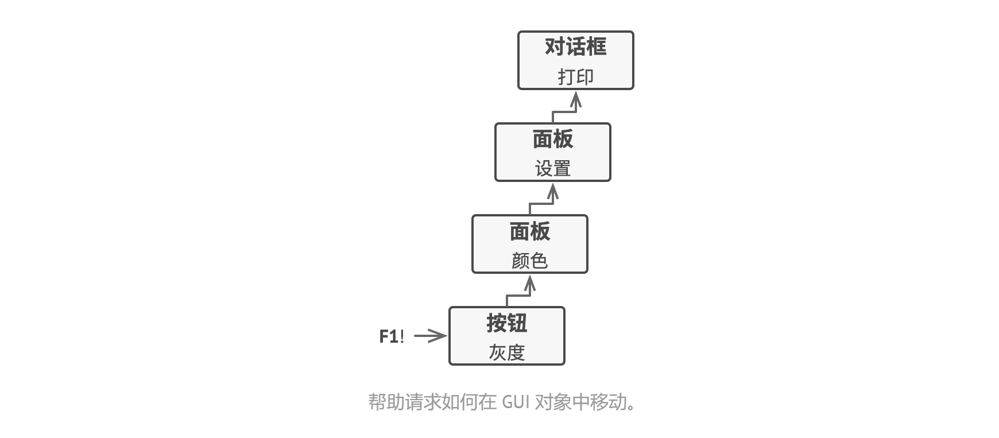
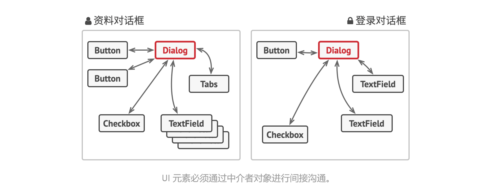

# 责任链模式

职责链模式、命令链、CoR、Chain of Command、Chain of Responsibility

允许你将请求沿着处理者链进行发送。收到请求后，每个处理者均可对请求进行处理，或将其传递给链上的下个处理者。


## 问题

假如你正在开发一个在线订购系统。你希望对系统访问进行限制，只允许认证用户创建订单。此外，拥有管理权限的用户也拥有所有订单的完全访问权限。

简单规划后，你会意识到这些检查必须一次进行。只要接收到包含用户凭据的请求，应用程序就可尝试对进入系统的用户进行认证。但如果由于用户凭据不正确而导致认证失败，那就没有必要进行后续检查了。


在接下来的几个月里，你实现了后续的几个检查步骤。

- 一位同事认为直接将原始数据传递给订购系统存在安全隐患。因此你新增了额外的验证步骤来清理请求中的数据。
- 过了一段时间，有人注意到系统无法抵御暴力密码破解方式的攻击。为了防范这种情况，你立刻添加了一个车检查步骤来过滤来自同一 IP 地址的重复错误请求。
- 又有人提议你可以对包含同样数据的重复请求返回缓存中的结果，从而提高系统响应速度。因此，你新增了一个检查步骤，确保只有没有满足条件的缓存结果时请求才能通过并被发送给系统。


检查代码本来就已经混乱不堪，而每次新增功能都会使其更加臃肿。修改某个检查步骤有时会影响其他的检查步骤。最糟糕的是，当你希望复用这些检查步骤来保护其他系统组件时，你只能复制部分代码，因为这些组件只需部分而非全部的检查步骤。

系统会变得让人非常费解，而且其维护成本也会激增。你在艰难地和这些代码共处一段时间后，有一天终于决定对整个系统进行重构。


## 解决方案

与许多其他行为设计模式一样，责任链会将特定行为转换为被称作处理者的独立对象。上述示例中，每个检查步骤都可被抽取为仅有单个方法的类，并执行检查操作。请求及其数据则会被作为参数传递给该方法。

模式建议你将这些处理者连成一条链。链上的每个处理者都有一个成员变量来保存对于下一处理者的引用。除了对处理请求外，处理者还负责沿着链传递请求。请求会在链上移动，直至所有处理者都有机会对其进行处理。

最重要的是：处理者可以决定不再沿着链传递请求，这可高效地取消所有后续处理步骤。

在我们的订购系统示例中，处理者会在进行请求处理工作后决定是否继续沿着链传递请求。如果请求中包含正确的数据，所有处理者都将执行自己的主要行为，无论该行为是身份验证还是数据缓存。


不过还有一种稍微不同的方式（也是更经典的一种），那就是处理者接收到请求后自行决定是否能够对其进行处理。如果自己能够处理，处理者就不再继续传递请求。因此在这种情况下，每个请求要么最多有一个处理者对其进行处理，要么没有任何处理者对其进行处理。在处理图形用户界面元素栈中的事件时，这种方式非常常见。

例如，当用户点击按钮时，按钮产生的事件将沿着 GUI 元素链进行传递，最开始是按钮的容器（如窗口或面板），直至应用程序主窗口。链上第一个能处理该事件的元素会对其进行处理。此外，该例还有另一个值得我们关注的地方：它表明我们总能从对象树中抽取出链来。

所有处理者均实现同一接口是关键所在。每个具体处理着仅关心下一个包含 execute 方法的处理者。这样一来，你就可以在运行时使用不同的处理者来创建链，而无需将相关代码与处理者的具体类进行耦合。




## 结构


1. 处理者（Handler）声明了所有具体处理者的通用接口。该接口通常仅包含单个方法用于请求处理，但有时其还会包含一个设置链上下个处理者的方法。

2. 基础处理者（Base Handler）是一个可选的类，你可以将所有处理者共用的样本代码放置其中。

   通常情况下，该类中定义了一个保存对于下个处理者引用的成员变量。客户端可通过将处理者传递给上个处理者的构造函数或设定方法来创建链。该类还可以实现默认的处理行为：确定下个处理者存在后再将请求传递给它。

3. 具体处理者（Concrete Handlers）包含处理请求的实际代码。每个处理者接收到请求后，都必须决定是否进行处理，以及是否沿着链传递请求。

   处理者通常是独立且不可变的，需要通过构造函数一次性地获得所有必要地数据。

4. 客户端（Client）可根据程序逻辑一次性或者动态地生成链。注意：请求可发送给链上的任意一个处理者，而非必须是第一个处理者。


## 伪代码


在本例中，责任链模式负责为活动的 GUI 元素显示上下文帮助信息。

应用程序的 GUI 通常为对象树结构。例如，负责渲染程序主窗口的对话框类就是对象树的根节点。对话框包含面板，而面板可能包含其他面板，或是按钮和文本框等下层元素。

只要给一个简单的组件指定帮助文本，它就可显示简短的上下文提示。但更复杂的组件可自定义上下文帮组文本的显示方式，例如显示手册摘录内容或在浏览器中打开一个网页。

当用户将鼠标指针移动到某个元素并按下 F1 键时，程序检测到指针下的组件并对其发送帮助请求。该请求不断向上传递到该元素所有的容器，直至某个元素能够显示帮助信息。



```
// 处理者接口声明了一个创建处理者链的方法。还声明了一个执行请求的方法。
interface ComponentWithContextualHelp is
	method showHelp()


// 简单组件的基础类
abstract class Component implements ComponentWithContextualHelp is
	field tooltipText: string
	
	// 组件容器在处理者链中作为下一个链接
	protected field container: Container
	
	// 如果组件设定了帮助蚊子，那它将会显示提示信息。如果组件没有帮助文字
	// 且其容器存在，那它会将调用传递给容器。
	method showHelp() is
		if (tooltipText != null)
			// 显示提示信息
		else
			container.showHelp()
			

// 容器可以将简单组件和其他容器作为其子项目。链关系将在这里建立。该类将从
// 其父类处继承 showHelp 的行为。
abstract class Container extends Component is
	protected field children: array of Component
	
	method add(child) is
		children.add(child)
		child.container = this


// 原始组件应该能够使用帮助操作的默认实现
class Button extends Component is
	// ...


// 但复杂组件可能会对默认实现进行重写。如果无法以新的方式来提供帮助文字，
// 那组件总是还能调用基础实现的。
class Panel extends Container is
	field modalHelpText: string
	
	method showHelp() is
		if (modalHelpText != null)
			// 显示包含帮助文字的模态窗口
		else
			super.showHelp()


// ...同上...
class Dialog extends Container is
	field wikiPageURL: string
	
	method showHelp() is
		if (wikiPageURL != null)
			// 打开百科帮助页面
		else
			super.showHelp()


class Application is
	// 每个程序都能以不同方式对链进行配置
	method createUI() is
		dialog = new Dialog("预算报告")
		dialog.wikiPageURL = "http://..."
		panel = new panel(0, 0, 400, 800)
		panel.modalHelpText = "本面板用于..."
		ok = new Button(250, 760, 50, 20, "确认")
		ok.tooltipText = "这是一个确认按钮..."
		cancel = new Button(320, 760, 50, 20, "取消")
		// ...
		panel.add(ok)
		panel.add(cancel)
		dialog.add(panel)
		
	// 想象这里会发生什么
	method onF1KeyPress() is
		component = this.getComponentAtMouseCoords()
		component.showHelp()
```


## 适用场景

- 当程序需要使用不同方式处理不同种类请求，而且请求类型和顺序预先未知时，可以使用责任链模式。

  该模式能将多个处理者连接成一条链。接收到请求后，它会询问没哥哥处理者是否能够对其进行处理。这样所有处理者都有机会来处理请求。

- 当必须按顺序执行多个处理者时，可以使用该模式。

  无论你以何种顺序将处理者连接成一条链，所有请求都会严格按照顺序通过链上的处理者。

- 如果所需处理者及其顺序必须在运行时进行改变，可以使用责任链模式。

  如果在处理者类中有对引用成员变量的设定方法，你将能动态地插入和移除处理者，或者改变其顺序。

  

## 实现方式

1. 声明处理者接口并描述请求处理方法的签名。

   确定客户端如何将请求数据传递给方法。最灵活的方式是将请求转换为对象，然后将其以参数的形式传递给处理函数。

2. 为了在具体处理者中消除重复的样本代码，你可以根据处理者接口创建抽象处理者基类。

   该类需要有一个成员变量来存储指向链上下个处理者的引用。你可以将其设置为不可变类。但如果你打算在运行时对链进行改变，则需要定义一个设定方法来修改引用成员变量的值。

   为了使用方便，你还可以实现处理方法的默认行为。如果还有剩余对象，该方法会将请求传递给下个对象。具体处理者还能够调用父对象的方法来使用这一行为。

3. 依次创建具体处理者子类并实现其处理方法。每个处理者在接收到请求后都必须做出两个决定：

   - 是否自行处理这个请求
   - 是否将该请求沿着链进行传递

4. 客户端可以自行组装链，或者从其他对象处获得预先组装好的链。在后一种情况下，你必须实现工厂类以根据配置或环境设置来创建链。

5. 客户端可以触发链中的任意处理者，而不仅仅是第一个。请求将通过链进行传递，直至某个处理者拒绝继续传递，或者请求到达链尾。

6. 由于链的动态性，客户端需要准备好处理以下情况：

   - 链中可能只有单个链接
   - 部分请求可能无法到达链尾
   - 其他请求可能直到链尾都未被处理


## 优缺点

- 你可以控制请求处理的顺序
- 单一职责原则。你可对发起操作和执行操作的类进行解耦
- 开闭原则。你可以在不更改现有代码的情况下在程序中新增处理者
- 部分请求可能未被处理


## 与其他模式之间的关系

- 责任链模式、命令模式、中介者模式和观察者模式用于处理请求发送者和接受者之间的不同连接方式：

  - 责任链按照顺序将请求动态传递给一系列的潜在接收者，直至其中一名接收者对请求进行处理
  - 命令在发送者和请求者之间建立单向连接
  - 中介者清除了发送者和请求者之间的直接连接，强制它们通过一个中介对象进行间接沟通
  - 观察者允许接收者动态地订阅或取消接收请求

- 责任链通常和组合模式结合使用。这种情况下，叶组件接收到请求后，可以将请求沿包含全体父组件的链一直传递至对象树的底部。

- 责任链的管理者可使用命令模式实现。在这种情况下，你可以对由请求代表的同一个上下文对象执行许多不同的操作。

  还有另外一种实现方式，那就是请求自身就是一个命令对象。在这种情况下，你可以对有一系列不同上下文连接而成的链执行相同的操作。

- 责任链和装饰模式的类结构非常相似。两者都依赖递归组合将需要执行的操作传递给一系列对象。但是，两者有几点重要的不同之处。

  责任链的管理者可以相互独立地执行一切操作，还可以随时停止传递请求。另一方面，各种装饰可以在遵循基本接口的情况下扩展对象的行为。此外，装饰无法中断请求的传递。


# 命令模式

Action、Transaction、Command

它可将请求转换为一个包含与请求相关的所有信息的独立对象。该转换让你能根据不同的请求讲方法参数化、延迟请求执行或将其放入队列中，且能实现可撤销操作。


## 问题

假如你正在开发一款新的文字编辑器，当前的任务是创建一个包含多个按钮的工具栏，并让每个按钮对应编辑器的不同操作。你创建了一个非常简洁的 Button 类，它不仅可用于生成工具栏上的按钮，还可用于生成各种对话框的通用按钮。


尽管所有按钮看上去都很相似，但它们可以完成不同的操作（打开、保存、打印和应用等）。你会在哪里放置这些按钮的点击处理代码呢？最简单的解决方案是在使用按钮的每个地方都创建大量的子类。这些子类中包含按钮点击后必须执行的代码。


你很快就意识到这种方式有严重的缺陷。首先，你创建了大量的子类，每当修改基类 Button 时，你都有可能需要修改所有子类的代码。简单来说，GUI 代码以一种拙劣的方式依赖于业务逻辑中的不稳定代码。


还有一个部分最难办。复制 / 粘贴文字等操作可能会在多个地方被调用。例如用户可以点击工具栏上小小的复制按钮，或者通过上下文菜单复制一些内容，又或者直接使用键盘上的 Ctrl C。

我们的程序最初只有工具栏，因此可以使用按钮子类来实现各种不同操作。换句话说，复制按钮 CopyButton 子类包含复制文字的代码是可行的。在实现了上下文菜单、快捷方式和其他功能后，你要么 需要将操作代码复制进许多个类中，要么需要让菜单依赖于按钮，而后者是更糟糕的选择。


## 解决方案

优秀的软件设计通常会将关注点进行分离，而这往往会导致软件的分层。最常见的例子：一层负责用户图像界面；另一层负责业务逻辑。GUI 层负责在屏幕上渲染美观的图形，捕获所有输入并显示用户和程序工作的结果。当需要完成一些重要内容时（比如计算月球轨道或撰写年度报告），GUI 层则会将工作委派给业务逻辑底层。

这在代码中看上去就像这样：一个 GUI 对象传递一些参数来调用一个业务逻辑对象。这个过程通常被描述为一个对象发送请求给另一个对象。


命令模式建议 GUI 对象不直接提交这些请求。你应该将请求的所有细节（例如调用的对象、方法名称和参数列表）抽取出来组成命令类，该类中仅包含一个用于触发请求的方法。

命令对象负责连接不同的 GUI 和业务逻辑对象。此后，GUI 对象无需了解业务逻辑对象是否获得了请求，也无需了解其对请求进行处理的方式。GUI 对象触发命令即可，命令对象会自行处理所有细节工作。


下一步是让所有命令实现相同的接口。该接口通常只有一个没有任何参数的执行方法，让你能在不和具体命令类耦合的情况下使用同一请求发送者执行不同命令。此外还有额外的好处，现在你能在运行时切换连接至发送者的命令对象，以此改变发送者的行为。

你可能会注意到遗漏的一块拼图，请求的参数。GUI 对象可以给业务层对象提供一些参数。但执行命令方法没有任何参数，所以我们如何将请求的详情发送给接收者呢？答案是：使用数据对命令进行预先配置，或者让其能够自行获取数据。


回到文本编辑器。应用命令模式后，我们不再需要任何按钮子类来实现点击行为。我们只需在 Button 基类中添加一个成员变量来存储对于命令对象的引用，并在点击后执行该命令即可。

你需要为每个可能的操作实现一系列命令类，并且根据按钮所需行为将命令和按钮连接起来。

其他菜单、快捷方式或整个对话框等 GUI 元素都可以通过相同方式来实现。当用户与 GUI 元素交互时，与其连接的命令将会被执行。现在你很可能已经猜到了，与相同操作相关的元素将会被连接到相同的命令，从而避免了重复代码。

最后，命令成为了减少 GUI 和业务逻辑层之间耦合的中间层。而这仅仅是命令模式所提供的一小部分好处。

**真实世界类比**

在市中心逛街后，你找到一家不错的餐厅，坐在了临窗的座位上。一名友善的服务员走近你，迅速记下你点的食物，写在一张纸上。服务员来到厨房，把订单贴在墙上。过了一段时间，厨师拿到了订单，他根据订单来准备食物。厨师将做好的食物和订单一起放在托盘上。服务员看到托盘后对订单进行检查，确保所有的食物都是你要的，然后将食物放到了你的桌上，

那张纸就是一个命令，它在厨师开始烹饪前一直位于队列中。命令中包含与烹饪这些食物相关的所有信息。厨师能够根据它马上开始烹饪，而无需跑来直接和你确认订单详情。


## 结构


1. 发送者（Sender），亦称触发者（Invoker）类负责对请求进行初始化，其中必须包含一个成员变量来存储对于命令对象的引用。发送者触发命令，而不向接收者直接发送请求。注意，发送者并不负责创建命令对象：它通常会通过构造函数从客户端处获得预先生成的命令。

2. 命令（Command）接口通常仅声明一个执行命令的方法。

3. 具体命令（Concrete Commands）会实现各种类型的请求。具体命令自身并不完成工作，而是会将调用委派给一个业务逻辑对象。但为了简化代码，这些类可以进行合并。

   接收对象执行方法所需的参数可以声明为具体命令的成员变量。你可以将命令对象设为不可变，仅允许通过构造函数对这些成员变量进行初始化。

4. 接收者（Receiver）类包含部分业务逻辑。几乎任何对象都可以作为接收者。绝大部分命令只处理如何将请求传递到接收者的细节，接收者自己会完成实际的工作。

5. 客户端（Client）会创建并配置具体命令对象。客户端必须将包括接收者实体在内的所有请求参数传递给命令的构造函数。此后，生成的命令就可以与一个或多个发送者相关联了。


## 伪代码


在本例中，命令模式会记录已执行操作的历史记录，以在需要时撤销操作。

有些命令会改变编辑器的状态（例如剪切和粘贴），它们可在执行相关操作前对编辑器的状态进行备份。命令执行后会和当前点备份的编辑器状态一起被放入命令历史（命令对象栈）。此后，如果用户需要进行回滚操作，程序可从历史记录中取出最近的命令，读取相应的编辑器状态备份，然后进行恢复。

客户端代码（GUI 元素和命令历史等）没有和具体命令类相耦合，因为它通过命令接口来使用命令。这使得你能在无需修改已有代码的情况下在程序中新增新的命令。

```
// 命令基类会为所有具体命令定义通用接口
abstract class Command is
	protected field app: Application
	protected field editor: Editor
	protected field backup: text
	
	constructor Command(app: Application, editor: Editor) is
		this.app = app
		this.editor = editor
		
	// 备份编辑器状态
	method saveBackup() is
		backup = editor.text
		
	// 恢复编辑器状态
	method undo() is
		editor.text = backup
	
	// 执行命令被声明为抽象以强制所有具体命令提供自己的实现。该方法必须
	// 根据命令是否更改编辑器的状态返回 true 或 false。
	abstract method execute()
	
	
// 这里是具体命令
class CopyCommand extends Command is
	// 复制命令不会被保存到历史记录中，因为它没有改变编辑器的状态
	method execute() is
		app.clipboard = editor.getSelection()
		return flase


class CutCommand extends Command is
	// 剪切命令改变了编辑器的状态，因此它必须被保存到历史记录中。只要方法
	// 返回 true，它就会被保存。
	method execute() is
		saveBackup()
		app.clipboard = editor.getSelection()
		editor.deleteSelection()
		return true


class PasteCommand extends Command is
	method execute() is
		saveBackup()
		editor.replaceSelection(app.clipboard)
		return true


// 撤销操作也是一个命令
class UndoCommand extends Command is
	method execute() is
		app.undo()
		return flase


// 全局命令历史记录就是一个堆栈
class CommandHistory is
	private field history: array of Command
	
	// 后进...
	method push(c: Command) is
		// 将命令压入历史记录数组的末尾
	
	// ...先出
	method pop():Command is
		// 从历史记录中取出最近的命令


// 编辑器类包含实际的文本编辑操作。它会担任接收者的角色：最后所有命令都会
// 将执行工作委派给编辑器的方法。
class Editor is
	field text: string

	method getSelection() is
		// 返回选中的文字
	
	method deleteSelection() is
    	// 删除选中的文字
    	
    method replaceSelection(text) is
    	// 在当前位置插入剪贴板中的内容
	
	
// 应用程序类会设置对象之间的关系。它会担任发送者的角色：当需要完成某些
// 工作时，它会创建并执行一个命令对象
class Application is
	field clipboard: string
	field editors: array of Editors
	field activeEditor: Editor
	field history: CommandHistory
	
	// 将命令分派给 UI 对象的代码可能会是这样的
	method createUI() is
		// ...
		copy = function() {excuteCommand(new CopyCommand(this, activeEditor))}
		copyButton.setCommand(copy)
		shortcuts.onKeyPress("Ctrl+C", copy)
		
		cut = function() {excuteCommand(new CutCommand(this, activeEditor))}
		cutButton.setCommand(cut)
		shortcuts.onKeyPress("Ctrl+X", cut)
		
		...
		
	// 执行一个命令并检查它是否需要被添加到历史记录中
	mthod excuteCommand(command) is
		if (command.execute)
			history.push(command)
			
	// 从历史记录中取出最近的命令并运行其 undo 方法。注意：你并不知晓
	// 该命令所属的类。但是我们不需要知晓，因为命令自己知道如何撤销其动作。
	method undo() is
		command = history.pop()
		if (command != null)
			command.undo()
```


## 适用场景

- 如果你需要通过操作来参数化对象，可使用命令模式。

  命令模式可将特定的方法调用转化为独立的对象。这一改变也带来了许多有趣的应用：你可以将命令作为方法的参数进行传递、将命令保存在其他对象中，或者在运行时切换已连接的命令等。

  举个例子：你正在开发一个 GUI 组件（例如上下文菜单），你希望用户能够配置菜单项，并在点击菜单项时触发操作。

- 如果你想要将操作放入队列中、操作的执行或者远程执行操作，可使用命令模式。

  同其他对象一样，命令也可以实现序列化（序列化的意思是转化为字符串），从而能方便地写入文件或数据库中。一段时间后，该字符串可被恢复成为最初的命令对象。因此，你可以延迟或计划命令的执行。但其功能远不止如此！使用同样的方式，你还可以将命令放入队列、记录命令或者通过网络发送命令。

- 如果你想要实现操作回滚功能，可使用命令模式。

  尽管有很多方法可以实现撤销和恢复功能，但命令模式可能是其中最常用的一种。

  为了能够回滚操作，你需要实现已执行操作的历史记录功能。命令历史记录是一种包含所有已执行命令对象及其相关程序状态备份的栈结构。

  这种方法有两个缺点。首先，程序状态的保存功能并不容易实现，因为部分状态可能是私有的。你可以使用备忘录模式来在一定程度上解决这个问题。

  其次，备份状态可能会占用大量内存。因此，有时你需要借助另一种实现方式：命令无需恢复原始状态，而是执行反向操作。反向操作也有代价：它可能会很难甚至是无法实现。


## 实现方式

1. 声明仅有一个执行方法的命令接口。
2. 抽取请求并使之成为实现命令接口的具体命令类。每个类都必须有一组成员变量来保存请求参数和对于实际接收者对象的引用。所有这些变量的数值都必须通过命令构造参数进行初始化。
3. 找到担任发送者职责的类。在这些类中添加保存命令的成员变量。发送者只能通过命令接口与其命令进行交互。发送者自身通常并不创建命令对象，而是通过客户端代码获取。
4. 修改发送者使其执行命令，而非直接将请求发送给接收者。
5. 客户端必须按照以下顺序来初始化对象：
   - 创建接收者
   - 创建命令，如有需要可将其关联至接收者
   - 创建发送者并将其与特定命令关联


## 优缺点

- 单一职责原则。你可以解耦触发和执行操作的类。
- 开闭原则。你可以在不修改已有客户端代码的情况下在程序中创建新的命令。
- 你可以实现撤销和恢复功能。
- 你可以实现操作的延迟执行。
- 你可以将一组简单命令组合成一个复杂命令。
- 代码可能会变得更加复杂，因为你在发送者和接受者之间增加了一个全新的层次。


## 与其他模式之间的关系

- 责任链模式、命令模式、中介者模式和观察者模式用于处理请求发送者和接受者之间的不同连接方式：

  - 责任链按照顺序将请求动态传递给一系列的潜在接收者，直至其中一名接受者对请求进行处理。
  - 命令在发送者和请求者之间建立单向连接。
  - 中介者清楚了发送者和请求者之间的直接连接，强制它们通过一个中介对象进行间接沟通。
  - 观察者允许接收者动态地订阅或取消接收请求。

- 责任链的管理者可使用命令模式实现。在这种情况下，你可以对由请求代表的同一个上下文对象执行许多不同的操作。

  还有另一种实现方式，那就是请求自身就是一个命令对象。在这种情况下，你可以对由一系列不同上下文连接而成的链执行相同的操作。

- 你可以同时使用命令和备忘录模式来实现撤销。在这种情况下，命令用于对目标对象执行各种不同的操作，备忘录用来保存一条命令执行前该对象的状态。

- 命令和策略模式看上去很像，因为两者都能通过某些行为来参数化对象。但是，它们的意图有非常大的不同。

  - 你可以使用命令来将任何操作转换为对象。操作的参数将成为对象的成员变量。你可以通过转换来延迟操作的执行、将操作放入队列、保存历史命令或者向远程服务发送命令等。
  - 另一方面，策略通常可用于描述完成某件事的不同方式，让你能够在同一个上下文类中切换算法。

- 原型模式可用于保存命令的历史记录。

- 你可以将访问者模式视为命令模式的加强版本，其对象可对不同类的多钟对象执行操作。


# 迭代器模式

Iterator

让你能在不暴露集合底层表现形式（列表、栈和树等）的情况下遍历集合中所有的元素。


## 问题

集合是编程中最常用的数据类型之一。尽管如此，集合只是一组对象的容器而已。大部分集合使用简单列表存储元素。但有些集合还会使用栈、树、图和其他复杂的数据结构。无论集合的构成方式如何，它都必须提供某种访问元素的方式，便于其他代码使用其中的元素。集合应提供一种能够遍历元素的方式，且保证它不会周而复始地访问同一个元素。

如果你的集合基于列表，那么这项工作听上去仿佛很简单。但如何遍历复杂数据结构（例如树）中的元素呢？例如，今天你需要使用深度优先算法来遍历树结构，明天可能会需要广度优先算法；下周则可能会需要其他方式（比如随机存储树中的的元素）。

不断向集合中添加遍历算法回魔乎其高效存储数据的主要职责。此外，有些算法可能是根据特定应用定制的，将其加入泛型集合类中会显得非常奇怪。

另一方面，使用多种集合的客户端代码可能并不关心存储数据的方式。不过由于集合提供不同的元素访问方式，你的代码将不得不与特定集合类进行耦合。


## 解决方案


迭代器模式的主要思想是将集合的遍历行为抽取为单独的迭代器对象。

除实现自身算法外，迭代器还封装了遍历操作的所有细节，例如当前位置和末尾剩余元素的数量。因此，多个迭代器可以在相互独立的情况下同时访问集合。

迭代器通常会提供一个获取集合元素的基本方法。客户端可不断调用该方法直至它不返回任何内容，这意味着迭代器已经遍历了所有元素。

所有迭代器必须实现相同的接口。这样一来，只要有合适的迭代器，客户端代码就能兼容任何类型的集合或遍历算法。如果你需要采用特殊方式来遍历集合，只需创建一个新的迭代器类即可，无需对集合或客户端进行修改。


## 结构


1. 迭代器（Iterator）接口声明了遍历集合所需的操作：获取下一个元素、获取当前位置和重新开始迭代等。

2. 具体迭代器（Concrete Iterators）实现遍历集合的一种特定算法。迭代器对象必须跟踪自身遍历的进度。这使得多个迭代器可以相互独立地遍历同一集合。

3. 集合（Collection）接口声明一个或多个方法来获取与集合兼容的迭代器。注意：返回方法的类型必须被声明为迭代器接口，因此具体集合可以返回各种不同种类的迭代器。

4. 具体集合（Concrete Collections）会在客户端请求迭代器时返回一个特定的具体迭代器类实体。你可能会琢磨，剩下的集合代码在什么地方呢？不用担心，它也会在同一个类中。只是这些细节对于实际模式来说并不重要，所以我们将其省略了。

5. 客户端（Client）通过集合和迭代器的接口与两者进行交互。这样客户端无需与具体类进行耦合，允许同一客户端代码使用各种不同的集合和迭代器。

   客户端通常不会自行创建迭代器，而是会从集合中获取。但在特定情况下，客户端可以直接创建一个迭代器（例如当客户端需要自定义特殊迭代器时）。


## 伪代码


本例中，迭代器模式用于遍历一个封装了访问微信好友关系功能的特殊集合。该集合提供使用不同方式遍历档案资料的多个迭代器。

好友迭代器可用于遍历指定档案的好友。同事迭代器也提供同样的功能，但仅包括与目标用户在同一家公司工作的好友。这两个迭代器都实现了同一个通用接口，客户端能在不了解认证和发送 REST 请求等实现细节的情况下获取档案。

客户端仅通过接口与集合和迭代器交互，也就不会同具体类耦合。如果你决定将应用连接到全新的社交网络，只需提供新的集合和迭代器类即可，无需修改现有代码。

```
// 集合接口必须声明一个用于生成迭代器的工厂方法。如果程序中有不同类型的
// 迭代器，你也可以声明多个方法。
interface SocialNetwork is
	method createFriendsIterator(profileId):ProfileIterator
	method createCoworkersIterator(profileId):ProfileIterator


// 每个具体集合都与其返回的一组具体迭代器相耦合。但客户并不是这样的，因为
// 这些方法的签名将会返回迭代器接口。
class WeChat implements SocailNetwork is
	// ...大量的集合代码应放在这里...
	
	// 迭代器创建代码
	method createFriendsIterator(profileId) is
		return new WeChatIterator(this, profileId, "friends")
		
	method createCoworkersIterator(profileId) is
		return new WeChatIterator(this, profileId, "coworkers")
		

// 所有迭代器的通用接口
interface ProfileIterator is
	method getNext():Profile
	method hasMore():bool
	

// 具体迭代器类
class WeChatIterator implements ProfileIterator is
	// 迭代器需要一个指向其遍历集合的引用
	private field weChat: WeChat
	private field profileId, type: string
	
	// 迭代器对象会独立于其他迭代器来对集合进行遍历。因此它必须保存迭代器的状态
	private field currentPosition
	private field cache: array of Profile
	
	constructor WeChatIterator(weChat, profileId, type) is
		this.weChat = weChat
		this.profileId = profileId
		thid.type = type
	
	private method lazyInit() is
		if (cache == null)
			cache = weChat.socialGraphRequest(profileId, type)
			
	// 每个具体迭代器类都会自行实现通用迭代器接口
	method getNext() is
		if (hasMore())
			currentPosition++
			return cache[currentPosition]
	
	method hasMore() is
		lazyInit()
		return currentPosition < cache.length


// 这里有一个好用的办法：你可将迭代器传递给客户端类，无需让其拥有访问整个
// 集合的权限。这样一来，你就无需将集合暴露给客户端了。
// 还有一个好处：你可在运行时将不同的迭代器传递给客户端，从而改变客户端与
// 集合互动的方式。这一方法可行的原因是客户端代码并没有和具体迭代器类相耦合。
class SocialSpanmmer is
	method send(iterator: ProfileIterator, message: string) is
		while (iterator.hasMore())
			profile = iterator.getNext()
			System.sendEmail(profile.getEmail(), message)


// Application 类可对集合和迭代器进行配置，然后将其传递给客户端代码
class Application is
	field network: SocialNetwork
	field spammer: SocialSpammer
	
	method config() is
		if working with WeChat
			this.network = new WeChat()
		if working with LinkedIn
			this.network = new LinkedIn()
		this.spammer = new SocialSpammer()
		
	method sendSpamToFriends(profile) is
		iterator = network.createFriendsIterator(profile.getId())
		spammer.send(iterator, "非常重要的消息")
		
	method sendSpamToCowokers(profile) is
		iterator = network.createCoworkersIterator(profile.getId())
		spammer.send(iterator, "非常重要的消息")
```


## 适用场景

- 当集合背后为复杂的数据结构，且你希望对客户端隐藏其复杂性时（出于使用便利性或安全性的考虑），可以使用迭代器模式。

  迭代器封装了与复杂数据结构进行交互的细节，为客户端提供多个访问集合元素的简单方法。这种方式不仅对客户端来说非常方便，而且能避免客户端在直接与集合交互时执行错误或有害的操作，从而起到保护集合的作用。

- 使用该模式可以减少程序中重复的遍历代码。

  重要迭代算法的代码往往体积非常庞大。当这些代码被放置在程序业务逻辑中，它会让原始代码的职责模糊不清，降低其可维护性。因此，将遍历代码移到特定的迭代器中可使程序代码更加精炼和简洁。

- 如果你希望代码能够遍历不同的甚至是无法预知的数据结构，可以使用迭代器模式。

  该模式为集合和迭代器提供了一些通用接口。如果你在代码中使用了这些接口，那么将其他实现了这些接口的集合和迭代器传递给它时，它仍将可以正常运行。


## 实现方式

1. 声明迭代器接口。该接口必须提供至少一个方法来获取集合中的下个元素。但为了使用方便，你还可以添加一些其他方法，例如获取前一个元素、记录当前位置和判断迭代是否已结束。
2. 声明集合接口并描述一个获取迭代器的方法。其返回值必须是迭代器接口。如果你计划拥有多组不同的迭代器，则可以声明多个类似的方法。
3. 为希望使用迭代器进行遍历的集合实现具体迭代器类。迭代器对象必须与单个集合实体链接。链接关系通常通过迭代器的构造函数建立。
4. 在你的集合类中实现集合接口。其主要思想是针对特定集合为客户端代码提供创建迭代器对象的快捷方式。集合对象必须将自身传递给迭代器的构造函数来创建两者之间的链接。
5. 检查客户端代码，使用迭代器替代所有集合遍历代码。每当客户端需要遍历集合元素时都会获取一个新的迭代器。


## 优缺点

- 单一职责原则。通过将体积庞大的遍历算法代码抽取为独立的类，你可对客户端代码和集合进行整理。
- 开闭原则。你可实现新型的集合和迭代器并将其传递给现有代码，无需修改现有代码。
- 你可以并行遍历同一集合，因为每个迭代器对象都包含其自身的遍历状态。
- 相似的，你可以暂停遍历并在需要时继续。
- 如果你的程序只与简单的集合进行交互，应用该模式可能会矫枉过正。
- 对于某些特殊集合，使用迭代器可能比直接遍历的效率低。


## 与其他模式之间的关系

- 你可以使用迭代器模式来遍历组合模式树。
- 你可以同时使用工厂方法模式和迭代器来让子类集合返回不同类型的迭代器，并使得迭代器与集合相匹配。
- 你可以同时使用备忘录模式和迭代器来获取当前迭代器的状态，并且在需要的时候进行回滚。
- 你可以同时使用备忘录模式和迭代器来获取当前迭代器的状态，并且在需要的时候进行回滚。
- 可以同时使用访问者模式和迭代器来遍历复杂数据结构，并对其中的元素执行所需操作，即使这些元素所属的类完全不同。


# 中介者模式

Intermediary、Controller、Mediator

能让你减少对象之间混乱无须的依赖关系。该模式会限制对象之间的直接交互，迫使它们通过一个中介者对象进行合作。


## 问题

假如你有一个创建和修改客户资料的对话框，它由各种控件组成，例如文本框（TextField）、复选框（Checkbox）和按钮（Button）等。


某些表单元素可能会直接进行互动。例如，选中 “我有一只狗” 复选框后可能会显示一个隐藏文本框用于输入狗狗的名字。另一个例子是提交按钮必须在保存数据前校验所有输入内容。


如果直接在表单元素代码中实现业务逻辑，你将很难在程序其他表单中复用这些元素类。例如，由于复选框类与狗狗的文本框相耦合，所以无法在其他表单中使用它。你要么使用渲染资料表单时用到的所有类，要么一个都不用。


## 解决方案

中介者模式建议你停止组件之间的直接交流并使其相互独立。这些组件必须调用特殊的中介者ed指向，通过中介者对象重定向调用行为，以间接的方式进行合作。最终，组件仅依赖于一个中介者类，无需与多个其他组件相耦合。

在资料编辑表单的例子中，Dialog 类本身将作为中介者，其很可能已知自己所有的子元素，因此你甚至无需在该类中引入新的依赖关系。



绝大部分重要的修改都在实际表单元素中进行。让我们想想提交按钮。之前，当用户点击按钮后，它必须对所有表单元素数值进行校验。而现在它的唯一工作是将点击事件通知给对话框。收到通知后，对话框可以自行校验数值或将任务委派给各元素。这样一来，按钮不再与多个表单元素相关联，而仅依赖于对话框类。

你还可以为所有类型的对话框抽取通用接口，进一步削弱其依赖性。接口中将声明一个所有表单元素都能使用的通知方法，可用于将元素中发生的事件通知给对话框。这样一来，所有实现了该接口的对话框都能使用这个提交按钮了。

采用这种方式，中介者模式让你能在单个中介者对象中封装多个对象间的复杂关系网。类所拥有的依赖关系越少，就越易于修改、扩展或复用。


## 结构


1. 组件（Component）是各种包含业务逻辑的类。每个组件都有一个指向中介者的引用，该引用被声明为中介者接口类型。组件不知道中介者实际所属的类，因此你可通过将其连接到不同的中介者以使其能在其他程序中复用。

2. 中介者（Mediator）接口声明了与组件交流的方法，但通常仅包括一个通知方法。组件可将任意上下文（包括自己的对象）作为该方法的参数，只有这样接收组件和发送者类之间才不会耦合。

3. 具体中介者（Concrete Mediator）封装了多种组件间的关系。具体中介者通常会保存所有组件的引用并对其进行管理，甚至有时会对其声明周期进行管理。

4. 组件并不知道其他组件的情况。如果组件内发生了重要事件，它只能通知中介者。中介者收到通知后能轻易地确定发送者，这或许已足以判断接下来需要触发的组件了。

   对于组件来说，中介者看上去完全是一个黑箱。发送者不知道最终会由谁来处理自己的请求，接收者也不知道最初是谁发出了请求。


## 伪代码


本例中，中介者模式可帮助你减少各种 UI 类之间的相互依赖关系。

用户触发的元素不会直接与其他元素交流，即使看上去它们应该这样做。相反，元素只需让中介者知晓事件即可，并能在发出通知时同时传递任何上下文信息。

本例中的中介者是整个认证对话框。对话框知道具体元素应如何进行合作并促进它们之间的间接交流。当接收到事件通知后，对话框会确定负责处理事件的元素并据此重定向请求。

```
// 中介者接口声明了一个能让组件将各种事件通知给中介者的方法。中介者可对这些
// 事件做出相应并将执行工作传递给其他组件。
interface Mediator is
	method notify(sender: Component, event: string)
	

// 具体中介者类可解开各组件之间相互交叉的连接关系并将其转移到中介者中
class AuthenticationDialog implements Mediator is
	private field title: string
	private field loginOrRegisterChkBx: Checkbox
	private field loginUsername, loginPassword: Textbox
	private field registrationUsername, registrationPassword,
				  registrationEmail: Textbox
	private field okBtn, cancelBtn: Button
	
	constructor AuthenticationDialog() is
		// 创建所有组件对象并将当前中介者传递给其构造函数以建立连接
		
	// 当组件中有事件发生时，它会通知中介者。中介者接收到通知后可自行处理。
	// 也可将请求传递给另一个组件。
	method notify(sender, event) is
		if (sender == loginOrRegisterChkBx and event == "check")
			if (loginOrRegisterChkBx.checked)
				title = "登录"
				// 1. 显示登录表单组件
				// 2. 隐藏注册表单组件
			else
				title = "注册"
				// 1. 显示注册表单组件
				// 2. 隐藏登录表单组件
				
		if (sender == okBtn && event == "click")
			if (loginOrRegister.checked)
				// 尝试找到使用登录信息的用户
				if (!found)
					// 在登录字段上方显示错误信息
			else
				// 1. 使用注册字段中的数据创建用户账号
				// 2. 完成用户登录工作
				// ...
				
				
// 组件会使用中介者接口与中介者进行交互。因此只需将它们与不同的中介者连接
// 起来，你就能在其他情境中使用这些组件了。
class Component is
	field dialog: Mediator
	
	constructor Component(dialog) is
		this.dialog = dialog
		
	method click() is
		dialog.notify(this, "click")
		
	method keypress() is
		dialog.notify(this, "keypress")
		

// 具体组件之间无法进行交流。它们只有一个交流渠道，那就是向中介者发送通知
class Button extends Component is
	// ...
	
class Textbox extends Component is
	// ...
	
class Checkbox extends Component is
	method check() is
		dialog.notify(this, "check")
	// ...
```


## 适用场景

- 当一些对象和其他对象紧密耦合以致难以对其进行修改时，可使用中介者模式。、

  该模式让你将对象间的所有关系抽取成为一个单独的类，以使对于特定组件的修改工作独立于其他组件。

- 当组件因过度依赖其他组件而无法在不同应用中复用时，可使用中介者模式。

  应用中介者模式后，每个组件不再知晓其他组件的情况。尽管这些组件无法直接交流，但它们仍可通过中介者对象进行间接交流。如果你希望在不同应用中复用一个组件，则需要为其提供一个新的中介者类。

- 如果为了能在不同情景下复用一些基本行为，导致你需要被迫创建大量组件子类时，可使用中介者模式。

  由于所有组件间 关系都被包含在中介者中，因此你无需修改组件就能方便地新建中介者类以定义新的组件合作方式。


## 实现方式

1. 找到一组当前紧密耦合，且提供其独立性能带来更大好处的类（例如更易于维护或更方便复用）。

2. 声明中介者接口并描述中介者和各种组件之间所需的交流接口。在绝大多数情况下，一个接收组件通知的方法就足够了。

   如果你希望在不同情景下复用组件类，那么该接口将非常重要。只要组件使用通用接口与其中介者合作，你就能将该组件与不同实现中的中介者进行连接。

3. 实现具体中介者类。该类可从自行保存其下所有组件的引用中受益。

4. 你可以更进一步，让中介者负责组件对象的创建和销毁。此后，中介者可能会与工厂或外观类似。

5. 组件必须保存对于中介者对象的引用。该连接通常在组件的构造函数中建立，该函数会将中介者对象作为参数传递。

6. 修改组件代码，使其可调用中介者的通知方法，而非其他组件的方法。然后将调用其他组件的代码抽取到中介者类中，并在中介者接收到该组件通知时执行这些代码。


## 优缺点

- 单一职责原则。你可以将多个组件间的交流抽取到同一个位置，使其更易于理解和维护。
- 开闭原则。你无需修改实际组件就能增加新的中介者。
- 你可以减轻应用中多个组件间的耦合情况。
- 你可以更方便地复用各个组件。
- 一段时间后，中介者可能会演化成为上帝对象。


## 与其他模式之间的关系

- 责任链模式、命令模式、中介者模式和观察者模式用于处理请求发送者和接受者之间的不同连接方式：

  - 责任链按照顺序将请求动态传递给一系列的潜在接收者，直至其中一名接受者对请求进行处理。
  - 命令在发送者和请求者之间建立单向连接。
  - 中介者清楚了发送者和请求者之间的直接连接，强制它们通过一个中介对象进行间接沟通。
  - 观察者允许接收者动态地订阅或取消接收请求。

- 外观模式和中介者的职责类似：它们都尝试在大量紧密耦合的类中组织起合作。

  - 外观为子系统的所有对象定义了一个简单接口，但是它不提供任何新功能。子系统本身不会意识到外观的存在。子系统中的对象可以直接进行交流。
  - 中介者将系统中组件的沟通行为中心化。各组件只知道中介者对象，无法直接相互交流。

- 中介者和观察者之间的区别往往很难记住。在大部分情况下，你可以使用其中一种模式，而有时可以同时使用。来看看如何做到这点。

  中介者的主要目标是消除一系列系统组件之间的相互依赖。这些组件将依赖于同一个中介者对象。观察者的目标是在对象之间建立动态的单向连接，使得部分对象可作为其他对象的附属发挥作用。

  有一种流行的中介者而是实现方式依赖于观察者。中介者对象担当发布者的角色，其他组件则作为订阅者，可以订阅中介者的事件或取消订阅。当中介者以这种方式实现时，它可能看上去与观察者非常相似。

  当你感到疑惑时，记住可以采用其他方式来实现中介者。例如，你可永久性地将所有组件链接到同一个中介者对象。这种实现方式和观察者并不相同，但这仍是一种中介者模式。

  假设有一个程序，其所有的组件都变成了发布者，它们之间可以相互建立动态连接。这样程序中就没有中心化的中介者对象，而只有一些分布式的观察者。