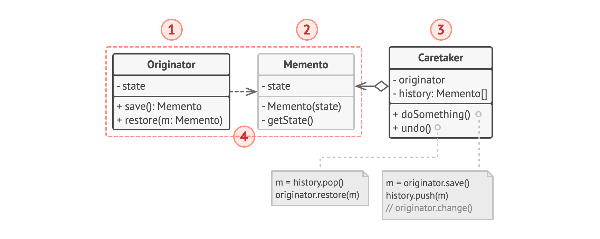
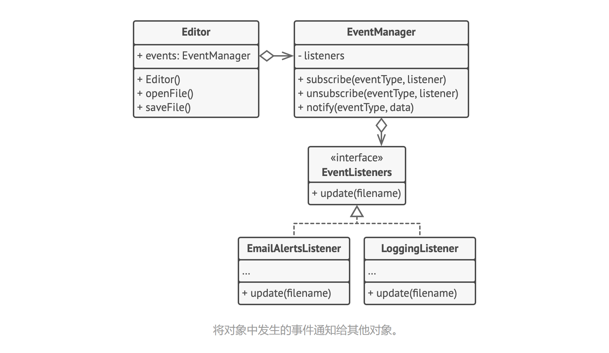

# 备忘录模式

Snapshot、Memento

允许在不暴露对象实现细节的情况下保存和恢复对象之前的状态。


## 问题

假如你正在开发一款文字编辑器。除了简单的文字编辑功能外，编辑器还要有设置文本格式和插入内嵌图片等功能。

后来，你决定让用户能撤销施加在文本上的任何操作。你选择采用直接的方式来实现该功能：程序在执行任何操作前会记录所有的对象状态，并将其保存下来。当用户此后需要撤销某个操作时，程序将从历史记录中获取最近的快照，然后使用它来恢复所有对象的状态。


首先，到底该如何生成一个快照呢？很可能你会需要遍历对象的所有成员变量并将其数值复制保存。但只有当对象对其内容没有严格访问权限限制的情况下，你才能使用该方式。不过，绝大部分对象会使用私有成员变量来存储重要数据，这样别人就无法轻易查看其中的内容。

假设对象都公开其所有状态。尽管这种方式能够解决当前问题，让你可随时生成对象的状态快照，但这种方式仍存在一些严重问题。未来你可能会添加或删除一些成员变量。听上去简单，但需要对负责复制受影响对象状态的类进行更改。

还有编辑器状态的实际快照，它需要包含哪些数据？至少必须包含实际的文本、光标坐标和当前滚动条位置等。你需要收集这些数据并将其放入特定容器中，才能生成快照。

你很可能会将大量的容器对象存储在历史记录列表中。这样容器最终大概率会成为同一个类的对象。这个类中几乎没有任何方法，但有许多与编辑器状态一一对应的成员变量。为了让其他对象能保存或读取快照，你很可能需要将快照的成员变量设为共有。无论这些状态是否私有，其都将暴露一切编辑器状态。其他类会对快照类的每个小改动产生依赖，除非这些改动仅存在于私有成员变量或方法中，而不会影响外部类。

我们似乎走进了一条死胡同：要么会暴露类的所有内部细节而使其过于脆弱；要么会限制对其状态的访问权限而无法生成快照。那么，还有其他方式来实现撤销功能吗？


## 解决方案

我们刚才遇到的所有问题都是封装破损造成的。一些对象试图做超出其职责范围的工作。由于在执行某些行为时需要获取数据，所以它们侵入了其他对象的私有空间，而不是让这些对象来完成实际的工作。

备忘录模式将创建状态快照（Snapshot）的工作委派给实际状态的拥有者原发器（Originator）对象。这样其他对象就不再需要从外部复制编辑器状态了，编辑器类拥有其状态的完全访问权，因此可以自行生成快照。

模式建议将对象状态的副本存储在一个名为备忘录（Memento）的特殊对象中。除了创建备忘录的对象外，任何对象都不能访问备忘录的内容。其他对象必须使用受限接口与备忘录进行交互，它们可以获取快照的元数据（创建时间和操作名称等），但不能获取快照中原始对象的状态。


这种限制策略允许你将备忘录保存在通常被称为负责人（Caretakers）的对象中。由于负责人仅通过受限接口与备忘录互动，故其无法修改存储在备忘录内部的状态。同时，原发器拥有对备忘录所有成员的访问权限，从而能随时恢复其以前的状态。

在文字编辑器的示例中，我们可以创建一个独立的历史类（History）作为负责人。编辑器每次执行操作前，存储在负责人中的备忘录栈都会生长。你甚至可以在应用的 UI 中渲染该栈，为用户显示之前的操作历史。

当用户触发撤销操作时，历史类将从栈中取回最近的备忘录，并将其传递给编辑器以请求进行回滚。由于编辑器拥有对备忘录的完全访问权限，因此它可以使用从备忘录中获取的数值来替换自身的状态。


## 结构



**基于嵌套类的实现**

该模式的经典实现方式依赖于许多流行语言（例如 C++、C# 和 Java）所支持的嵌套类。

1. 原发器（Originator）类可以生成自身状态的快照，也可以在需要时通过快照恢复自身状态。

2. 备忘录（Memento）是原发器状态快照的值对象（value object）。通常做法是将备忘录设为不可变的，并通过构造函数一次性传递数据。

3. 负责人（Caretaker）仅知道何时和为何捕捉原发器的状态，以及何时恢复状态。

   负责人通过保存备忘录栈来记录原发器的历史状态。当原发器需要回溯历史状态时，负责人将从栈中获取最顶部的备忘录，并将其传递给原发器的恢复（restoration）方法。

4. 在该实现方法中，备忘录类将被嵌套在原发器中。这样原发器就可访问备忘录的成员变量和方法，即使这些方法被声明为私有。另一方面，负责人对于备忘录的成员变量和方法的访问权限非常有限：它们只能在栈中保存备忘录，而不能修改其状态。


**基于中间接口的实现**

另一种实现方法适用于不支持嵌套类的编程语言（PHP）。

1. 在没有嵌套类的情况下，你可以规定负责人仅可通过明确声明的中间接口与备忘录互动，该接口仅声明与备忘录元数据相关的方法，限制其对备忘录成员变量的直接访问权限。
2. 另一方面，原发器可以直接与备忘录对象进行交互，访问备忘录类中声明的成员变量和方法。这种方式的缺点在于你需要将备忘录的所有成员变量声明为公有。

**封装更加严格的实现**


如果不想让其他类有任何机会通过备忘录来访问原发器的状态，那么还有另一种可用的实现方式。

1. 这种实现方式允许存在多种不同类型的原发器和备忘录。每种原发器都和其相应的备忘录类进行交互。原发器和备忘录都不会将其状态暴露给其他类。
2. 负责人此时被明确禁止修改存储在备忘录中的状态。但负责人类将独立于原发器，因为此时恢复方法被定义在了备忘录类中。
3. 每个备忘录将与创建了自身的原发器连接。原发器会将自己及状态传递给备忘录的构造函数。由于这些类之间的紧密联系，只要原发器定义了合适的设置器（setter），备忘录就能恢复其状态。


## 伪代码


本例结合使用了命令模式与备忘录模式，可保存复杂文字编辑器的状态快照，并能在需要时从快照中恢复之前的状态。

命令（command）对象将作为负责人，它们会在执行与命令相关的操作前获取编辑器的备忘录。当用户试图撤销最近的命令时，编辑器可以使用保存在命令中的备忘录来将自身回滚到之前的状态。

备忘录类没有声明任何共有的成员变量、获取器（getter）和设置器，因此没有对象可以修改其内容。备忘录与创建自己的编辑器相连接，这使得备忘录能够通过编辑器对象的设置器传递数据，恢复与其相连接的编辑器的状态。由于备忘录与特定的编辑器对象相连接，程序可以使用中心化的撤销栈实现对多个独立编辑器窗口的支持。

```pseudocode
// 原发器中包含了一些可能会随时间变化的重要数据。它还定义了在备忘录中保存
// 自身状态的方法，以及从备忘录中恢复状态的方法
class Editor is
	private field text, curX, curY, selectionWidth
	
	method setText(text) is
		this.text = text
		
	method setCursor(x, y) is
		this.curX = x
		this.curY = y
		
	method setSelectionWidth(width) is
		this.selectionWidth = width
		
	// 在备忘录中保存当前的状态
	method createSnapshot():Snapshot is
		// 备忘录是不可变得对象；因此原发器会将自身状态作为参数传递给备忘
		// 录的构造函数。
		return new Snapshot(this, text, curX, curY, selectionWidth)

// 备忘录类保存有编辑器的过往状态
class Snapshot is
	private field editor: Editor
	private field text, curX, curY, selectionWidth
	
	constructor Snapshot(editor, text, curX, curY, selectionWidth) is
		this.editor = editor
		this.text = text
		this.curX = x
		this.curY = y
		this.selectionWidth = selectionWidth
		
	// 在某一时刻，编辑器之前的状态可以使用备忘录对象来恢复
	method restore() is
		editor.setText(text)
		editor.setCursor(curX, curY)
		editor.setSelectionWidth(selectionWidth)
		
// 命令对象可作为负责人。在这种情况下，命令会在修改原发器状态之前获取一个
// 备忘录。当需要撤销时，它会从备忘录中恢复原发器的状态
class Command is
	private field backup: Snapshot
	
	method makeBackup() is
		backup = editor.createSnapshot()
		
	method undo() is
		if (backup != null)
			backup.restore()
	// ...
```


## 适用场景

- 当你需要创建对象状态快照来恢复其之前的的状态时，可以使用备忘录模式。

  备忘录模式允许你复制对象中的全部状态（包括私有成员变量），并将其独立于对象进行保存。尽管大部分人因为撤销这个用例才记得该模式，但其实它在处理事务（比如需要在出现错误时回滚一个操作）的过程中也必不可少。

- 当直接访问对象的成员变量、获取器或设置器将导致封装被突破时，可以使用该模式。

  备忘录让对象自行负责创建其状态的快照。任何其他对象都不能读取快照，这有效地保障了数据的安全性。


## 实现方式

1. 确定担任原发器角色的类。重要的是明确程序使用的一个原发器中心对象，还是多个较小的对象。

2. 创建备忘录类。逐一声明对应每个原发器成员变量的备忘录成员变量。

3. 将备忘录类设为不可变。备忘录只能通过构造函数一次性接受数据。该类中不能包含设置器。

4. 如果你所使用的编程语言支持嵌套类，则可将备忘录嵌套在原发器中；如果不支持，那么你可从备忘录类中抽取一个空接口，然后让他所有对象通过接口来引用备忘录。你可在该接口中添加一些元数据操作，但不能暴露原发器的状态。

5. 在原发器中添加一个创建备忘录的方法。原发器必须通过备忘录构造函数的一个或多个实际参数来自身状态传递给备忘录。

   该方法返回结果的类型必须是你在上一步中抽取的接口（如果你已经抽取了）。实际上，创建备忘录的Fha必须直接与备忘录类进行交互。

6. 在原发器类中添加一个用于恢复自身状态的方法。该方法接受备忘录对象作为参数。如果你在之前的步骤中抽取了接口，那么可将接口作为参数的类型。在这种情况下，你需要将输入对象强制转换为备忘录，因为原发器需要拥有该对象的完全访问权限。

7. 无论负责人是命令对象、历史记录或其他完全不同的东西，它都必须要知道何时向原发器请求新的备忘录、如何存储备忘录以及使用特定备忘录来对原发器进行恢复。

8. 负责人与原发器之间的连接可以移动到备忘录类中。在本例中，每个备忘录都必须与创建自己的原发器相连接。恢复方法也可以移动到备忘录类中，但只有当备忘录嵌套在原发器中，或者原发器类提供了足够多的设置器并可对其状态进行重写时，这种方式才能实现。


## 优缺点

- 你可以在不破坏对象封装情况的前提下创建对象状态快照。
- 你可以通过让负责人维护原发器状态历史记录来简化原发器代码。
- 如果客户端过于频繁地创建备忘录，程序将消耗大量内存。
- 负责人必须完整跟踪原发器的生命周期，这样才能销毁弃用的备忘录。
- 绝大部分动态编程语言（例如 PHP、Python 和 JavaScript）不能确保备忘录中的状态不被修改。


## 与其他模式之间的关系

- 你可以同时使用命令模式和备忘录模式来实现撤销。这种情况下，命令用于对目标对象执行各种不同的操作，备忘录用来保存一条命令执行前该对象的状态。
- 你可以同时使用备忘录和迭代器模式来获取当前迭代器的状态，并且在需要的时候进行回滚。
- 有时候原型模式可以作为备忘录的一个简化版本，其条件是你需要在历史记录中存储的对象的状态比较简单，不需要链接其他外部资源，或者链接可以方便地重建。


# 观察者模式

Event-Subscriber、Listener、Observer

允许你定义一种订阅机制，可在对象事件发生时通知多个 “观察” 该对象的其他对象。


## 问题

假如你有两种类型的对象：顾客和商店。顾客对某个特定品牌的产品非常感兴趣，而该产品很快将会在商店里出售。

顾客可以每天来商店看看产品是否到货。但如果商品尚未到货时，绝大多数来到商店的顾客都会空手而归。


另一方面，每次新产品到货时，商店可以向所有顾客发送邮件（可能会被视为垃圾邮件）。这样，部分顾客就无需反复前往商店了，但也有可能会惹恼对新产品没有兴趣的其他顾客。

我们似乎遇到了一个矛盾：要么让顾客浪费时间检查产品是否到货，要么让商店浪费资源去通知没有需求的顾客。


## 解决方案

拥有一些值得关注的状态的对象通常被称为目标，由于它要将自身的状态改变通知给其他对象，我们也将其称为发布者（publisher）。所有希望关注发布者状态变化的其他对象被称为订阅者（subscribers）。

观察者模式建议你为发布者类添加订阅机制，让每个对象都能订阅或取消订阅发布者事件流。这并不像听上去那么复杂。实际上，该机制包括 1）一个用于存储订阅者对象引用的列表成员变量；2）几个用于添加或删除该列表中订阅者的公有方法。


现在，无论何时发生了重要的发布者事件，它都要遍历订阅者并调用其对象的特定通知方法。

实际应用中可能会有十几个不同的订阅者类跟踪者同一个发布者类的事件，你不会希望发布者与所有这些类相耦合的。此外如果他人会使用发布者类，那么你甚至可能会对其中的一些类一无所知。

因此，所有订阅者都必须实现同样的接口，发布者仅通过该接口与订阅者交互。接口中必须声明通知方法及其参数，这样发布者在发出通知时还能传递一些上下文数据。


## 结构


1. 发布者（Publisher）会向其他对象发送值得关注的事件。事件会在发布者自身状态改变或执行特定行为后发生。发布者中包含一个允许新订阅者加入和当前订阅者离开列表的订阅架构。
2. 当新事件发生时，发送者会遍历订阅列表并调用每个订阅者对象的通知方法。该方法是在订阅者接口中声明的。
3. 订阅者（Subscriber）接口声明了通知接口。在绝大多数情况下，该接口仅包含一个 update 方法。该方法可以拥有多个参数，使发布者能在更新时传递事件的详细信息。
4. 具体订阅者（Concrete Subscriber）可以执行一些操作来回应发布者的通知。所有具体订阅者类都实现了同样的接口，因此发布者不需要与具体类相耦合。
5. 订阅者通常需要一些上下文信息来正确地处理更新。因此，发布者通常会将一些上下文数据作为通知方法的参数进行传递。发布者也可将自身作为参数进行传递，使订阅者直接获取所需的数据。
6. 客户端（Client）会分别创建发布者和订阅者对象，然后为订阅者注册发布者更新。


## 伪代码



本例中，观察者模式允许文本编辑器对象将自身的状态改变通知给其他服务对象。

订阅者列表是动态生成的：对象可在运行时根据程序需要开始或停止监听通知。

在本实现中，编辑器类自身并不维护订阅列表。它将工作委派给专门从事此工作的一个特殊帮手对象。你还可将该对象升级为中心化的事件分发器，允许任何对象成为发布者。

只要发布者通过同样的接口与所有订阅者进行交互，那么在程序中新增订阅者时就无需修改已有发布者类的代码。

```pseudocode
// 发布者基类包含订阅管理代码和通知方法
class EventManager is
	private field listeners: has map of event types and listeners
	
	method subscribe(eventType, listener) is
		listeners.add(eventType, listener)
	
	method unsubscribe(eventType, listener) is
		listeners.remove(eventType, listener)
		
	mothod notify(eventType, data) is
		foreach (listener in listeners.of(eventType)) do
			listener.update(data)
			
// 具体发布者包含一些订阅者感兴趣的实际业务逻辑。我们可以从发布者基类中
// 扩展出该类，但在实际情况下并不总能做到，因为具体发布者可能已经是子类了。
// 在这种情况下，你可用组合来修补订阅逻辑，就像我们在这里做的一样。
class Editor is
	public field events: EventManager
	private field file: File
	
	constructor Editor() is
		events = new EventManager()
		
	// 业务逻辑的方法可将变化通知给订阅者
	method openFile(path) is
		this.file = new File(path)
		events.notify("open", file.name)
	
	method saveFile() is
		file.write()
		events.notify("save", file.name)
		
	// ...
	
	
// 这里是订阅者接口。如果你的编程语言支持函数类型，则可用一组函数来代替
// 整个订阅者的层次结构
interface EventListener is
	method update(filename)


// 具体订阅者会对其注册的发布者所发出的更新消息做出响应
class LoggingListener implements EventListener is
	private field log: File
	private field message: string
	
	constructor LoggingListener(log_filename, message) is
		this.log = new File(log_filename)
		this.message = message
	
	method update(filename) is
		log.write(replace('%s', filename, message))
	
class EmailAlertsListener implements EventListener is
	private field email: string
	private field message: string
	
	constructor EmailAlertsListener(email, message) is
		this.email = email
		this.message = message
		
	method update(filename) is
		system.email(email, replace('%s', filename, message))
		
		
// 应用程序可在运行时配置发布者和订阅者
class Application is
	method config() is
		editor = new Editor()
		
		logger = new LoggingListener("/path/to/log.txt","有人打开了文件：%s");
		editor.events.subscribe("open", logger)
		
		emailAlerts = new EmailAlertsListener("/path/to/log.txt","有人打开了文件：%s");)
		editor.events.subscribe("save", emailAlerts)
            
```


## 适用场景

- 当一个对象的状态改变需要改变其他对象，或实际对象是事先未知的或动态变化的时，可使用观察者模式。

  当你使用图形用户界面时通常会遇到一个问题。比如，你创建了自定义按钮类并允许客户端在按钮中注入自定义代码，这样当用户按下按钮时就会触发这些代码。

  观察者模式允许任何实现了订阅者接口的对象订阅发布者对象的事件通知。你可在按钮中添加订阅机制，允许客户端通过自定义订阅类注入自定义代码。

- 当应用中的一些对象必须观察其他对象时，可使用该模式。但仅能在有限时间内或特定情况下使用。

  订阅列表是动态的，因此订阅者可随时加入或离开该列表。

  

## 实现方式

1. 仔细检查你的业务逻辑，试着将其拆分为两个部分：独立于其他代码的核心功能讲作为发布者；其他代码则将转化为一组订阅类。

2. 声明订阅者接口。该接口至少应声明一个 update 方法。

3. 声明发布者接口并定义一些接口来在列表中添加和删除订阅对象。记住发布者必须仅通过订阅者接口与它们进行交互。

4. 确定存放实际订阅列表的位置并实现订阅方法。通常所有类型的发布者代码看上去都一样，因此将列表放置在直接扩展自发布者接口的抽象类是显而易见的。具体发布者会扩展该类从而继承所有的订阅行为。

   但是，如果你需要在现有的类层次结构中应用该模式，则可以考虑使用组合的方式：将订阅逻辑放入一个独立的对象，然后让所有实际订阅者使用该对象。

5. 创建具体发布者类。每次发布者发生了重要事件时都必须通知所有的订阅者。

6. 在具体订阅者类中实现通知更新的方法。绝大部分订阅者需要一些与事件相关的上下文数据。这些数据可作为通知方法的参数来传递。

   但还有另一种选择。订阅者接收到通知后直接从通知中获取所有数据。在这种情况下，发布者必须通过更新方法将自身传递出去。另一种不太灵活的方式是通过构造函数将发布者与订阅者永久性地连接起来。

7. 客户端必须生成所需的全部订阅者，并在相应的发布者处完成注册工作。


## 优缺点

- 开闭原则。你无需修改发布者代码就能引入新的订阅者类（如果是发布者接口则可轻松引入发布者类）。
- 你可以在运行时建立对象之间的联系。
- 订阅者的通知顺序是随机的。


## 与其他模式之间的关系

- 责任链模式、命令模式、中介者模式和观察者模式用于处理请求发送者和接收者之间的不同连接方式：

  - 责任链按照顺序将请求动态传递给一系列的潜在接收者，直至其中一名接收者对请求进行处理。
  - 命令在发送者和请求者之间建立单向连接。
  - 中介者清除了发送者和请求者之间的直接连接，强制它们通过一个中介对象进行间接沟通。
  - 观察者允许接收者动态地订阅或取消接收请求。

- 中介者和观察者之间的区别往往很难记住。在大部分情况下，你可以使用其中一种模式，而有时可以同时使用。

  中介者的主要目标是消除一系列系统组件之间的相互依赖。这些组件将依赖于同一个中介者对象。观察者的目标是在对象之间建立动态的单向连接，使得部分对象可作为其他对象的附属发挥作用。

  有一种流行的中介者模式实现方式依赖于观察者。中介者对象担当发布者的角色，其他组件则作为订阅者，可以订阅中介者的事件或取消订阅。当中介者以这种方式实现时，它可能看上去与观察者非常相似。

  当你感到疑惑时，记住可以采用其他方式来实现中介者。例如，你可永久性地将所有组件链接到同一个中介者大对象。这种实现方式和观察者并不相同，但这仍是一种中介者模式。

  假设有一个程序，其所有的组件都变成了发布者，它们之间可以相互建立动态连接。这样程序中就没有中心化的中介者对象，而只有一些分布式的观察者。


# 状态模式

State

让你能在一个对象的内部状态变化时改变其行为，使其看上去就像改变了自身所属的类一样。


## 问题

状态模式与有限状态机的概念紧密相关。


其主要思想是程序在任意时刻仅可处于几种有限的状态中。在任何一个特定状态中，程序的行为都不相同，且可瞬间从一个状态切换到另一个状态。不过，根据当前状态了，程序可能会切换到另外一种状态，也可能会保持当前状态不变。这些数量有限且预先定义的状态切换规则被称为转移。

你还可将该方法应用在对象上。假如你有一个文档 Document 类。文档可能会处于草稿 Draft、审阅中 Moderation 和已发布 Published 三种状态中的一种。文档的 publish 发布方法在不同状态下的行为略有不同：

- 处于草稿状态时，它会将文档转移到审阅中状态。
- 处于审阅中状态时，如果当前用户是管理员，它会公开发布文档。
- 处于已发布状态时，它不会进行任何操作。


状态机通常由众多条件运算符 if 或 switch 实现，可根据对象的当前状态选择相应的行为。状态通常只是对象中的一组成员变量值。即使你之前从未听说过有限状态机，你也很可能已经实现过状态模式。下面代码应该能够帮助你回忆起来。

```
class Document is
	field state: string
	// ...
	method publish() is
		switch (state)
			"draft":
				state = "moderation"
				break
			"moderation":
				if (currentUser.role == "admin")
					state = "published"
				break
			"published":
				// do nothing
				break
	// ...
```

当我们逐步在文档类中添加更多状态和依赖于状态的行为后，基于条件语句的状态机就会暴露其最大的弱点。为了能根据当前状态选择完成相应行为的方法，绝大部分方法中会包含复杂的条件语句。修改其转换逻辑可能会涉及到修改所有方法中的状态条件语句，导致代码的维护工作非常艰难。

这个问题会随着项目进行变得越发严重。我们很难在设计阶段预测到所有可能的状态和转换。随着时间推移，最初仅包含有限条件语句的间接状态机可能会变成臃肿的一团乱麻。


## 解决方案

状态模式建议为对象的所有可能状态新建一个类，然后将所有状态的对应行为抽取到这些类中。

原始对象被称为上下文（context），它并不会自行实现所有行为，而是会保存一个指向表示当前状态的状态对象的引用，且将所有与状态相关的工作委派给该对象。


如需将上下文转换为另一种状态，则需将当前活动的状态对象替换为另外一个代表新状态的对象。采用这种方式是有前提的：所有状态类都必须遵循同样的接口，而且上下文必须仅通过接口与这些对象进行交互。

这个接口可能看上去与策略模式相似，但有一个关键性的不同。在状态模式中，特定状态知道其他所有状态的存在，且能触发从一个状态到另一个状态的转换；策略则几乎完全不知道其他策略的存在。

智能手机的按键和开关会根据设备当前状态完成不同行为：

- 当手机处于解锁状态时，按下按键将执行各种功能。
- 当手机处于锁定状态时，按下任何按键都将解锁屏幕。
- 当手机电量不足时，按下任何按键都将显示充电页面。


## 结构


1. 上下文（Context）保存了对于一个具体状态对象的引用，并会将所有与该状态相关的工作委派给它。上下文通过状态接口与状态对象交互，且会提供一个设置器用于传递新的状态对象。

2. 状态（State）接口会声明特定于状态的方法。这些方法应能被其他所有具体状态所理解，因为你不希望某些状态所拥有的方法永远不会被调用。

3. 具体状态（Concrete States）会自行实现特定于状态的方法。为了避免多个状态中包含相似代码，你可以提供一个封装有部分通用行为的中间抽象类。

   状态对象可存储对于上下文对象的反向引用。状态可以通过该引用从上下文处获取所需信息，并且能触发状态转移。

4. 上下文和具体状态都可以设置上下文的下个状态，并可通过替换连接到上下文的状态对象来完成实际的状态转换。


## 伪代码


本例中，状态模式将根据当前回放状态，让媒体播放器中的相同控件完成不同的行为。

播放器的主要对象总是会连接到一个负责播放器绝大部分工作的状态对象中。部分操作会更换播放器当前的状态对象，以此改变播放器对于用户互动所作出的反应。

```pseudocode
// AudioPlayer 类即为上下文。它还会维护指向状态类实例的引用，
// 该状态类则用于表示音频播放器当前的状态。
class AudioPlayer is
	field state: State
	field UI, volume, playlist, currentSong
	
	constructor AudioPlayer() is
		this.state = new ReadyState(this)
		
		// 上下文会将处理用户输入的工作委派给状态对象。由于每个状态都以
		// 不同的方式处理输入，其结果自然将依赖于当前所处的状态。
		UI = new UserInterface()
		UI.lockButton.onClick(this.clickLock)
		UI.playButton.onClick(this.clickPlay)
		UI.nextButton.onClick(this.clickNext)
		UI.prevButton.onClick(this.clickPrevious)
		
	// 其他对象必须能切换音频播放器当前所处的状态
	method changeState(state: State) is
		this.state = state
		
	// UI 方法会将执行工作委派给当前状态
	method clickLock() is
		state.clickLock()
	method clickPlay() is
		state.clickPlay()
	method clickNext() is
		state.clickNext()
	method clickPrevious() is
		state.clickPrevious()
		
	// 状态可调用上下文的一些服务方法
	method startPlayback() is
		// ...
	method stopPlayback() is
		// ...
	method nextSong() is
		// ...
	method previousSong() is
		// ...
	method fastForward(time) is
		// ...
	method rewind(time) is
		// ...
		
	
// 所有具体状态类都必须实现状态基类声明的方法，并提供反向引用指向与状态
// 相关的上下文对象。状态可使用反向引用将上下文转换为另一个状态。
abstract class State is
	protected field player: AudioPlayer
	
	// 上下文将自身传递给状态构造函数。这可帮助状态在需要时获取一些有用的
	// 上下文数据。
	constructor State(player) is
		this.player = player
	
	abstract method clickLock()
	abstract method clickPlay()
	abstract method clickNext()
	abstract method clickPrevious()
	
	
// 具体状态会实现与上下文状态相关的多种行为
class LockedState extends State is
	
	// 当你解锁一个锁定的播放器时，它可能处于两种状态之一。
	method clickLock() is
		if (player.playing)
			player.changeState(new PlayingState(player))
		else
			player.changeState(new ReadyState(player))
			
	method clickPlay() is
		// already locked，do nothing
	
	method clickNext() is
		// already locked，do nothing
		
	method clickPrevious() is
		// already locked，do nothing
		
		
// 它们还可在上下文中触发状态转换
class ReadyState extends State is
	method clickLock() is
		player.changeState(new LockedState(player))
		
	method clickPlay() is
		player.startPlayback()
		player.changeState(new PlayingState(player))
		
	method clickNext() is
		player.nextSong()
		
	method clickPrevious() is
		player.previousSong()
		

class PlayingState extends State is
	method clickLock() is
		player.changeState(new LockedState(player))
		
	method clickPlay() is
		player.stopPlayback()
		player.changeState(new ReadyState(player))
		
	method clickNext() is
		if (event.doubleclick)
			player.nextSong()
		else
			player.fastForward(5)
		
	method clickPrevious() is
		if (event.doubleclick)
			player.previous
		else
			player.rewind(5)
```


## 适用场景

- 如果对象需要根据自身当前状态进行不同行为，同时状态的数量非常多且与状态相关的代码会频繁变更的话，可使用状态模式。

  模式建议你将所有特定于状态的代码抽取到一组独立的类中。这样你可以在独立于其他状态的情况下添加新状态或修改已有状态，从而减少维护成本。

- 如果某个类需要根据成员变量的当前值改变自身行为，从而需要使用大量的条件语句时，可使用该模式。

  状态模式会将这些条件语句的分支抽取到相应状态类的方法中。同时，你还可以清除主要类中与特定状态相关的临时成员变量和帮手方法代码。

- 当相似状态和基于条件的状态机转换中存在许多重复代码时，可使用状态模式。

  状态模式让你能够生成状态类层次结构，通过将共用代码抽取到抽象基类中来减少重复。


## 实现方式

1. 确定哪些类是上下文。它可能是包含依赖于状态的代码的已有类；如果特定于状态的代码分散在多个类中，那么它可能是一个新的类。

2. 声明状态接口。虽然你可能会需要完全复制上下文中声明的所有方法，但最好是仅把关注点放在那些可能包含特定于状态的行为的方法上。

3. 为每个实际状态创建一个继承于状态接口的类。然后检查上下文中的方法并将与特定状态相关的所有代码抽取到新建的类中。

   再将代码移动到状态类的过程中，你可能会发它依赖于上下文中的一些私有成员。你可以采用一下几种变通方式：

   - 将这些成员变量或方法设为共有。
   - 将需要抽取的上下文行为更改为上下文中的公有方法，然后在状态类中调用。这种方式简陋却便捷，你可以稍后再对其进行修补。
   - 将状态类嵌套在上下文类中。这种方式需要你所使用的编程语言支持嵌套类。

4. 在上下文类中添加一个状态接口类型的引用成员变量，以及一个用于修改该成员变量值的公有设置器。

5. 再次检查上下文中的方法，将空的条件语句替换为相应的状态对象方法。

6. 为切换上下文状态，你需要创建某个状态类实例并将其传递给上下文。你可以在上下文、各种状态或客户端中完成这项工作。无论在何处完成这项工作，该类都将依赖于其所实例化的具体类。


## 优缺点

- 单一职责原则。将与特定状态相关的代码放在单独的类中。
- 开闭原则。无需修改已有状态类和上下文就能引入新状态。
- 通过消除臃肿的状态机条件语句简化上下文代码。
- 如果状态机只有很少的几个状态，或者很少发生改变，那么应用该模式可能会显得小题大作。


## 与其他模式之间的关系

- 桥接模式、状态模式和策略模式（在某种程度上包括适配器模式）模式的接口非常相似。实际上，它们都基于组合模式，即将工作委派给其他对象，不过也各自解决了不同的问题。模式并不只是以特定方式组织代码的配方，你还可以使用它们来和其他开发者讨论模式所解决的问题。
- 状态可被视为策略的扩展。两者都基于组合机制：它们都通过将部分工作委派给帮手对象来改变其在不同情景下的行为。策略使得这些对象相互之间完全独立，它们不知道其他对象的存在。但状态模式没有限制具体状态之间的依赖，且允许它们自行改变在不同情景下的状态。
