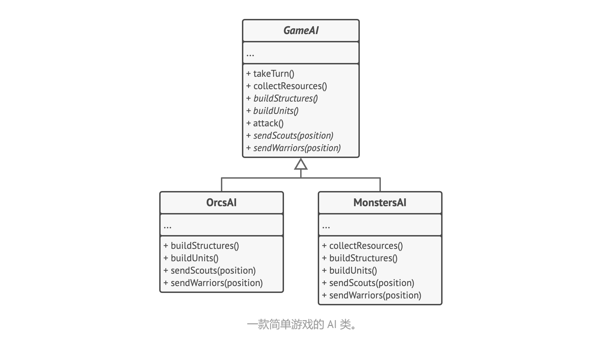

# 策略模式

Strategy

它能让你定义一系列算法，并将每种算法分别放入独立的类中，以使算法的对象能够相互替换。


## 问题

你打算为游客们创建一款导游程序。该程序的核心功能是提供美观的地图，以帮助用户在任何城市中快速定位。用户期待的程序新功能是自动路线规划：他们希望输入地址后就能在地图上看到前往目的地的最快路线。

程序的首个版本只能规划公路路线。驾车旅行的人很满意。但是并非所有人都会在度假时开车。因此你在下次更新时添加了规划步行路线的功能。此后，你又添加了规划公共交通路线的功能。而这只是个开始。不久后，你又要为骑行者规划路线。过了一段时间，你又要为浏览城市中的所有景点规划路线。

尽管从商业角度看，这款应用非常成功，但其技术部分会让你非常头疼：每次添加新的路线规划算法后，导游应用中主要类的体积就会增加一倍。终于在某个时候，你觉得自己没法继续维护这堆代码了。

无论是修复简单缺陷还是微调街道权重，对某个算法进行任何秀登录都会影响整个类，从而增加在已有正常运行代码中引入错误的风险。

此外，团队合作将变得低效。如果你在应用成功发布后招不了团队成员，它们会抱怨在合并冲突的工作上花费太多时间。在实现新功能的过程中，你的团队需要修改同一个巨大的类，这样他们编写的代码相互之间就可能会出现冲突。


## 解决方案

策略模式建议找出负责用许多不同方式完成特定任务的类，然后将其中的算法抽取到一组被称为策略的独立类中。

名为上下文的原始类必须包含一个成员变量来存储对于每种策略的引用。上下文并不执行任务，而是将工作委派给已连接的策略对象。

上下文不负责选择符合任务需要的算法，客户端会将所需策略传递给上下文。实际上，上下文并不十分了解策略，它会通过同样的通用接口与所有策略进行交互，而该接口只需暴露一个方法来触发所选策略中封装的算法即可。

因此，上下文可独立于具体策略。这样你就可在不修改上下文代码或其他策略的情况下添加新算法或修改已有算法了。


在导游应用中，每个路线规划算法都被抽取到只有一个 buildRoute 生成路线方法的独立类中。该方法接收起点和终点作为参数，并返回路线中途点的集合。

即使传递给每个路径规划类的参数一模一样，其所创建的路线也可能完全不同。主要导游类的主要工作是在地图上渲染一系列中途点，不会在意如何选择算法。该类还有一个车用于切换当前路径规划策略的方法，因此客户端（例如用户界面中的按钮）可用其他策略替换当前选择的路径规划行为。


## 结构


1. 上下文（Context）维护指向具体策略的引用，且仅通过策略接口与该对象进行交流。
2. 策略（Strategy）接口是所有具体策略的通用接口，它声明了一个上下文用于执行策略的方法。
3. 具体策略（Concrete Strategies）实现了上下文所用算法的各种不同变体。
4. 当上下文需要运行算法时，它会在其已连接的策略对象上调用执行方法。上下文不清楚其所涉及的策略类型与算法的执行方式。
5. 客户端（Client）会创建一个特定策略对象并将其传递给上下文。上下文则会提供一个设置器以便客户端在运行时替换相关联的策略。


## 伪代码

本例中，上下文使用了多个策略来执行不同的计算操作。

```pseudocode
// 策略接口声明了某个算法各个不同版本间所共有的操作。上下文会使用该接口
// 来调用具体策略定义的算法
interface Strategy is
	method execute(a, b)
	
// 具体策略会在遵循策略基础接口的情况下实现算法。该接口实现了它们
// 在上下文中的互换性。
class ConreteStrategyAdd implements Strategy is
	method execute(a, b) is
		return a + b

class ConreteStrategySubtract implements Strategy is
	method execute(a, b) is
		return a - b
		
class ConreteStrategyMultiply implements Strategy is
	method execute(a, b) is
		return a * b
		
// 上下文定义了客户端关注的接口
class Context is
	// 上下文会维护指向某个策略对象的引用。上下文不知晓策略的具体类。
	// 上下文必须通过策略接口来与所有策略进行交互。
	private strategy: Strategy
	
	// 上下文通常会通过构造函数来接收策略对象，同时还提供设置器以便在运行时切换策略
	method setStrategy(Strategy strategy) is
		this.strategy = strategy
		
	// 上下文会将一些工作委派给策略对象，而不是自行实现不同版本的算法
	method executeStrategy(int a, int b) is
		return strategy.execute(a, b)

// 客户端代码会选择具体策略并将其传递给上下文。客户端必须知晓策略之间的
// 差异，才能做出正确的选择。
class ExampleApplication is
	method main() is
		// 创建上下文对象
		
		// 读取第一个数
		// 读取第二个数
		// 从用户输入中读取期望进行的行为
		
		if (aciton == addition) then
			context.setStrategy(new ConcreteStrategyAdd())
			
		if (aciton == subtraction) then
			context.setStrategy(new ConcreteStrategySubtract())
			
		if (aciton == multiplication) then
			context.setStrategy(new ConcreteStrategyMultiply())
			
		result = context.executeStrategy(first number, second number)
		
		打印结果
```


## 适用场景

- 当你想使用对象中各种不同的算法变体，并希望能在运行时切换算法时，可使用策略模式。

  策略模式让你能够将对象关联至可以不同方式执行特定子任务的不同子对象，从而以间接方式在运行时更改对象行为。

- 当你有许多仅在执行某些行为时略有不同的相似类时，可使用策略模式。

  策略模式让你能将不同行为抽取到一个独立类层次结构中，并将原始类组合成同一个，从而减少重复代码。

- 如果算法在上下文的逻辑中不是特别重要，使用该模式能将类的业务逻辑与其算法实现细节隔离开来。

  策略模式让你能将各种算法的代码、内部数据和依赖关系与其他代码隔离开来。不同客户端可通过一个简单接口执行算法，并能在运行时进行切换。

- 当类中使用了复杂条件运算符以在同一算法的不同变体中切换时，可使用该模式。

  策略模式将所有继承自同样接口的算法抽取到独立类中，因此不再需要条件语句。原始对象并不实现所有算法的变体，而是将执行工作委派给其中的一个独立算法对象。


## 实现方式

1. 从上下文类中找出修改频率较高的算法（也可能是用于在运行时选择某个算法变体的复杂条件运算符）。
2. 声明该算法所有变体的通用策略接口。
3. 将算法逐一抽取到各自的类中，它们都必须实现策略接口。
4. 在上下文类中添加一个成员变量用于保存对于策略对象的引用。然后提供设置器以修改该成员变量。上下文仅可通过策略接口同策略对象进行交互，如有需要还可定义一个接口来让策略访问其数据。
5. 客户端必须将上下文类与相应策略进行关联，是上下文可以预期的方式完成其主要工作。


## 优缺点

- 你可以在运行时切换对象内的算法。
- 你可以将算法的实现和使用算法的代码隔离开来。
- 你可以使用组合来代替继承。
- 开闭原则。你无需对上下文进行修改就能够引入新的策略。
- 如果你的算法极少发生改变，那么没有任何理由引入新的类和接口。使用该模式只会让程序过于复杂。
- 客户端必须知晓策略间的不同，它需要选择合适的策略。
- 许多现在编程语言支持函数类型功能，允许你在一组匿名函数中实现不同版本的算法。这样，你使用这些函数的方式就和使用策略对象时完全相同，无需借助额外的类和接口来保持代码简洁。


## 与其他模式之间的关系

- 桥接模式、状态模式和策略模式（在某种程度上包括适配器模式）模式的接口非常相似。实际上，它们都基于组合模式，即将工作委派给其他对象，不过也各自解决了不同的问题。模式并不只是以特定方式组织代码的配方，你还可以使用它们来和其他开发者讨论模式所解决的问题。
- 命令模式和策略看上去很像，因为两者都能通过某些行为来参数化对象。但是，它们的意图有非常大的不同。
  - 你可以使用命令来将任何操作转换为对象。操作的参数将成为对象的成员变量。你可以通过转换来延迟操作的执行、将操作放入队列、保存历史命令或者向远程服务发送命令等。
  - 另一方面，策略通常可用于描述完成某件事的不同方式，让你能够在同一个上下文类中切换算法。
- 装饰模式可让你更改对象的外表，策略则让你能够改变其本质。
- 模板方法基于继承机制：它允许你通过扩展子类中的部分内容来改变部分算法。策略基于组合机制：你可以通过对相应行为提供不同的策略来改变对象的部分行为。模板方法在类层次上运作，因此它是静态的。策略在对象层次上运作，因此允许在运行时切换行为。
- 状态可被视为策略的扩展。两者都基于组合机制：它们都通过将部分工作委派给帮手对象来改变其在不同情景下的行为。策略使得这些对象相互之间完全独立，它们不知道其他对象的存在。但状态模式没有限制具体状态之间的依赖，且允许它们自行改变在不同情景下的状态。


# 模板方法模式

Template Method

它在超类中定义了一个算法的框架，允许子类在不修改结构的情况下重写算法的特定步骤。


## 问题

假如你正在开发一款分析公司文档的数据挖掘程序。用户需要向程序输入各种格式（PDF、DOC 或 CSV）的文档，程序则会试图从这些文件中抽取有意义的数据，并以统一的格式将其返回给用户。

该程序的首个版本仅支持 DOC 文件。在接下来的一个版本中，程序能够支持 CSV 文件。一个月后，你又要让程序从 PDF 文件中抽取数据。


一段时间后，你发现这三个类中包含许多相似代码。尽管这些类处理不同数据格式的代码完全不同，但数据处理和分析的代码却几乎完全一样。如果能在保持算法结构完整的情况下去除重复代码，这难道不是一件很棒的事情吗？

还有另一个与使用这些类的客户端代码相关的问题：客户端代码中包含许多条件语句，以根据不同的处理对象类型选择合适的处理过程。如果所有处理数据的类都拥有相同的接口或基类，那么你就可以去除客户端代码中的条件语句，转而使用多态机制来处理对象上调用函数。


## 解决方案

模板方法模式建议将算法分解为一系列步骤，然后将这些步骤改写为方法，最后在模板方法中依次调用这些方法。步骤可以是抽象的，也可以有一些默认的实现。为了能够使用算法，客户端需要自行提供子类并实现所有的抽象步骤。如有必要还需重写一些步骤（但这一步中不包括模板自身）。

让我们考虑如何在数据挖掘应用中实现上述方案。我们可为图中的三个解析算法创建一个基类，该类将定义调用了一系列不同文档处理步骤的模板方法。


首先，我们将所有步骤声明为抽象类型，强制要求子类自行实现这些方法。例子中，子类中已有所有必要的实现，因此我们只需调整这些方法的签名，使之与超类的方法匹配即可。

现在，看看如何去除重复代码。对于不同的数据格式，打开和关闭文件以及抽取和解析数据的代码都不同，因此无需修改这些方法。但分析原始数据和生成报告等其他步骤的实现方式非常相似，因此可将其提取到基类中，以让子类共享这些代码。

正如你所看到的，我们有两种类型的步骤：

- 抽象步骤必须由各个子类来实现
- 可选步骤已有一些默认实现，但仍可在需要时进行重写

还有另一种名为钩子的步骤。钩子是内容为空的可选步骤。即使不重写钩子，模板方法也能工作。钩子通常放置在算法重要步骤的前后，为子类提供额外的算法扩展点。


模板方法可用于建造大量房屋。标准房屋建造方案中可提供几个扩展点，允许潜在房屋业主调整成品房屋的部分细节。每个建造步骤（例如打地基、建造框架、建造墙壁和安装水电管线等——都能进行微调，这使得成品房屋会略有不同。


## 结构


1. 抽象类（AbstractClass）会声明作为算法步骤的方法，以及依次调用它们的实际模板方法。算法步骤可以被声明为抽象类型，也可以提供一些默认实现。
2. 具体类（ConcreteClass）可以重写所有步骤，但不能重写模板方法自身。


## 伪代码



本例中的模板方法模式为一款简单策略游戏中人工智能的不同分支提供框架。

游戏中所有的重组都有几乎同类的单位和建筑。因此你可以在不同的种族上复用相同的 AI 结构，同时还需要具备重写一些细节的能力。通过这种方式，你可以重写半兽人的 AI 使其更富攻击性，也可以让人类侧重防守，还可以禁止怪物建造建筑。在游戏中新增种族需要创建新的 AI 子类，还需要重写 AI 基类中所声明的默认方法。

```pseudocode
// 抽象类定义了一个模板方法，其中通常会包含某个由抽象原语操作调用组成的
// 算法框架。具体子类会实现这些操作，但是不会对模板方法做出修改。
class GameAI is 
	// 模板方法定义了某个算法的框架
	method turn() is
		collectResources()
		buildStructures()
		buildUnits()
		attack()
		
	// 某些步骤可在基类中直接实现
	method collectResources() is
		foreach (s in this.buildStructures) do
			s.collect()
			
	// 某些可定义为抽象类型
	abstract method buildStructures()
	abstract method buildUnits()
	
	// 一个类可包含多个模板方法
	method attack() is
		enenmy = closestEnemy()
		if (enemy == null)
			sendScouts(map.center)
		else
			sendWarriors(enemy.position)
			
	abstract method sendScouts(position)
	abstract method sendWarriors(position)
	

// 具体类必须实现基类中的所有抽象操作，但是它们不能重写模板方法自身
class OrcsAI extends GameAI is
	method buildStructures() is
		if (there are some resources) then
			// 建造农场，接着是谷仓，然后是要塞
		
	method buildUnits() is
		if (there are plenty of resources) then
			if (there are no scouts)
				// 建造苦工，将其加入侦查组
			else
				// 建造步兵，将其加入战士组
			
	// ...
	
	method sendScouts(position) is
		if (scouts.length > 0) then
			// 将侦查组送到指定位置
	
	method sendWarriors(position) is
		if (warriors.length > 5) then
			// 将战斗组送到指定位置
	

// 子类可以重写部分默认的操作
class MonstersAI extends GameAI is
	method collectResources() is
		// 怪物不会采集资源
		
	method buildStructures() is
		// 怪物不会建造建筑
		
	method buildUnits() is
		// 怪物不会建造单位
```


## 适用场景

- 当你只希望客户端扩展某个特定算法步骤，而不是整个算法或其结构时，可使用模板方法模式。

  末班方法将整个算法转换为一系列独立的步骤，以便子类能对其进行扩展，同时还可让超类中所定义的结构保持完整。

- 当多个类的算法除一些细微不同之外几乎完全一样时，你可使用该模式。但其后果是，只要算法发生变化，你就可能需要修改所有的类。

  在将算法转换为模板方法时，你可将相似的实现步骤提取到超类中以去除重复代码。子类间各不同的代码可继续保留在子类中。


## 实现方式

1. 分析目标算法，确定能否将其分解为多个步骤。从所有子类的角度触发，考虑那些步骤能够通用，那些步骤各不相同。
2. 创建抽象基类并声明一个模板方法和代表算法步骤的一系列抽象方法。在模板方法中根据算法结构一次调用相应步骤。可用 final 修饰模板方法以防止子类对其进行重写。
3. 虽然可将所有步骤全都设为抽象类型，但默认实现可能会给部分步骤带来好处，因为子类无需实现哪些方法。
4. 可考虑在算法的关键步骤之间添加钩子。
5. 为每个算法变体新建一个具体子类，它必须实现所有的抽象步骤，也可以重写部分可选步骤。


## 优缺点

- 你可仅允许客户端重写一个大型算法中的特定部分，使得算法其他部分修改对其所造成的影像减小。
- 你可将重复代码提取到一个超类中。
- 部分客户端可能会受到算法框架的限制。
- 通过子类抑制默认步骤实现可能会违反里氏替换原则。
- 模板方法中的步骤越多，其维护工作就可能会越困难。


## 与其他模式之间的关系

- 工厂方法模式是模板方法模式的一种特殊形式。同时，工厂方法可以作为大型模板方法的一个步骤。
- 模板方法基于继承机制：它允许你通过扩展子类中的部分内容来改变部分算法。策略模式基于组合机制：你可以通过对相应行为提供不同的策略来改变对象的部分行为。模板方法在类层次上运作，因此它是静态的。策略在对象层次上运作，因此允许在运行时切换行为。


# 访问者模式

Visitor

它能将算法与其所作用的对象隔离起来。


## 问题

假如你的团队开发了一款能够使用巨型图像中地理信息的应用程序。图像中的每个节点既能代表复杂实体（例如一座城市），也能代表更精细的对象（例如工业区和旅游景点等）。如果节点代表的真实对象之间存在公路，那么这些节点就会相互连接。在程序内部，每个节点的类型都由其所属的类来表示，每个特定的节点则是一个对象。


一段时间后，你接到了实现将图像导出到 XML 文件中的任务。这些工作最初看上去很简单。你计划为每个节点类添加导出函数，然后递归执行图像中的每个节点的导出函数。解决方案简单且优雅：使用多态机制可以让导出方法的调用代码不会和具体的节点类相耦合。

但是，系统架构师拒绝批准对已有节点类进行修改。他认为这些代码已经是产品了，不想冒险对其进行修改，因为修改可能会引入潜在的缺陷。


此外，他还质疑在节点类中包含导出 XML 文件的代码是否有意义。这些类的主要工作是处理地理数据。导出 XML 文件的代码放在这里并不合适。

还有另一个原因，那就是在此项任务完成后，营销部门很有可能会要求程序提供导出其他类型文件的功能，或者提出其他奇怪的要求。这样你很可能会被迫再次修改这些重要但脆弱的类。


## 解决方案

访问者模式建议将新行为放入一个名为访问者的独立类中，而不是试图将其整合到已有类中。现在，需要执行操作的原始对象将作为参数被传递给访问者中的方法，让方法能访问对象所包含的一切必要数据。

如果现在该操作能在不同类的对象上执行会怎么样呢？比如在我们的示例中，各节点类导出 XML 文件的实际实现很可能会稍有不同。因此，访问这类可以定义一组（而不是一个）方法，且每个方法可接受不同类型的参数，如下所示：

```pseudocode
class ExportVisitor implements Visitor is
	method doForCity(City c) {...}
	method doForIndustry(Industry f) {...}
	method doForSightSeeing(SightSeeing ss) {...}
	// ...
```

但我们究竟应该如何调用这些方法（尤其是在处理整个图像方面）呢？这些方法的签名各不相同，因此我们不能使用多态机制。为了可以挑选出能够处理特定对象的访问者方法，我们需要对它的类进行检查。这听上去是不是很槽糕？

```pseudocode
foreach (Node node in graph)
	if (node instanceof City)
		exportVisitor.doForCity((City) node)
	if (node instanceof Industry)
		exportVisitor.doForIndustry((Industry) node)
	// ...
}
```

你可能会问，我们为什么不使用方法重载呢？就是使用相同的方法名称，但参数不同。不幸的是，即使我们的编程语言支持重载也不行。由于我们无法提前知晓节点对象所属的类，所以重载机制无法执行正确的方法。方法会将节点基类作为输入参数的默认类型。

但是，访问者模式可以解决这个问题。它使用了一种名为双分派的技巧，不适用累赘的条件语句也可以执行正确的方法。与其让客户端来选择调用正确版本的方法，不如将选择权委派给作为参数传递给访问者的对象。由于该对象知晓其自身的类，因此能更自然地在访问者中选出正确的方法。它们会接收一个访问者并告诉其应执行的访问者方法。

```pseudocode
// 客户端代码
foreach (Node node in graph)
	node.accept(exportVisitor)

// 城市
class City is
	method accept(Visitor v) is
		v.doForCity(this)
	// ...
	
// 工业区
class Industry is
	method accept(Visitor v) is
		v.doForIndustry(this)
	// ...
```

虽然最终还是修改了节点类，但毕竟改动很小，且使得我们能够在后续进一步添加行为时无需再次修改代码。

现在，如果我们抽取出所有访问者的通用接口，所有已有的节点都能与我们在程序中引入的任何访问者交互。如果需要引入与节点相关的某个行为，你只需要实现一个新的访问者类即可。


## 结构


1. 访问者（Visitor) 接口声明了一系列以对象结构的具体元素为参数的访问者方法。如果编程语言支持重载，这些方法的名称可以是相同的，但是其参数一定是不同的。
2. 具体访问者（Concrete Visitor）会为不同的具体元素类实现相同行为的几个不同版本。
3. 元素（Element）接口声明了一个方法来接收访问者。该方法必须有一个参数被声明为访问者接口类型。
4. 具体元素（Concrete Element）必须实现接收方法。该方法的目的是根据当前元素类将其调用重定向到相应访问者的方法。注意：即使元素基类实现了该方法，所有子类都必须对其进行重写并调用访问者对象中的合适方法。
5. 客户端（Client）通常会作为集合或其他复杂对象（例如一个组合树）的代表。客户端通常不知晓所有的具体元素类，因为它们会通过抽象接口与集合中的对象进行交互。


## 伪代码


本例中，访问者模式为几何图像层次结构添加了对于 XML 文件导出功能的支持。

```pseudocode
// 元素接口声明了一个 accept 方法，它会将访问者基础接口作为一个参数
interface Shape is
	method move(x, y)
	method draw()
	method accept(v: Visitor)
	
	
// 每个具体元素类都必须以特定方式实现 accept 方法，使其能调用相应元素类的访问者方法
class Dot implements Shape is
	// ...
	
	// 注意我们正在调用 visitDot 方法与当前类的名称相匹配
	// 这样我们能让访问者知晓与其交互的元素类
	method accept(v: Visitor) is
		v.visitDot(this)
		
class Rectangle implements Shape is
	// ...
	method accept(v: Visitor) is
		v.visitRectangle(this)

class Circle implements Shape is
    // ...

class CompoundShape implements Shape is
	// ...


// 访问者接口声明了一组与元素类对应的访问方法。访问方法的签名能让访问者
// 准确辨别处与其交互的元素所属的类
interface Visitor is
	method visitDot(d: Dot)
	method visitCircle(c: Circle)
	method visitRectangle(r: Rectangle)
	method visitCompoundShape(cs: CompoundShape)
	
// 具体访问者实现了同一算法的多个版本，而且该算法能与具体类进行交互。
// 访问者模式在复杂对象结构（例如组合树）上使用时能发挥最大作用。在这种
// 情况下，它可以存储算法的一些中间状态，并同时在结构中的不同对象上执行
// 访问者方法。这可能会非常有帮助。
class XMLExportVisitor implements Visitor is
	method visitDot(d: Dot) is
		// 导出 dot 的 ID 和中心坐标
	
	method visitCircle(c: Circle) is
		// 导出 circle 的ID、中心坐标和半径
	
	// ...
	
	
// 客户端代码可在不知晓具体类的情况下在一组元素上运行访问者操作。
// 接收操作会将调用定位到访问者对象的相应操作上。
class Application is
	field allShapes: array of Shapes
	
	method export() is
		exportVisitor = new XMLExportVisitor()
		
		foreach (shape in allShapes) do
			shape.accept(exportVisitor)

```

如果不是十分理解本例使用 accept 方法，Visitor and Double Dispatch 详细解释了这个问题。注意：下面内容对于绝大多数面向对象编程语言来说都是成立的。

```pseudocode
// 几何图形类的层次结构
interface Graphic is
	method draw()
	
class Shape implements Graphic is
	field id
	method draw()
	// ...
	
class Dot extends Shape is
	field x, y
	method draw()
	// ...
	
class Circle extends Dot is
	field radius
	method draw()
	// ...

class Rectangle extends Shape is
	field width, height
	method draw()
	// ...
	
class CompoundGraphic implements Graphic is
	field children: array of Graphic
	method draw()
	// ...
```

代码运行正常且程序处于开发阶段。但某天决定开发导出功能。如果将导出功能的代码放入这些类中，它们看上去会很奇怪。因此，你决定不在层次结构里的类中添加导出果农哥，而是在层次结构外创建一个包含所有导出逻辑的新类。该类会包含将每个对象的共有状态导出为 XML 字符串的方法。

```pseudocode
class Exporter is
	method export(s: Shape) is
		print("导出形状")
	method export(d: Dot)
		print("导出点")
	method export(c: Circle)
	...
	

// 这些代码看上去不错，但是 ...
class App() is
	method export(shape: Shape) is
		Exporter exporter = new Exporter()
		exporter.export(shape);
		
app.export(new Circle())
// 这里将输出导出形状，为什么？
```

**后期 / 动态绑定**

假如你是一个编译器。你必须决定如何编译下面的代码：

```
method drawShape(shape: Shape) is
	shape.draw()
```

Shape 类中定义了 draw 方法。还有四个子类重写了该方法。我们能否有把握决定调用哪个实现？看上去不太可能。确认的唯一方式是启动程序并检查传递给该方法的对象所属的类。我们只知道一件事情：该对象将包含 draw 方法的实现。

因此，最终机器代码将检查 s 参数的类并且从合适的类中选择 draw 方法的实现。

这种动态类型检查被称为后期（或动态）绑定：

- 后期，是因为我们在编译后和运行时才将对象及其实现链接起来。
- 动态，是因为每个新对象都可能需要链接到不同的实现。

**前期 / 静态绑定**

```pseudocode
method exportShape(shape: Shape) is
	Exporter exporter = new Exporter()
	exporter.export(shape);
```

第二行代码很清楚：Exporter 类没有构造方法，因此我们仅能将对象初始化。那么对 export 方法的调用呢？Exporter 有五个同名但参数不同的方法。调用哪一个呢？看来我们在这里也需要动态绑定。

但还有一个问题。如果 Exporter 类中有一个图形类没有相应的 export 方法怎么办？例如，一个 Ellipse 椭圆对象。编译器不能确保存在适当的与重写后的方法相对应的重载方法。编译器无法应对这种模棱两可的情况。

因此，编译器开发者会选择安全的方式：使用前期（或静态）绑定来处理重载方法。

- 前期，是因为它发生在运行程序前编译的时候。
- 静态，是因为它无法在运行时更改。

回到之前的示例。我们可以确定传递过来的参数类型属于 Shape 类层次结构中：要么是 Shape 类，要么是它的子类。我们还知道 Exporter 类包含支持 Shape 类的导出功能基础实现：export(s: Shape)。

这是唯一能够安全链接当前代码而不会造成模棱两可情形的实现。因此尽管我们将 Rectangle 对象传递给了 exportShape，导出类仍将调用 export(s: Shape) 方法。

**双分派**

双分派是一个允许在重载时使用动态绑定的技巧。实现方式：

```pseudocode
class Visitor is
	method visit(s: Shape) is
		print("访问形状")
	method visit(d: Dot)
		print("访问点")

interface Graphic is
	method accept(v: Visitor)

class Shape implements Graphic is
	method accept(v: Visitor)
		// 编译器明确知道 this 的类型是 Shape
		// 因此可以安全地调用 visit(s: Shape)
		v.visit(this)

class Dot extends Shape is
	method accept(v: Vistor)
		// 编译器明确知道 this 的类型是 Dot
		// 因此可以安全地调用 visit(s: Dot)
		v.visit(this)

Visitor v = new Visitor();
Graphic g = new Dot();

// accept 方法是重写而不是重载的。编译器可以进行动态绑定。
// 因此在对象调用某个方法时，将执行其所属类中的 accept
// 方法，本例中是 Dot 类
g.accept(v)

// 输出：“访问点”
```

尽管访问者模式基于双分派的原则创建，但这并不是其主要目的。访问者的目的是让你能为整个类层次结构添加外部操作，而无需修改这些类的已有代码。


## 适用场景

- 如果你需要对一个复杂对象结构（例如对象树）中的所有元素执行某些操作，可使用访问者模式。

  访问者模式通过在访问者对象中为多个目标类提供相同操作的变体，让你能在属于不同类的一组对象上执行同一操作。

- 可使用访问者模式来清理辅助行为的业务逻辑。

  该模式会将所有非主要的行为抽取到一组访问者类中，使得程序的主要类能更专注主要的工作。

- 当某个行为仅在类层次结构中的一些类中有意义，而在其他类中没有意义时，可使用该模式。

  你可将该行为抽取到单独的访问者类中，只需实现接受相关类的对象作为参数的访问者方法并将其他方法留空即可。


## 实现方式

1. 在访问者接口中声明一组访问方法，分别对应程序中的每个具体元素类。

2. 声明元素接口。如果程序中已有元素类层次接口，可在层次结构基类中添加抽象的接收方法。该方法必须接收访问者对象作为参数。

3. 在所有具体元素类中实现接收方法。这些方法必须将调用重定向到当前元素的对应的访问者对象中的访问者方法上。

4. 元素类只能通过访问者接口与访问者进行交互。不过访问者必须知晓所有的具体元素类，因为这些类在访问者方法中都被作为参数类型引用。

5. 为每个无法在元素层次结构中实现的行为创建一个具体访问者类并实现所有的访问者方法。

   你可能会遇到访问者需要访问元素类的私有成员变量的情况。在这种情况下，你要么将这些变量或方法设为公有，这将破坏元素的封装；要么将访问者类嵌入到元素类中。后一种方式只有在支持嵌套类的编程语言中才可能实现。

6. 客户端必须创建访问者对象并通过接收方法将其传递给元素。


## 优缺点

- 开闭原则。你可以引入在不同类对象上执行的新行为，且无需对这些类做出修改。
- 单一职责原则。可将同一行为的不同版本移动到同一个类中。
- 访问者对象可以在与各种对象交互时收集一些有用的信息。当你想要遍历一些复杂的对象结构（例如对象树），并在结构中的每个对象上应用访问者时，这些信息可能会有所帮助。
- 每次在元素层次结构中添加或移除一个类时，你都要更新所有的访问者。
- 在访问者同某个元素进行交互时，它们可能没有访问元素私有成员变量和方法的必要权限。


## 与其他模式之间的关系

- 你可以将访问者模式视为命令模式的加强版本，其对象可对不同类的多种对象执行操作。
- 你可以使用访问者对整个组合模式树执行操作。
- 可以同时使用访问者和迭代器模式来遍历复杂数据结构，并对其中的元素执行所需操作，即使这些元素所属的类完全不同。