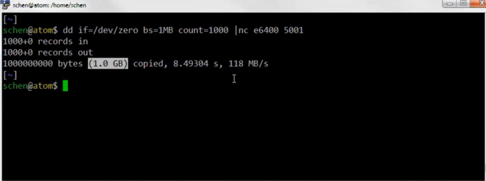
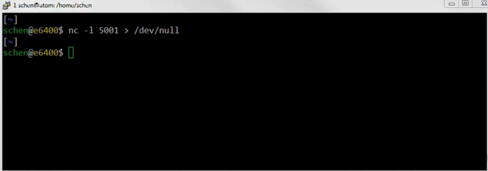
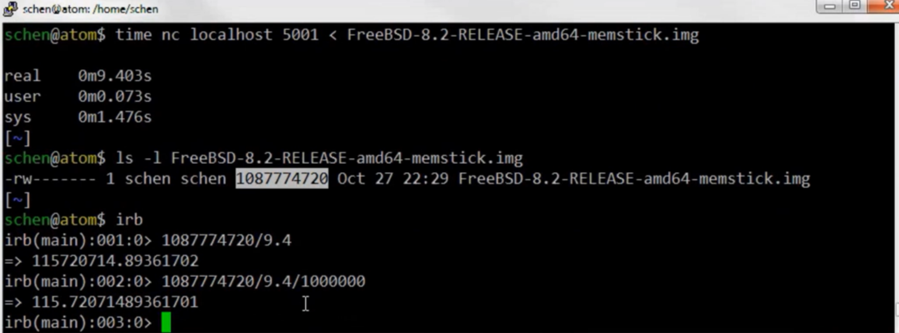
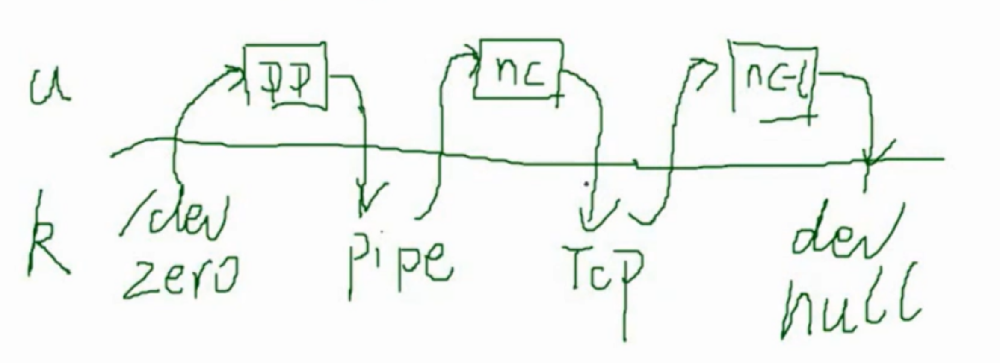

# Test environment

性能测试时，开发与测试需要对齐测试环境。

- atom is Intel Celeron 1037U
  - low and lvy Bridge dual core @ 1.8 GHz, 8GB ram
- e6400 is Dell laptop 2009
  - Intel Core2 Duo P8600 @ 2.4 GHz, 4GB ram
- e350 is AMD E-350
  - 8GB ram, low and APU


# Testing

下面我们使用 netcat 来测试一下在千兆网中 tcp 可以达到的吞吐量，有效带宽





在 atom 机器 发送到 e6400 机器：

- e6400： 在5001端口监听，收数据。
- atom：从 `/dev/sero` 读一千兆数据，发送到5001端口（注：/dev/zero文件代表一个永远输出 0的设备文件，使用它作输入可以得到全为空的文件。因此可用来创建新文件和以覆盖的方式清除旧文件）

扩展：命令学习

```bash
dd命令：
- 用于读取、转换并输出数据。
- 可从标准输入或文件中读取数据，根据指定的格式来转换数据，再输出到文件、设备或标准输出。
参数： 
if=文件名：输入文件名，默认为标准输入。即指定源文件。
bs=bytes：同时设置读入/输出的块大小为bytes个字节。
count=blocks：仅拷贝blocks个块，块大小等于ibs指定的字节数。

nc命令
- netcat的简写，有着网络界的瑞士军刀美誉。一款功能强大的网络工具
参数：
l 用于指定nc将处于侦听模式。该参数意味着nc被当作server，侦听并接受连接。
```

**本地测试：从 atmo 发送到 atom**

第一次测量：从 `dev/zero` 读取数据10G数据测带宽为 580MB/s。


第二次测量：把文件发送到nc，用的是IO重定向的方法。从本地读取数据1G左右数据文件，测带宽为 115.720MB/s。因为该步测试从磁盘加载文件，测试结果内含磁盘读取时间消耗，作为网络带宽结果不准确，因此再进行第三次测量。



第三次测量：从本地读取数据1G左右数据文件，测带宽为 1074.876MB/s。由于步骤2测试时，已经将文件数据加载进内存中了，该步测试可以认为是直接从内存中加载数据。


进一步测试：发送端还是使用dd，接收端加一个显示接收速度的工具叫pv。这是一台双核机器，实际上起了4个进程dd、nc、dd、pv，4个进程去分两个核的话会出现一定的争用情况。第三次测量最快，只起了2个nc进程。这个或许能解释性能为什么有这么大差别。做实验的话可以把top打开，看一下每个进程占CPU的情况。


再来一个测试，把数据发送到一台更慢的机器e350上。还是能达到118MB/s，说明TCP协议栈的开销确实不大，因为即便是e350这个低端机器都能把一个千兆网的带宽用完。如果加上别的操作，性能可能会下降。


扩展：

```bash
ls -l 出来的单位是B
ls - lh 出来的单位是KB
time命令 - “time a simple command or give resource usage”，即测量命令的执行时间，或者给出系统资源的使用情况

第二张图中使用了irb来计算带宽
（irb是一个交互式的Ruby界面。可以通过irb来调试、运行和实验Ruby代码。）
除此之外，也可以使用python的交互界面，或这Linux上提供的 bc、calc等计算工具
```

扩展： [在Linux命令行中使用计算器的5个命令](https://www.cnblogs.com/yychuyu/p/13543143.html#:~:text=在 Linux 命令行里，有许多计算器工具，这些命令行计算器可以让我们执行科学计算、财务计算或者一些简单的计算。当然，我们也可以在 Shell 脚本中使用这些命令执行更为复杂的数学运算。 这里我们主要介绍5种命令行计算器：,bc; calc; expr; gcalccmd; qalc; 1.)


# Test results with netcat

- 118MB/s between atom and {e6400, e350}
- 580MB/s on atom, dd | nc, nc -l > /dev/null
- 1074MB/s on atom, nc < file, nc -l > /dev/null

1. 刚才性能测试的结果，在两台机器之间，千兆网，TCP用 netcat 测出来的吞吐量，是118MB/s。
2. 在atom这台机器上，如果用dd重定向到nc，然后在同样一台机器上用nc测，是580MB/s。
3. 在同样atom这台机器上，不用dd而改用文件重定向测，服务端不变的话，是1074MB/s。

2、3这两个数据太低了，解释一下其中的原因。k，内核态。u，用户态。

DD是一个进程，它从/dev/zero读到DD，然后写到一个管道pipe里面。nc是另外一个进程，从管道里边读出来，再发到本机的TCP。实际上有4次数据从用户到内核的拷贝，这还只是客户端。

服务端同样有两次。一次是从TCP中读出来到nc-l，然后nc-l再写到、重定向到文件上去，写到内核/dev/null。

所以，我们测出来的不是光有tcp这段，而是包括了另外两段，加上X2的开销，一共是3倍。如果只有TCP的话，2的数据应该是它的3倍，1.6G/s左右。3情况不一样是因为它少了前面DD这一步，他直接从pipe文件(已经缓存在内存)读。

