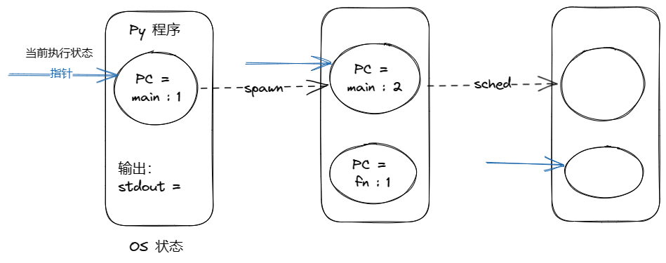

# 理解操作系统的新途径

## 回顾：程序 / 硬件的状态机模型

计算机软件

- 状态机（C / 汇编）
  - 允许执行特殊指令（syscall）请求操作系统
  - 操作系统 = API + 对象


计算机硬件

- 无情执行指令的机器
  - 从 CPU Reset 状态开始执行 Firmware 代码
  - 操作系统 = C 程序


## 一个大胆的想法

无论软件还是硬件，都是状态机

- 而状态和状态的迁移是可以画出来的
- 理论上说，只需要两个 API
  - dump_state( ) - 获取当前程序状态
  - single_step( ) - 执行一步
  - gdb 不就是做这个的吗！


## GDB 检查状态的缺陷

太复杂

- 状态太多（指令数很多）
- 状态太大（很多库函数状态）


简化：把复杂的东西分解成简单的东西

- 在操作系统课上，简化是非常重要的主题，把握使用场景所需重点
  - 否则容易迷失在细节的海洋中
  - 一些具体的例子
    - 只关注系统调用（strace）
    - Makefile 的命令日志
    - strace / Makefile 日志的清理

strace 做的一个重要简化是我们把指令分为两种，一种是计算指令（move、add、load、store，这些存粹的计算只能把寄存器的值拿出来算算放回寄存器，或者把一个内存的值放回寄存器）。strace 不 care 这些计算指令，只 care system call 指令。它认为系统调用是重要的，所以把系统调用的参数打印出来了，它对程序执行流做了纵向简化，使你能够看到软件和操作系统边界上发生了什么。


# 操作系统 “玩具”：设计与实现

## 操作系统玩具：API

四个 “操作系统” API

- choose(xs): 返回 xs 中的一个随机选项
- write(s): 输出字符串 s
- spawn(fn): 创建一个可运行的状态机 fn
- sched(): 随机切换到任意状态机执行


有一个困难，我们不知道该执行谁了。玩具的方法是，我们有一个当前执行状态，有一个蓝色指针指向它。不管怎样执行系统调用，蓝色指针都是不变的，但是如果我们执行这样的系统调用 sched，那么就会随机在已有的状态机里面选一个。

```python
def fn():
    pass

def main():
    sys_spawn(fn)
```




除此之外，所有的代码都是确定（deterministic）的存粹计算

- 允许使用 list，dict等数据结构


## 操作系统玩具：应用程序

我们可以动手把状态机画出来！

```python
count = 0

def Tprint(name):
    global count
    for i in range(3):
        count += 1
        sys_write(f'#{count:02} Hello from {name}{i+1}\n')
        sys_sched()
        
def main():
    n = sys_choose([3, 4, 5])
    sys_write(f'#Thread = {n}\n')
    for name in 'ABCDE'[:n]:
        sys_spawn(Tprint, name)
	sys_sched()
```

线程是可以共享内存的，进程是有独立内存的。操作系统很重要的是提供状态机的隔离，但我们的玩具里面提供了一种共享。可以理解成局部变量是隔离的，没有办法互相访问，但全局变量是共享的。


## 实现系统调用

有些系统调用的实现是显而易见的

```python
def sys_write(s): print(s)
def sys_choose(xs): return random.choice(xs)
def sys_spawn(t): runnables.append(t)
```

有些就困难了

```python
def sys_sched():
    raise NotImplementedError('No idea how')
```

我们需要

- 封存当前状态机的状态
- 恢复另一个 “被封存” 状态机的执行
  - 没错，我们离真正的 “分时操作系统” 就只差这一步


## 使用 Python 的语言机制

Generator objects（无栈协程 / 轻量级线程 / ...）

```python
def numbers():
	i = 0
    while True:
        ret = yield f'{i:b}'	# “封存” 状态机状态
        i += ret
```

使用方法：

```python
n = numbers()	# 封存状态机初始状态
n.send(None)	# 恢复封存的状态
n.send(0)	# 恢复封存的状态（并传入返回值）
```

完美适合我们实现操作系统玩具（os-model.py)


玩具的意义

我们并没有脱离真实的操作系统

- “简化” 了操作系统的 API
  - 在暂时不要过度关注细节的时候理解操作系统
- 细节也会有的，但不是现在
  - 学习路线：先 100% 理解玩具，在理解真实系统和玩具的差异

```cpp
void sys_write(const char *s) { printf("%s", s); }
void sys_sched() { usleep(rand() % 10000); }
int sys_choose(int x) { return rand() % x; }

void sys_spawn(void *(*fn)(void *), void *args) {
    pthread_create(&threads[nthreads++], NULL, fn, args);
}
```


# 建模操作系统

## 一个更全面的操作系统模型

进程 + 线程 + 终端 + 存储（崩溃一致性）

| 系统调用/Linux 对应          | 行为                           |
| ---------------------------- | ------------------------------ |
| sys_spawn(fn)/pthread_create | 创建从 fn 开始执行的线程       |
| sys_fork()/fork              | 创建当前状态机的完整复制       |
| sys_sched()/定时被动调用     | 切换到随机的线程/进程执行      |
| sys_choose(xs)/rand          | 返回一个 xs 中的随机的选择     |
| sys_write(s)/printf          | 向调试终端输出字符串 s         |
| sys_bread(k)/read            | 读取虚拟磁盘块 k 的数据        |
| sys_bwrite(k, v)/write       | 向虚拟磁盘块 k 写入数据 v      |
| sys_sync()/sync              | 将所有向虚拟磁盘的数据写入落盘 |
| sys_crash()/长按电源按键     | 模拟系统崩溃                   |


## 模型做出的简化

被动进程/线程切换

- 实际程序随时都可能被动调用 sys_sched() 切换

只有一个终端

- 没有 read()（用 choose 替代 “允许读到任意值”）

磁盘是一个 dict

- 把任意 key 映射到任意 value
- 实际的磁盘
  - key 为整数
  - value 是固定大小（例如 4KB）的数据
  - 二者在某种程度上是可以互相转换的


## 模型实现

原理与刚才的最小操作系统玩具类似

- mosaic.py - 500 行建模操作系统
- 进程/线程都是 Generator Object
- 共享内存用 heap 变量访问
  - 线程会得到共享 heap 的指针
  - 进程会得到一个独立的 heap clone


输出程序运行的 “状态图”

- JSON Object
- Vertices：线程/进程、内存快照、设备历史输出
- Edges：系统调用
  - 操作系统就是状态机的管理者


## 建模的意义

我们可以把状态机的执行画出来了

- 可以直观地理解程序执行的全流程
- 可以对照程序在真实操作系统上的运行结果

这对于更复杂的程序来说是十分关键的

```cpp
void Tsum() {
    for (int i = 0; i < n; i++) {
        int tmp = sum;
        tmp++;
        // 假设此时可能发生进程/线程转换
        sum = tmp;
    }
}
```

