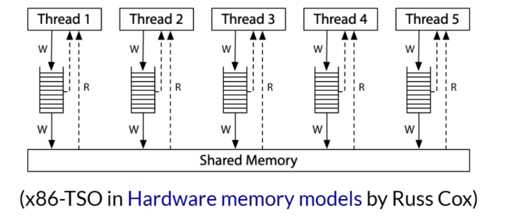

# 多处理器编程入门

## Three Easy Pieces：并发

操作系统作为 “状态机的管理者”，引入了共享的状态

- 带来了并发

- 操作系统是最早的并发程序

  ```python
  def Tprint(name):
      sys_write(f'{name}')
      
  def main():
      for name in 'AB':
          sys_spawn(Tprint, name)
  ```

- 使用 model checker 绘制状态图


## 多线程共享内存并发

线程：共享内存的执行流

- 执行流拥有独立的堆栈 / 寄存器

简化的线程 API (thread.h)

- spawn(fn)
  - 创建一个入口函数是 fn 的线程，并立即开始执行
    - `void fn(int tid) {...}`
    - 参数 tid 从 1 开始编号
  - 行为：sys_spawn(fn, tid)
- join()
  - 等待所有运行线程的返回（也可以不调用）
  - 行为：`while (done != T) sys_sched()`


多线程共享内存并发：入门

多线程编程：一个 API 搞定

```c
#include "thread.h"

void Ta() { while (1) { printf("a"); }}
void Tb() { while (1) { printf("b"); }}

int main() {
    create(Ta);
    create(Tb);
}
```

- 这个程序可以利用系统中的多处理器
  - 操作系统会自动把线程放置在不同的处理器上
  - CPU 使用率超过了 100%


## 问出更多问题

Ta 和 Tb 真的共享内存吗？

- 如何证明 / 否证这件事？

如何证明线程具有独立堆栈（以及确定堆栈的范围）？

- 输出混乱，应该如何处理？

更多的 “好问题” 和解决

- 创建线程使用的是哪个系统调用？
- 能不能用 gdb 调试？
  - 基本原则：有需求，就能做到（RTFM）


## thread.h 背后：POSIX Threads

想进一步配置线程？

- 设置更大的线程栈
- 设置 detach 运行（不在进程结束后被杀死，也不能 join）
- ...

POSIX 为我们提供了线程库（pthreads）

- man 7 pthreads
- 练习：改写 thread.h，使得线程拥有更大的栈
  - 可以用 stack probe 的程序验证


# 放弃 (1)：原子性

## 状态机的隐含假设

世界上只有一个状态机

- 没有其他任何人能 “干涉” 程序的状态
- 推论：对变量的 load 一定返回本线程最后一次 store 的值
  - 这也是编译优化的基本假设

但共享内存推翻了这个假设

```cpp
int Tworker() {
    printf("%d\n", x);	// Global x
    printf("%d\n", x);
}
```

- 其他线程随时可以修改 x
  - 导致两次可能读到不同的 x


## 潘多拉魔盒已经打开...

```cpp
unsigned int balance = 100;

int Talipay_withdraw(int amt) {
    if (balance >= amt) {
        balance -= amt;
        return SUCCESS;
    } else {
        return FAIL;
    }
}
```

两个线程并发支付 100 会发生什么

- 账户里会多出用不完的钱
- Bug 不跟你开玩笑


## 例子：求和

## 放弃 (1)：指令 / 代码执行原子性假设

“处理器一次执行一条指令” 的基本假设在今天的计算机系统上不再成立（我们的模型作出了简化的假设）。

单处理器多线程

- 线程在运行时可能被中断，切换到另一个线程执行

多处理器多线程

- 线程根本就是并行执行的

1960s，大家争先在共享内存上实现原子性（互斥）

- 但几乎所有的实现都是错的，知道 Dekker's Algorithm，还只能保证两个线程的互斥


## 放弃原子性的后果

printf 还能在多线程程序里调用吗？

```cpp
void thread1() { while (1) { printf("a"); }}
void thread2() { while (1) { printf("b"); }}
```

我们都知道 printf 是有缓冲区的（为什么？）

- 如果执行 buf[pos++] = ch（pos 共享）不就炸了吗？

RTFM!


# 放弃 (2)：执行顺序

## 放弃 (2)：程序的顺序执行假设

编译器堆内存访问 “eventually consistent” 的处理导致共享内存作为线程同步工具的失效。

刚才的例子

- -01: R[eax] = sum; R[eax] += N; sum = R[eax]
- -02: sum += N;
- 你的编译器也许是不同的结果

另一个例子

```cpp
while (!done);
// would be optimized to
if (!done) while (1);
```


## 保证执行顺序

回忆 “编译正确性”

- C 状态和汇编状态机的 “可观测行为等价”

- 方法 1：插入 “不可优化” 代码

  - asm volatile ("" ::: "memory")
    - "Clobbers memory"

- 方法 2：标记变量 load / store 为不可优化

  - 使用 volatile 变量

  ```cpp
  extern int volatile done;
  while (!done);
  ```

  


# 放弃 (3)：处理器间的可见性

## 例子

```cpp
int x = 0, y = 0;

void T1() {
    x = 1;	// Store(x)
    __sync_synchronize();
    printf("%d", y);	// Load(y)
}

void T2() {
	y = 1;	// Store(y)
    __sync_synchronize();
    printf("%d", x);	// Load(x)
}
```

遍历模型告诉我们：01, 10, 11

- 机器永远是对的
- Model checker 的结果和实际的结果不同 -> 假设错了


## 现代处理器也是（动态）编译器

错误（简化）的假设

- 一个 CPU 执行一条指令到达下一状态


实际的实现

- 电路将连续的指令 “编译” 成更小的 μops
  - RF[9] = load(RF[7] + 400)
  - store(RF[12], RF[13])
  - RF[3] = RF[4] + RF[5]


在任何时刻，处理器都维护一个 μop 的 “池子”

- 与编译器一样，做 “顺序执行” 假设：没有其他处理器 “干扰”
- 每一周期执行尽可能多的 μop - 多路发射、乱序执行、按序提交


## 放弃 (3)：多处理器间内存访问的即时可见性

满足单处理器 eventual memory consistency 的执行，在多处理器系统上可能无法序列化。

当 x != y时，对 x，y 的内存读写可以交换顺序

- 它们甚至可以在同一个周期里完成（只要 load / store unit 支持）

- 如果写 x 发生 cache miss，可以让读 y 先执行

  - 满足 “尽可能执行 μop” 的原则，最大化处理器性能

  ```assembly
  movl $1, (x)	#
  movl (y), %eax	#
  ```

  

- 在多处理器上的表现

  - 两个处理器分别看到 y = 0 和 x = 0


## 宽松内存模型 (Relaxed / Weak Memory Model)

宽松内存模型的目的是使单处理器的执行更高效

x86 已经是市面上能买到的 “最强” 的内存模型了

- 这也是 Intel 自己给自己加的包袱
- 看看 ARM / RISC-V 吧，根本就是个分布式系统

