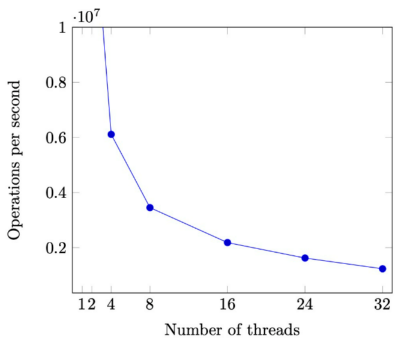

# 互斥问题：定义与假设

## 回顾：并发编程

理解并发的工具

- 线程 = 人（大脑能完成局部存储和计算）
- 共享内存 = 物理世界（物理世界天生并行）
- 一切都是状态机（debugger & model checker）

“躲进厕所锁上门，我就把全世界人锁在了厕所外”


## 互斥问题：定义

互斥（mutual exclusion），“互相排斥”

- 实现 lock_t 数据结构和 lock / unlock API:

```C
typedef struct {
    ...
} lock_t;
void lock(lock_t *lk);
void unlock(lock_t *lk);
```

一把 “排他性” 的锁，对于锁对象 lk

- 如果某个线程持有锁，则其他线程的 lock 不能返回（Safety）
- 在多个线程执行 lock 时，至少有一个可以返回（Liveness）
- 能正确处理处理器乱序、宽松内存模型和编译优化


## 互斥问题的经典算法

Peterson 算法

- 包间、旗子和门上的字条
- 假设 atomic load / store
  - 实现这个假设也不是非常容易的（peterson.c）

因此，假设很重要

- 不能同时读 / 写共享内存（1960s）不是一个好的假设
  - Load（环顾四周）的时候不能写，“看一眼就把眼睛闭上”
  - Store（改变物理世界状态）的时候不能读，“闭着眼睛动手”
  - 这是操作系统课，更喜欢直观、简单、粗暴（稳定）、有效的解决方法


## 实现互斥的基本假设

允许使用使我们可以不管一切麻烦事的原子指令

```cpp
void atomic_inc(long *ptr);
int atomic_xchg(int val, int *ptr);
```

看起来是一个普通的函数，但假设：

- 包含一个原子指令
  - 指令的执行不能被打断
- 包含一个 compiler barrier
  - 无论何种优化都不可越过此函数
- 包含一个 memory fence
  - 保证处理器在 stop-the-world 前所有对内存的 store 都 “生效”
  - 即对 resume-the-world 之后的 load 可见


## Atomic Exchange 实现

```C
int xchg(int volatile *ptr, int newval) {
    int result;
    asm volatile(
        // 指令自带 memory barrier
        "lock xchgl %0 %1"
        : "+m"(*ptr), "=a"(result)
        : "1"(newval)
        // Compiler barrier
        : "memory"
    );
    return result;
}
```


# 自旋锁 (Spin Lock)

## 实现互斥：做题家 vs. 科学家

做题家：拿到题就开始排列组合

- 熟练得...
  - 如果长久的训练都是 “必须在规定的时间内正确解出问题”，那么浪费时间的思考自然就少了

科学家：考虑更多更根本的问题

- 我们可以设计出怎样的原子指令？
  - 它们的表达能力如何？
- 计算机硬件可以提供比 “一次 load / store" 更强的原子性吗？
  - 如果硬件很困难，软件 / 编译器可以么？


## 自旋锁：用 xchg 实现互斥

在厕所门口放一个桌子（共享变量）

- 初始时放着

自旋锁（Spin Lock）

- 想上厕所的同学（一条 xchg 指令）
  - Stop the world
  - 看一眼桌子上有什么
  - 把放到桌上
  - Resume the world
- 出厕所的同学
  - 把钥匙放到桌上


## 实现互斥：自旋锁

```cpp
int table = YES;

void lock() {
retry:
    int got = xchg(&table, NOPE);
    if (got == NOPE)
        goto retry;
    assert(got == YES);
}

void unlock() {
    xchg(&table, YES);	// 为什么不是 table = YES; ?
}
```


在 xchg 的假设下简化实现

- 包含一个原子指令
- 包含一个 compiler barrier
- 包含一个 memory fence
  - sum-spinlock demo

```cpp
int locked = 0;

void lock() {
	while (xchg(&locked, 1));
}

void unlock() {
    xchg(&locked, 0);
}
```


# 你们（不）想要的无锁算法

## 更强大的原子指令

Compare and exchange("test and set")

- (lock) cmpxchg SRC, DEST

  ```cpp
  TEMP = DEST
  if accumulator == TEMP:
  	ZF = 1
  	DEST = SRC
  else:
  	ZF = 0
  	accumulator = TEMP
  ```

- 看起来没复杂多少，好像又复杂了很多
  - 学编程 / 操作系统 “纸面理解” 是不行的
  - 一定要写代码加深印象
    - 对于这个例子：我们可以列出 “真值表”


## 在自旋锁中代替 xchg

在自旋锁的实现中，xchg 完全可以用 cmpxchg 代替

```cpp
// cmpxchg(old='钥匙', new='', *ptr)
```

- 这样做有什么好处吗？
  - 有得，在自旋失败的时候减少了一次 store
  - 当然，现代处理器也可以优化 xchg


## 多出的 Compare：用处

同时检查上一次获得的值是否仍然有效 + 修改生效

```cpp
// Create a new node
retry:
	expected = head;
	node->next = expected;
	seen = compxchg(expected, node, &head);
	if (seen != expected)
        goto retry;
```

习题：如何实现 pop( ) ?

- Lockless Patterns: an introduction to compare-and-swap
- Is Parallel Programming Hard, And, If So, What Can You Do About It? (perfbook)
- The Art of Multiprocessor Programming


# 在操作系统上实现互斥

## 自旋锁的缺陷

性能问题 (1)

- 除了进入临界区的线程，其他处理器上的线程都在空转
- 争抢锁的处理器越多，利用率越低
  - 4个 CPU 运行4个 sum-spinlock 和1个 OBS
    - 任意时刻都只有一个 sum-atomic 在有效计算
  - 均分 CPU，OBS 就分不到100%的 CPU 了

性能问题 (2)

- 持有自旋锁的线程可能被操作系统切换出去
  - 操作系统不 “感知” 线程在做什么
  - 但为什么不能呢？
- 实现 100% 的资源浪费


## Scalability：性能的新维度

同一份计算任务，时间（CPU cycles）和空间（mapped memory）会碎处理器数量的增长而变化。

用自旋锁实现 sum ++ 的性能问题

- 严谨的统计很难
  - CPU 动态功耗
  - 系统中的其他进程
  - 超线程
  - NUMA
  - ......
  - Benchmarking crimes




## 自旋锁的使用场景

1. 临界区几乎不 “拥堵”
2. 持有自旋锁时禁止执行流切换


使用场景：操作系统内核的并发数据结构（短临界区）

- 操作系统可以关闭中断和抢占
  - 保证锁的持有者在很短的时间内可以释放锁
- 如果是虚拟机呢...
  - PAUSE 指令会触发 VM Exit
- 但依旧很难做好
  - An analysis of Linux scalability to many cores (OSDI'10)


## 实现线程 + 长临界区的互斥

作业那么多，与其干等 Online Judge 发布，不如把自己（CPU）让给其他作业（线程）执行？

“让” 不是 C 语言代码可以做到的（C 代码只能执行指令）

- 但有一种特殊的指令：syscall
- 把锁的实现放到操作系统里就好啦
  - `syscall(SYSCALL_lock, &lk);`
    - 试图获得 lk，但如果失败，就切换到其他线程
  - `syscall(SYSCALL_unlock, &lk);`
    - 释放 lk，如果有等待锁的线程就唤醒


操作系统 = 更衣室管理员

- 先到的人（线程）
  - 成功获得手环，进入游泳馆
  - *lk = lock，系统调用直接返回
- 后到的人（线程）
  - 不能进入游泳馆，排队等待
  - 线程放入等待队列，执行线程切换（yield）
- 洗完澡出来的人（线程）
  - 交还手环给管理员；管理员把手环再交给排队的人
  - 如果等待队列不为空，从等待队列中取出一个线程允许执行
  - 如果等待队列为空，*lk = YES
- 管理员（OS）使用自旋锁确保自己处理手环的过程是原子的


## 关于互斥的一些分析

自旋锁（线程直接共享 locked）

- 更快的 fast path
  - xchg 成功 -> 立即进入临界区，开销很小
- 更慢的 slow path
  - xchg 失败 -> 浪费 CPU 自旋等待


互斥锁（通过系统调用访问 locked）

- 更经济的 slow path
  - 上锁失败线程不再占用 CPU
- 更慢的 fast path
  - 即便上锁成功也需要进出内核（syscall）