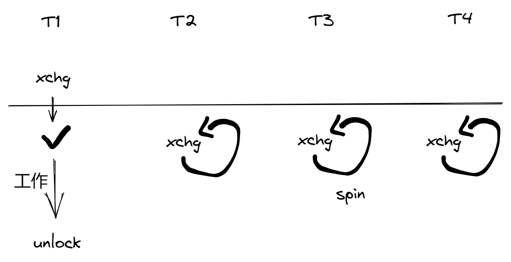
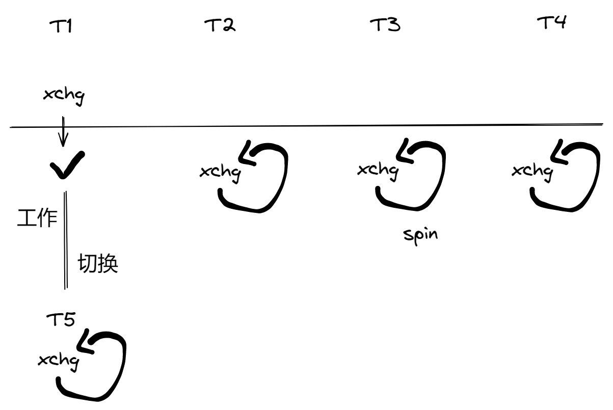

互斥（Peterson 算法）：为了掌控并发程序的复杂行为，使程序退回到串行执行的 lock & unlock。

# 互斥问题：定义与假设

## 回顾：并发编程

理解并发的工具

- 线程 = 人（大脑能完成局部存储和计算）
- 共享内存 = 物理世界（物理世界天生并行）
- 一切都是状态机（debugger & model checker）

“躲进厕所锁上门，我就把全世界人锁在了厕所外”


## 互斥问题：定义

互斥（mutual exclusion），“互相排斥”

- 实现 lock_t 数据结构和 lock / unlock API:

```C
typedef struct {
    ...
} lock_t;
void lock(lock_t *lk);
void unlock(lock_t *lk);
```

一把 “排他性” 的锁，对于锁对象 lk

- 如果某个线程持有锁，则其他线程的 lock 不能返回（Safety）
- 在多个线程执行 lock 时，至少有一个可以返回（Liveness）
- 能正确处理处理器乱序、宽松内存模型和编译优化


## 互斥问题的经典算法

Peterson 算法

- 包间、旗子和门上的字条
- 假设 atomic load / store
  - 实现这个假设也不是非常容易的（peterson.c）

因此，假设很重要

- 不能同时读 / 写共享内存（1960s）不是一个好的假设
  - Load（环顾四周）的时候不能写，“看一眼就把眼睛闭上”
  - Store（改变物理世界状态）的时候不能读，“闭着眼睛动手”
  - 这是操作系统课，更喜欢直观、简单、粗暴（稳定）、有效的解决方法


## 实现互斥的基本假设

允许使用使我们可以不管一切麻烦事的原子指令。只需要记住任何时候使用原子指令是安全的，前提是它的实现是对的。

```cpp
void atomic_inc(long *ptr);
int atomic_xchg(int val, int *ptr);
```

看起来是一个普通的函数，但假设：

- 包含一个原子指令
  - 指令的执行不能被打断
- 包含一个 compiler barrier
  - 无论何种优化都不可越过此函数
- 包含一个 memory fence
  - 保证处理器在 stop-the-world 前所有对内存的 store 都 “生效”
  - 即对 resume-the-world 之后的 load 可见


## Atomic Exchange 实现

atomic-xchg 就和我们物理世界的 exchange 是一样的。这是一个原子的 exchange，当我准备 exchange 的时候，时间就暂停了，整个世界都停下来了，把两个东西换过来，然后世界就恢复了。然后其他人看到的是一瞬间发生的是两个东西调换，任何两个 memory  location 里面的值发生了变换。exchange 可以把一个寄存器和内存做交换。

```C
int xchg(int volatile *ptr, int newval) {
    int result;
    asm volatile(	// 表示汇编本身不能优化
        // 指令自带 memory barrier；lock: memory barrier + 原子
        "lock xchgl %0 %1"	// %0: 第零个待填入的东西
        : "+m"(*ptr), "=a"(result)
        : "1"(newval)
        // Compiler barrier
        : "memory"	// clobber, compiler barrier
    );
    return result;
}
```


# 自旋锁 (Spin Lock)

## 实现互斥：做题家 vs. 科学家

做题家：拿到题就开始排列组合

- 熟练得...
  - 如果长久的训练都是 “必须在规定的时间内正确解出问题”，那么浪费时间的思考自然就少了

科学家：考虑更多更根本的问题

- 我们可以设计出怎样的原子指令？
  - 它们的表达能力如何？
- 计算机硬件可以提供比 “一次 load / store" 更强的原子性吗？
  - 如果硬件很困难，软件 / 编译器可以么？


## 自旋锁：用 xchg 实现互斥

在厕所门口放一个桌子（共享变量）

- 初始时放着钥匙

自旋锁（Spin Lock）

- 想上厕所的同学（一条 xchg 指令）
  - Stop the world
  - 看一眼桌子上有什么（钥匙或 NONE）
  - 把放到桌上（覆盖之前有的任何东西）
  - Resume the world
  - 期间看到钥匙才可以进厕所，否则重复
- 出厕所的同学
  - 把钥匙放到桌上


## 实现互斥：自旋锁

```cpp
int table = YES;

void lock() {
retry:
    int got = xchg(&table, NOPE);
    if (got == NOPE)
        goto retry;
    assert(got == YES);
}

void unlock() {
    xchg(&table, YES);	// 为什么不是 table = YES; ?
}
```

(在 model checker 中检查)

第一个问题：如果在 unlock 之前这个线程发生了 crash，会怎么样？死锁。你可能在 lock 和 unlock 之间不小心返回了，控制流 return。这是一种非常常见的死锁方式。就像你申请了资源，在一个 return 的地方释放了，但是在其他 return 的地方又忘了。

有什么好的解决办法？为什么会喜欢 C++？在构造的时候 lock，在析构的时候 unlock。在进入函数的时候可以 Hold 这个锁，随时随地都可以返回，返回的时候会触发这个对象的析构，然后它锁就释放了。

```cpp
class Hold {
public:
    Hold(lk) { lock(lk); }
    ~Hold() { unlock(this->lk); }
}

void foo() {
    // RAII, Resource Acquisition is Initialization
    Hold(lk);
    
    if (...) {
        return;
    }
    
}
```

[C++11（及现代C++风格）和快速迭代式开发 – 刘未鹏 | Mind Hacks](http://mindhacks.cn/2012/08/27/modern-cpp-practices/)

[C++中的RAII介绍 - binbinneu - 博客园 (cnblogs.com)](https://www.cnblogs.com/jiangbin/p/6986511.html)


第二个问题：unlock() 里面为什么不是 `table = YES` ? 是因为在并发的时候我们的假设 lock 和 unlock 在任何情况下（编译优化、宽松内存模型）都要正确的。所以，最安全的办法，如果你绝对不想犯任何错误，不想因为稀奇古怪的问题使你的程序循环运行了几千万次才出现一个不对，当然要用保守的办法。实际上，在 X86 系统里，`table = YES;` 是可以的，linux kernel spin lock 实现应该就是一个 release，就是一个写，连 memory fence 都不需要，只用一个 compiler barrier 就可以，编译优化不要越过它就行。这个细节显然不在我们的掌控之内。


对于任何复杂的并发程序、算法，我们都可以用 model checker 去检查它。我们能写这样一个模型，就可以用暴力枚举的方式去看它执行的各种情况。

```python
def Tworker(enter, exit):
  for _ in range(2):
    while True:
      seen = heap.table
      heap.table = '❌'
      sys_sched()
      if seen == '✅':
        break
    sys_sched()
    sys_write(enter)
    sys_sched()
    sys_write(exit)
    sys_sched()
    heap.table = '✅'
    sys_sched()

def main():
  heap.table = '✅'
  sys_spawn(Tworker, '(', ')')
  sys_spawn(Tworker, '[', ']')

# Outputs:
# ()()[][]
# ()[]()[]
# ()[][]()
# []()()[]
# []()[]()
# [][]()()
```


**在 xchg 的假设下简化实现**

- 包含一个原子指令
- 包含一个 compiler barrier
- 包含一个 memory fence
  - sum-spinlock demo

```cpp
int locked = 0;

void lock() {
	while (xchg(&locked, 1));
}

void unlock() {
    xchg(&locked, 0);
}
```


```cpp
#include "thread.h"

#define N 100000000
#define M 10

long sum = 0;

int xchg(int volatile *ptr, int newval) {
  int result;
  asm volatile(
    "lock xchgl %0, %1"
    : "+m"(*ptr), "=a"(result)
    : "1"(newval)
    : "memory"
  );
  return result;
}

int locked = 0;

void lock() {
  while (xchg(&locked, 1)) ;
}

void unlock() {
  xchg(&locked, 0);
}

void Tsum() {
  long nround = N / M;
  for (int i = 0; i < nround; i++) {
    lock();
    for (int j = 0; j < M; j++) {
      sum++;  // Non-atomic; can optimize
    }
    unlock();
  }
}

int main() {
  assert(N % M == 0);
  create(Tsum);
  create(Tsum);
  join();
  printf("sum = %ld\n", sum);
}
```

我们将 sum 变量的访问用 lock/unlock 包围起来，以实现互斥。注意到 sum 是一个普通的变量，能够以大家熟悉的方式被编译优化 (例如 10 次 `sum++` 可以被优化成 `sum += 10`)。lock/unlock 中的 compiler barrier 和 memory fence 保证了线程间的数据可以正确读取。


# 你们（不）想要的无锁算法

## 更强大的原子指令

Compare and exchange("test and set")

- (lock) cmpxchg SRC, DEST

  ```cpp
  TEMP = DEST
  if accumulator == TEMP:
  	ZF = 1
  	DEST = SRC
  else:
  	ZF = 0
  	accumulator = TEMP
  ```

- 看起来没复杂多少，好像又复杂了很多
  - 学编程 / 操作系统 “纸面理解” 是不行的
  - 一定要写代码加深印象
    - 对于这个例子：我们可以列出 “真值表”


想学习一条新指令，可以网上找这样的汇编代码，然后写出你认为的 C 的代码，然后你可以对所有可能的内存指针指着的值，old 和 new 的值，可以画一个真值表出来，就知道你写的对不对了。

```c
//cmpxchg.c
#include <stdio.h>
#include <assert.h>

int cmpxchg(int old, int new, int volatile *ptr) {
  asm volatile(
    "lock cmpxchgl %[new], %[mem]"
      : "+a"(old), [mem] "+m"(*ptr)
      : [new] "S"(new)
      : "memory"
  );
  return old;
}

int cmpxchg_ref(int old, int new, int volatile *ptr) {
  int tmp = *ptr;  // Load
  if (tmp == old) {
    *ptr = new;  // Store (conditionally)
  }
  return tmp;
}

void run_test(int x, int old, int new) {
  int val1 = x;
  int ret1 = cmpxchg(old, new, &val1);

  int val2 = x;
  int ret2 = cmpxchg_ref(old, new, &val2);

  assert(val1 == val2 && ret1 == ret2);
  printf("x = %d -> (cmpxchg %d -> %d) -> x = %d\n", x, old, new, val1);
}

int main() {
  for (int x = 0; x <= 2; x++)
    for (int old = 0; old <= 2; old++)
      for (int new = 0; new <= 2; new++)
        run_test(x, old, new);
}
```


## 在自旋锁中代替 xchg

在自旋锁的实现中，xchg 完全可以用 cmpxchg 代替

```cpp
// cmpxchg(old='钥匙', new='', *ptr)
```

- 这样做有什么好处吗？
  - 有得，在自旋失败的时候减少了一次 store
  - 当然，现代处理器也可以优化 xchg


## 多出的 Compare：用处

多一次 compare，你可以实现一个并发的单链表。

同时检查上一次获得的值是否仍然有效 + 修改生效

```cpp
// Create a new node
retry:
	expected = head;
	node->next = expected;
	seen = compxchg(expected, node, &head);
	if (seen != expected)
        goto retry;
```

习题：如何实现 pop( ) ? （真正了解并发之后可以看看）

- Lockless Patterns: an introduction to compare-and-swap
  - [Lockless patterns: an introduction to compare-and-swap [LWN.net\]](https://lwn.net/Articles/847973/)

- Is Parallel Programming Hard, And, If So, What Can You Do About It? (perfbook)
  - [Is Parallel Programming Hard, And, If So, What Can You Do About It? (kernel.org)](https://cdn.kernel.org/pub/linux/kernel/people/paulmck/perfbook/perfbook.html)

- The Art of Multiprocessor Programming
  - [The Art of Multiprocessor Programming | ScienceDirect](https://www.sciencedirect.com/book/9780124159501/the-art-of-multiprocessor-programming)


# 在操作系统上实现互斥

## 自旋锁的缺陷

性能问题 (1)

- 除了进入临界区的线程，其他处理器上的线程都在空转
- 争抢锁的处理器越多，利用率越低
  - 4个 CPU 运行4个 sum-spinlock 和1个 OBS
    - 任意时刻都只有一个 sum-atomic 在有效计算
  - 均分 CPU，OBS 就分不到100%的 CPU 了

如图，如果机器有 4 个 CPU，意味着实际的 CPU 使用率是 25%。相当于一人处理，他人围观。




性能问题 (2)

- 持有自旋锁的线程可能被操作系统切换出去
  - 操作系统不 “感知” 线程在做什么
  - 但为什么不能呢？
- 实现 100% 的资源浪费

如果线程数量比处理器数量要多，那会发生什么呢？线程是会随时随地被切换出去的。在工作还没有释放锁的时候，就发生了一个线程的切换，换到另外一个 T5。T5 还是 xchg，这变成了所有人在摸鱼，然后持有 progress 的人在睡觉。造成浪费的原因是操作系统的设计就是不感知上面的程序在做什么，也不能知道线程多久把锁释放掉。




## Scalability：性能的新维度

上面的现象就引发了多处理器的 Scalability：同一份计算任务，时间（CPU cycles）和空间（mapped memory）会碎处理器数量的增长而变化。

用自旋锁实现 sum ++ 的性能问题

如图，如果我们使用自旋锁实现 sum++，开 1、2、4、8、16、24、32 个线程，整个系统每秒钟能够完成 sum++ 的数量，随着线程的增加，完成数量反而减少。看起来是个多线程的程序，好像并行了，又没有完全并行，并行反而不如不并行。

现代的多处理器系统是有缓存的，当我们读 sum，写sum，不是真的去 ddr 内存上面读写（延迟就爆炸了）。如果直接在 ddr 读写的话，几百个 ns 就没有了，意味着上百上千个时钟周期就过去了，显然不能让 load、store 浪费这么多时钟周期。所以我们的内存是从缓存里读的，当要读写 sum 的时候，都是从一级缓存里面读出来、写进去。而只要有另外一个处理器想要读写 sum，它就要把我的一级缓存里的值拉下来。如果我现在想要读 sum，sum是另外一个 CPU 写的，为了保证我程序里最后的 sum 的值是对的，我就要从那个 CPU 的 L1 Cache 里面把那个值给拉过来，读出来、写进去。

为什么会有随着处理器增加，效率越来越低。因为不管是 spinlock 锁的变量是瓶颈，sum 也是共享的瓶颈，这两个变量来回在处理器之间传来传去，传就要时间。


[Gernot's List of Systems Benchmarking Crimes (gernot-heiser.org)](https://gernot-heiser.org/benchmarking-crimes.html)


严谨的统计很难

- CPU 动态功耗
- 系统中的其他进程
- 超线程
- NUMA
- ......
- Benchmarking crimes

今天的笔记本电脑只能做一分钟男人对吧。在高功耗下它能够持续的时间是很短的，散热跟不上它就会降频。


## 自旋锁的使用场景

1. 临界区几乎不 “拥堵”，否则就会出现上面的现象。如果所有的线程都要同一把锁，就会出现锁的拥堵。
2. 持有自旋锁时禁止执行流切换


使用场景：操作系统内核的并发数据结构（短临界区）。当你要创建一个新的进程的时候，要把新的进程插入到列表里，要用自旋锁。或者你有两个进程会同时访问同一个文件，需要自旋锁。

- 操作系统可以关闭中断和抢占
  - 保证锁的持有者在很短的时间内可以释放锁
- 如果是虚拟机呢...
  - PAUSE 指令会触发 VM Exit
- 但依旧很难做好
  - An analysis of Linux scalability to many cores (OSDI'10)
  - https://www.usenix.org/conference/osdi10/analysis-linux-scalability-many-cores

自旋锁可以理解成它能够实现多处理器间互斥的唯一方法。有一种办法可以实现临界区，关中断，在 CPU 上禁止切换的发生，那至少在这个 CPU 上就不会有临界区的问题了，代码会一直执行下去，不能被打断。但是关中断只能关当前 CPU 的中断，一个 CPU 是不能把其他 CPU 给关掉的。每个 CPU 都是个独立的人，你不能影响其他人自己的执行和状态。


## 实现线程 + 长临界区的互斥

作业那么多，与其干等 Online Judge 发布，不如把自己（CPU）让给其他作业（线程）执行？

“让” 不是 C 语言代码可以做到的（C 代码只能执行指令），没有一条指令是让 CPU 给其他线程执行的。世界上分成两种指令，一种是状态机内部的指令，还有一种是请求操作系统。

操作系统会实现两个系统调用 lock、unlock。操作系统看到 SYSCALL_lock 这个系统调用后，它会用自旋锁先保护好关于这把锁的临界区，然后去看我是否能得到锁。如果能得到锁，就直接返回。如果得不到锁，就会把这个线程变成不可运行，切换到另外一个线程去运行。

- 但有一种特殊的指令：syscall
- 把锁的实现放到操作系统里就好啦
  - `syscall(SYSCALL_lock, &lk);`
    - 试图获得 lk，但如果失败，就切换到其他线程
  - `syscall(SYSCALL_unlock, &lk);`
    - 释放 lk，如果有等待锁的线程就唤醒


自旋锁求和的 Scalability

如果把多 `sum++` 均匀地分到 n 个线程，将会得到什么样的结果？

临界区的代码不能并行——因此无论开启多少个线程，执行 `sum++` 指令的数量是完全相同的。然而，因为多个处理器之间争抢锁和 sum 变量，将会引起缓存一致性协议的额外开销。随着线程数量的增长，程序的效率逐渐降低。为了观察到这一现象，你需要在多处理器系统上运行这个程序。


使用互斥锁保护临界区

操作系统为我们提供了互斥锁，以应对多处理器自旋带来的 CPU 浪费。互斥锁会先试着自旋；如果没能获得锁，则会进入 Slow Path，由操作系统接管锁的实现。由于无法预知多久后锁才会被释放，操作系统会将上锁的线程暂停并不再调度它，直到持有锁的线程释放锁为止。

从使用的角度，互斥锁的行为与自旋锁完全相同 (除了更少的 CPU 浪费)。


操作系统 = 更衣室管理员

- 先到的人（线程）
  - 成功获得手环，进入游泳馆
  - *lk = lock，系统调用直接返回
- 后到的人（线程）
  - 不能进入游泳馆，排队等待
  - 线程放入等待队列，执行线程切换（yield）
- 洗完澡出来的人（线程）
  - 交还手环给管理员；管理员把手环再交给排队的人
  - 如果等待队列不为空，从等待队列中取出一个线程允许执行
  - 如果等待队列为空，*lk = YES
- 管理员（OS）使用自旋锁确保自己处理手环的过程是原子的


## 关于互斥的一些分析

自旋锁（线程直接共享 locked）

- 更快的 fast path
  - xchg 成功 -> 立即进入临界区，开销很小
- 更慢的 slow path
  - xchg 失败 -> 浪费 CPU 自旋等待


互斥锁（通过系统调用访问 locked）

- 更经济的 slow path
  - 上锁失败线程不再占用 CPU
- 更慢的 fast path
  - 即便上锁成功也需要进出内核（syscall）


# Futex: Fast Userspace muTexes

实际上今天的操作系统锁的实现。小孩子才做选择。操作系统当然是全都要啦！它有个很巧妙的实现，它使得在锁不拥堵的时候（只有一个人上锁解锁），不需要进入操作系统内核。然后在 slow path 上锁失败的时候，在执行系统调用。把 fast path 和 slow path 分开优化是计算机系统优化的常用技巧，为了使其运行更快，需要去分析二八定律，20% 的代码消耗了 80% 的时间，然后把 20% 的代码，找绝大部分情况的代码优化的更好。

- Fast path：一条原子指令，上锁成功立即返回
- Slow path：上锁失败，执行系统调用睡眠
  - 性能优化的最常见技巧
    - 看 average (frequent) case 而不是 worst case

POSIX 线程库中的互斥锁 (pthread_mutex)

- 观察线程库中的 lock / unlock 行为
  - Mutex 没有争抢的情况
  - Mutex 有争抢的情况


## Take-away Messages

为了实现现代多处理器系统上的互斥，我们首先需要理解 “原子操作” (例如 `atomic_xchg`) 的假设：

1. 操作本身是原子的、看起来无法被打断的，即它真的是一个 “原子操作”；
2. 操作自带一个 compiler barrier，防止优化跨过函数调用。这一点很重要——例如我们今天的编译器支持 Link-time Optimization (LTO)，如果缺少 compiler barrier，编译优化可以穿过 volatile 标记的汇编指令；
3. 操作自带一个 memory barrier，保证操作执行前指令的写入，能对其他处理器之后的 load 可见。

在此假设的基础上，原子操作就成为了我们简化程序执行的基础机制。通过自旋 (spin)，可以很直观地实现 “轮询” 式的互斥。而为了节约共享内存线程在自旋上浪费的处理器，我们也可以通过系统调用请求操作系统来帮助现成完成互斥。