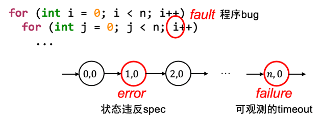
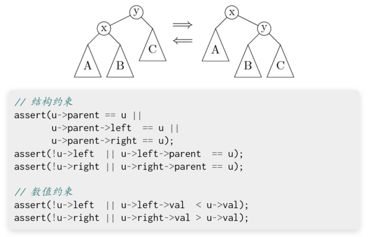

# 调试理论

## 开始调试之前

编程哲学

机器永远是对的

不管是 crash 了，wrong answer 了，还是虚拟机神秘重启，都是自己背锅。


未测代码永远是错的

你以为最不可能出 bug 的地方，往往 bug 就在那躺着。


## 调试困难的根本原因

因为 bug 的触发经历了漫长的过程

- 需求 (informal) -> 设计 -> 代码 (状态机, formal, 数学对象) -> Fault (bug)-> Error (程序状态错)-> Failure
  - 我们只能观测到 failure（可观测的结果错）
  - 我们可以检查状态的正确性（但非常费时）
  - 无法预知 bug 在哪里（每一行 “看起来” 都挺对的）




## 调试理论

“软件” 的两层含义

- 人类需求在信息世界的投影
  - 理解错需求 -> bug
- 计算过程的精确（数学）描述
  - 实现错误 -> bug

调试（debugging）

- 已知程序有 bug，如何找到？


调试理论：如果我们能判定任意程序状态的正确性，那么给定一个 failure，我们可以通过二分查找定位到第一个 error 的状态，此时的代码就是 fault (bug)。


调试理论：推论

- 为什么我们喜欢单步调试？
  - 从一个假定正确的状态出发
  - 每个语句的行为有限，容易判定是否是 error
- 为什么调试理论看起来很没用？
  - 因为判定程序状态的正确性非常困难
    - 是否在调试 DP 题/图论算法时陷入时间黑洞？

调试理论其实很有用。它让我们看到了调试困难的原因，就是检查状态很难。换句话说，调试理论告诉我们应该去想怎样去检查程序的状态？


## 调试理论 (cont'd)

实际中的调试：观察状态机执行（trace）的某个侧面

- 缩小错误状态（error）可能产生的位置
- 作出适当的假设
- 再进行细粒度的定位和诊断


最重要的两个工具

- printf -> 自定义 log 的 trace
  - 灵活可控、能快速定位问题大概位置、适用于大型软件
  - 无法精确定位、大量的 logs 管理起来比较麻烦
- gdb -> 指令/语句级 trace
  - 精确、指令级定位、任意查看程序内部状态
  - 耗费大量时间


# 调试 “任何问题”

## 一切皆可调试

程序 = 计算机系统 = 状态机

- 机器永远是对的
- UNIX 世界里你做任何事情都是在编程
  - 因此配置错、make 错等，都是程序或输入 / 配置有 bug
  - 输入 / 配置可以看成是程序的一部分


所有问题都可以用调试理论解决

- 你写了一个程序，现在这个程序出 bug 了（例如 Segmentation Fault），你是怎样排查这个问题的？
  - curl: command not found
  - 'sys/cdefs.h': No such file or directory
  - make: run: No such file or directory


## 使用调试理论（cont'd）

Debug (fault localization) 的基本理论回顾：

- Fault（程序 / 输入 / 配置错）-> Error -> Failure（可观测性）
  - 绝大部分工具的 Failure 都有 “原因报告”
    - 因此能帮助你快速定位 fault
  - man perror：标准库有打印 error message 的函数


如果问题不能帮你定位到 fault / error?

- 出错原因报告不准确或不够详细
- 程序执行的过程不够详细
  - 既然我们有需求，那别人肯定也会有这个需求
    - 一定有信息能帮助我们


正确的方法：理解程序（状态机）的执行过程

- ssh：使用 -v 选项检查日志
- gcc：使用 -v 选项打印各种过程
- make：使用 -n 选项查看完整命令
  - make -nB | grep -ve '^\(echo\|mkdir\)' 可以查看完整编译 nemu 的编译过程

各种工具普遍提供调试功能，帮助用户 / 开发者了解程序的行为


## 例子：找不到 sys/cdefs.h

‘sys/cdefs.h’: No such file or directory，找不到文件（这看起来是用 perror() 打印出来的）

- #include = 复制粘贴，自然会经过路径解析
- 明明 /usr/include/x86_64-linux-gnu/sys/cdefs.h 是存在的（man 1 locate）-> 极度挫败，体验极差


推理：#include <> 一定有一些搜索路径

- 为什么两个编译选项，一个通过，一个不通过？
  - gcc -m32 -v vs. gcc -v


这是标准的解决问题办法：自己动手排查

- 在面对复杂 / 小众问题时比 STFW / ChatGPT 有效


# 使用 GDB 调试程序

## gdb：入门

gdb：最常用的命令在 gdb cheat sheet

想要更好的体验？

- gdb 本身也是一个编程语言
  - 它甚至支持 python
  - 我们可以执行一些初始化代码（-x）
- 库函数也是代码
  - directory 命令增加源码路径
- gdb 有许多前端
  - cgdb，pwndbg，vscode，...
- RTFM -M 比 ChatGPT 好用在于它不需要 prompt 且全面


## Futex: Fast Userspace muTexes (cont'd)

- Fast path：一条原子指令，上锁成功立即返回
- Slow path：上锁失败，执行系统调用睡眠
  - 性能优化的最常见技巧
    - 看 average（frequent）case 而不是 worst case


POSIX 线程库中的互斥锁（pthread_mutex)

- 观察线程库中的 lock / unlock 行为
  - mutex 没有争抢的情况
  - mutex 有争抢的情况


一个简单的设计：现在用户空间自旋

- 如果获得锁，直接进入（Fast Path，无系统调用）
- 未能获得锁，系统调用（Slow Path）
- 解锁后用系统调用唤醒潜在的 Slow Path 线程
  - 更好的设计可以彻底消除 fast-path 的系统调用


RTFM（劝退）

- futex(7), futex(2)
- A futex overview and update(LWN)
- Futexes are tricky（论 model checker 的重要性）
- 我们不讲并发算法
  - 但我们可以调试它的实现


# 调试理论：应用

## 调试理论：应用

需求 -> 设计 -> 代码 -> Fault -> Error -> Failure

technical debt

- 每当你写出不好维护的代码，你都在给你未来的调试 / 需求变更挖坑


中枪了？

- 为了快点跑程序，随便写的 klib
- 为了赶紧实现指令，随手写的代码
- 为了应付老板，随便写的系统实现


## 编程的基本准则

Programs are meant to be read by humans and only incidentally for computers to execute. - D.E. Knuth

好的程序

- 不言自明：能知道是做什么的（specification）
  - 因此代码风格很重要
- 不言自证：能确认代码和 specification 一致
  - 因此代码中的逻辑流很重要
- 新时代的评判标准
  - AI 是否能正确理解 / 维护你的代码


## 调试理论的最重要应用

写好读、易验证的代码

在代码中添加更多的断言（assertions）

断言的意义：

- 把代码中隐藏的 specification 写出来
  - Fault -> Error（靠测试）
  - Error -> Failure（靠断言）
    - Error 暴露的越晚，越难调试
    - 追溯导致 assert failure 的变量值（slice）通常可以快速


## 例子：维护父亲节点的平衡树




## 更多的断言

你是否希望在每一次指针访问时，都增加一个断言

- `assert(obj -> low <= ptr && ptr < obj -> high);`

```cpp
int *ref(int *a, int i) {
    return &a[i];
}

void foo() {
    itn arr[64];
    *ref(arr, 64) = 1;	// bug
}
```


一个神奇的编译选项

- -fsanitize=address
  - Address Sanitizer; asan "动态程序分析"