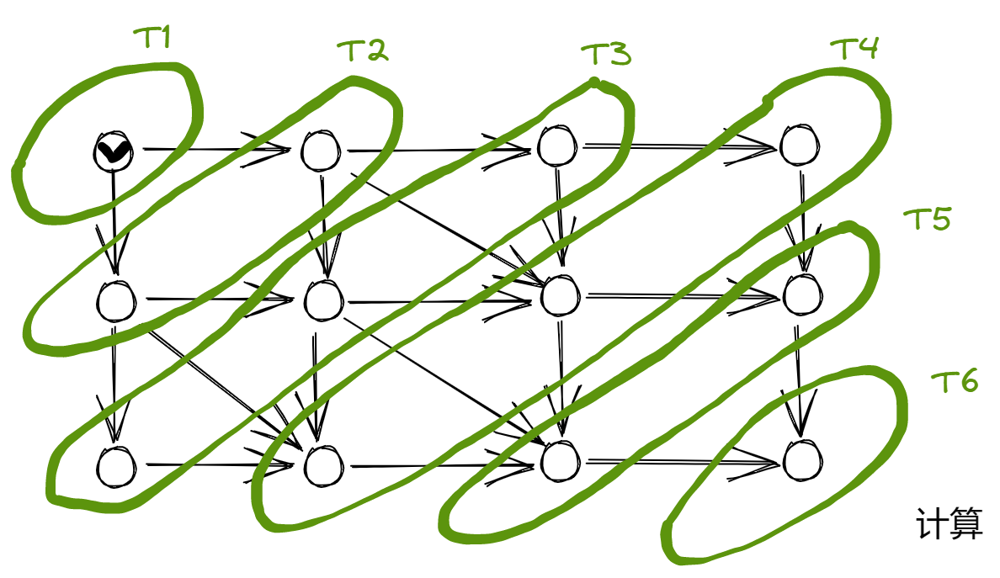
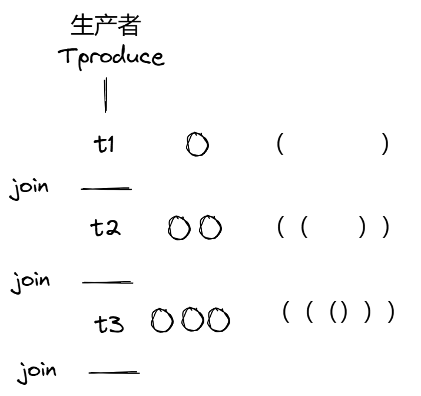
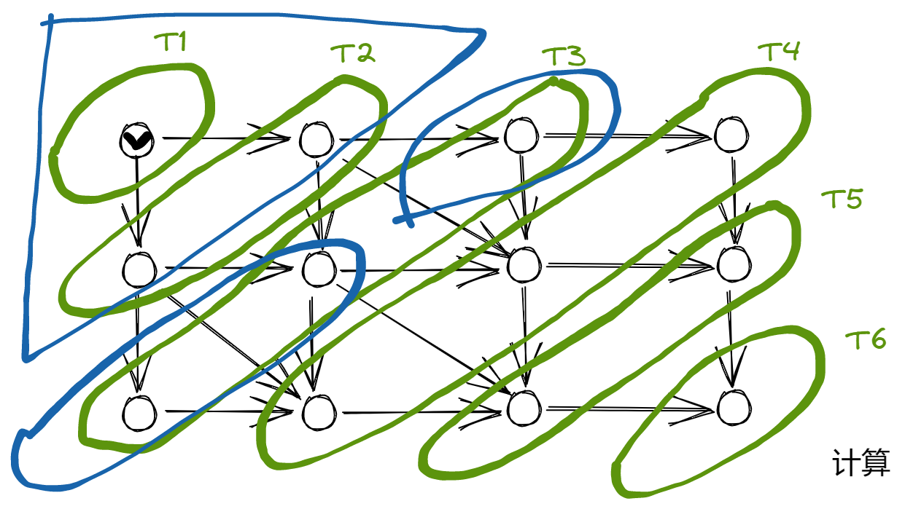
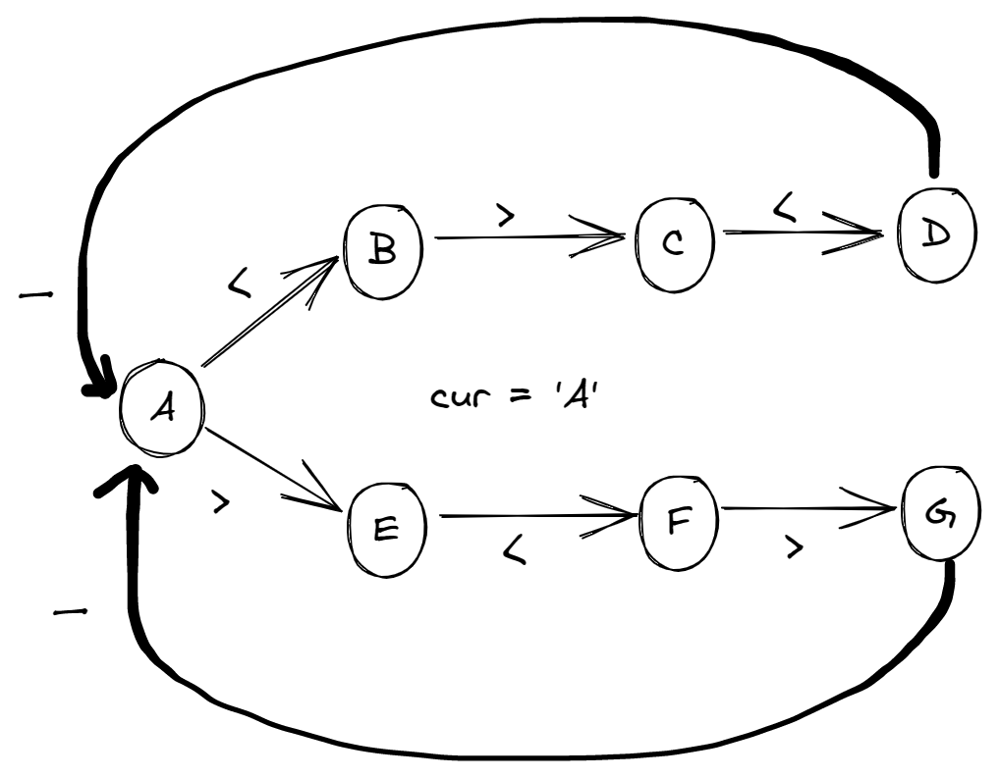

**背景回顾**：我们已经了解如何通过 “不可优化、保证顺序” 的原子指令实现自旋锁，以及借助操作系统 (系统调用) 实现线程的睡眠，从而不致于出现 CPU 空转的浪费。然而，互斥并不总是能满足多个并发线程协作完成任务的需求，例如大家试着在完成 Minilab 时应该已经遇到了一些困难。如何能便捷地让共享内存的线程协作以共同完成计算任务？


# 同步问题

## 同步（Synchronization）

两个或两个以上随时间变化的量在变化过程中保持一定的相对关系

- 同步电路（一个时钟控制所有的触发器）
- iPhone/iCloud 同步（手机 vs 电脑 vs云端）
- 变速箱同步器（合并快慢速齿轮）
- 同步电机（转子与磁场转速一致）
- 同步电路（所有触发器在边沿同时触发）

异步（Asynchronous）= 不需要同步

- 上述很多例子都有异步版本（异步电机、异步电路、异步线程）


## 并发程序中的同步

并发程序的步调很难保持 “完全一致”

- 线程同步：**在某个时间点共同达到互相知己的状态**

再把线程想象成我们自己

- NPY：等我洗个头就出门/等我打完这局游戏就来
- 舍友：等我修好这个 bug 就吃饭
- 导师：等我出差回来就讨论这个课题
- jyy：等我成为卷王就躺平
  - 先到先等，**在条件达成的瞬间再恢复并行**
  - 同时开始出去玩/吃饭/讨论


## 生成者-消费者问题：学废你就赢了

99% 的实际并发问题都可以用生产者-消费者解决。

```c
void Tproduce() { while (1) printf("("); }
void Tconsume() { while (1) printf(")"); }
```

在 printf 前后增加代码，使得打印的括号序列满足

- 一定是某个合法括号序列的前缀
- 括号嵌套的深度不超过 n
  - n = 3，( ( ( ) ) ( ) ) ( ( ( 合法
  - n = 3，( ( ( ( ) ) ) ), ( ( ) ) ) 不合法
- 生产者-消费者问题中的同步
  - Tproduce：等到有空位时才能打印左括号
  - Tconsume：等到有多余的左括号才能打印右括号


## 计算图、调度器和生产者-消费者问题

为什么叫 “生产者-消费者” 而不是 “括号问题” ？

- 左括号：生产资源（任务）、放入队列
- 右括号：从队列取出资源（任务）执行


并行计算基础：计算图

- 计算任务构成有向无环图
  - (u, v) ∈ E 表示 v 要用到前 u 的值
- 只要调度器（生产者）分配任务效率够高，算法就能并行
  - 生产者把任务放入队列中
  - 消费者（workers）从队列中取出任务



动态规划，图里面的最长路径，就是要花的时间。就算每一步立即算完，也需要 6 步才能算完。如果你想要把任何一个算法并行化，就把它的计算图画出来。

这个模型和生产者-消费者有什么关系呢？有没有一种万能的并行程序实现方法？



t1 时刻，t1 任务只有打印一个左括号，等到右括号来了之后完成一次同步。然后 t2 分解成两个节点，打印两个左括号，收到两个右括号后又可以生产了。t3 的时候，可以分解成 3 个左括号，等到收到 3 个右括号再回来。

相当于有好多轮的同步。一开始先作为生产者，然后把这个任务分出去，分出去之后作为消费者等到一个左括号，等到任务完成，完成一次同步，相当于一个 join。

实际中，如果每一点的计算量比较小的话，划分可以更灵活一点。第一次划分可以是一个三角形，等到中间比较大的时刻，可以把它分为两个比较均匀的两部分。理想情况下，可以把这些任务全部分到每个线程上执行，但是线程同步是有开销的，有代价的。使用生产者、消费者基本可以解决所有的并发问题。




**join**

子线程join到主线程（启动程序的线程，比如c语言执行main函数的线程）。你的问题可能在于没有理解join，阻塞线程仅仅是一个表现，而非目的。其目的是等待当前线程执行完毕后，”计算单元”与主线程汇合。即主线程与子线程汇合之意。main是主线程，在main中创建了thread线程，在main中调用了thread.join()，那么等thread结束后再执行main代码。在很多情况下，主线程生成并起动了子线程，如果子线程里要进行大量的耗时的运算，主线程往往将于子线程之前结束，但是如果主线程处理完其他的事务后，需要用到子线程的处理结果，也就是主线程需要等待子线程执行完成之后再结束，这个时候就要用到join()方法了。


## 生成者-消费者：实现

如果要实现生产者-消费者问题，想想在任何时候都打印了一些东西。什么时候才能打印一个左括号、什么时候才能打印一个右括号呢？左括号，没有深度限制的话随时都能打，如果有深度限制的话，马上要超过深度了，你就不能打了。所以打印左括号的限制是 count < n。右括号，count > 0，不然所有左括号配对上了，再打一个右括号就不对了。这就给了我们一个最基础、最典型的实现方法，用互斥锁也可以实现的，就是不断去等这个条件满足。


能否用互斥锁实现括号问题？

- 左括号：嵌套深度（队列）不足 n 时才能打印
- 右括号：嵌套深度（队列）＞ 1 时才能打印
  - 当然是等到满足条件时再打印了
    - 用互斥锁保持条件成立


并发：小心！

- 压力测试 + 观察输出结果
- 自动观察输出结果：pc-check.py
- 未来：copilot 观察输出结果，并给出修复建议

- 更远的未来 ...


## 使用互斥锁和自旋锁解决生产者-消费者问题

注意到我们为生产者和消费者分别设置了 `CAN_PRODUCE` 和 `CAN_CONSUME` 两个条件。我们在持有互斥锁的前提下检查条件是否满足，且只有条件满足时才能生产/消费。

条件不满足时，我们必须释放锁，并再次等待——如果不释放锁，其他生产者/消费者就无法生产/消费，从而造成死锁。

```c
#include "thread.h"
#include "thread-sync.h"

int n, count = 0;
mutex_t lk = MUTEX_INIT();

#define CAN_PRODUCE (count < n)
#define CAN_CONSUME (count > 0)

void Tproduce() {
    while (1) {
    retry:
        mutex_lock(&lk);
        if (!CAN_PRODUCE) {
            mutex_unlock(&lk);
            goto retry;
        } else {
            count++;
            printf("(");    // push an element into buffer
            mutex_unlock(&lk);
        }
        
    }
}

void Tconsume() {
    while (1) {
    retry:
        mutex_lock(&lk);
        if (!CAN_CONSUME) {
            mutex_unlock(&lk);
            goto retry;
        } else {
            count--;
            printf(")");    // pop an element from buffer
            mutex_unlock(&lk);
        }
    }
}

int main(int argc, char *argv[]) {
    assert(argc == 2);
    n = atoi(argv[1]);
    setbuf(stdout, NULL);
    for (int i = 0; i < 8; i++) {
        create(Tproduce);
        create(Tconsume);
    }
}
```

虽然 goto 是 harmful 的，但在有些时候使用 goto 可以提高代码可读性，C 程序里面如果你要做 error handling 的话，goto 其实是一个标准的写法，基本上只有这一种用法。

刚开始跟并发打交道的时候，就要有一个信念，程序是错的。不管代码看起来多么正常，我们总是要有一些怀疑的精神。我们可以实现一些检查的代码。写一个自动的程序，把一个程序的输出 pipe 给这个 checker。

缺陷：这种实现方式会有 spin wait，得不到锁的话会不断交换，引发很大开销。


# 条件变量

之前改进自旋锁的时候是怎么把开销去掉的。请操作系统帮我，如果我得到这把锁失败，那就让我去睡觉。然后等到有人把这把锁释放，再把我唤醒。我们可以用睡眠的方式解决循环等待一个条件发生的问题。


## 同步问题：分析

**线程同步由条件不成立等待和同步条件达成继续构成**

线程 join

- Tmain 同步条件：nexit == T
- Tmain 达成同步：最后一个线程跳出 nexit++

生产者/消费者问题

- Tproduce 同步条件：CAN_PRODUCE (count < n)
- Tproduce 达成同步：Tconsume count--
- Tconsume 同步条件：CAN_CONSUME (count > 0)
- Tconsume 达成同步：Tproduce count++


## 理想中的同步 API

```c
wait_until(CAN_PRODUCE) {
    count++;
    printf("()");
}

wait_until(CAN_CONSUME) {
    count--;
    printf(")");
}
```

若干是实现上的难题

- 正确性
  - 大括号内代码执行时，其他线程不得破坏等待的条件
- 性能
  - 不能 spin check 条件达成
  - 已经在等待的线程怎么知道条件被满足？


## 条件变量：理想与实现之间的折衷

一把互斥锁 + 一个 “条件变量” +手工唤醒

- wait(cv, mutex)，睡眠
  - 调用时必须保证已经获得 mutex
  - wait 释放 mutex、进入睡眠状态
  - 被唤醒后需要重新执行 lock(mutex)
- signal/notify(cv)，唤醒
  - 随机私信一个等待者：醒醒
  - 如果有线程正在等待 cv，则唤醒其中一个线程
- broadcast/notifyAll(cv)
  - 叫醒所有人
  - 唤醒全部正在等待 cv 的线程


## 错误的生产者-消费者实现

```c
#include "thread.h"
#include "thread-sync.h"

int n, count = 0;
mutex_t lk = MUTEX_INIT();
cond_t cv = COND_INIT();
 
#define CAN_PRODUCE (count < n)
#define CAN_CONSUME (count > 0)

void Tproduce() {
  while (1) {
    mutex_lock(&lk);
    if (!CAN_PRODUCE) {
      cond_wait(&cv, &lk);
    }
    printf("("); count++;
    cond_signal(&cv);
    mutex_unlock(&lk);
  }
}

void Tconsume() {
  while (1) {
    mutex_lock(&lk);
    //出问题的原因：if条件成立的时候会等待，等待唤醒的时候if条件不一定成立
    //本来唤醒producer，但唤醒consumer就错了
    if (!CAN_CONSUME) {		
      cond_wait(&cv, &lk);	
    }
    printf(")"); count--;
    cond_signal(&cv);
    mutex_unlock(&lk);
  }
}

int main(int argc, char *argv[]) {
  assert(argc == 3);
  n = atoi(argv[1]);
  int T = atoi(argv[2]);
  setbuf(stdout, NULL);
  for (int i = 0; i < T; i++) {
    create(Tproduce);
    create(Tconsume);
  }
}
```

使用条件变量时，我们要注意唤醒的线程是不受控制的。因此有趣的现象可能发生 (假设 n = 1，但有多个生产者和消费者)：

- 一个 Tconsume 和一个 Tproduce 同时处于等待状态
- 此时打印的括号序列为 `...(`，此时可以打印一个右括号
- 此时另一个 Tconsume 开始执行，打印一个右括号，并执行 signal 唤醒一个线程
- Tconsume 被唤醒，因此打印出 `...())`

我们看到，Tproduce 只希望唤醒消费者；Tconsume 只希望唤醒生产者，因此可以用两个条件变量解决这个问题。

```c
//万能的实现同步的方法
void Tconsume() {
  while (1) {
    mutex_lock(&lk);
    //出问题的原因：if条件成立的时候会等待，等待唤醒的时候if条件不一定成立
    //本来唤醒producer，但唤醒consumer就错了
    //把if改成while，当cond不成立时进去了，循环出来的时候cond一定是成立的。
    while(!cond)			//2
        wait(cv, mutex);	//1
    //因为互斥锁的保护，wait之后会重新获得这把锁
    //重新获得这把锁之后会检查while条件，cond成立的时候才出来
    assert(cond);			//3, 执行顺序
    printf(")"); count--;
    broadcast(cv)
    mutex_unlock(&lk);
  }
}

// 把下面意思转换成上面
// wait until
//	(cond)
// with
//	(mutex) {
//	...
// }
```


写模型的意义在于你如果能把模型写出来，就意味着你自己实现了一遍条件变量的 API。

```py
N, Tp, Tc = 1, 2, 2

def Tproduce(nm):
  //互斥锁不等于yes时，就要等待
  while heap.mutex != 'Yes':
    sys_sched()
  //如果看到等于yes，就不等待，置NO，然后切换
  heap.mutex = 'No'
  sys_sched()
  //在这会先把这把锁得到
  
  //如果条件不成立的话，条件变量的行为会执行wait
  //wait就是把当前线程放到blocked线程列表里,同时把这把锁释放
  //释放以后就可以切换了
  if not (heap.count < N):
    heap.blocked.append(nm)	//睡眠
    heap.mutex = 'Yes'		//释放锁，这两行之间不能切换
    sys_sched()
    //如果当前线程还没被唤醒，就要不停等待
    while nm in heap.blocked:
      sys_sched()
    //直到从睡眠列表里唤醒，还要重新获得这把互斥锁
    while heap.mutex != 'Yes':
      sys_sched()
    heap.mutex = 'No'
    sys_sched()

  heap.count += 1
  sys_sched()
  sys_write('(')
  sys_sched()

  //如果当前有blocked的线程，我会随机选一个，然后把它删掉，最后把互斥锁释放
  if heap.blocked:
    r = sys_choose([i for i, _ in enumerate(heap.blocked)])
    heap.blocked.pop(r)

  heap.mutex = 'Yes'

def Tconsume(nm):
  while heap.mutex != 'Yes':
    sys_sched()
  heap.mutex = 'No'
  sys_sched()
  
  if not (heap.count > 0):
    heap.blocked.append(nm)
    heap.mutex = 'Yes'
    sys_sched()
    while nm in heap.blocked:
      sys_sched()
    while heap.mutex != 'Yes':
      sys_sched()
    heap.mutex = 'No'
    sys_sched()

  heap.count -= 1
  sys_sched()
  sys_write(')')
  sys_sched()

  if heap.blocked:
    r = sys_choose([i for i, _ in enumerate(heap.blocked)])
    heap.blocked.pop(r)

  heap.mutex = 'Yes'

def main():
  heap.count = 0
  heap.mutex = 'Yes'
  heap.blocked = []

  for i in range(Tp):
    sys_spawn(Tproduce, f'Tp{i+1}')
  for i in range(Tc):
    sys_spawn(Tconsume, f'Tc{i+1}')

# Outputs:
# ()()
# ())(
```

编写正确的并发程序并非易事，即便是资深的系统程序员 (包括 Linux 内核开发者) 都无法避免在代码中引入并发 bug。压力测试、模型检验都是帮助我们提升对并发程序正确性信心的手段。除此之外，防御性地编程 (例如写出尽可能简单、正确性明了的代码) 也是至关重要的。


## 条件变量：实现生产者-消费者

```c
void Tproduce() {
    mutex_lock(&lk);
    if (!CAN_PRODUCE) cond_wait(&cv, &lk);
    printf("("); count++; cond_signal(&cv);
    mutex_unlock(&lk);
}

void Tconsume() {
	mutex_lock(&lk);
    if (!CAN_CONSUME) cond_wait(&cv, &lk);
    printf(")"); count--; cond_signal(&cv);
    mutex_unlock(&lk);
}
```

代码延时 & 压力测试 & 模型检验

- （Small scope hypothesis）


## 条件变量：正确的打开方式

同步的本质：wait_until(COND) { ... }，因此：

- 需要等待条件满足时

  ```c
  mutex_lock(&mutex);
  while (!COND) {
      wait(&cv, &mutex);
  }
  assert(cond);	// 互斥锁保证条件成立
  mutex_unlock(&mutex);
  ```

- 任何改动使其他线可能被满足时

  ```c
  mutex_lock(&mutex);
  // 任何可能使条件满足的代码
  broadcast(&cv);
  mutex_unlock(&mutex);
  ```

  


# 条件变量：应用

## 条件变量：万能并行计算框架（M2）

```c
struct work {
    void (*run)(void *arg);
    void *arg;
}

void Tworker() {
    while (1) {
        struct work *work;
        wait_until(has_new_work() || all_done) {
            work = get_work();
        }
        if (!work) break;
        else {
            work->run(work->arg);	// 允许生成新的 work（注意互斥）
            release(work);	// 注意回收 work 分配的资源
        }
    }
}
```


## 条件变量：更古怪的问题

有三种线程

- Ta 若干：死循环打印 <
- Tb 若干：死循环打印 >
- Tc 若干：死循环打印 _

任务：

- 对这些线程进行同步，使得屏幕打印出 <><_ 和 ><>_ 的组合

使用条件变量，只要回答三个问题：

- 打印 “<" 的条件？
- 打印 “>" 的条件？
- 打印 “_" 的条件？


解决所有的同步问题，只要回到这个地方就行了

```
wait until
	(cond)
with
	(mutex) {
	...
}
```

你只要能把做这件事情的条件写出来，就可以用条件变量解决这个问题。这个条件是什么呢？

其实这是一个状态机，初始的时候可以打印一个 < 或 >，就到了另一个状态。到这个状态就开始有条件了。用一个状态表示当前在哪。其中 D、G状态可以合并成一个。

那么什么时候可以打 < 呢？ACE；

在 ABE 可以打 >；

在 DG 可以打 _；



怎么一遍写对？既然这是个状态机，为什么我不能把它原样搬到代码里呢？

设一个常量数组 rule，把图放进了数据结构里。当前状态，能不能打印，到下个状态，用一个 next 函数。

所有东西都落到一个条件 can_print，当前状态是可以到下一个字符（状态）的，而且现在并发量还足够多。两个线程不能同时打印左括号右括号，比如 A 同时打左括号右括号。还有一个相当于互斥锁的 quota，唯一的一个人可以进。

无论你的条件多么复杂，只要你能写出一个 can_print 这样的函数。无论里面设计多少个状态，多少个共享变量，规则有多复杂，你只要把线程能打印的条件写出来，剩下的就是照抄。

```c
#include "thread.h"
#include "thread-sync.h"

#define LENGTH(arr) (sizeof(arr) / sizeof(arr[0]))

enum { A = 1, B, C, D, E, F, };

struct rule {
  int from, ch, to;
} rules[] = {
  { A, '<', B },
  { B, '>', C },
  { C, '<', D },
  { A, '>', E },
  { E, '<', F },
  { F, '>', D },
  { D, '_', A },
};
int current = A, quota = 1;

mutex_t lk = MUTEX_INIT();
cond_t cv = COND_INIT();

int next(char ch) {
  for (int i = 0; i < LENGTH(rules); i++) {
    struct rule *rule = &rules[i];
    if (rule->from == current && rule->ch == ch) {
      return rule->to;
    }
  }
  return 0;
}

static int can_print(char ch) {
    return next(ch) != 0 && quota > 0;
}

void fish_before(char ch) {
  mutex_lock(&lk);
  while (!can_print(ch)) {
    // can proceed only if (next(ch) && quota)
    cond_wait(&cv, &lk);
  }
  quota--;
  mutex_unlock(&lk);
}

void fish_after(char ch) {
  mutex_lock(&lk);
  quota++;
  current = next(ch);
  assert(current);
  cond_broadcast(&cv);
  mutex_unlock(&lk);
}

const char roles[] = ".<<<<<>>>>___";

void fish_thread(int id) {
  char role = roles[id];
  while (1) {
    fish_before(role);
    putchar(role);  // Not lock-protected
    fish_after(role);
  }
}

int main() {
  setbuf(stdout, NULL);
  for (int i = 0; i < strlen(roles); i++)
    create(fish_thread);
}
```

使用信号量就是专门为这种问题设计的算法，但是用条件变量就是一种万能的同步方法。


## Take-away Messages

记住两点：

1、如果想要把任何算法并行化，给了大家一个通用的思想方法。不管什么样的计算问题，它总有一个哪一个东西是用另一个东西算出来的，可以把这个计算图用有向无环图来表示出来。

处理器会乱序执行。如果知道x、y不是同一个变量的话就可以乱序。在这个流程也有一个计算图，每条指令都可以看成一个节点。1、3两条指令就形成了依赖关系，read after write dependency，建立一条边。现在高性能处理器它做的事情就是对这个计算图用硬件做拓扑排序。大核在程序运行的时候做拓扑排序，把指令的计算图算出来，然后使得能并行的部分并行起来。

```
x = 0	//1，x: write
t = y	//2
t1 = x	//3, x: read
```

2、我们如果想要实现同步的话，就想一个问题 “生产者-消费者”。不管是打印左右括号，还是打一个更复杂的东西，最终归结下来都是下面这个流程。任何一个线程总要做一件事的，但这件事是不能随便做的，所以想要把多个线程同步起来，就去想做事这段代码执行的条件是什么。条件想清楚后，把它们放在同一个互斥锁里面，用万能的条件变量方法。

```
wait until
	(cond)
with
	(mutex) {
	'print("c")';	
}
```

**万能条件变量方法**：先把互斥锁上上，如果世界上只有一把锁，把该保护的东西都保护了，那你的代码可以认为很容易变成顺序程序了。然后 cond 不成立，你就去等，直到有人把你唤醒，你会再检查123，条件成立才会进来。然后任何时候你让别人的条件成立了，你就把所有人唤醒，就不会错了。因为如果你唤醒一个错的人，正好那个人刚唤醒又睡了，很可能整个系统就死锁了。唤醒所有人就是安全的。那我不就把所有的并行丢掉了吗？

```
lock(mutex)
	while(!cond)			//2
		wait(cv, mutex);	//1
	assert(cond);			//3
	//4这里通常是从队列里取出一个任务
	broadcast(cv)
unlock(mutex)
//5计算任务可以在这里做
```

计算图节点的一个本地计算都是远大于你的同步互斥开销的，T0 >> Tmutex/sync。上面这段代码确实是串行的，4这里通常是从队列里取出一个任务。看起来打一个左括号一个右括号，打一个右括号就意味着你从队列里取出一个计算任务，计算任务可以在5做，可能这里话100ms，那前面串行花的100us就可以忽略不计了。


同步的本质是线程需要等待某件它所预期的事件发生，而事件的发生总是可以用共享状态的条件来表达。并且在这个条件被满足的前提下完成一些动作：

```c
WAIT_UNTIL(cond) with (mutex) {
  // cond 在此时成立
  work();
}
```

计算机系统的设计者提供了条件变量的机制模仿这个过程，它与互斥锁联合使用：

- `cond_wait(cv, lk)` 释放互斥锁 `lk` 并进入睡眠状态。注意被唤醒时，`cond_wait` 会重新试图获得互斥，直到获得互斥锁后才能返回。
- `cond_signal(cv)` 唤醒一个在 `cv` 上等待的线程
- `cond_broadcast(cv)` 唤醒所有在 `cv` 上等待的线程

我们也很自然地可以用 wait + broadcast 实现 `WAIT_UNTIL`，从而实现线程之间的同步。


