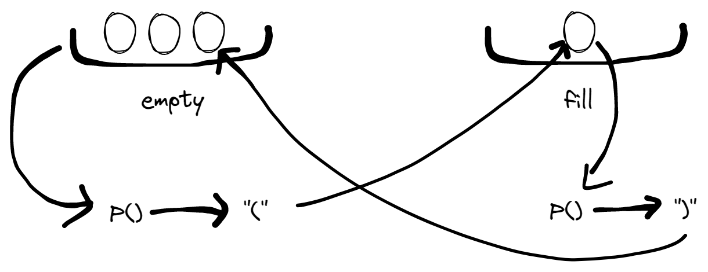
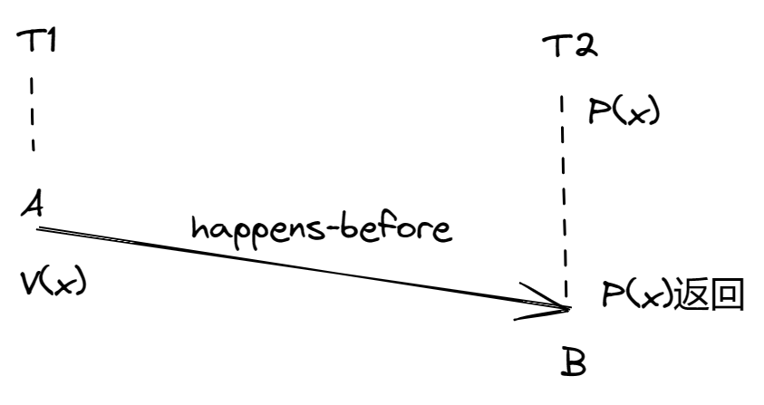
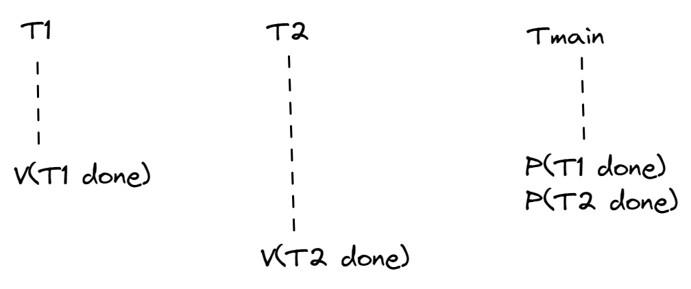
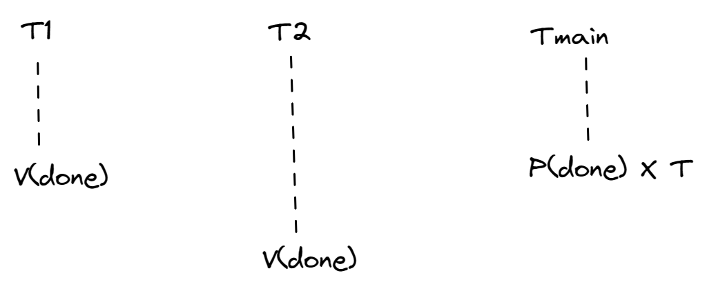
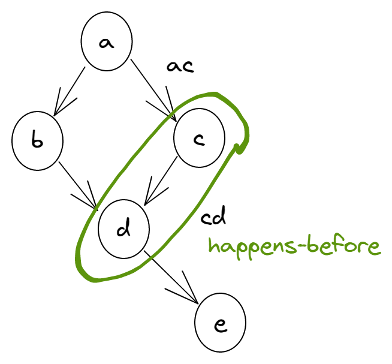
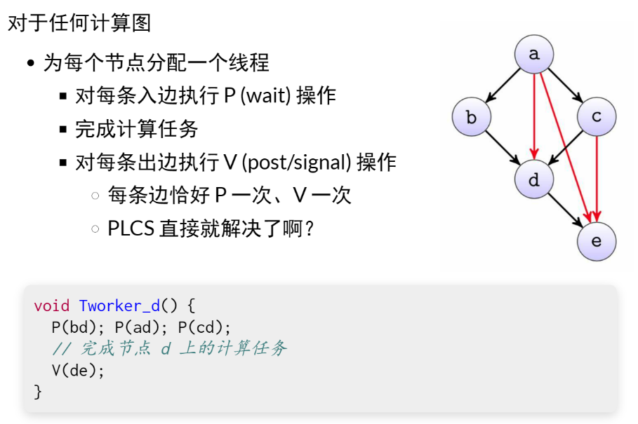
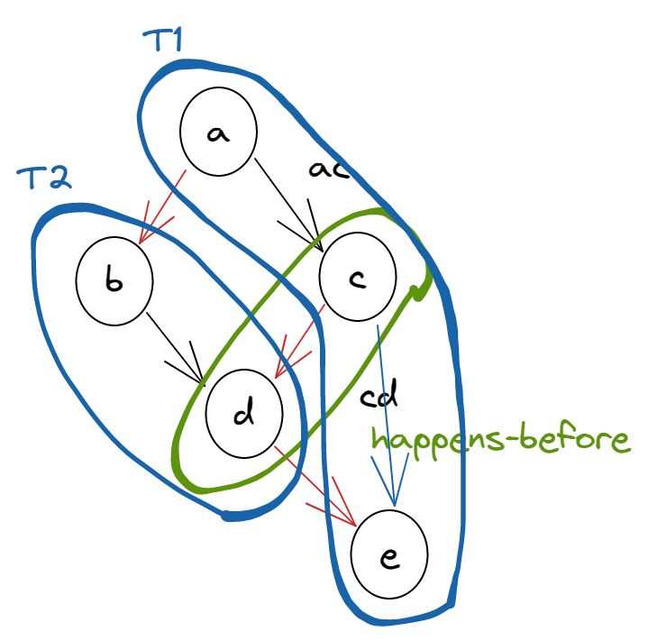
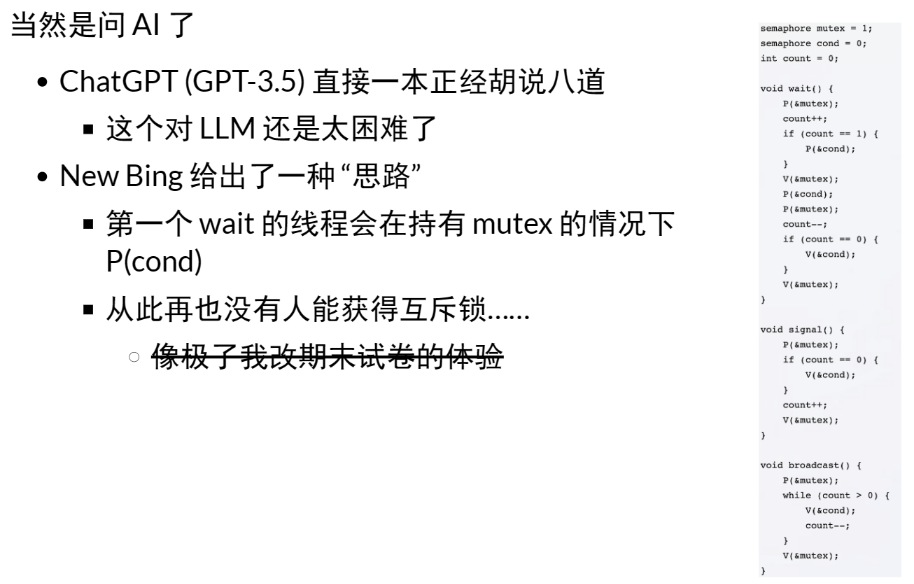
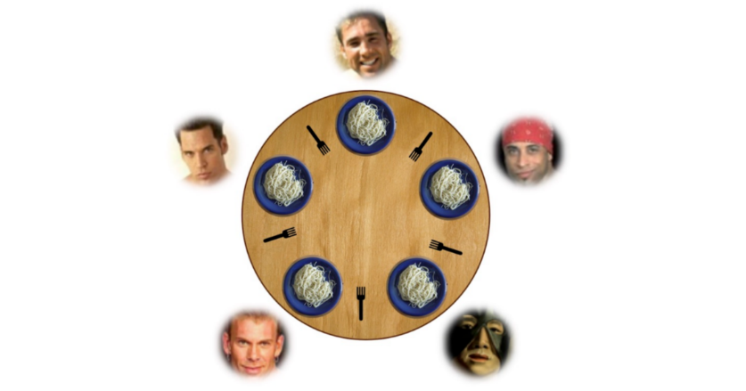
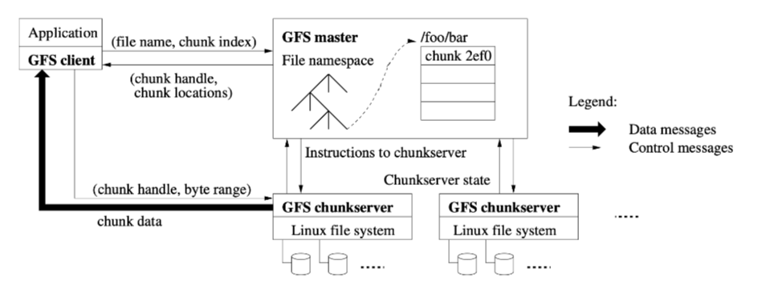

**背景回顾**：我们分析了同步的本质需求：两个并发的线程等待某个同步条件达成，完成时间线的 “交汇”。相应地，我们有了条件变量实现同步，并且解决了生产者-消费者问题 (括号打印问题)。

**本讲内容**：另一种共享内存系统中常用的同步方法：信号量 (E. W. Dijkstra)

- 什么是信号量
- 信号量适合解决什么问题
- 哲 ♂ 学家吃饭问题


# 信号量

## 信号量：一种条件变量的特例

打印 “合法” 的括号序列 `(())()`

- 左括号对应 push
- 右括号对应 pop

```
#define CAN_PRODUCE (count < n)
#define CAN_CONSUME (count > 0)

wait_until(CAN_PRODUCE) with (mutex) {
  count++;
  printf("(");
}

wait_until(CAN_CONSUME) with (mutex) {
  count--;
  printf(")");
}
```


## 信号量：一种条件变量的特例

```c
void P(sem_t *sem) {	// wait
    wait_until(sem->count > 0) {
        sem->count--;
    }
}

void V(sem_t *sem) {	// post (signal)
    sem->count++;
}
```

正是因为条件的特殊性，信号量不需要 broadcast

- P 失败时立即睡眠等待
- 执行 V 时，唤醒任意等待的线程


如果手上有一个东西，就用 V 操作，如果想等一个东西就用 P 操作。但它和条件变量不一样的是，条件变量在 broadcast 的时候，如果有人在等，我的 broadcast 就会把它唤醒，但是如果我在等之前 broadcast 的话，那就没有人被唤醒。信号量，如果 P 成功，一定会带来一次 count--。如果 V 成功，一定会带来一次 count++。所以就不会存在 signal 丢掉的情况。


## 理解信号量 (1)

互斥锁 count = 1 的特殊情况

- 互斥锁是信号量的特例

```c
#define YES 1
#define NO 0

void lock() {
	wait_until(count == YES) {
        count = NO;
    }
}

void unlock() {
	count = YES;
}
```


## 理解信号量 (2)

P - prolaag (try + decrease/down/wait/acquire)

- 试着从袋子里取一个球
  - 如果拿到了，离开
  - 如果袋子空了，排队等待


V - verhoog (increase/up/post/signal/release)

- 往袋子里放一个球
  - 如果有人在等球，他就可以拿走刚放进去的球了
  - 放球 - 拿球的过程实现了同步


任何时候想用信号量解决同步问题的时候，都可以用这个模型。一个或多个袋子（P、V 是带参数的），一个球代表了一个单位的资源。现在允许打印10个左括号，就可以在这放10个球，10个打左括号的线程过来了就试图从包里拿球，第11个来拿不到就得等，所以就能打10个左括号。


## 理解信号量 (3)

扩展的互斥锁：一个手环 -> n 个手环

- 让更多同学可以进入更衣室
  - 管理员可以持有任意数量的手环（count，更衣室容量上限）
  - 先进入更衣室的同学先进入游泳池
  - 手环用完后需要等同学出来
- 信号量对应了 “资源数量”


## 信号量：实现优雅的生产者-消费者

信号量设计的重点

- 考虑 “球”/“手环” （每一单位的资源）是什么
- 生产者/消费者 = 把球从一个袋子里放到另一个袋子里

```c
void Tproduce() {
    P(&empty);
    printf("(");	//注意共享数据结构访问需互斥
    V(&fill);
}
void Tconsume() {
	P(&fill);
    printf(")");
    V(&empty);
}
```




# 信号量：应用

## 信号量的两种典型应用

1. 实现一次临时的 happens-before
   - 初始：s = 0
   - A; V(s)
   - P(s); B
     - 假设 s 只被使用一次，保证 A happens-before B
   
   如果你想在两个线程间达成某种顺序，比如 T1 做 A，T2 做 B，你希望 B 要用到 A 计算的数据。如果你希望实现一个先 A 后 B 的同步操作，那么比较简单的方式是：创建一个新的信号量，在 A 完成后才 V(x)，在 B 开始前 P(x)。
   
   如果 T1 先执行，V(x)，count+1。然后 B 再执行，count-1。有点像互斥锁初始的时处于被锁定的状态，然后 A 再 release 这个锁，然后 B 再获得这把锁就可以完成一个同步。所以如果 B 先来，需要等到 A 执行了 V(x) 后，P(x) 才能返回，这就形成了一个 A happens-before B。
   
    使用条件变量实现，如果 A 用了条件变量的话，直接在这个条件变量 broadcast/signal，如果 B 后来的话，这个 broadcast/signal 就丢了，还需要使用一个额外的变量告诉 B 这件事情做完了。信号量因为自带一个计数器，一个包、一个球，所以实现还是简单点的。
   
   
   
2. 实现计数型的同步
   - 初始: done = 0
   - Tworker: V(done)
   - Tmain: P(done) x T
   
   跟生产者-消费者刚才那个模型很像，你有一个池子，资源池里有多少个资源。


对应了两种线程 join 的方法

- T1 -> T2 -> ... vs. 完成就行，不管顺序

方式1：T1 -> T2 -> ... 顺序



方式2：完成就行，不管顺序

只要有任何一个线程执行完了，我就可以被唤醒一次，我就可以知道每一个线程的执行时间。




## 例子：实现计算图

信号量既然可以实现 happens-before，那信号量就能用来很容易实现任何计算图。

万能的实现计算图同步的方式，不需要条件变量，而且很简单。

为每条边设置一个信号量






## 实现计算图（cont'd）

乍一看很厉害

- 完美解决了并行问题

实际上...

- 创建那么多线程和那么多信号量 = Time Limit Exceeded

- 解决线程太多的问题
  - 一个线程负责多个节点的计算
    - 静态划分 -> 覆盖问题：如果在得到问题的时候已经对问题有了全局的视野和比较好的划分，就可以做一个静态的划分，覆盖问题，优化。在多少个线程之内，让最长的路径尽可能的短，并且中间的同步尽可能少。
    - 动态调度 -> 又变回了生产者-消费者
  
  只要节点计算顺序不违背拓扑序。把 ace 放到一个线程上叫 T1，bd 放到一个线程上叫 T2。相当于在不违背拓扑序的情况下添加一个拓扑序，T1 做的是 a，c，e，线程内的同步就不需要了，就用顺序程序来写。线程间同步还是需要的，分到两个线程只用同步3次就可以了，可以省下一些线程和信号量。
  
  
  
  动态划分，之前的打印 <><_ 和 ><>_ 序列就是个典型例子。选择了打印左括号，才知道之后打印右括号。
  
  信号量的困难：上一条鱼打印完之后，< 和 > 都是可行的，我就面临一个二选一的问题。如果你让 < 线程和 > 线程同时去抢球，就可能会造成小麻烦。如果想要用信号量实现的话，建议在做完上一件事情的时候让它决定下一个是谁，由动态计算图的上一个节点生成下一个节点。
  
- 解决信号量太多的问题
  
  - 计算节点共享信号量
    - 可能出现 “假唤醒” -> 又变回了条件变量


## 例子：使用信号量实现条件变量




## 使用信号量实现条件变量：本质困难

操作系统用自旋锁保证 wait 的原子性

```c
wait(cv, mutex) {
    release(mutex);
    sleep();
}
```

信号量实现的矛盾

- 不能带着锁睡眠（NewBing 犯的错误）
- 也不能先释放锁
  - P(mutex); nwait++; V(mutex);
  - 此时 signal/broadcast 发生，唤醒了后 wait 的线程
  - P(sleep);
- 我们稍后介绍解决这种矛盾的方法


## 信号量的使用：小结

信号量是对 "袋子和球/手环" 的抽象

- 实现一次 happens-bofore，或是计数型的同步
  - 能够写出优雅的代码
  - P(empty);  printf("(");  V(fill)
- 但并不是所有的同步条件都容易用这个抽象来表达


**TIP: BE CAREFUL WITH GENERALIZATION**

The abstract technique of generalization can thus be quite useful in systems design, where one good idea can be made slightly broader and thus solve a larger class of problems. However, be careful when generalizing; as Lampson warns us "Don't generalize; generalizations are generally wrong".

One could view semaphores(信号) as a generalization of locks and condition variables; however, is such a generalization needed? And, given the difficulty of realizing a condition variable on top of a semaphore, perhaps this generalization is not as general as you might think.


# 哲学家吃饭问题

经典同步问题：哲学家（线程）有时思考，有时吃饭

- 吃饭需要同时得到左手和右手的叉子
- 当叉子被其他人占有时，必须等待，如何完成同步？




## 失败与成功的尝试

失败的尝试

- 把信号量当互斥锁：先拿一把叉子，再拿另一把叉子


成功的尝试（万能的方法）

```c
#define CAN_EAT (avail[lhs] && avail[rhs])
mutex_lock(&mutex)
while (!CAN_EAT)
    cond_wait(&cv, &mutex);
avail[lhs] = avail[rhs] = false;
mutex_unlock(&mutex);

mutex_lock(&mutex);
avail[lhs] = avail[rhs] = true;
cond_broadcast(&cv);
mutex_unlock(&mutex);
```


## 成功的尝试：信号量

Trick: 死锁会在 5 个哲学家 “同时吃饭” 时发生

- 破坏这个条件即可
  - 保证任何时候至多只有4个人可以吃饭
  - 直观理解：大家先从桌上退出
    - 袋子里有 4 张卡
    - 拿到卡的可以上桌吃饭（拿叉子）
    - 吃饭以后把卡归还到袋子
- 任意 4 个人想吃饭，总有一个可以拿起左右手的叉子
  - 教科书上有另一种解决方法（lock ordering；之后会将）


但这真的对吗？

- philosopher-check.py
- 在必要的时候使用 model checker


## 反思：分布与集中

“Leader/follower“ 有一个集中的总控，而非各自协调

- 在可靠的消息机制上实现任务分派
  - Leader 串行处理所有请求（例如：条件变量服务）

```c
void Tphilosopher(int id) {
    send(Twaiter, id, EAT);
    receive(Twaiter);	// 等待 waiter 吧两把叉子递给哲学家
    eat();
    send(Twaiter, id, DONE);	// 归还叉子
}

void Twaiter() {
    while (1) {
        (id, status) = receive(Any);
        switch (status) { ... }
    }
}
```


## 反思：分布与集中（cont'd)

你可能会觉得，管叉子的人是性能瓶颈

- 一大桌人吃饭，每个人都叫服务员的感觉

- Premature optimization is the root of all evil (D.E.Knuth)

  抛开 workload 谈优化就是耍流氓

  

- 吃饭的时间通常远远大于请求服务员的时间

- 如果一个 manager 搞不定，可以分多个 (fast/slow path)

  - 把系统设计好，集中管理可以不是瓶颈： [The Google File System](https://pdos.csail.mit.edu/6.824/papers/gfs.pdf) (SOSP'03) 开启大数据时代


# Take-away Messages

信号量是一种特殊的条件变量，而且可以在操作系统上被高效地实现，避免 broadcast 唤醒的浪费：

```
void P() {
  WAIT_UNTIL(count > 0) {
    count--;
  }
}
void V() {
  count++;
}
```

同时，我们也可以把信号量理解成袋子里的球，或是管理游泳池的手环，因此它在符合这个抽象时，能够带来优雅的代码。

更重要的是，但凡我们能将任务很好地分解成少量串行的部分和绝大部分 “线程局部” 的计算，那么生产者-消费者和计算图模型就能实现有效的并行。精心设计的分布式同步协议不仅可能存在正确性漏洞，带来的性能收益很可能也是微乎其微的。