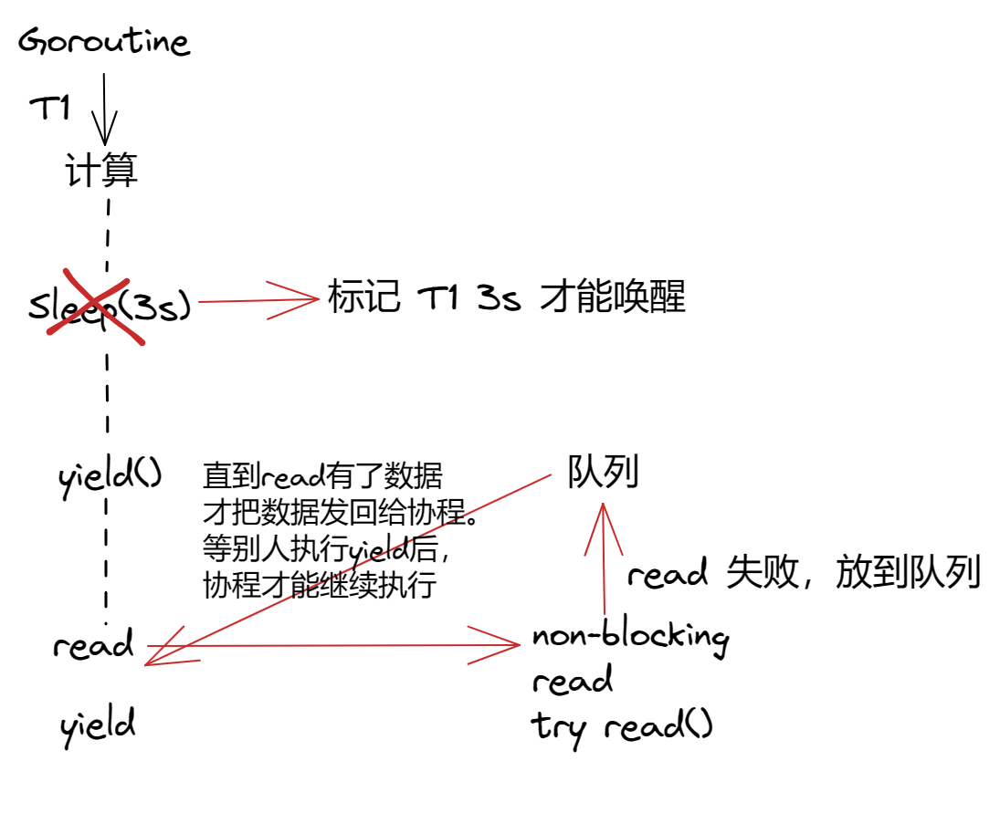
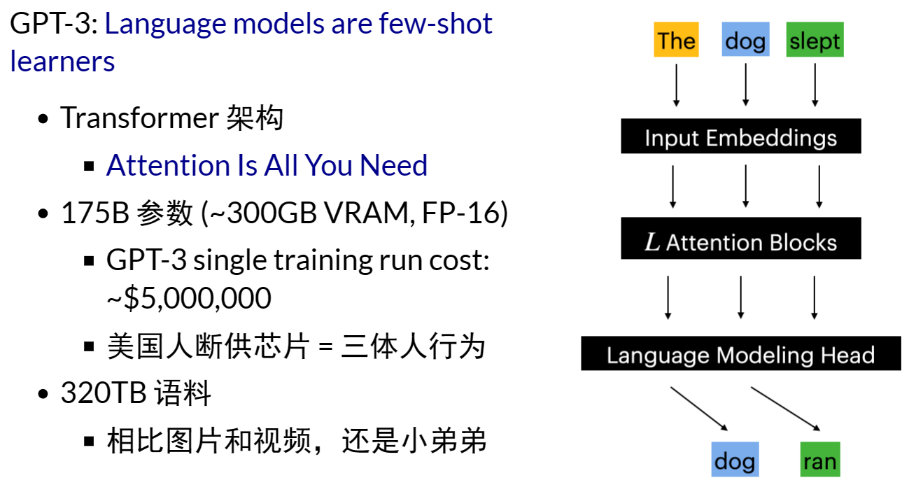
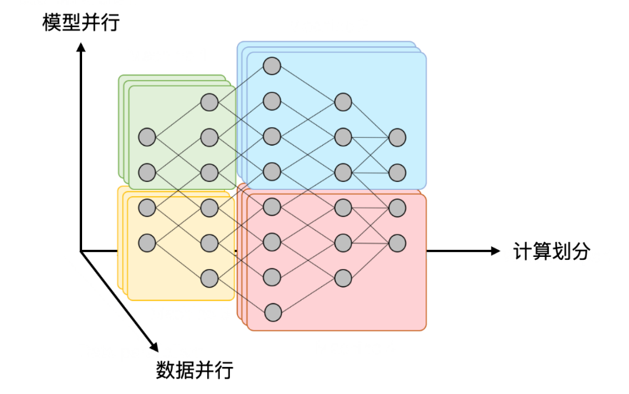
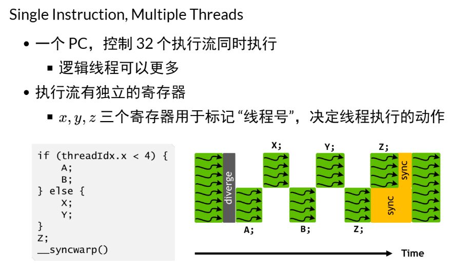
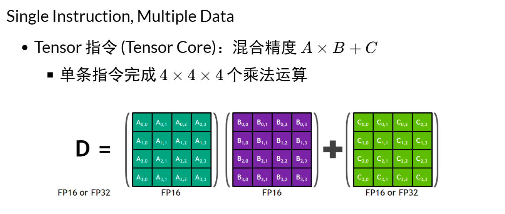
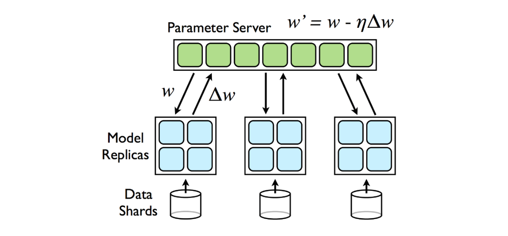
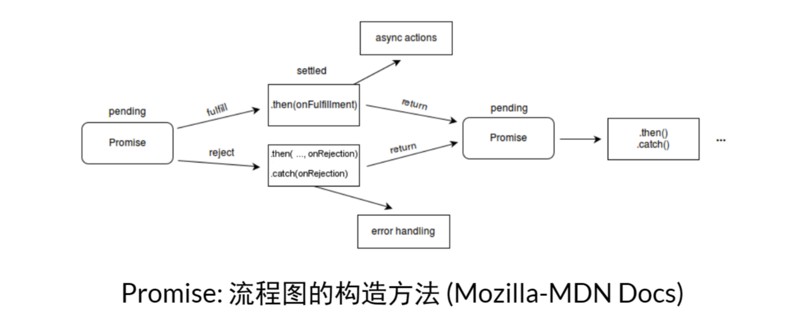

**Changelog & 反馈**

- 反馈：万能同步方法中的 broadcast v.s. signal
- 上课仅仅起到 “导读” 的作用；阅读教科书 + 做实验是真正掌握操作系统的必要途径：只有实际理解程序 (状态机) 的执行，才真正 “会编程”。这是目前人类和 LLM 唯一的差距
- 实验：难度、Online Judge 和 academic integrity

**背景回顾**：我们已经掌握了多种并发控制技术：自旋锁、互斥锁、条件变量、信号量。我们已经可以实现共享内存系统上的任意并发/并行计算。然而，大家也在使用这些 “底层” 并发控制时发现使用的困难。那么，真实世界的程序员是怎么实现并发程序的？

**本讲内容**：(本次课为科普，不需要掌握相关编程技术) 并发编程模型与底层同步机制的封装

- 高性能计算中的并行编程 (embarrassingly parallel 的数值计算)
- 数据中心中的并发编程 (协程、Goroutine 和 channel)
- 人工智能时代的分布式机器学习 (GPU 和 Parameter Server)
- 用户身边的并发编程 (Web 和异步编程)


# 高性能计算中的并行编程

## （经典）高性能计算

"A technology that harnesses the power of supercomputers or computer clusters to solve complex problems requiring massive computation." (IBM)


源自数值密集型科学计算任务

- 物理系统模拟
  - 天气预报、航天、制造、能源、制药、...
  - 大到宇宙小到两字，有模型就能模拟
- 矿厂
  - 存粹的 hash 计算
- [HPC-China 100](http://www.hpc100.cn/top100/21/)


## 高性能计算程序：特点

物理世界具有 “空间局部性“

- 一切 “模拟物理世界” 的系统都具有 embarrassingly parallel 的特性


## 高性能计算：关键问题

问题1：计算任务如何分解

- 通常计算图容易静态切分（机器-线程两级任务分解）
- 生产者-消费者解决一切
  - [Message Passing Interface (MPI)](https://hpc-tutorials.llnl.gov/mpi/) - "a specification for the developers and users of message passing libraries", [OpenMP](https://www.openmp.org/) - "multi-platform shared-memory parallel programming in C/C++ and Fortran"
  - [Parallel and Distributed Computation: Numerical Methods](https://web.mit.edu/dimitrib/www/pdc.html)

```c
#pragma(编译指示、注解) omp parallel num_threads(128)
for (int i = 0; i < 1024; i++) {
}
```

问题2：海量线程之间的如何同步和通信

- 持久存储（~PB）-> CPU/内存（~TB）-> GPU/显存（~10GB）-> 缓存（~MB）


# 数据中心的并发编程

## 数据中心程序：特点

"A network of computer and storage resources that enable the delivery of shared applications and data." (CISCO)

以数据（存储）为中心

- 互联网索引与搜索
  - Google
- 社交网络
  - Facebook/Twitter
- 支撑各类互联网应用
  - 通信（微信/QQ）、支付（支付宝）、游戏/网盘/...


## 数据中心：关键问题

如何实现高可靠、低延迟的多副本分布式存储和计算系统？

- 在服务海量地理分布请求的前提下，三者不可兼得：
  - 数据要保持一致（Consistency）
  - 服务时刻保持可用（Availability）
  - 容忍机器离线（Partition tolerance）


## 数据中心程序上的单机程序

事件驱动 + 高并发：系统调用密集且延迟不确定

- 网络数据读写
- 持久存储读写
- 单机程序目标：尽可能多地服务并行的请求
  - QPS：吞吐量
  - Tail latency：一个请求慢了，其他请求不能慢


假设有数千/数万个请求同时到达服务器

- 线程能够实现并行处理
- 但远多于处理器数量的线程导致性能问题
  - 切换开销
  - 维护开销


## 协程：操作系统 ”不感知“ 的上下文切换

和线程概念相同（独立堆栈、共享内存）

- 但 “一直执行”，直到 yield() 主动放弃处理器
  - 有编译器辅助，切换开销低
    - yield() 是函数调用，只需保存/恢复 “callee saved” 寄存器（非常少量）。比一次中断上下文切换要保存所有的寄存器，要轻量得多。而且某种程度讲，编译器参与了寄存器的分配和优化，性能就远比被动地用线程切换要效率来得高。不会运行到一半就被中断，然后打断，它的执行时间更长。
    - 线程切换需要保存/恢复全部寄存器
  - 但等待 I/O 时，其他协程就不能运行了...
    - 失去了并行，因为所有的线程切换都是手动的

```c
// 只可能是 1122 或 2211
void T1() { send("1"); send("1"); yield(); }
void T2() { send("2"); send("2"); yield(); }
```


## Go 和 Goroutine

Go：小孩子才做选择，多处理器并行和轻量级并发我全都要！

Goroutine：概念上是线程，实际是线程和协程的混合体

- 每个 CPU 上有一个 Go Worker，自由调度 goroutines
- 执行到 blocking API 时（例如 sleep, read）
  - Go Worker 偷偷改成 non-blocking 的版本
    - 成功 -> 立即继续执行
    - 失败 -> 立即 yield 到另一个需要 CPU 的 goroutine
      - 太巧妙了！CPU 和操作系统全部用到 100%



它用起来是线程，但它把标准库做了一个很聪明的处理，实现却和协程一样轻量。


例子

- Fibonacci number from [The Go Programming Language (ch 9.8)](https://books.studygolang.com/gopl-zh/ch9/ch9-08.html)


## Go 语言中的同步

Do not communicate by sharing memory; instead, share memory by communicating. Effective Go

共享内存 = 万恶之源

- 信号量/条件变量：虽然很多书上叫做 IPC，进程间通信机制。实现了同步，但没有实现 “通信”。
  - 数据传递完全靠手工（没上锁就错了）。我们有一个简化的模型打印左右括号，但如果真的要做一个 work，那还是要在共享内存里放一个队列，然后用锁保护好，放东西要上锁，取东西也要上锁。


但 UNIX 时代就有一个实现并行的机制了

- cat *.txt | wc -l
  - 管道是一个天然的生产者/消费者
  - 为什么不用 “管道” 实现协程/线程间的同步 + 通信呢？
    - Channels in Go

在管道两边的进程是完全并行的。

如果你想在 Go 语言里面实现线程或协程间通信的话，你只要创建一个管道就可以了。通常你会把一个 workload 一个执行任务做一个结构体打包进来给这个 channel，然后 channel 是有容量的。


## Goroutine 和 Channel

Go 语言为数据中心应用提供了高 I/O 并发的基础机制和 goroutine 之间的同步机制。Goroutine 的使用方法和线程完全一样，但实现却比线程轻量。

```go
// fib.go, goroutine
package main

import (
  "fmt"
  "time"
)

func main() {
  go spinner(100 * time.Millisecond)
  const n = 45
  fibN := fib(n) // slow
  fmt.Printf("\rFibonacci(%d) = %d\n", n, fibN)
}

func spinner(delay time.Duration) {
  for {
    for _, r := range `-\|/` {
      fmt.Printf("\r%c", r)
      time.Sleep(delay)
    }
  }
}

func fib(x int) int {
  if x < 2 { return x }
  return fib(x - 1) + fib(x - 2)
}
```

```go
// pc.go, channel
package main

import (
  "fmt"
  "time"
)

func main() {
  go spinner(100 * time.Millisecond)
  const n = 45
  fibN := fib(n) // slow
  fmt.Printf("\rFibonacci(%d) = %d\n", n, fibN)
}

func spinner(delay time.Duration) {
  for {
    for _, r := range `-\|/` {
      fmt.Printf("\r%c", r)
      time.Sleep(delay)
    }
  }
}

func fib(x int) int {
  if x < 2 { return x }
  return fib(x - 1) + fib(x - 2)
}
```


# 人工智能时代的分布式机器学习

## 机器学习：既计算密集，又数据密集

[Language Models are Few-Shot Learners (arxiv.org)](https://arxiv.org/abs/2005.14165)

[Attention Is All You Need (arxiv.org)](https://arxiv.org/abs/1706.03762)




## 并行化：Dependency Graph is All You Need




## 计算密集部分 (1)：SIMT




## 计算密集部分 (2)：SIMD




## 计算密集部分 (3)：堆更多的处理单元

GH100 Spec

- 144 SMs
- 18432 CUDA Cores (并行的 Threads)
  - AVX512: 512bits = 16 x Float32
- 576 Tensor Cores (4 per SM)
- 6 HBM3 or HBM2e stacks
- 12 512-bit memory controllers
- 60 MB L2 cache

---

这只是一个 GPU

- 显存/缓存决定了 GPU 内堆处理器的上限
- 但我们可以有多台机器、每个机器有多台 GPU！


## 分布式机器学习

高性能计算（GPU）+ 数据中心计算

[Scaling Distributed Machine Learning with the Parameter Server | USENIX](https://www.usenix.org/conference/osdi14/technical-sessions/presentation/li_mu)




# 用户身边的并发编程

## Web 2.0 时代（1999）

人与人之间联系更加紧密的互联网

- "Users were encouraged to provide content, rather than just viewing it."
- 你甚至可以找到一些 “Web 3.0”/Metaverse 的线索


是什么成就了今天的 Web 2.0？

- HTML (DOM Tree) + CSS = 终端世界
  - 通过 JavaScript 可以改变它
  - 通过 JavaScript 可以连接数据中心
  - Ajax (Asynchronous JavaScript + XML) 和 $
- 例子：Jupyter Notebook


## 人机交互程序：特点和主要挑战

特点：不太复杂

- 既没有太多计算
  - DOM Tree 也不至于太大（大了人也看不过来）
  - DOM Tree 怎么画浏览器全帮我们搞定了
- 也没有太多 I/O
  - 就是一些网络请求


挑战：程序员多

- 零基础的人你让他整共享内存上的多线程
- 恐怕我们现在用的到处都是 bug 吧？
  - 框架：不用怕，有我在
  - AI：不用怕，有我在


## 单线程 + 事件模型

JavaScript 给我们提供了尽可能少但又足够的并发

- 一个线程、全局的事件队列、按序执行 (run-to-complete)
- 耗时的 API (Timer, Ajax, ...) 调用会立即返回
  - 条件满足时向队列里增加一个事件

```javascript
$.ajax(
  {
    url: 'https://jyywiki.cn/hello/jyy',
    success: function(resp) {
      console.log(resp);
    },
    error: function(req, status, err) {
      console.log("Error");
    }
  }
);
```


## 异步事件模型

好处

- 并发模型简单了很多
  - 函数的执行是原子的（不能并行，减少了并发 bug 的可能性）
- API 依然可以并行
  - 适合网页这种 “大部分时间花在渲染和网络请求” 的场景
    - JavaScript 代码只负责 “描述” DOM Tree

坏处

- Callback hell（祖传屎山）
  - `$.ajax` 嵌套了 5 层，可维护性已经接近于零了


## 异步编程：Promise

导致 callback hell 的本质：人类脑袋里想的是 “流程图”，看到的是 “回调”

The Promise object represents the eventual completion (or failure) of an asynchronous operation and its resulting value.



可以更好的描述计算图


## Promise：描述 Workflow 的 “嵌入式语言”

Chaining

```js
loadScript("/article/promise-chaining/one.js")
  .then( script => loadScript("/article/promise-chaining/two.js") )
  .then( script => loadScript("/article/promise-chaining/three.js") )
  .then( script => {
    // scripts are loaded, we can use functions declared there
  })
  .catch(err => { ... } );
```


Fork-join

```js
a = new Promise( (resolve, reject) => { resolve('A') } )
b = new Promise( (resolve, reject) => { resolve('B') } )
c = new Promise( (resolve, reject) => { resolve('C') } )
Promise.all([a, b, c]).then( res => { console.log(res) } )
```


## Async-Await：一种计算图的描述语言

async function

- 总是返回一个 Promise object
- async_func() - fork


await promise

- await promise - join

```js
A = async () => await $.ajax('/hello/a')
B = async () => await $.ajax('/hello/b')
C = async () => await $.ajax('/hello/c')
hello = async () => await Promise.all([A(), B(), C()])
hello()
  .then(window.alert)
  .catch(res => { console.log('fetch failed!') } )
```


# Take-away Messages

(本讲为科普内容，不要求掌握实际代码编写)

- 计算图并发编程的真实应用场景
  - 高性能计算 (注重任务分解)：生产者-消费者 (MPI/OpenMP)
  - 数据中心 (注重系统调用)：线程-协程 (Goroutine)
  - 人工智能：高性能计算 + 数据中心
  - 人机交互 (注重易用性)：事件-流图 (Promise)
- 编程工具的发展突飞猛进
  - 开源社区和人工智能彻底改变了计算机科学的学习方式
  - 选择你的主力现代编程语言：Modern C++, Rust, Javascript, Scala/Kotlin/Java, ...