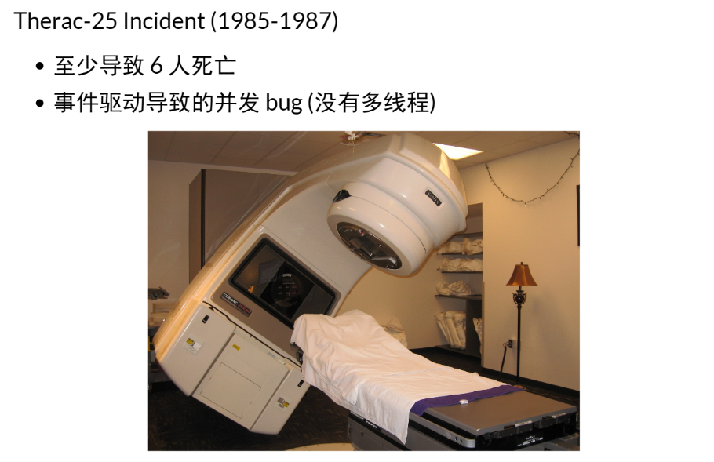
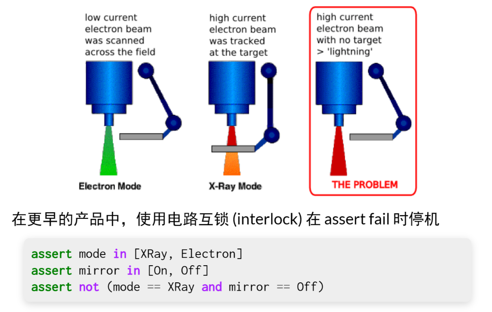
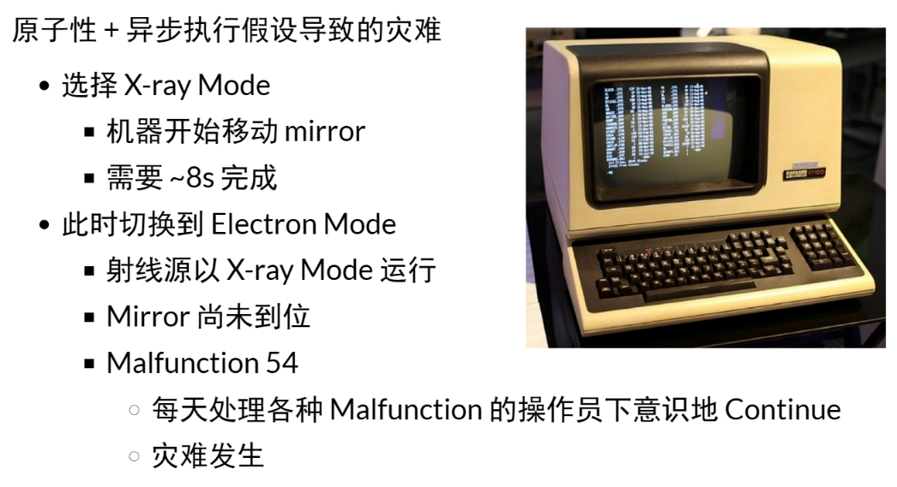
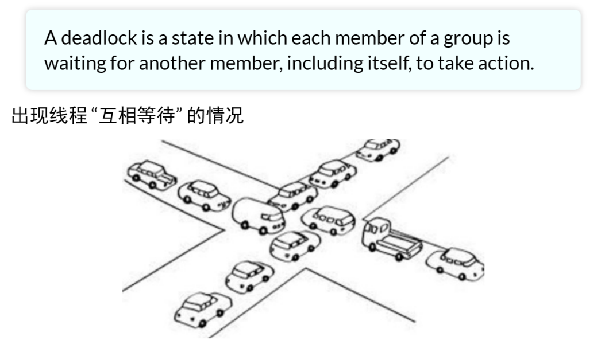
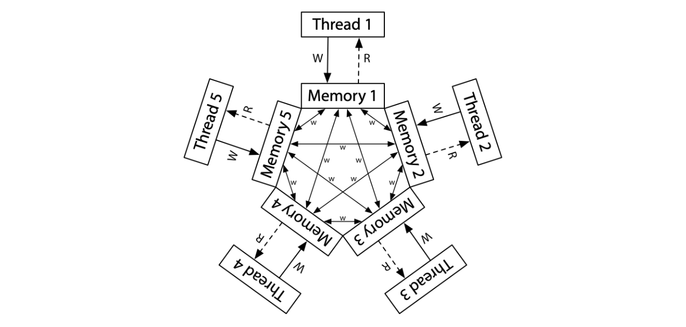
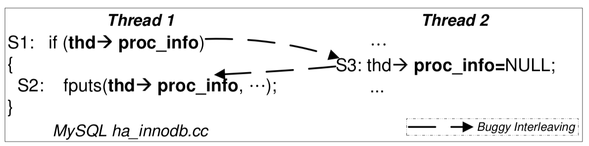
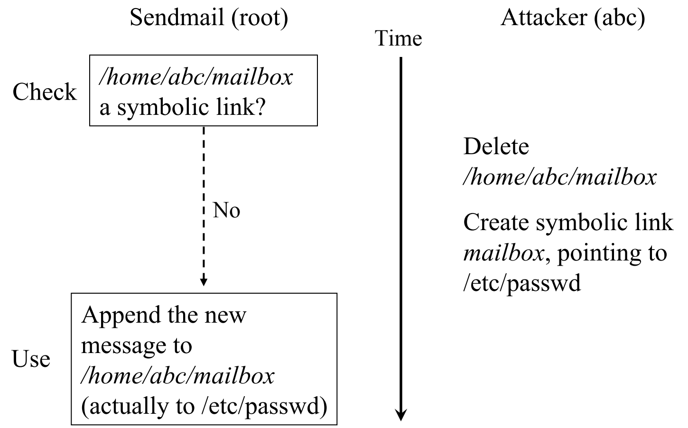

**背景回顾**：当我们在写程序的时候，我们其实是在写 bug。时至今日，我们还没有有效、方便的技术能帮助我们快速构建可靠的软件系统。然而并发 bugs “若隐若现” 的特性又导致它们经常逃脱开发人员的掌控。

**本讲内容**：常见的并发 bugs

- 死锁
- 数据竞争
- 原子性和顺序违反


# 伤人的并发 Bug

## 先回顾一个并发 Bug

在捡起东西的瞬间 “拿起” 物品，“拿起” 的物品会变成 “捡起” 的物品

似乎是由共享状态引起的

```c
v = "$1";
// Expected timing
// InHand = v;

Event(pickup) {
    v = "$99";
    Inventory.append(v);
}

// Actual timing
InHand = v;
```


## Killed by a Machine




## The Therac-25




## The Killer Software Bug in History




## 这甚至不是 Therac-25 里的最后一个杀人 Bug

问题修复后......

- If the operator sent a command at the exact moment the counter overflowed, the machine would skip setting up some of the beam accessories

最终解决方案

- 独立的硬件安全方案
- 在大计量照射发生时直接停机


这个事故告诉我们：在安全攸关的系统中，独立的防护模块是必不可少的。依据调试理论，即便不是安全攸关的系统，独立于程序实现的逻辑检查 (assertions) 可以在软件造成问题之前 fail fast。


# 死锁

## 死锁（Deadlock）




## AA-Deadlock

Model checker 可以告诉你为什么

```c
lock(&lk);
// lk = LOCKED;
lock(&lk);
// while (xchg(&lk, LOCKED) == LOCKED);
```

看起来很傻，你觉得自己不会犯这错误？

- 不，你会犯的
- 真实系统的复杂性等着你
  - 多层函数调用
  - 隐藏的控制流


## ABBA-Deadlock

哲学家吃饭问题

```c
void Tphilosopher() {
    P(&avail[lhs]);
    P(&avail[rhs]);
    // ...
    V(&avail[lhs]);
    V(&avail[rhs]);
}
```

- T1: P(1) - 成功，P(2) - 等待
- T2: P(2) - 成功，P(3) - 等待
- T3: P(3) - 成功，P(4) - 等待
- T4: P(4) - 成功，P(5) - 等待
- T5: P(5) - 成功，P(1) - 等待


## 死锁产生的必要条件

[System Deadlocks | ACM Computing Surveys](https://dl.acm.org/doi/10.1145/356586.356588)：死锁产生的四个必要条件

- 用 “资源” 来描述
  - 状态机视角：就是 “当前状态下持有的锁（校园卡/球）”

1. Mutual-exclusion - 一张校园卡只能被一个人拥有
2. Wait-for - 一个人等其他校园卡时，不会释放已有的校园卡
3. No-preemption - 不能抢夺他人的校园卡
4. Circular-chain - 形成校园卡的循环等待关系

四个条件 “缺一不可”

- 打破任何一个即可避免死锁
- 在程序逻辑正确的前提下 “打破” 根本没那么容易...


# 数据竞争

所以不上锁就没有死锁了吗？

## 数据竞争

不同的线程同时访问同一内存，且至少有一个是写。

- 两个内存访问在 “赛跑”，“跑赢” 的操作先执行
- 例子：共享内存上实现的 Peterson 算法


任何指令访问内存，load、store、move，还有很多指令比如 return（访问栈的内存，它的行为是把栈上的指令 pop 到 pc 上，其实是读内存）。


## 数据竞争（cont'd)

跑赢并没有想象中那么简单

- Weak memory model 允许不同观测者看到不同结果
- Since C11：[data race is undefined behavior](https://en.cppreference.com/w/c/language/memory_model)




## 数据竞争：你只要记得

用锁保护好共享数据

消灭一切数据竞争


## 数据竞争：例子

以下代码概括了你们遇到数据竞争的大部分情况

- 不要笑，你们的 bug 几乎都是这两种情况的变种

```c
// Case #1: 上错了锁
void thread1() { spin_lock(&lk1); sum++; spin_unlock(&lk1); }
void thread1() { spin_lock(&lk2); sum++; spin_unlock(&lk2); }
```


```c
// Case #2: 忘记上锁
void thread1() { spin_lock(&lk1); sum++; spin_unlock(&lk1); }
void thread2() { sum++; }
```


为什么不要笑？

不同的线程同时访问同一内存，且至少有一个是写

- “内存” 可以是地址空间中的任何内存
  - 可以是全部变量
  - 可以是堆区分配的变量
  - 可以是栈
- “访问” 可以是任何代码
  - 可能发生在你的代码里
  - 可以发生在框架代码里
  - 可能是一行你没有读到过的汇编代码
  - 可能是一条 ret 指令


# 原子性和顺序违反

## 并发编程的本质

人类是 sequential creature

- 我们只能用 sequential 的方式来理解并发
  - 程序分成若干 “块”，每一块看起来都没被打断 (原子)
  - 具有逻辑先后的 “块” 被正确同步
    - 例子：produce → (happens-before) → consume


并发控制的机制完全是 “后果自负” 的

- 互斥锁 (lock/unlock) 实现原子性
  - 忘记上锁——原子性违反 (Atomicity Violation, AV)
- 条件变量/信号量 (wait/signal) 实现先后顺序同步
  - 忘记同步——顺序违反 (Order Violation, OV)


## 那么，程序员用的对不对呢？

“Empirical study” 实证研究

- 收集了 105 个真实系统的并发 bugs
  - MySQL (14/9), Apache (13/4), Mozilla (41/16), OpenOffice (6/2)
  - 观察是否存在有意义的结论


97% 的非死锁并发 bug 都是原子性或顺序错误

- “人类的确是 sequential creature”
- [Learning from mistakes - A comprehensive study on real world concurrency bug characteristics](https://dl.acm.org/doi/10.1145/1346281.1346323) (ASPLOS'08, Most Influential Paper Award)


## 原子性违反 (AV)

“ABA”

- 我以为一段代码没啥事呢，但被人强势插入了
- 即便分别上锁 (消除数据竞争)，依然是 AV
  - Diablo I 里复制物品的例子
  - Therac-25 中 “移动 Mirror + 设置状态”




## 原子性违反 (cont'd)

操作系统中还有更多的共享状态

- “TOCTTOU” - time of check to time of use



- [TOCTTOU vulnerabilities in UNIX-style file systems: An anatomical study](https://www.usenix.org/legacy/events/fast05/tech/full_papers/wei/wei.pdf) (FAST'05); 我们可以用进程模型复现这个问题！


原子性” 一直是开发者希望拥有的——对编程者而言，理想情况是一段代码的执行要么看起来在瞬间全部完成，要么好像完全没有执行过。代码中的副作用：共享内存写入、文件系统写入等，则都是实现原子性的障碍。因为 “原子性” 如此诱人，在计算机硬件/系统层面提供原子性的尝试一直都没有停止过：从数据库事务 (transactions, tx) 到软件和硬件支持的 [Transactional Memory](https://dl.acm.org/doi/10.1145/165123.165164) “[an idea ahead its time](https://news.brown.edu/articles/2012/04/transaction)” 到 [Operating System Transactions](https://dl.acm.org/doi/abs/10.1145/1629575.1629591)，直到今天我们依然没有每个程序员都垂手可得的可靠原子性保障。

而保证程序的执行顺序就更困难了。Managed runtime 实现自动内存管理、channel 实现线程间通信等，都是减少程序员犯错的手段。


# Take-away Messages

人类本质上是 sequential creature，因此总是通过 “块的顺序执行” 这一简化模型去理解并发程序，也相应有了两种类型的并发 bugs：

- Atomicity violation，本应原子完成不被打断的代码被打断
- Order violation，本应按某个顺序完成的未能被正确同步

与这两类 bugs 关联的一个重要问题是数据竞争，即两个线程同时访问同一内存，且至少有一个是写。数据竞争非常危险，因此我们在编程时要尽力避免。