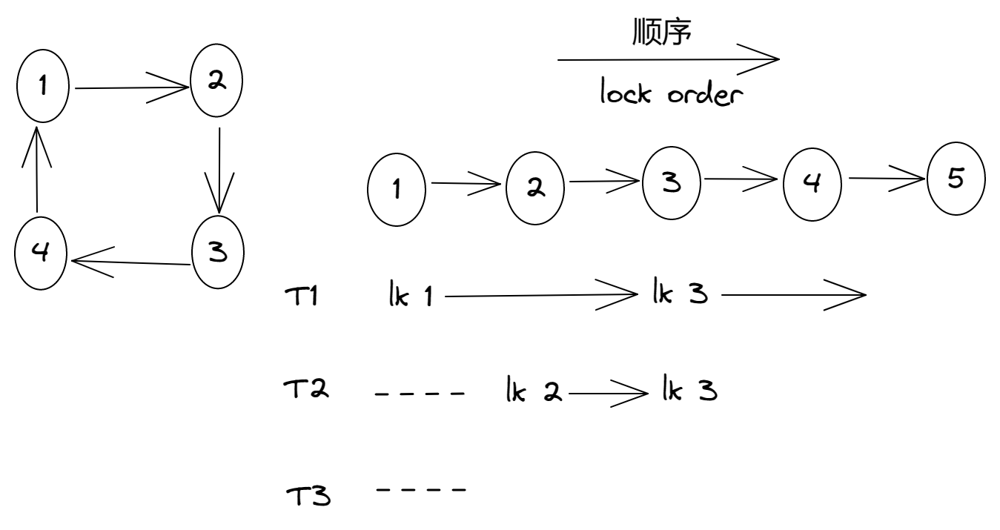
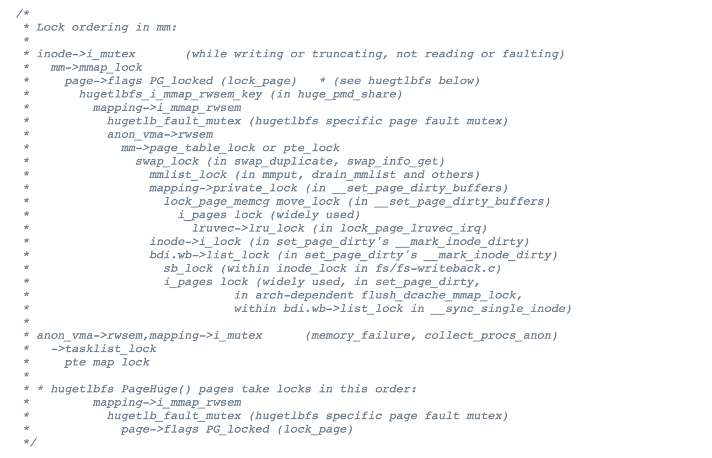
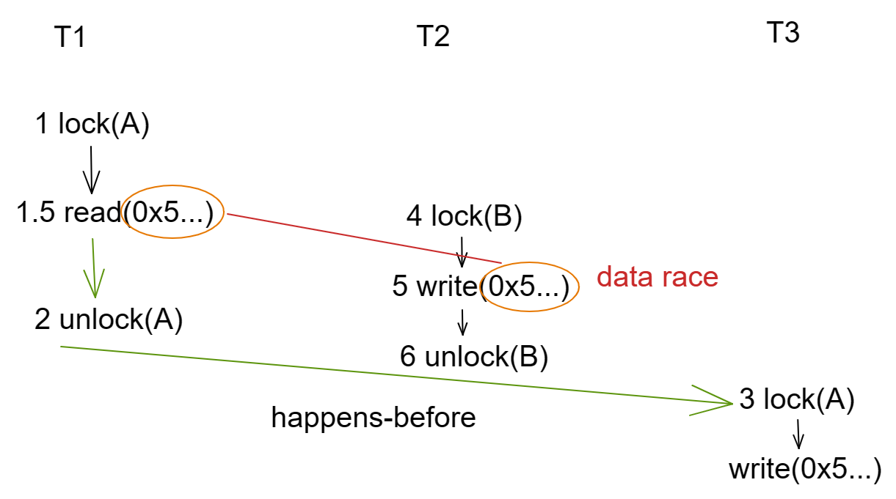
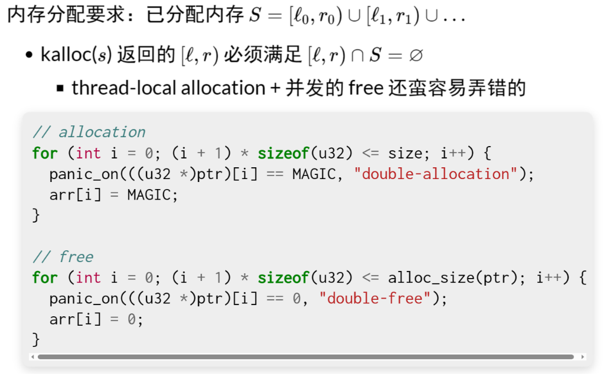

**背景回顾**：我们在编写并发程序时，难免会遇到死锁、数据竞争、原子性/顺序违反等类型的并发 bugs。即便我们知道它们的定义和触发条件，直接在编程时消灭它们依然是十分困难的。以数据竞争为例，它的定义貌似简单：两个线程同时访问同一内存地址，并且至少有一个是写。但 “访问内存” 则可能出其不意——例如 ret 指令和栈上数据的修改产生的数据竞争。那么，我们应该如何应对这些并发 bugs？

**本讲内容**：**一节真正的 “编程 ”课**：如何正确地 (并发) 编程：

- Lock ordering
- 防御性编程
- 运行时检查


# 死锁的应对

## 回顾：死锁产生的必要条件

[System Deadlocks](https://dl.acm.org/doi/10.1145/356586.356588)：死锁产生的四个必要条件

- 用 “资源” 来描述
  - 状态机视角：就是 “当前状态下持有的锁（校园卡/球）”

1. Mutual-exclusion：一张校园卡只能被一个人拥有
2. Wait-for：一个人等其他校园卡时，不会释放已有的校园卡
3. No-preemption：不能抢夺他人的校园卡
4. Circular-chain：形成校园卡的循环等待关系


## 应对死锁：死锁产生的必要条件（cont'd）

站着说话不腰疼的教科书：

- “理解了死锁的原因，尤其是产生死锁的四个必要条件，就可以最大可能地避免、预防和解除死锁。所以，在系统设计、进程调度等方面注意如何不让这四个必要条件成立，如何确定资源的合理分配算法，避免进程永久占据系统资源。此外，也要防止进程在处于等待状态的情况下占用资源。因此，对资源的分配要给予合理的规划。”

不能称为是一个合理的 argument

- 对于玩具系统/模型
  - 我们可以直接证明系统是 deadlock-free 的
- 对于真正的复杂系统
  - Bullshit


## 如何在实际系统中避免死锁？

四个条件中最容易达成的

- 避免循环等待

环是给我们编程处理问题带来复杂的一个结构，有没有可能让上锁的等待关系永远没有环呢？为了破除这个环，我们可以做拓扑排序，希望从左到右规定一个顺序。

T1 想要获取 1、3，就必须先获取 1，再获取 3。T2 想要获取 2、3。这两个线程就会抢这把锁，但是我要求的是系统里所有的线程对于世界上所有的锁都必须按照相同的顺序。如果总是按照从左到右获得锁的顺序的话，任意时刻总有一个线程获得最靠右的一把锁，而这个线程一定可以往后执行。执行完后，会按照相反顺序把锁释放掉。




**Lock ordering**

- 任意时刻系统中的锁都是有限的
- 严格按照固定的顺序获得所有锁（Lock Ordering），就可以消灭循环等待
  - 在任意时刻获得 “最靠后” 锁的线程总是可以继续执行
- 例子：修复哲学家吃饭问题


## Lock Ordering：应用（Linux Kernel：rmap.c）




## Emmm...

Textbooks will tell you that if you always lock in the same order, you will never get this kind of deadlock. *Practice will tell you that this approach doesn't scale*: when I create a new lock, I don't understand enough of the kernel to figure out where in the 5000 lock hierarchy it will fit.

The best locks are encapsulated: they *never get exposed in headers*, and are *never held around calls to non-trivial functions outside the same file*. You can read through this code and see that it will never deadlock, because it never tries to grab another lock while it has that one. People using your code don't even need to know you are using a lock.

—— *[Unreliable Guide to Locking](https://www.kernel.org/doc/html/latest/kernel-hacking/locking.html)* by Rusty Russell

- 最终犯错的还是人


## 使用 Lock Ordering 解决哲学家吃饭问题

只要每个线程上锁的顺序能被排成一个全序，在任何时候，获得 “最后一把锁” 的线程就总是能继续执行 (并在未来释放锁)。

即便是最容易发现、最容易预防的死锁类 bug，在实际的复杂系统中，想要使程序员能够正确遵守编程规范，也是十分困难的。因此，对于复杂的系统，我们必须总是假设程序员会花式犯错，最终才能得到高质量的系统。


# Bug 的本质和防御性编程

## 回顾：调试理论

程序 = 物理世界过程在信息世界中的投影

Bug = 违反程序员对 ”物理世界“ 的假设和约束

- Bug 违反了程序的 specification
  - 该发生的必须发生
  - 不该发生的不能发生
- Fault -> Error -> Failure


## 编程语言与 Bugs

编译器/编程语言

- 只管 “翻译” 代码，不管和实际需求 (规约) 是否匹配
  - “山寨支付宝” 中的余额 balance
    - 正常人看到 0 → 18446744073709551516 都认为 “这件事不对” (“balance” 自带 no-underflow 的含义)

怎么才能编写出 “正确” (符合 specification) 的程序？

- 证明：Annotation verifier ([Dafny](https://dafny-lang.github.io/dafny/)), [Refinement types](https://dl.acm.org/doi/10.1145/113446.113468)
- 推测：Specification mining ([Daikon](http://plse.cs.washington.edu/daikon/))
- 构造：[Program sketching](https://link.springer.com/article/10.1007/s10009-012-0249-7)
- 编程语言的历史和未来
  - 机器语言 → 汇编语言 → 高级语言 → 自然编程语言


## 回到现实

今天 (被迫) 的解决方法

- 虽然不太愿意承认，但始终假设自己的代码是错的
- (因为机器永远是对的)

然后呢？

- 首先，做好测试
- 检查哪里错了
- 再检查哪里错了
- 再再检查哪里错了
  - “防御性编程”
  - 把任何你认为可能 “不对” 的情况都检查一遍


## 防御性编程：实践

把程序需要满足的条件用 assert 表达出来。

及早检查、及早报告、及早修复

- Peterson 算法中的临界区计数器
  - `assert(nest == 1);`
- 二叉树的旋转
  - `assert(p->parent->left == p || p->parent->right == p);`
- AA-Deadlock 的检查
  - `if (holding(&lk)) panic();`
  - xv6 spinlock 实现示例


## 防御性编程和规约给我们的启发

你知道很多变量的含义

```c
#define CHECK_INT(x, cond) \
  ({ panic_on(!((x) cond), "int check fail: " #x " " #cond); })
#define CHECK_HEAP(ptr) \
  ({ panic_on(!IN_RANGE((ptr), heap)); })
```

变量有 “typed annotation”

- `CHECK_INT(waitlist->count, >= 0);`
- `CHECK_INT(pid, < MAX_PROCS);`
- `CHECK_HEAP(ctx->rip); CHECK_HEAP(ctx->cr3);`
- 变量含义改变 → 发生奇怪问题 (overflow, memory error, ...)
  - 不要小看这些检查，它们在底层编程 (M2, L1, ...) 时非常常见
  - 在虚拟机神秘重启/卡住/...前发出警报


## xv6 自旋锁实现

xv6 自旋锁是防御性编程的典范。他假设锁的使用者会犯各种类型的错误，包括 AA 型死锁、double release、释放非本处理器持有的锁等。

防御性编程对大型系统来说是至关重要的。如果没有适当的 assertions，调试代码会变得非常艰难。

```c
#include "thread.h"
#include "thread-sync.h"

struct cpu {
  int ncli;
};

struct spinlock {
  const char *name;
  int locked;
  struct cpu *cpu;
};

__thread struct cpu lcpu;

struct cpu *mycpu() {
  return &lcpu;
}

#define panic(...) \
  do { \
    fprintf(stderr, "Panic %s:%d ", __FILE__, __LINE__); \
    fprintf(stderr, __VA_ARGS__); \
    fprintf(stderr, "\n"); \
    abort(); \
  } while (0) \

void
initlock(struct spinlock *lk, char *name)
{
  lk->name = name;
  lk->locked = 0;
  lk->cpu = 0;
}

// Pushcli/popcli are like cli/sti except that they are matched:
// it takes two popcli to undo two pushcli.  Also, if interrupts
// are off, then pushcli, popcli leaves them off.

void
pushcli(void)
{
  // removes CPU-dependent code
  // eflags = readeflags();
  // cli();
  // if(mycpu()->ncli == 0)
  //   mycpu()->intena = eflags & FL_IF;
  mycpu()->ncli += 1;
}

void
popcli(void)
{
  // removes CPU-dependent code
  //if(readeflags()&FL_IF)
  //  panic("popcli - interruptible");
  if(--mycpu()->ncli < 0)
    panic("popcli");
  //if(mycpu()->ncli == 0 && mycpu()->intena)
  //  sti();
}

// Check whether this cpu is holding the lock.
int
holding(struct spinlock *lock)
{
  int r;
  pushcli();
  r = lock->locked && lock->cpu == mycpu();
  popcli();
  return r;
}

// Acquire the lock.
// Loops (spins) until the lock is acquired.
// Holding a lock for a long time may cause
// other CPUs to waste time spinning to acquire it.
void
acquire(struct spinlock *lk)
{
  pushcli(); // disable interrupts to avoid deadlock.
  if(holding(lk))
    panic("acquire");

  // The xchg is atomic.
  while(atomic_xchg(&lk->locked, 1) != 0)
    ;

  // Tell the C compiler and the processor to not move loads or stores
  // past this point, to ensure that the critical section's memory
  // references happen after the lock is acquired.
  __sync_synchronize();

  // Record info about lock acquisition for debugging.
  lk->cpu = mycpu();
}

// Release the lock.
void
release(struct spinlock *lk)
{
  if(!holding(lk))
    panic("release");

  lk->cpu = 0;

  // Tell the C compiler and the processor to not move loads or stores
  // past this point, to ensure that all the stores in the critical
  // section are visible to other cores before the lock is released.
  // Both the C compiler and the hardware may re-order loads and
  // stores; __sync_synchronize() tells them both not to.
  __sync_synchronize();

  // Release the lock, equivalent to lk->locked = 0.
  // This code can't use a C assignment, since it might
  // not be atomic. A real OS would use C atomics here.
  asm volatile("movl $0, %0" : "+m" (lk->locked) : );

  popcli();
}

struct spinlock lk;

#define N 10000000

long sum = 0;

void Tworker(int tid) {
  lcpu = (struct cpu) { .ncli = 0 };
  for (int i = 0; i < N; i++) {
    acquire(&lk);
    sum++;
    release(&lk);
  }
}

int main() {
  initlock(&lk, "spinlock");
  for (int i = 0; i < 2; i++) {
    create(Tworker);
  }
  join();
  printf("sum = %ld\n", sum);
}
```


# 自动运行时的检查

## 动态程序分析

通用 (固定) bug 模式的自动检查

- ABBA 型死锁
- 数据竞争
- 带符号整数溢出 (undefined behavior)
- Use after free
- ……

------

动态程序分析：状态机执行历史的一个函数 f(T)

- 付出程序执行变慢的代价
- 找到更多 bugs


## Lockdep: 运行时 Lock Ordering 检查

Lockdep 规约 (Specification)

- 为每一个锁确定唯一的 “allocation site”
  - assert: 同一个 allocation site 的锁存在全局唯一的上锁顺序

检查方法：printf

- 记录所有观察到的上锁顺序，例如 [*x*,*y*,*z*]⇒*x*→*y*,*x*→*z*,*y*→*z*
- 检查是否存在 *x*⇝*y*∧*y*⇝*x*
  - 我们有一个 “山寨版” 的例子

[Lockdep 的实现](https://jyywiki.cn/OS/OS_Lockdep)

- Since Linux Kernel 2.6.17, also in [OpenHarmony](https://gitee.com/openharmony)!


**Lockdep 实现**

为每一个锁都追踪上锁的顺序会带来相当的开销。更经济的方式是把所有在同一行代码中初始化的锁都看成是 “同一个锁”，这样锁的数量就大幅减少了。当然这也会损失一些检测精度，例如哲学家吃饭问题中，如果所有的锁都在同一行代码中初始化，我们就不能区分它们的上锁顺序了。

```c
#include <stdio.h>
#include <stdlib.h>
#include <assert.h>

typedef struct lock {
  int locked;
  const char *site;
} lock_t;

#define STRINGIFY(s) #s
#define TOSTRING(s)  STRINGIFY(s)
#define LOCK_INIT() \
  ( (lock_t) { .locked = 0, .site = __FILE__ ":" TOSTRING(__LINE__), } )

lock_t lk1 = LOCK_INIT();
lock_t lk2 = LOCK_INIT();

void lock(lock_t *lk) {
  printf("LOCK   %s\n", lk->site);
}

void unlock(lock_t *lk) {
  printf("UNLOCK %s\n", lk->site);
}

struct some_object {
  lock_t lock;
  int data;
};

void object_init(struct some_object *obj) {
  obj->lock = LOCK_INIT();
}

int main() {
  lock(&lk1);
  lock(&lk2);
  unlock(&lk1);
  unlock(&lk2);

  struct some_object *obj = malloc(sizeof(struct some_object));
  assert(obj);
  object_init(obj);
  lock(&obj->lock);

  lock(&lk2);
  lock(&lk1);
```


## ThreadSanitizer: 运行时的数据竞争检查

lock 和 unlock 是你提供的，有它的代码，可以修改代码去进行额外检查满不满足上锁的顺序。

数据竞争虽然你还是知道上锁、解锁的操作，可以打印日志，但是你不知道什么是共享内存的访问。如果想要自己做一个数据竞争的检查就困难了。虽然你不知道哪里有数据竞争，哪里访问内存，但是编译器知道，每一个对变量的load、store


并发程序的执行 trace

- 内存读写指令 (load/store)
- 同步函数调用
- Happens-before: program order 和 release acquire 的传递闭包

对于发生在不同线程且至少有一个是写的 *x*,*y* 检查 x*≺*y*∨*y*≺*x

- 实现：Lamport's Vector Clock
- [Time, clocks, and the ordering of events in a distributed system](https://dl.acm.org/doi/10.1145/359545.359563)


**ThreadSanitizer 和 数据竞争检查**

ThreadSanitizer 通过检查内存访问之间的 happens-before 关系，找出程序中潜在的数据竞争。

`gcc-ggdb -fsanitize=thread alipay.c && ./a.out`

```c
#include "thread.h"

unsigned long balance = 100;

void Alipay_withdraw(int amt) {
  if (balance >= amt) {
    usleep(1);  // Unexpected delays
    balance -= amt;
  }
}

void Talipay(int id) {
  Alipay_withdraw(100);
}

int main() {
  create(Talipay);
  create(Talipay);
  join();
  printf("balance = %lu\n", balance);
}
```


**ThreadSanitizer 的原理**

所有对同一把锁的 acquire、release 是有先后顺序的。比如说2一定是在3之前的，这是 ThreadSanitizer 通过检查调用的所有 thread 线程库里面的同步函数和互斥锁来获得上锁、解锁的日志和他们的顺序。同时它会记下 read、write 的地址。

ThreadSanitizer 的基本假设是每一个线程里面的事件是顺序发生的，我们就得到了一个图。所有 lock 和 unlock 的顺序叫 happens-before，跨线程的同步和互斥有 happens-before 的关系。比如 1, 1.5, 2 都一定在 3 之前发生。

ThreadSanitizer 做的事情是什么呢？你有这样一张图，然后图里有很多的内存访问。ThreadSanitizer 检查存不存在同一个变量的一个读一个写或者两个写，它不能通过图上面的点 1.5 走这些边到达点 5。1.5 到 5 不存在一条路径的话，就叫 data race。




**AddressSanitizer 和 Use-after-fee 检查**

AddressSanitizer 可以实现一系列内存错误相关的检查，它使用了一个 “shadow memory” 记录内存的状态——这也是为什么你会看到有些进程 “使用了 20TB 内存” 的原因。当然，这些内存只是逻辑上存在，操作系统并没有为它们分配任何物理内存。

```c
#include <stdlib.h>
2#include <string.h>
3
4int main() {
5  int *ptr = malloc(sizeof(int));
6  *ptr = 1;
7  free(ptr);
8  *ptr = 1;
9}
```


# 操作系统实验中的防御性编程

## 同学们面对的困境

理论很美好，现实很残酷

- 我们的框架直接运行在虚拟机上
  - 根本没法带这些 sanitizers
- 我们根本不可能 “观测每一次共享内存访问”
  - 直接摆烂
  - (困难是摆烂的第一原因)


另一种思路 (rule of thumb)

- 不实现 “完整” 的检查
- 允许存在误报/漏报
- 但实现简单、非常有用


## 例子：Buffer Overrun 检查

计算机系统中的 canary

- “牺牲” 一些内存单元，来预警 memory error 的发生
  - (程序运行时没有动物受到实质的伤害)


## Canary 的例子：保护栈空间 (Stack Guard)

实现非常简单。为每一个线程分配一个栈，程序运行是要栈、堆区、寄存器的。正常分配一个栈就是分配一个内存。如果线程占用的内存太多，不小心把栈搞溢出了，就把内存破坏了。

我们可以不要把栈的所有内存都分配给线程，栈顶栈底都扣掉一些叫 red zone，top 移后。然后每隔一小段时间，比如线程被换上去 、线程被中断的时候，都可以去检查 red zone 的值还是不是原来的值。如果红区有任一地方被破坏了，那么就直接发现了有一个 overflow 或 underflow。

```c
#define MAGIC 0x55555555
#define BOTTOM (STK_SZ / sizeof(u32) - 1)
struct stack { char data[STK_SZ]; };

void canary_init(struct stack *s) {
  u32 *ptr = (u32 *)s;
  for (int i = 0; i < CANARY_SZ; i++)
    ptr[BOTTOM - i] = ptr[i] = MAGIC;
}

void canary_check(struct stack *s) {
  u32 *ptr = (u32 *)s;
  for (int i = 0; i < CANARY_SZ; i++) {
    panic_on(ptr[BOTTOM - i] != MAGIC, "underflow");
    panic_on(ptr[i] != MAGIC, "overflow");
  }
}
```


## 烫烫烫、屯屯屯和葺葺葺

msvc 中 debug mode 的 guard/fence/canary

- 未初始化栈: `0xcccccccc`
- 未初始化堆: `0xcdcdcdcd`
- 对象头尾: `0xfdfdfdfd`
- 已回收内存:`0xdddddddd`
  - 手持两把锟斤拷，口中疾呼烫烫烫
  - 脚踏千朵屯屯屯，笑看万物锘锘锘
  - (它们一直在无形中保护你)

```
(b'\xcc' * 80).decode('gb2312')
```


## 防御性编程：低配版 Lockdep

不必大费周章记录什么上锁顺序

- 统计当前的 spin count
  - 如果超过某个明显不正常的数值 (1,000,000,000) 就报告

```
int count = 0;
while (xchg(&lk, LOCKED) == LOCKED) {
  if (count++ > SPIN_LIMIT) {
    panic("Spin limit exceeded @ %s:%d\n", __FILE__, __LINE__);
  }
}
```

- 配合调试器和线程 backtrace 一秒诊断死锁


## 防御性编程：低配版 AddressSanitizer (L1)




# Take-away Messages

Bugs (包括并发 bugs) 一直以来困扰着所有软件工程的实践者。这是因为到目前，仍然没有经济、可靠的手段能帮助我们检查实现的程序逻辑 (状态机描述，一个纯粹的数学对象) 是否满足我们设计时的种种预期。因此，为了实现 “更正确” 的软件，我们把对程序的预期表达在程序中 (race-free, lock ordering, ...)，而不是让程序在自然状态下悄悄进入有问题的状态，就是我们目前解决程序调试问题的折中办法。

各类 sanitizer 给我们带来的启发是：如果我们能清楚地追溯到问题产生的本源，我们就总是能找到好的应对方法——甚至是我们可以构造低配版的 “近似” sanitizer，它们在暗中帮助你实现 fail-fast 的程序，从而减轻你调试问题的负担。